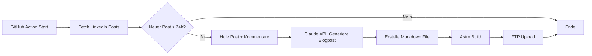

# teleschmie.de - Claude Code Briefing

## Projekt-Übersicht

**Website:** teleschmie.de
**Betreiber:** Jörg Zimmer (Online Marketing Freelancer)
**Ziel:** Statische Marketing-Website mit automatisierter LinkedIn-Content-Integration

---

## Design-Vorgaben (lau.do Style)

### Farbschema
```css
:root {
  --color-background: #FFFFFF;
  --color-text-primary: #1A1A1A;
  --color-text-secondary: #333333;
  --color-text-muted: #888888;
  --color-accent: #D4FF00; /* Neon-Lime */
}
```

### Typografie
- **Font:** Inter oder DM Sans (Google Fonts)
- **Headlines:** 48-72px, Bold, Schwarz
- **Subheadlines:** 12-14px, Uppercase, Letter-spacing: 0.1em, Grau
- **Body:** 16-18px, Regular, Dunkelgrau

### Layout-Prinzipien
- Sehr viel Whitespace (min. 80px zwischen Sektionen)
- Pill-förmige Navigation mit border-radius
- Lime-Highlights für Keywords (mark-Tag oder span mit Background)
- Smooth scroll animations (Intersection Observer)
- Mobile-first responsive Design

---

## Technische Architektur

### Stack
```
Framework:     Astro (Static Site Generator)
Styling:       Tailwind CSS
Deployment:    GitHub Actions → FTP Upload
Tracking:      Matomo (Self-hosted, Server-side)
AI:            Claude API (Anthropic)
LinkedIn:      Phantombuster oder Apify
```

### Warum Astro?
- Generiert pures HTML (kein JavaScript default)
- 100/100 PageSpeed möglich
- Hostbar auf klassischem Webhosting (nur statische Files)
- Perfektes SEO

### Projektstruktur
```
teleschmiede/
├── src/
│   ├── components/
│   │   ├── Header.astro
│   │   ├── Footer.astro
│   │   ├── Navigation.astro
│   │   └── BlogCard.astro
│   ├── layouts/
│   │   └── Layout.astro
│   ├── pages/
│   │   ├── index.astro
│   │   ├── ueber-mich.astro
│   │   ├── leistungen.astro
│   │   ├── blog/
│   │   │   ├── index.astro
│   │   │   └── [slug].astro
│   │   └── kontakt.astro
│   └── content/
│       └── blog/
│           └── *.md (automatisch generiert)
├── public/
│   ├── images/
│   └── favicon.svg
├── scripts/
│   ├── fetch-linkedin.js
│   ├── generate-post.js
│   └── deploy-ftp.js
├── .github/
│   └── workflows/
│       └── daily-linkedin.yml
├── astro.config.mjs
├── tailwind.config.mjs
└── package.json
```

---

## LinkedIn-Automation Pipeline

### Ablauf (täglich um 08:00 via GitHub Actions)



### LinkedIn-Daten-Schema
```json
{
  "post_id": "urn:li:share:123456",
  "author": "Jörg Zimmer",
  "content": "Post-Text hier...",
  "published_at": "2026-01-26T10:00:00Z",
  "reactions": 42,
  "comments": [
    {
      "author": "Max Müller",
      "author_headline": "Marketing Manager",
      "content": "Super Beitrag!",
      "reactions": 5
    }
  ]
}
```

### Claude API Prompt-Template
```
Du bist ein Content-Writer für Jörg Zimmers Marketing-Blog.

Schreibe einen Blogbeitrag basierend auf seinem LinkedIn-Post.
Der Beitrag soll:
- Den Kerninhalt des Posts zusammenfassen
- Die Community-Reaktionen hervorheben
- Kommentatoren namentlich erwähnen und zitieren
- Professionell aber persönlich klingen
- 300-500 Wörter lang sein

LinkedIn Post:
{post_content}

Kommentare:
{comments}

Schreibe den Beitrag im Markdown-Format mit Frontmatter:
---
title: "..."
date: "..."
linkedin_url: "..."
---
```

---

## GitHub Actions Workflow

```yaml
# .github/workflows/daily-linkedin.yml
name: Daily LinkedIn Sync

on:
  schedule:
    - cron: '0 7 * * *'  # 08:00 CET
  workflow_dispatch:  # Manueller Trigger

jobs:
  sync:
    runs-on: ubuntu-latest
    steps:
      - uses: actions/checkout@v4

      - name: Setup Node.js
        uses: actions/setup-node@v4
        with:
          node-version: '20'

      - name: Install dependencies
        run: npm ci

      - name: Fetch LinkedIn posts
        env:
          PHANTOMBUSTER_API_KEY: ${{ secrets.PHANTOMBUSTER_API_KEY }}
        run: node scripts/fetch-linkedin.js

      - name: Generate blog posts
        env:
          ANTHROPIC_API_KEY: ${{ secrets.ANTHROPIC_API_KEY }}
        run: node scripts/generate-post.js

      - name: Build site
        run: npm run build

      - name: Deploy via FTP
        uses: SamKirkland/FTP-Deploy-Action@v4.3.4
        with:
          server: ${{ secrets.FTP_HOST }}
          username: ${{ secrets.FTP_USER }}
          password: ${{ secrets.FTP_PASSWORD }}
          local-dir: ./dist/
```

---

## Matomo Setup (Cookie-frei)

### DSGVO-konforme Konfiguration
```php
// In Matomo Admin unter Privatsphäre:
$config['Tracker']['trust_visitors_cookies'] = 0;
$config['Tracker']['use_third_party_id_cookie'] = 0;
```

### Tracking-Code (ohne Cookies)
```javascript
var _paq = window._paq = window._paq || [];
_paq.push(['disableCookies']);
_paq.push(['setTrackerUrl', 'https://teleschmie.de/analytics/matomo.php']);
_paq.push(['setSiteId', '1']);
_paq.push(['trackPageView']);
_paq.push(['enableLinkTracking']);
```

### Wichtige Einstellungen
- [x] IP-Anonymisierung (2 Bytes)
- [x] Cookies deaktivieren
- [x] Fingerprinting deaktivieren
- [x] Do-Not-Track respektieren
- [x] Datenaufbewahrung: 26 Monate

---

## SEO-Anforderungen

### PageSpeed Ziel: 100/100
- Keine externen JS-Libraries (außer Matomo)
- Bilder: WebP, lazy loading, srcset
- Fonts: font-display: swap, preload
- Critical CSS inline
- HTML minifiziert

### Meta-Tags Template
```html
<title>{title} | Jörg Zimmer - Online Marketing</title>
<meta name="description" content="{description}">
<meta property="og:title" content="{title}">
<meta property="og:description" content="{description}">
<meta property="og:image" content="/images/og-image.jpg">
<link rel="canonical" href="https://teleschmie.de{path}">
```

---

## Secrets (in GitHub Actions)

Folgende Secrets müssen konfiguriert werden:

| Secret Name | Beschreibung |
|-------------|--------------|
| `FTP_HOST` | FTP-Server (z.B. ftp.strato.de) |
| `FTP_USER` | FTP-Benutzername |
| `FTP_PASSWORD` | FTP-Passwort |
| `ANTHROPIC_API_KEY` | Claude API Key |
| `PHANTOMBUSTER_API_KEY` | Phantombuster API Key |

---

## Nächste Schritte für Entwicklung

1. **Astro-Projekt initialisieren**
   ```bash
   npm create astro@latest teleschmie -- --template minimal
   cd teleschmie
   npx astro add tailwind
   ```

2. **Design implementieren** (siehe Design-Vorgaben oben)

3. **Statische Seiten erstellen**
   - Home, Über mich, Leistungen, Kontakt

4. **Blog-System aufsetzen**
   - Content Collections für Markdown-Posts
   - Dynamische Routen für Blog-Posts

5. **LinkedIn-Pipeline entwickeln**
   - Phantombuster Account + Phantom erstellen
   - fetch-linkedin.js Script
   - generate-post.js mit Claude API

6. **GitHub Actions konfigurieren**
   - Secrets hinzufügen
   - Workflow testen

7. **Matomo installieren**
   - Download + FTP-Upload
   - DSGVO-konforme Konfiguration

---

## Kontakt

Bei Fragen zum Projekt:
- Repository Issues nutzen
- Oder direkt an den Projektverantwortlichen
