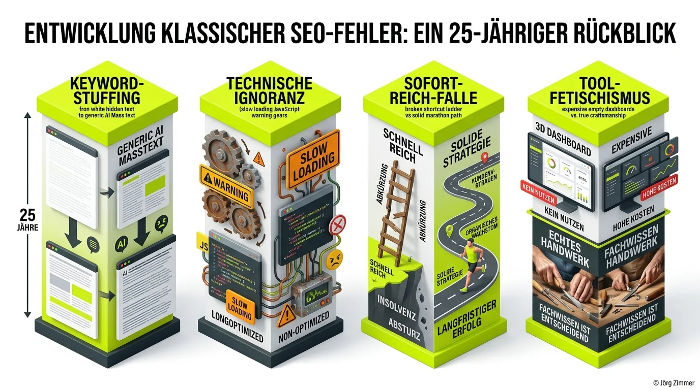

Ich mache jetzt seit über 25 Jahren Suchmaschinenoptimierung.

Wenn ich das laut ausspreche, fühle ich mich manchmal wie ein digitaler Dinosaurier. Ich habe die Geburt von Google miterlebt, den spektakulären Untergang von AltaVista und Fireball beobachtet und Zeiten durchstanden, in denen Agenturen glaubten, Meta-Keywords seien der heilige Gral für Spitzenrankings.

Und wisst ihr, was das Faszinierende daran ist? Die kardinalen Fehler von 2002 sehe ich im Jahr 2026 immer noch Tag für Tag. Nur die Tools sind schicker geworden, die Dashboards bunter und die Ausreden der Verantwortlichen kreativer.

## Die vier ewigen Stolpersteine der Suchmaschinenoptimierung

Wir tragen heute unfassbare Rechenpower in der Hosentasche und steuern Workflows mit agentischer KI. Trotzdem fallen Unternehmen im organischen Suchkanal zuverlässig über dieselben banalen Steine wie vor einem Vierteljahrhundert.

Ein ehrlicher Blick auf die Evolution der vier häufigsten Irrtümer:

### 1. Keyword-Stuffing 2.0: Vom weißen Footer-Text zum KI-Massenmüll
- **Damals (2002)**: Man packte weiße Schrift auf weißen Hintergrund in den Website-Footer: *„Schuhe günstig Schuhe online Schuhe Berlin kaufen“*. Peinlich, primitiv und nach wenigen Wochen von Googles ersten Filter-Updates rasiert.
- **Heute (2026)**: Es wird nicht mehr getippt, sondern massenhaft generiert. Brav nach Prompt: *„Schreib mir einen SEO-optimierten Text für Begriff XY mit 1.500 Wörtern“*. Das Resultat ist syntaktisch polierter, aber inhaltlich völlig hohler Datensalat ohne eigene Expertise, der weder Mensch noch Algorithmus überzeugt.

### 2. Technik als lästiges Beiboot
Wie oft höre ich in Kundengesprächen den Satz: *„Jörg, unser Redaktionsplan ist weltklasse, der Content ist genial!“* Schön. Aber wenn deine Seite auf dem Smartphone 8 Sekunden zum Rendern benötigt oder clientseitiges JavaScript den Crawler aussperrt, bricht jeder Nutzer frustriert ab. Früher blockierten Flash-Animationen den Index, heute sind es gigantische JavaScript-Bundles und fehlendes SSR. Ohne sauberes technisches Fundament existiert keine organische Sichtbarkeit.

### 3. Die Sofort-Reich-Falle und mangelnde Ausdauer
SEO braucht Zeit. Das war 2002 so, und das ist auch 2026 im Zeitalter generativer Suchmaschinen so. Wer garantierte Resultate in vier Wochen verspricht, betreibt kein SEO, sondern schaltet Paid Ads. Organisches Vertrauen wächst wie Zinseszinsen. Wer nach den ersten hundert Metern des Marathons enttäuscht stehenbleibt, hat das Wesen des Kanals nicht verstanden.

### 4. Tool-Fetischismus statt echtes Handwerk
Viele Teams abonnieren Enterprise-Tools für tausende Euro monatlich und wiegen sich in der Illusion, das Problem sei gelöst. Doch Metriken allein generieren keinen Umsatz. Wenn man nicht weiß, wo der Nagel sitzt, haut man sich mit dem besten Tool-Hammer nur auf den Daumen.

## Gegenüberstellung: SEO-Fehler 2002 vs. SEO-Fehler 2026

Die folgende Matrix zeigt schonungslos, wie sich die Fehlermuster zwar äußerlich transformiert haben, die zugrundeliegende Denkweise jedoch identisch geblieben ist:

| Fehlerbereich | Klassischer Fehler (2002) | Moderner Fehler (2026) | Die nachhaltige Lösung |
| :--- | :--- | :--- | :--- |
| **Content** | Unsichtbares Keyword-Stuffing | Ungeprüfter KI-Massencontent | Echte E-E-A-T-Expertise & Information Gain |
| **Technik** | Flash-Intros & Framesets | Schwere JS-Hydration & kein SSR | Sauberes HTML, schnelle CWV, Barrierefreiheit |
| **Erwartungshaltung** | Ranking-Garantie in 14 Tagen | Sofortiger Traffic durch automatisierten Spam | Langfristige Markenbildung & Trust-Aufbau |
| **Werkzeuge** | Meta-Tag-Generatoren | Unverstandene KI- und Tool-Dashboards | Fundierte Datenanalyse & strategisches Handeln |

## Warum SEO zu 80 Prozent Psychologie ist

In meiner täglichen Praxis in der [SEO-Sprechstunde](/seo-sprechstunde/) stelle ich immer wieder fest: Es mangelt den Verantwortlichen fast nie an theoretischem Wissen. Es mangelt schlicht an Disziplin und Konsequenz bei der Umsetzung.

Der Mensch neigt biologisch dazu, Abkürzungen zu suchen. Deshalb fallen Unternehmen immer wieder auf angebliche Geheimtricks herein, statt über Monate hinweg verlässliche Relevanzsignale aufzubauen. Wie ich bereits im Artikel [GEO, SEO, AI-SEO oder LLMO?](/blog/geo-seo-ai-seo-llmo-umfrage/) dargelegt habe, ändern sich zwar die Akronyme, aber niemals die psychologische Erwartung des Suchenden: Er will eine schnelle, kompetente und verlässliche Antwort auf sein Problem.

<figure class="my-8 bg-neutral-50 border border-neutral-200 p-6 md:p-8 rounded-2xl shadow-sm">
  

    
    

      <h4 class="font-bold text-base md:text-lg text-dark mb-0">Jörg Zimmer</h4>
      
Senior SEO & AI Search Consultant

    

  

  <blockquote class="text-base md:text-lg text-dark leading-relaxed italic border-l-4 border-lime-accent pl-4 my-4 font-normal">
    „Tools sind wie Hämmer: Wenn du nicht weißt, wo der Nagel ist, haust du dir nur auf den Daumen. Dashboards und bunte KI-Scores machen dich nicht zum Experten. Echtes Fachwissen, systematisches Handwerk und der Mut zur geduldigen Umsetzung tun es.“
  </blockquote>
  <figcaption class="mt-4 pt-3 border-t border-neutral-200/60 flex flex-wrap items-center justify-between gap-2 text-xs text-neutral-500">
    Experten-Zitat • <cite class="not-italic font-semibold text-neutral-700">Jörg Zimmer</cite>
    <a href="https://www.linkedin.com/posts/joerg-zimmer-seo-sea-freelancer-berlin-spandau_24-jahre-seo-gleiche-fehler-activity-7286645315112111104-5Y7_" target="_blank" rel="noopener noreferrer" class="font-bold text-lime-700 hover:underline inline-flex items-center gap-1">
      Diskussion auf LinkedIn ansehen →
    </a>
  </figcaption>
</figure>

## Dein 4-Punkte-Plan gegen den Stillstand

Die Fundamente erfolgreicher Webprojekte sind unkaputtbar. Wer diese vier Kernregeln verinnerlicht, lässt 90 % der Mitbewerber mühelos hinter sich:

1. **Technisches Fundament**: Die Website muss rasend schnell laden und barrierefrei für Crawler und Nutzer aufbereitet sein. Wie das systematisch geht, zeigt mein Leitfaden zum [Website SEO Audit](/blog/website-seo-audit-vibe-coding/).
2. **Reale Problemlösung**: Schreibe Inhalte nicht für Maschinen, sondern für echte Menschen mit konkreten Schmerzpunkten. Beachte dabei die Grundsätze aus dem [E-E-A-T Leitfaden](/glossar/eeat/).
3. **Konsequente Markenbildung**: Baue eine unverwechselbare Reputation in deiner Nische auf, sodass dein Name zum Synonym für Fachkompetenz wird.
4. **Strategische Geduld**: Beende das hektische Springen von Trend zu Trend. Lass deinen Maßnahmen die nötigen sechs bis zwölf Monate Zeit, um ihre volle Hebelwirkung zu entfalten.

Wenn das Kind bereits in den Brunnen gefallen ist und ein Algorithmus-Update deine Domain abgestraft hat, hilft oft nur ein strukturierter Rettungsplan durch eine professionelle [SEO Feuerwehr](/blog/seo-feuerwehr-rettung/). Wie so eine strukturierte Analyse im Detail abläuft, erfährst du auch im Beitrag [SEO-Sprechstunde einfach erklärt](/blog/seo-sprechstunde-erklaert/).

<!-- CTA Box -->

  LinkedIn Community Diskussion
  <h3 class="text-xl md:text-2xl font-bold text-white mb-3 !mt-0 !border-none !pb-0">
    Jetzt an der Diskussion teilnehmen
  </h3>
  

    Woran scheitert SEO bei dir in der Praxis am häufigsten: An der Technik, am Content oder an der Geduld? Teile deine Erfahrungen auf LinkedIn!
  

  <a href="https://www.linkedin.com/posts/joerg-zimmer-seo-sea-freelancer-berlin-spandau_24-jahre-seo-gleiche-fehler-activity-7286645315112111104-5Y7_" target="_blank" rel="noopener noreferrer" class="btn-primary">
    <svg class="w-4 h-4 fill-current" viewBox="0 0 24 24"><path d="M20.447 20.452h-3.554v-5.569c0-1.328-.027-3.037-1.852-3.037-1.853 0-2.136 1.445-2.136 2.939v5.667H9.351V9h3.414v1.561h.046c.477-.9 1.637-1.85 3.37-1.85 3.601 0 4.267 2.37 4.267 5.455v6.286zM5.337 7.433c-1.144 0-2.063-.926-2.063-2.065 0-1.138.92-2.063 2.063-2.063 1.14 0 2.064.925 2.064 2.063 0 1.139-.925 2.065-2.064 2.065zm1.782 13.019H3.555V9h3.564v11.452zM22.225 0H1.771C.792 0 0 .774 0 1.729v20.542C0 23.227.792 24 1.771 24h20.451C23.2 24 24 23.227 24 22.271V1.729C24 .774 23.2 0 22.222 0h.003z"/></svg>
    Beitrag auf LinkedIn öffnen
    →
  </a>

