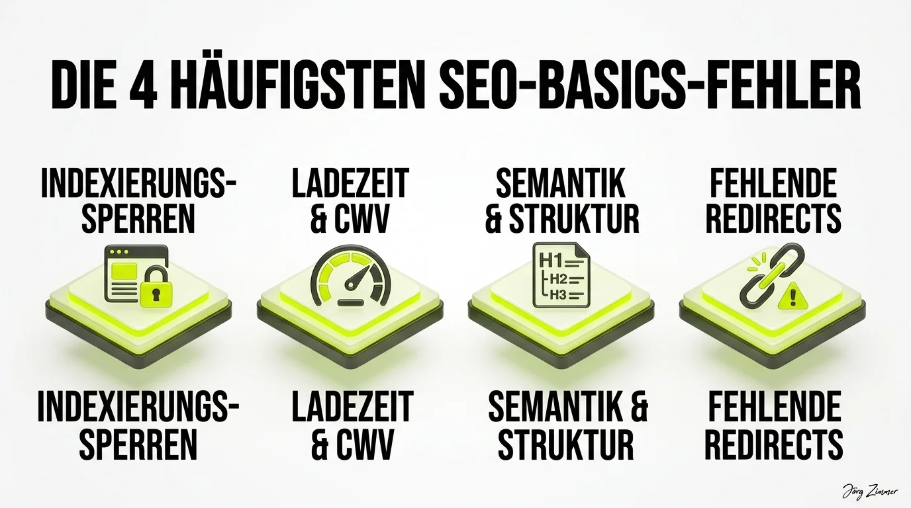

In vier von fünf [SEO-Sprechstunden](/seo-sprechstunde/) erlebe ich ein Phänomen, das mich immer wieder fassungslos macht: Websites etablierter Unternehmen, in die fünf- oder sechsstellige Budgets geflossen sind, scheitern nicht an exotischen Algorithmus-Geheimnissen oder komplexen RAG-Pipelines.

Sie scheitern an banalstem **handwerklichen Pfusch am Bau**.

Während Geschäftsführungen und Marketing-Teams über generative KI, multimodale Suchmodelle und Sprachassistenten philosophieren, steht im digitalen Maschinenraum das Wasser bis zum Hals: Die Indexierung ist versehentlich gesperrt, Ladezeiten vertreiben jeden zweiten mobilen Besucher und Weiterleitungen existieren schlichtweg nicht.

<figure class="my-8 bg-neutral-50 border border-neutral-200 p-6 md:p-8 rounded-2xl shadow-sm">
  

    
    

      <h4 class="font-bold text-base md:text-lg text-dark mb-0">Jörg Zimmer</h4>
      
Senior SEO & AI Search Consultant

    

  

  <blockquote class="text-base md:text-lg text-dark leading-relaxed italic border-l-4 border-lime-accent pl-4 my-4 font-normal">
    „Liste der 9 größten SEO Fehler: 1.) nicht mit SEO anzufangen 2.) es nach kurzem Sprint aufzuhören 3.) es den falschen Leuten zuzuschreiben 4.) sich auf falsche Keywörter zu konzentrieren 5.) die einfachen Basics zu vernachlässigen 6.) denken das man gut sei ohne zu messen 7.) den Informationsdurst zu unterschätzen 8.) Nutzerfreudlichkeits-Standards missachten 9.) die Komplexität des Themas unterschätzen.“
  </blockquote>
  <figcaption class="mt-4 pt-3 border-t border-neutral-200/60 flex flex-wrap items-center justify-between gap-2 text-xs text-neutral-500">
    

      Experten-Zitat • <cite class="not-italic font-semibold text-neutral-700">Jörg Zimmer</cite>
      •
      <a href="https://www.linkedin.com/feed/update/urn:li:activity:7119353116784779264" target="_blank" rel="noopener noreferrer" class="text-neutral-600 hover:text-dark underline inline-flex items-center gap-1">
        Quelle: LinkedIn-Beitrag von Jörg Zimmer
        <svg class="w-3 h-3 text-neutral-400" fill="none" stroke="currentColor" viewBox="0 0 24 24"><path stroke-linecap="round" stroke-linejoin="round" stroke-width="2" d="M10 6H6a2 2 0 00-2 2v10a2 2 0 002 2h10a2 2 0 002-2v-4M14 4h6m0 0v6m0-6L10 14" /></svg>
      </a>
    

    <a href="https://www.linkedin.com/in/joerg-zimmer-seo-sea-freelancer-berlin-spandau/" target="_blank" rel="noopener noreferrer" class="font-bold text-lime-700 hover:underline inline-flex items-center gap-1 shrink-0">
      Jörg Zimmer auf LinkedIn folgen →
    </a>
  </figcaption>
</figure>

## Die Hall of Shame: Die vier fatalsten Basics-Fehler

Wenn wir in der Sprechstunde gemeinsam mit [SE Ranking (Partnerlink)](https://seranking.com/de/?ga=4169588&source=link) und [Rankscale (Partnerlink)](https://rankscale.ai/?via=offer) den Live-Audit durchführen, stoßen wir fast ausnahmslos auf dieselben vier Kardinalsünden:

### 1. Indexierungs-Sperren (Die unsichtbare Schranke)
Es klingt wie ein schlechter Scherz, ist aber bittere Realität: Nach einem Relaunch vergisst das Entwicklerteam, den robots-Meta-Tag von `noindex, nofollow` auf `index, follow` zurückzusetzen. Die Website ist optisch perfekt, aber für Suchmaschinen schlichtweg nicht existent. Dasselbe gilt für versehentlich blockierte CSS- und JS-Ressourcen in der `robots.txt`.

### 2. Ladezeit & Core Web Vitals (Der mobile Kundenschreck)
Mobilseiten, die acht Sekunden zum Rendern benötigen, unkomprimierte Fünf-Megabyte-Hero-Bilder und Layout-Verschiebungen (CLS), die Nutzer versehentlich auf die falsche Schaltfläche klicken lassen: Wer die [Core Web Vitals](/glossar/core-web-vitals/) ignoriert, verliert nicht nur Rankings, sondern verbrennt sein Mediabudget durch astronomische Absprungraten.

### 3. Semantik & Struktur (Verwirrung für den Google-Bot)
Überschriften werden nach Schriftgröße gestylt statt nach logischer Hierarchie: Drei H1-Tags auf einer Startseite, gefolgt von einer H4 und zwei H2s. Was für das menschliche Auge noch lesbar wirkt, zerstört die semantische Straßenkarte für Suchmaschinen. [Technisches SEO](/glossar/technisches-seo/) verlangt eine stringente, saubere Dokumentenarchitektur.

### 4. Fehlende 301-Redirects (Totalverlust historischer Autorität)
Wird eine URL-Struktur angepasst oder eine Domain umgezogen, müssen alle alten Adressen per permanenter 301-Weiterleitung auf das exakte neue Ziel geleitet werden. Fehlen diese Regeln, laufen bestehende Backlinks auf 404-Fehlerseiten – der über Jahre aufgebaute PageRank löst sich in Luft auf. Wie wir solche Notfälle beheben, zeigt unser Bericht [Die SEO Feuerwehr rückt aus](/blog/seo-feuerwehr-rettung/).

## Der Vergleich: Versäumnis versus Sofortlösung

In der folgenden Übersicht haben wir die gravierendsten Fehler und ihre wirksame Gegenmaßnahme zusammengefasst:

| SEO-Fehler | Konsequenz für das Business | Sofortige Lösung |
|---|---|---|
| **Aktives Noindex auf Produktivseiten** | Kompletter Verlust der Sichtbarkeit, Null Klicks | Robots-Header und Meta-Tags sofort prüfen und freigeben |
| **Miserable Core Web Vitals** | Hohe Absprungrate, Abstrafung im Page Experience Ranking | Bilder zu WebP konvertieren, Drittanbieter-Tracker entkoppeln |
| **Fehlende 301-Weiterleitungen** | Totalverlust von Backlink-Power nach Relaunch | 1:1 Weiterleitungsmatrix vor dem DNS-Switch hinterlegen |
| **Falsche Suchintention (Keywords)** | Traffic ohne jegliche qualifizierte Leads | Fokus auf transaktionale und beratende Suchanfragen schärfen |

## Stimmen aus der Fachcommunity

Mein LinkedIn-Beitrag zu diesen Versäumnissen löste eine breite Welle der Zustimmung aus:

**Beate Aust** bestätigte, dass selbst im Jahr 2026 die grundlegenden Hausaufgaben in fast jedem zweiten Projekt vernachlässigt werden. Es sei erschreckend, wie viele Unternehmen versuchen, den dritten Schritt vor dem ersten zu machen.

**Charlotte Rüsch** hob hervor, dass SEO von vielen Kunden noch immer als Reparaturbetrieb verstanden wird, anstatt von Beginn an die statische Tragfähigkeit der Website zu planen.

**Jörg Niethammer** brachte es treffend auf den Punkt: Alle Welt redet über KI-Overviews und Sprachmodelle, vergisst aber, vorher die Haustür abzuschließen. Wer seine Indexierungs-Basics nicht meistert, braucht über [SE Ranking KI-Sichtbarkeit](/blog/se-ranking-ki-sichtbarkeit/) gar nicht erst nachdenken.

## Der 120-Minuten-Hebel: Schluss mit Pfusch am Bau

Bist du sicher, dass deine Website nicht auch heimlich in der 80%-Falle feststeckt? 

In der zweistündigen Live-Session analysieren wir deine Webpräsenz bis ins letzte Detail – welche enormen Sprünge dabei möglich sind, zeigt meine Fallstudie zu [zwei Stunden SEO-Potential](/blog/zwei-stunden-seo-potential/). Wir durchleuchten den Status Quo und geben dir eine priorisierte To-Do-Liste an die Hand, mit der du deine Rankings sofort stabilisierst.

Lass uns deine Website gemeinsam auf den Prüfstand stellen.

<!-- LinkedIn CTA Box -->

  <h3 class="text-xl md:text-2xl font-bold text-white mb-3 !mt-0 !border-none !pb-0">
    Jetzt an der Diskussion teilnehmen
  </h3>
  

    Diskutiere mit Jörg Zimmer und Web-Experten auf LinkedIn über handwerkliche SEO-Basics und wie man typische Relaunch-Fallen vermeidet.
  

  <a href="https://www.linkedin.com/posts/joerg-zimmer-seo-sea-freelancer-berlin-spandau_in-80-aller-seo-sprechstunden-entdecke-activity-7366897094021791744-trk9" target="_blank" rel="noopener noreferrer" class="btn-primary">
    <svg class="w-4 h-4 fill-current" viewBox="0 0 24 24"><path d="M20.447 20.452h-3.554v-5.569c0-1.328-.027-3.037-1.852-3.037-1.853 0-2.136 1.445-2.136 2.939v5.667H9.351V9h3.414v1.561h.046c.477-.9 1.637-1.85 3.37-1.85 3.601 0 4.267 2.37 4.267 5.455v6.286zM5.337 7.433c-1.144 0-2.063-.926-2.063-2.065 0-1.138.92-2.063 2.063-2.063 1.14 0 2.064.925 2.064 2.063 0 1.139-.925 2.065-2.064 2.065zm1.782 13.019H3.555V9h3.564v11.452zM22.225 0H1.771C.792 0 0 .774 0 1.729v20.542C0 23.227.792 24 1.771 24h20.451C23.2 24 24 23.227 24 22.271V1.729C24 .774 23.2 0 22.222 0h.003z"/></svg>
    Beitrag auf LinkedIn öffnen
    →
  </a>

