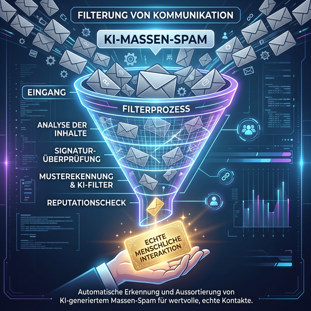

Es war kurz vor Weihnachten, draußen war es grau, und ich wollte eigentlich nur kurz bei LinkedIn vorbeischauen, um zu sehen, was die Branche so treibt. Aber statt spannender Insights oder echter Networking-Stories explodierte mein Feed förmlich. Überall Weihnachtsgrüße. Überall die gleichen, verdächtig perfekten Floskeln. Überall... irgendwie die gleiche Handschrift.

Ich dachte erst, ich hätte eine Zeitschleife erwischt. Aber dann wurde mir klar: Wir sind Zeugen einer neuen Ära des Social-Media-Spams.

## Der Übeltäter: Ein AI-Agent namens "Achim"

Lass uns über **Achim vom Gartenverein** sprechen (Name von mir geändert, um den Unschuldigen zu schützen). Achim ist ein technikaffiner Kerl. Er hat sich einen AI-Agenten gebaut – eine kleine, fleißige Software-Biene, die automatisch Weihnachtsgrüße generiert, Bilder erstellt und das ganze Paket direkt in die Feeds seiner Kontakte pumpt.

Das Ergebnis? Ein digitaler Einheitsbrei aus "Frohe Weihnachten und einen superduper erfolgreichen Rutsch in ein noch erfolgreicheres Jahr!". 

An sich ist Achims Tat harmlos. Er wollte ja nur nett sein. Aber er hat damit ungewollt ein riesiges, hässliches Problem sichtbar gemacht, das uns 2026 massiv beschäftigen wird: Die Industrialisierung der (un)echten Interaktion.

## Wenn die Maschine das "Social" aus Social Media entfernt

Was Achim im Kleinen gemacht hat, wird aktuell im Großen perfektioniert. Wir reden nicht mehr nur über Bots, die Likes verteilen. Wir reden über AI-Agenten, die:
- **Kontextsensitive Kommentare schreiben:** Die KI erkennt, worum es in deinem Post geht, und verfasst einen Kommentar, der täuschend echt nach Zustimmung oder konstruktiver Kritik klingt.
- **Automatisierte Engagement-Loops bilden:** Bots liken und kommentieren Bots, um die Algorithmen von LinkedIn auszutricksen und Reichweite vorzugaukeln.
- **Fake-Authentizität auf Knopfdruck:** Die Maschine lernt deinen Schreibstil (oder das, was sie dafür hält) und produziert Content am laufenden Band.

## Die Gefahr: Die Entwertung der Aufmerksamkeit

LinkedIn war immer der Ort, an dem man "echte" Profis trifft. Aber wenn ich davon ausgehen muss, dass der Kommentar unter meinem Video nur von einem Prompt generiert wurde, den jemand morgens um 8 Uhr automatisiert hat, warum sollte ich dann noch antworten? Warum sollte ich mir die Mühe machen, wertvollen Content zu erstellen, wenn die Währung "Aufmerksamkeit" durch AI-Massenware entwertet wird?

In meiner [SEO-Sprechstunde](/seo-sprechstunde/) habe ich oft Kunden, die fragen: "Jörg, können wir LinkedIn nicht auch automatisieren?" Meine Antwort ist immer ein klares: "Können wir – aber wir sollten es nicht." Wer Vertrauen aufbauen will, kann das nicht delegieren. Nicht an einen Praktikanten und erst recht nicht an GPT-5.

## Die Community-Reaktion: Ein digitaler Aufschrei

Als ich meine Gedanken dazu auf LinkedIn geteilt habe, war das Echo bemerkenswert. 19 Reaktionen und 13 Kommentare in kürzester Zeit. 

Die Meinungen waren gespalten, wie so oft bei neuen Technologien:
- **Die Skeptiker:** "LinkedIn stirbt, wenn das so weitergeht. Es wird zum Hub für AI-Müll."
- **Die Pragmatiker:** "Ach, lass Achim doch seinen Spaß. Wer es liest, ist selbst schuld."
- **Die Visionäre:** "Wir brauchen endlich 'Human-Validated' Badges für Content."

Ein Kommentar blieb mir besonders hängen: *"Jörg, wenn die KIs miteinander reden, haben wir Menschen endlich wieder mehr Zeit für das Wesentliche."* Ein schöner Gedanke, aber leider ein Trugschluss. Denn auf LinkedIn wollen wir ja gerade mit Menschen reden, nicht mit deren digitalen Stellvertretern.

## Meine Strategie: Mut zur Unvollkommenheit

Was bedeutet das für dich und mich? Ich werde weiter echte Inhalte posten. Mit echten Gedanken, die manchmal weh tun oder unbequem sind. Und ja, ich werde weiter echte Tippfehler machen. Warum? Weil Tippfehler ein Beweis für Menschlichkeit sind. Ein Beweis, dass da jemand am Keyboard saß, der vielleicht gerade Kaffee getrunken hat oder abgelenkt war.

Authentizität ist im KI-Zeitalter keine Phrase mehr, sondern ein messbarer Wettbewerbsvorteil. In einer Welt voller perfekt generierter Achim-Grüße ist das Unperfekte das neue Premium.

## Wie gehen wir 2026 damit um?

LinkedIn wird auf das Problem reagieren müssen. Ob es durch Proof-of-Person-Verfahren oder bessere Spam-Filter geschieht, bleibt abzuwarten. Aber bis dahin haben wir als Nutzer die Macht. Wir können entscheiden, wen wir lesen und wem wir unsere wertvollste Ressource schenken: Unsere Zeit.

---

*Was ist eure Meinung? Habt ihr "Achims Weihnachtsgrüße" auch schon im Feed gesehen? Wo hört die hilfreiche Unterstützung durch KI auf und wo fängt der Spam an? Diskutiert mit mir auf LinkedIn!*

### Weiterführende Artikel für KI-Beobachter
* **Lese-Tipp:** [GEO vs. SEO: Wo liegt der Unterschied in der KI-Suche?](/blog/ai-seo-geo-praktikanten/)
* **Lese-Tipp:** [SE Ranking AI Tracker: Den Überblick behalten](/blog/se-ranking-ai-tracker/)
* **Lese-Tipp:** [24 Jahre SEO: Warum wir immer noch an den Basics scheitern](/blog/24-jahre-seo-gleiche-fehler/)

