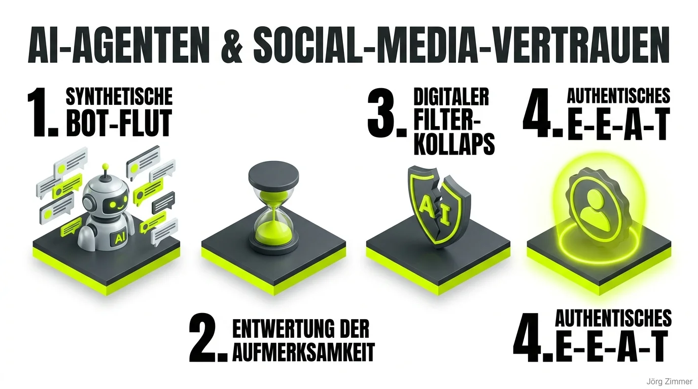

Es war kurz vor Weihnachten: Draußen herrschte das typische Berliner Dezembergrau, der Kaffee auf dem Schreibtisch dampfte und ich wollte eigentlich nur kurz mein LinkedIn-Netzwerk scannen, um interessante Branchendiskussionen zu verfolgen.

Doch was mir entgegenschlug, war eine digitale Kernschmelze.

Mein Feed explodierte förmlich vor Festtagsgrüßen und Neujahrswünschen. Doch von echter Herzlichkeit oder individuellem Austausch war weit und breit keine Spur. Stattdessen: Generierter Einheitsbrei im Fließbandtakt. Synthetische Bildchen mit perfekten Plastik-Rentieren, garniert mit austauschbaren Wohlfühlfloskeln frisch aus der Prompt-Maschine.

### Der Fall „Achim vom Gartenverein“: Die Industrialisierung des Smalltalks

Besonders anschaulich wurde das Phänomen durch einen Bekannten, den wir hier liebevoll „Achim vom Gartenverein“ nennen wollen. Achim ist ambitioniert, liebt moderne Technologien und wollte zu den Feiertagen alles ganz besonders professionell und effizient lösen.

Also baute er sich einen autonomen AI-Agenten.

Eine fleißige Software-Biene, die vollautomatisch persönliche Kontakte scannte, standardisierte Weihnachtsgrüße formulierte, DALL-E-Grafiken dazu generierte und das gesamte Paket ungefiltert in hunderte Postfächer feuerte:

> *„Lieber Jörg, ich wünsche dir ein frohes, besinnliches Weihnachtsfest und einen superduper erfolgreichen Start in ein noch erfolgreicheres neues Geschäftsjahr!“*

Achim meinte es gut. Doch mit seinem Experiment hat er ungewollt das größte Dilemma der modernen B2B-Kommunikation offengelegt: Wenn Interaktion industrialisiert wird, verliert sie augenblicklich jeden Wert.

### Wenn die Maschine das „Social“ aus Social Media entfernt

Was im privaten Rahmen wie ein kurioses Missgeschick wirkt, hat sich auf geschäftlichen Plattformen zu einer handfesten Seuche entwickelt. Wir sprechen heute nicht mehr über plumpe Bots, die nach vordefinierten Keywords stumpfe Link-Spams posten. Wir sehen hochentwickelte Agenten, die ganze Engagement-Loops untereinander aufbauen:

| Mechanismus | Was der Agent technisch ausführt | Die reale Folge im Netzwerk |
| :--- | :--- | :--- |
| **Kontext-Kommentierung** | Liest Fremdposts aus und generiert 3-Punkt-Antworten | Täuscht fachliche Auseinandersetzung vor, erzeugt Frust |
| **Synthetische Engagement-Loops** | Bots liken und kommentieren Bots | Künstliche Reichweite ohne echten geschäftlichen Gegenwert |
| **Persönlichkeits-Klone** | Simuliert Tonfall und Vokabular des Profilinhabers | Profilinhaber verliert die eigene authentische Stimme |
| **Massen-Outreach per LLM** | Personalisiert Inmails anhand von Profil-Keywords | Postfächer verstopfen mit unglaubwürdigen Pitch-Nachrichten |

Das fundamentale Problem dabei: Wenn ich als Leser erkenne, dass ein Kommentar nur das Rechenergebnis eines automatisierten Prompts ist – warum sollte ich mir dann jemals wieder die Zeit nehmen, dir eine durchdachte menschliche Antwort zu schreiben?

Echte Aufmerksamkeit ist die härteste und knappste Währung unserer Zeit. Wer sie mit Falschgeld bedient, zerstört nachhaltig das Fundament für das E-E-A-T-Kriterium [Trustworthiness](/glossar/trustworthiness-eeat/).

<figure class="my-8 bg-neutral-50 border border-neutral-200 p-6 md:p-8 rounded-2xl shadow-sm">
  

    
    

      <h4 class="font-bold text-base md:text-lg text-dark mb-0">Jörg Zimmer</h4>
      
Senior SEO & AI Search Consultant

    

  

  <blockquote class="text-base md:text-lg text-dark leading-relaxed italic border-l-4 border-lime-accent pl-4 my-4 font-normal">
    „Alle sind gut beraten, wenn sie noch ein paar separate Quellen bespielen. Damit meine ich jetzt ja, also auch Social Media und und, aber auch Portale, andere Portale, die vielleicht schon von den von den Modulen gekrault werden. Ja, weil das sehe ich so ein bisschen ist ein bisschen eine These noch nicht belegt, weil können es noch nicht messen. Ähm, aber ist ein bisschen eine.“
  </blockquote>
  <figcaption class="mt-4 pt-3 border-t border-neutral-200/60 flex flex-wrap items-center justify-between gap-2 text-xs text-neutral-500">
    

      Experten-Zitat • <cite class="not-italic font-semibold text-neutral-700">Jörg Zimmer</cite>
      •
      <a href="https://www.youtube.com/watch?v=32YkPQtOJDU&t=1652s" target="_blank" rel="noopener noreferrer" class="text-neutral-600 hover:text-dark underline inline-flex items-center gap-1">
        Quelle: YouTube Magic Writing Podcast (27:32)
        <svg class="w-3 h-3 text-neutral-400" fill="none" stroke="currentColor" viewBox="0 0 24 24"><path stroke-linecap="round" stroke-linejoin="round" stroke-width="2" d="M10 6H6a2 2 0 00-2 2v10a2 2 0 002 2h10a2 2 0 002-2v-4M14 4h6m0 0v6m0-6L10 14" /></svg>
      </a>
    

    <a href="https://www.linkedin.com/in/joerg-zimmer-seo-sea-freelancer-berlin-spandau/" target="_blank" rel="noopener noreferrer" class="font-bold text-lime-700 hover:underline inline-flex items-center gap-1 shrink-0">
      Jörg Zimmer auf LinkedIn folgen →
    </a>
  </figcaption>
</figure>

### Warum Unvollkommenheit der größte Wettbewerbsvorteil wird

Viele Gründer und Marketer fragen mich im Kontext von [AI SEO](/glossar/ai-seo/): *„Jörg, können wir unsere Social-Media-Kanäle nicht komplett an autonome Agenten übergeben?“*

Meine Antwort lautet stets: Technisch könnt ihr das sofort tun. Strategisch ist es der sicherste Weg, eure Marke zu ruinieren.

Wenn du als Berater oder Agentur wahrgenommen werden willst, brauchst du gelebte [Experience im E-E-A-T](/glossar/experience-eeat/). Algorithmen lernen rasant, synthetische Muster zu isolieren. Wenn alle mit denselben Sprachmodellen dieselben perfekten Phrasen dreschen, sticht nur noch eines hervor: Der Mensch mit Ecken, Kanten, ungeschminkten Meinungen und echten Praxiserfahrungen.

Ich werde auf LinkedIn weiterhin Inhalte veröffentlichen, die nicht glattgebügelt sind. Mit Formulierungen, die vielleicht polarisieren. Und ja: gelegentlich auch mit einem Tippfehler. Denn ein Tippfehler ist im KI-Zeitalter der ultimative Beweis dafür, dass am anderen Ende ein Mensch sitzt, der leidenschaftlich in die Tasten gehauen hat.

### Wo KI wirklich glänzt: Daten, Recherche und Sichtbarkeits-Audits

Das bedeutet keineswegs, dass wir KI verteufeln sollten. Ganz im Gegenteil: Im Bereich Analyse, Prompting und technischer Vorbereitung ist generative KI unschlagbar:

* **Sichtbarkeits-Audits mit Profi-Tools:** Wenn wir prüfen wollen, wie deine Marke in den neuen KI-Antwortmaschinen abschneidet und [Wie komme ich in ChatGPT](/blog/wie-komme-ich-als-unternehmen-in-chatgpt/) in der Praxis funktioniert, nutzen wir Plattformen wie <a href="https://rankscale.ai/?via=offer" target="_blank" rel="noopener noreferrer nofollow sponsored">Rankscale (Partnerlink)</a>, um präzise Brand-Mentions in LLMs zu überwachen.
* **Tiefgehende Marktdaten:** Für verlässliche Keyword-Analysen, Backlink-Prüfungen und Onpage-Diagnosen setzen wir auf die bewährte Power von <a href="https://seranking.com/de/?ga=4169588&source=link" target="_blank" rel="noopener noreferrer nofollow sponsored">SE Ranking (Partnerlink)</a>.
* **Effiziente Agenten-Workflows:** Ein gezielter [SEO-Mega-Prompt & KI-Agenten](/blog/seo-mega-prompt-claude-agent/) beschleunigt die technische Datenaufbereitung um ein Vielfaches, während Standards wie der [Cloudflare Agent Readiness](/blog/cloudflare-agent-readiness-scan/) dafür sorgen, dass Crawler die Daten sauber verarbeiten können.

Nutze künstliche Intelligenz als Hebel für dein Gehirn – aber niemals als Ersatz für deine menschliche Stimme.

### Drei klare Handlungsregeln für authentische Reichweite

1. **Finger weg von generierten Auto-Kommentaren:** Wer vorgefertigte KI-Antworten unter fremde Beiträge klatscht, verbrennt seinen Ruf schneller, als jeder Algorithmus ihn pushen kann.
2. **KI für die Struktur, Herz für den Text:** Lass dir von Modellen Gliederungen, Argumentationsketten oder Datenübersichten bauen – das eigentliche Schreiben und Bewerten gehört in deine Hand.
3. **Erlaube dir Haltung:** Trau dich, Dinge beim Namen zu nennen, die in deiner Branche schieflaufen. Achim vom Gartenverein hat seine Grüße im digitalen Papierkorb wiedergefunden. Sei kein Achim. Sei echt.

<!-- LinkedIn CTA Box -->

  <h3 class="text-xl md:text-2xl font-bold text-white mb-3 !mt-0 !border-none !pb-0">
    Jetzt an der Diskussion teilnehmen
  </h3>
  

    Diskutiere mit Jörg Zimmer und der SEO-Community auf LinkedIn über diesen Beitrag.
  

  <a href="https://www.linkedin.com/posts/joerg-zimmer-seo-sea-freelancer-berlin-spandau_achim-vom-gartenverein-hat-einen-ai-agenten-share-7409572323978276864-P1I1" target="_blank" rel="noopener noreferrer" class="btn-primary">
    <svg class="w-4 h-4 fill-current" viewBox="0 0 24 24"><path d="M20.447 20.452h-3.554v-5.569c0-1.328-.027-3.037-1.852-3.037-1.853 0-2.136 1.445-2.136 2.939v5.667H9.351V9h3.414v1.561h.046c.477-.9 1.637-1.85 3.37-1.85 3.601 0 4.267 2.37 4.267 5.455v6.286zM5.337 7.433c-1.144 0-2.063-.926-2.063-2.065 0-1.138.92-2.063 2.063-2.063 1.14 0 2.064.925 2.064 2.063 0 1.139-.925 2.065-2.064 2.065zm1.782 13.019H3.555V9h3.564v11.452zM22.225 0H1.771C.792 0 0 .774 0 1.729v20.542C0 23.227.792 24 1.771 24h20.451C23.2 24 24 23.227 24 22.271V1.729C24 .774 23.2 0 22.222 0h.003z"/></svg>
    Beitrag auf LinkedIn öffnen
    →
  </a>

  <h3 class="text-xl font-bold text-dark mb-2 !mt-0 !border-none !pb-0">Willst du echte Ergebnisse statt Bot-Blabla?</h3>
  
Authentizität ist der Schlüssel, aber fundierte Daten sind das Schloss. Mit <a href="https://seranking.com/de/?ga=4169588&source=link" target="_blank" rel="noopener noreferrer nofollow sponsored" class="font-bold underline text-lime-700">SE Ranking (Partnerlink)</a> auditieren wir deine reale Suchperformance und mit <a href="https://rankscale.ai/?via=offer" target="_blank" rel="noopener noreferrer nofollow sponsored" class="font-bold underline text-lime-700">Rankscale (Partnerlink)</a> messen wir deine Erwähnungen und Brand-Authority in den neuen KI-Suchsystemen.

  <a href="/kontakt/" class="btn-primary inline-flex">Jetzt Strategie-Check anfragen →</a>

