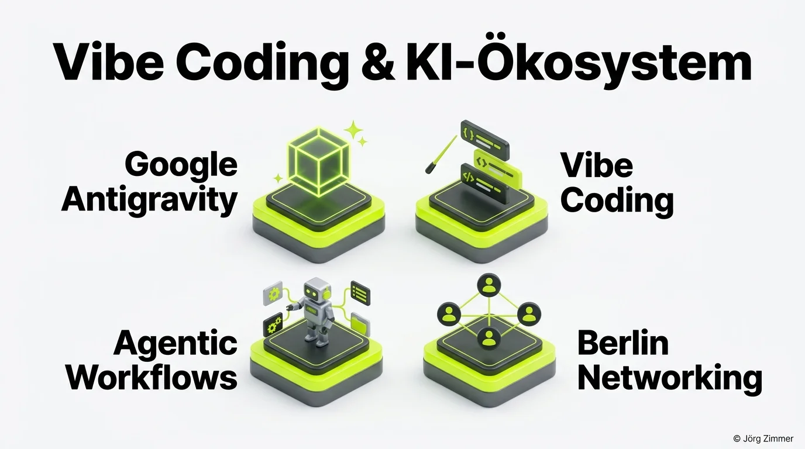

Die künstliche Intelligenz entwickelt sich gegenwärtig mit einer Geschwindigkeit, die selbst langjährige Branchenbeobachter staunen lässt. Nahezu wöchentlich veröffentlichen Google, OpenAI und Anthropic leistungsfähigere Modelle, vergrößerte Kontextfenster und multimodale Funktionen.

Doch bei aller technologischen Automatisierung und Token-Effizienz bleibt ein Faktor unersetzbar: **Der direkte, persönliche Austausch zwischen Praktikern, Entwicklern und Vordenkern auf Augenhöhe.**

Deshalb habe ich mir mein Ticket gesichert und bin am **8. April 2026** beim **1. AI Connect Berlin** vor Ort. Kein oberflächliches Buzzword-Bingo, sondern ungefilterter Tacheles-Austausch in einer der lebendigsten Innovations-Locations der Hauptstadt.

## Die Location: Cambridge Innovation Center (CIC) Berlin

Das Event findet im traditionsreichen **CIC Berlin** in der Lohmühlenstraße 65 statt – genau an der Schnittstelle von Treptow und Kreuzberg. Das Cambridge Innovation Center beherbergt seit Jahren dynamische Tech-Startups, Acceleratoren und Forschungsprojekte. 

Von 18:00 bis 21:00 Uhr verwandelt sich das CIC in den Treffpunkt der Berliner KI-Community. Wer mich von Veranstaltungen wie dem [SEO-Stammtisch Berlin](/blog/seo-stammtisch-berlin-axel-springer/) kennt, weiß: Ich bin dort, um hinter die Fassaden von Standard-Demos zu blicken und handfeste Praxiserfahrungen zu diskutieren.

<figure class="my-8 bg-neutral-50 border border-neutral-200 p-6 md:p-8 rounded-2xl shadow-sm">
  

    
    

      <h4 class="font-bold text-base md:text-lg text-dark mb-0">Jörg Zimmer</h4>
      
Senior SEO & AI Search Consultant

    

  

  <blockquote class="text-base md:text-lg text-dark leading-relaxed italic border-l-4 border-lime-accent pl-4 my-4 font-normal">
    „Wer heute noch glaubt, generative KI sei bloß ein Texterstellungs-Tool für Social-Media-Snippets, verpasst die größte Revolution seit der Erfindung des Internets. Vibe Coding und agentische Workflows verändern die Software- und SEO-Welt für immer.“
  </blockquote>
  <figcaption class="mt-4 pt-3 border-t border-neutral-200/60 flex flex-wrap items-center justify-between gap-2 text-xs text-neutral-500">
    Experten-Zitat • <cite class="not-italic font-semibold text-neutral-700">Jörg Zimmer</cite>
    <a href="https://www.linkedin.com/in/joerg-zimmer-seo-sea-freelancer-berlin-spandau/" target="_blank" rel="noopener noreferrer" class="font-bold text-lime-700 hover:underline inline-flex items-center gap-1">
      Jörg Zimmer auf LinkedIn folgen →
    </a>
  </figcaption>
</figure>

## Die Schwerpunktthemen: Was meinen Arbeitsalltag dominiert

Ich besuche Tech-Events nicht für Fingerfood, sondern um mich über die drängenden Fragen unserer täglichen Arbeit auszutauschen:

| Thema | Relevanz für die Praxis | Diskussionsschwerpunkt beim AI Connect |
|---|---|---|
| **Google Antigravity & Gemini Pro** | Komplexe Reasoning-Fähigkeiten bei gigantischen Kontextfenstern | Reale Agenten-Pipelines fernab von isolierten Chatfenstern |
| **Vibe Coding** | Reduzierung von Entwicklungszyklen durch KI-gestützte Architektur | Qualitätssicherung, Testautomatisierung und Architektursouveränität |
| **Agentic Workflows** | Autonome Subagenten für Recherchen, Datenanalyse und Coding | Multi-Agenten-Systeme und Tool-Calling in realen Kundenprojekten |
| **Berlin Tech-Networking** | Direkte Synergien zwischen Entwicklern, Marketern und Gründern | Brückenbau zwischen algorithmischer Suche und generativer KI |

### 1. Google Antigravity: Multi-Agenten im Härtetest
Die Architektur moderner KI-Coding-Assistenten hat sich rasant entwickelt. Mit Google Antigravity lassen sich hochspezialisierte Subagenten definieren, die eigenständig Repositories analysieren, Refactorings durchführen und Build-Pipelines testen. Wie man diese Systeme stabil führt, ohne in Rekursionsfallen zu tappen, ist eines meiner Lieblingsthemen.

### 2. Das Phänomen Vibe Coding
Vibe Coding beschreibt das Gefühl, Software nicht mehr tastenweise zu schreiben, sondern wie ein Regisseur das Gesamtkunstwerk zu leiten. Man beschreibt die Vision, legt Architekturmuster fest und lässt Modelle wie Gemini Pro die Implementierungsdetails lösen. Das setzt enorme Kapazitäten für strategisches Denken frei.

### 3. Der Brückenschlag zu GEO und moderner Sichtbarkeit
Als digitaler Berater mit 25 Jahren Erfahrung beobachte ich genau, wie Sprachmodelle Informationen verdauen. Im Artikel über [KI als SEO-Praktikant](/blog/ai-seo-geo-praktikanten/) habe ich bereits dargelegt, warum [GEO (Generative Engine Optimization)](/glossar/geo/) das nächste große Spielfeld ist. Wir müssen verstehen, wie KI-Modelle Quellendaten verarbeiten, um Websites künftig zitierfähig zu halten.

## Lass uns in Berlin persönlich austauschen!

Egal ob du Full-Stack-Entwickler, Gründerin, SEO-Spezialist oder einfach technikbegeistert bist: Sprich mich beim AI Connect gerne direkt an. 

Wir können über Prompt-Architekturen, den Vergleich [SISTRIX vs SE Ranking](/blog/sistrix-vs-se-ranking/), die Messung von [SE Ranking KI-Sichtbarkeit](/blog/se-ranking-ki-sichtbarkeit/) oder einfach über die Zukunft unserer Arbeitswelt diskutieren.

Falls du am 8. April verhindert bist, aber deine eigene Web- und KI-Strategie auf den Prüfstand stellen möchtest: In der [SEO-Sprechstunde](/seo-sprechstunde/) analysieren wir deine Ausgangslage und entwickeln einen zukunftssicheren Fahrplan.

<!-- LinkedIn CTA Box -->

  <h3 class="text-xl md:text-2xl font-bold text-white mb-3 !mt-0 !border-none !pb-0">
    Jetzt an der Diskussion teilnehmen
  </h3>
  

    Diskutiere mit Jörg Zimmer und der Tech-Community auf LinkedIn über Vibe Coding, Gemini Pro und die Zukunft der KI-Entwicklung.
  

  <a href="https://www.linkedin.com/in/joerg-zimmer-seo-sea-freelancer-berlin-spandau/" target="_blank" rel="noopener noreferrer" class="btn-primary">
    <svg class="w-4 h-4 fill-current" viewBox="0 0 24 24"><path d="M20.447 20.452h-3.554v-5.569c0-1.328-.027-3.037-1.852-3.037-1.853 0-2.136 1.445-2.136 2.939v5.667H9.351V9h3.414v1.561h.046c.477-.9 1.637-1.85 3.37-1.85 3.601 0 4.267 2.37 4.267 5.455v6.286zM5.337 7.433c-1.144 0-2.063-.926-2.063-2.065 0-1.138.92-2.063 2.063-2.063 1.14 0 2.064.925 2.064 2.063 0 1.139-.925 2.065-2.064 2.065zm1.782 13.019H3.555V9h3.564v11.452zM22.225 0H1.771C.792 0 0 .774 0 1.729v20.542C0 23.227.792 24 1.771 24h20.451C23.2 24 24 23.227 24 22.271V1.729C24 .774 23.2 0 22.222 0h.003z"/></svg>
    Beitrag auf LinkedIn öffnen
    →
  </a>

