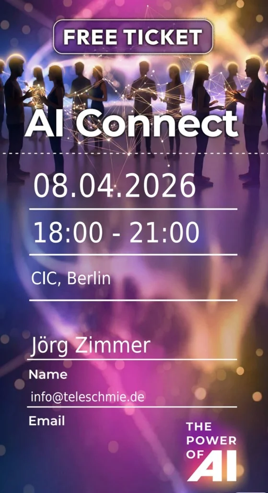

ALOHA! 🌻

Die KI-Welt dreht sich gerade so schnell, dass man kaum mit dem Blinzeln hinterherkommt. Täglich spucken Google, OpenAI und Anthropic neue Modelle und Features aus, die unsere Arbeitsweise fundamental verändern. Aber wisst ihr, was trotz aller Automatisierung, LLMs und Token-Wahnsinn immer noch unschlagbar ist? **Echter menschlicher Vibe und der direkte Austausch von Nerds zu Nerds.**

Deshalb habe ich mir mein Ticket geschnappt und bin am **8. April 2026** beim **1. AI Connect Berlin** am Start. Kein Bullshit-Bingo, kein trockenes Frontal-Bespaßen, sondern echtes Networking in einer der spannendsten Locations der Hauptstadt.

## Die Location: CIC Berlin – Wo Innovation atmet
Das Event findet im **CIC Berlin (Cambridge Innovation Center)** in der Lohmühlenstraße 65 statt. Wer das CIC nicht kennt: Das ist quasi das Wohnzimmer für skalierende Tech-Unternehmen und Innovatoren in Berlin. Ein Ort, der wie gemacht ist für ein Format wie "AI Connect", das die lokale Community zusammenbringen will. Von **18:00 bis 21:00 Uhr** wird hier die Luft vor fachlichem Austausch vibrieren.

  
 Jörgs Tacheles-Ecke

  
"Wer heute noch glaubt, KI sei nur ein Tool zum Texte schreiben, hat den Schuss nicht gehört. Wir sind mitten in einer technologischen Revolution, die das Handwerk des Codens und Kreierens völlig neu definiert. Wer nicht connected, bleibt auf der Strecke."

## Warum ich "schwer gespannt" bin
Ich gehe nicht zu Events, um nur Häppchen zu essen (obwohl die meistens auch gut sind). Ich suche Leute, die sich mit mir über die wirklich heißen Themen unterhalten wollen, die gerade meinen Arbeitsalltag dominieren:

### 1. Google Antigravity & Gemini AI Pro
Die Power, die hinter diesen Modellen steckt, ist brachial. Besonders im Bereich von **Complex Reasoning** und der Verarbeitung riesiger Kontext-Fenster setzen Google Antigravity und Gemini Pro gerade Maßstäbe. Ich will mit euch darüber fachsimpeln, wie ihr diese Modelle in der "Wildnis" einsetzt – fernab von einfachen Chatbot-Demos.

### 2. Google AI Studio: Mein digitaler Spielplatz
Seit ich Google AI Studio für mich entdeckt habe, ist das mein primärer Ort für schnelle Prototypen geworden. Die Integration in bestehende Workflows und die Geschwindigkeit, mit der man hier Ideen validieren kann, ist unglaublich. Wer von euch experimentiert hier noch mit System-Prompts und Temperatur-Settings?

### 3. Nano Banana & die neue Multimedia-Welt
Nano Banana ist für mich das Sinnbild für die Verschmelzung von Song-Erstellung, Video-Generierung und intelligenter Texterstellung. Wir reden hier nicht mehr über Spielereien für Social Media, sondern über professionelle Produktion auf Speed. Ich zeige euch gerne im Call (oder beim Bierchen vor Ort), was ich damit gerade für meine Projekte deichsle.

## Das Top-Thema: Vibe Coding
Das ist das Thema, das mich gerade am meisten triggert. **Vibe Coding** mit Google Antigravity und Cloud Code fühlt sich weniger nach klassischem Programmieren und mehr nach "Dirigieren" oder "Kuratieren" an. Die Barriere zwischen Idee und funktionierendem Code schmilzt weg. Das verändert nicht nur, *was* wir bauen, sondern *wie* wir überhaupt denken.

## Lass uns in Berlin fachsimpeln!
Egal ob du SEO-Experte, Entwickler, Marketer oder einfach nur KI-begeistert bist – lass uns quatschen! Ich bin ein "Digitaler Dinosaurier", der seit über 25 Jahren im Tech-Business ist, aber ich war selten so neugierig auf die Zukunft wie heute.

Wenn du Lust hast, über LLM-Architekturen, **[GEO (Generative Engine Optimization)](/blog/ai-seo-geo-praktikanten/)** oder einfach nur die beste Pizza in Kreuzberg zu quatschen – sprich mich an! Ich freue mich auf neue Gesichter und spannende Perspektiven.

## Vernetz dich mit mir!
Kannst du nicht dabei sein? Kein Stress. Lass uns trotzdem in Kontakt bleiben. Ich poste regelmäßig meine neuesten Experimente und "Tacheles-Einsichten" zu Antigravity und Gemini Pro auf LinkedIn.

  <h3 class="text-2xl font-bold mb-4">Lass uns auf LinkedIn connecten!</h3>
  
Vernetz dich jetzt mit mir, um keine Insights zu Vibe Coding und der Zukunft der SEO-Welt zu verpassen.

  <a href="https://www.linkedin.com/in/joerg-zimmer-seo-sea-freelancer-berlin-spandau/" target="_blank" rel="noopener noreferrer" class="btn-primary inline-flex">
    Jetzt auf LinkedIn vernetzen
  </a>

---

*ALOHA 🌻! Wir sehen uns in Berlin oder im Feed!*

### Weiterführende Artikel zum Thema KI
* **Lese-Tipp:** [KI als SEO-Praktikant: Warum GEO die neue Suche ist](/blog/ai-seo-geo-praktikanten/)
**Lese-Tipp:** Hat dir dieser Insight geholfen? Dann vernetz dich mit mir auf LinkedIn für tägliche SEO-Updates!
* **Lese-Tipp:** [Sistrix vs. SE Ranking: Wer hat die besseren KI-Daten?](/blog/sistrix-vs-se-ranking/)
