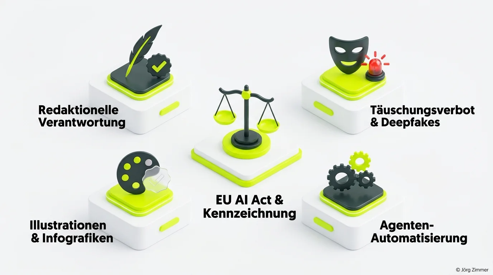

Eine Website mit über 200 Unterseiten, vollständig mit der Unterstützung autonomer KI-Agentensysteme erstellt: Muss ich dafür eigentlich einen rechtlichen Warnhinweis anbringen?

Das Foto im Header ist vollkommen echt: Der Typ auf dem Stuhl bin ich, und auf dem Bildschirm läuft meine eigene Webpräsenz. Was als Experiment begann, um LinkedIn-Beiträge in fundierte Blogartikel und Glossareinträge zu transformieren, ist zu einem umfassenden Leuchtturm-Projekt herangewachsen.

Über die Entwicklung habe ich bereits im Artikel [Meine KI-Website als Leuchtturm](/blog/ki-website-leuchtturm/) berichtet. Doch je autonomer meine agentischen Workflows mit Google Antigravity und Gemini Ultra agierten, desto dringlicher stellte sich eine Frage: **Wie viel Kennzeichnung verlangt der europäische Gesetzgeber?**

<figure class="my-8 bg-neutral-50 border border-neutral-200 p-6 md:p-8 rounded-2xl shadow-sm">
  

    
    

      <h4 class="font-bold text-base md:text-lg text-dark mb-0">Jörg Zimmer</h4>
      
Senior SEO & AI Search Consultant

    

  

  <blockquote class="text-base md:text-lg text-dark leading-relaxed italic border-l-4 border-lime-accent pl-4 my-4 font-normal">
    „Nicht der Automatisierungsgrad einer Website entscheidet über die Kennzeichnungspflicht, sondern das Täuschungsrisiko. Wer die redaktionelle Verantwortung für seine Inhalte übernimmt und keine gefälschten Realitäten vorspiegelt, nutzt KI legitim als Produktivitäts-Turbo.“
  </blockquote>
  <figcaption class="mt-4 pt-3 border-t border-neutral-200/60 flex flex-wrap items-center justify-between gap-2 text-xs text-neutral-500">
    Experten-Zitat • <cite class="not-italic font-semibold text-neutral-700">Jörg Zimmer</cite>
    <a href="https://www.linkedin.com/in/joerg-zimmer-seo-sea-freelancer-berlin-spandau/" target="_blank" rel="noopener noreferrer" class="font-bold text-lime-700 hover:underline inline-flex items-center gap-1">
      Jörg Zimmer auf LinkedIn folgen →
    </a>
  </figcaption>
</figure>

## Das technische Setup hinter dem Projekt

Für alle Entwickler und Technik-Enthusiasten: Die Plattform basiert auf einem extrem schlanken Astro-Framework mit minimalem JavaScript, versioniert über GitHub und optimiert durch [Markdown Content Negotiation](/glossar/markdown-content-negotiation/). Was früher Wochen an manueller Fleißarbeit gekostet hätte, erledigen heute spezialisierte Agenten-Pipelines:
- Echte Fotos aus dem Arbeitsalltag bleiben als authentische Assets erhalten.
- Technische Infografiken werden passgenau zur Textstruktur generiert.
- Glossardefinitionen und strukturierte Daten werden automatisiert validiert.
- Ich prüfe jeden publizierten Inhalt persönlich auf fachliche Korrektheit.

Doch wie beurteilen Rechtsexperten und Praktiker diese Konstellation vor dem Hintergrund des [EU AI Act](/glossar/eu-ai-act/)?

## Die rechtliche Grenze: Täuschungsabsicht versus Produktivität

In unserer Fachdiskussion auf LinkedIn kristallisierten sich vier wesentliche Säulen heraus, die den rechtlichen Rahmen definieren:

### 1. Redaktionelle Verantwortung als Schutzzaun
Christian Bennefeld brachte die juristische Essenz auf den Punkt: Solange eine reale Person als Herausgeber und Autor im Impressum die volle presserechtliche und zivilrechtliche Verantwortung für jede Zeile trägt, liegt der Fokus auf dem Ergebnis, nicht auf dem Werkzeug. Wer seine Texte vor dem Go-Live prüft, haftet für Richtigkeit – egal ob die Rohfassung von einer KI oder einem Praktikanten stammt.

### 2. Das Verbot von Täuschung und Deepfakes
Sven Badalyan lieferte die treffendste Sicherheitsanalogie: In der IT-Sicherheit markiert man nicht jeden automatisierten Hintergrundprozess, sondern jene Schnittstellen, an denen Vertrauensgrenzen überschritten werden. Bei Websites verläuft diese Grenze dort, wo synthetische Testimonials, gefälschte Expertenprofile oder manipulierte Bildbeweise eine reale Identität vortäuschen. Reine Sachtexte fallen nicht darunter.

### 3. Infografiken und stilisierte Illustrationen
Stefan Niesche wies mit einem Augenzwinkern auf die visuelle Ebene hin: Während fotorealistische Personenbilder bei Fälschungsgefahr klar unter Kennzeichnungspflichten fallen, sind stilisierte 3D-Grafiken oder Prozessdiagramme als grafische Hilfsmittel anerkannt. Dennoch schadet ein transparenter Hinweis im Impressum oder Footer niemals.

### 4. Agenten-Automatisierung ist legal
Der Grad der Automatisierung durch Multi-Agenten-Systeme ist kein Vergehen. Wer [Agent Readiness](/glossar/agent-readiness/) implementiert und maschinenlesbare Schnittstellen baut, investiert in Zukunftssicherheit. Wie Ronny K. in den Kommentaren betonte: Angst vor Regulierung darf nicht dazu führen, dass Innovationskraft durch vorauseilenden Gehorsam erstickt wird.

## Was Google und SEO-Algorithmen fordern

Auch aus Suchmaschinensicht gibt es Entwarnung: Google hat seine Richtlinien für [KI-Content](/glossar/ki-content/) längst klargestellt. Bestraft wird nicht die Erzeugung durch Algorithmen, sondern minderwertiger Spam ohne Informationsmehrwert (Information Gain).

Wer durch tiefgreifende Praxiserfahrung, originäre Daten und saubere Strukturen ein überzeugendes [E-E-A-T](/glossar/e-e-a-t/) Profil aufbaut, rankt erfolgreich – unabhängig davon, wie viele Zeilen Code von Agenten generiert wurden.

## Handlungsempfehlung für deine Website

Wenn du KI-Systeme für deine Content-Erstellung oder Website-Entwicklung einsetzt, befolge diesen Leitfaden:
- **Übernimm redaktionelle Verantwortung:** Veröffentliche niemals ungeprüfte Halluzinationen.
- **Vermeide gefälschte Testimonials:** Echte Kundenstimmen und Portraits müssen real bleiben.
- **Setze auf Transparenz:** Ein dezenter Hinweis in deinen Leitlinien oder im Impressum schafft Vertrauen bei Nutzern und Partnern.

Möchtest du klären, wie du KI-Workflows rechtssicher und SEO-wirksam in deinem Unternehmen verankerst? In der [SEO-Sprechstunde](/seo-sprechstunde/) analysieren wir deine Prozesse und zeigen dir, wie du maximale Effizienz mit höchster Qualität verbindest.

<!-- LinkedIn CTA Box -->

  <h3 class="text-xl md:text-2xl font-bold text-white mb-3 !mt-0 !border-none !pb-0">
    Jetzt an der Diskussion teilnehmen
  </h3>
  

    Diskutiere mit Jörg Zimmer und Rechtsexperten auf LinkedIn über den EU AI Act, Transparenz und die Kennzeichnung KI-generierter Websites.
  

  <a href="https://www.linkedin.com/posts/joerg-zimmer-seo-sea-freelancer-berlin-spandau_ai-generierte-website-zu-100-mit-agenten-activity-7490392598851936256-ZCSL" target="_blank" rel="noopener noreferrer" class="btn-primary">
    <svg class="w-4 h-4 fill-current" viewBox="0 0 24 24"><path d="M20.447 20.452h-3.554v-5.569c0-1.328-.027-3.037-1.852-3.037-1.853 0-2.136 1.445-2.136 2.939v5.667H9.351V9h3.414v1.561h.046c.477-.9 1.637-1.85 3.37-1.85 3.601 0 4.267 2.37 4.267 5.455v6.286zM5.337 7.433c-1.144 0-2.063-.926-2.063-2.065 0-1.138.92-2.063 2.063-2.063 1.14 0 2.064.925 2.064 2.063 0 1.139-.925 2.065-2.064 2.065zm1.782 13.019H3.555V9h3.564v11.452zM22.225 0H1.771C.792 0 0 .774 0 1.729v20.542C0 23.227.792 24 1.771 24h20.451C23.2 24 24 23.227 24 22.271V1.729C24 .774 23.2 0 22.222 0h.003z"/></svg>
    Beitrag auf LinkedIn öffnen
    →
  </a>

