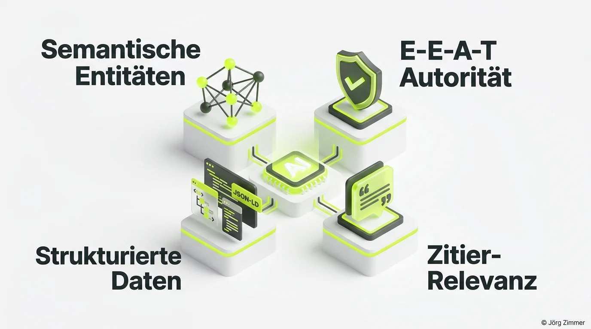

Blickst du bei den ganzen neuen Abkürzungen noch durch? AI SEO, GEO, AIO, LLMO – unsere Branche liebt Akronym-Kreationen. Doch hinter der aktuellen Begriffsdebatte verbirgt sich eine der fundamentalsten Umwälzungen, die ich in über 15 Jahren als digitaler Berater erlebt habe.

Die Gretchenfrage lautet heute: **Was passiert mit unserem digitalen Geschäftsmodell, wenn Google, Perplexity oder ChatGPT die Antwort direkt generieren – und Nutzer gar nicht mehr auf eine Website klicken?**

Null-Klick-Suchen (Zero-Click Searches) wachsen rasant. Wer in den synthetisierten Antworten generativer Sprachmodelle nicht als autoritative Quelle zitiert wird, existiert in der digitalen Customer Journey schlichtweg nicht mehr.

## Das Umfrageergebnis: 112 Kommentare und ein klares Votum

Um herauszufinden, wie die Praxis mit diesem Paradigmenwechsel umgeht, habe ich die LinkedIn-Community direkt befragt: *„Sichtbarkeit in KI-Modellen optimieren – wie nennen wir das neue Handwerk?“*

Die Resonanz war gewaltig: Über 110 Fachleute beteiligten sich an der Abstimmung und führten eine lebhafte Diskussion. Das Ergebnis spiegelt ein klares Meinungsbild wider:

| Fachbegriff | Stimmenanteil | Bedeutung & Ausrichtung |
|---|---|---|
| **GEO (Generative Engine Optimization)** | **51 %** | Präzise Optimierung von Inhalten für generative Synthese in LLMs |
| **AI SEO** | **22 %** | Eingängige Kunden-Bezeichnung, verknüpft gewohnte Begriffe |
| **SEO bleibt SEO** | **19 %** | Haltung der Traditionalisten: Disziplin erweitert sich, Name bleibt |
| **LLMO (Large Language Model Optimization)** | **8 %** | Technischer Fokus auf Modellarchitekturen und RAG-Pipelines |

Mit über der Hälfte aller Stimmen setzt sich **GEO** als Branchenstandard durch. Der Grund leuchtet ein: Er beschreibt exakt die methodische Arbeit, ohne falsche Versprechungen über Algorithmus-Manipulationen zu machen.

<figure class="my-8 bg-neutral-50 border border-neutral-200 p-6 md:p-8 rounded-2xl shadow-sm">
  

    
    

      <h4 class="font-bold text-base md:text-lg text-dark mb-0">Jörg Zimmer</h4>
      
Senior SEO & AI Search Consultant

    

  

  <blockquote class="text-base md:text-lg text-dark leading-relaxed italic border-l-4 border-lime-accent pl-4 my-4 font-normal">
    „Vollkommen egal, wie wir das Kind taufen – entscheidend ist die geschäftliche Konsequenz. Wer heute nicht dafür sorgt, dass seine Marke in Knowledge Graphs und Sprachmodellen als unumstößliche Autorität verankert ist, verliert künftig jeden direkten Kundenkontakt.“
  </blockquote>
  <figcaption class="mt-4 pt-3 border-t border-neutral-200/60 flex flex-wrap items-center justify-between gap-2 text-xs text-neutral-500">
    Experten-Zitat • <cite class="not-italic font-semibold text-neutral-700">Jörg Zimmer</cite>
    <a href="https://www.linkedin.com/in/joerg-zimmer-seo-sea-freelancer-berlin-spandau/" target="_blank" rel="noopener noreferrer" class="font-bold text-lime-700 hover:underline inline-flex items-center gap-1">
      Jörg Zimmer auf LinkedIn folgen →
    </a>
  </figcaption>
</figure>

## Warum GEO mehr als ein flüchtiger Hype ist

In den vergangenen zwei Jahrzehnten gab es zahllose Prophezeiungen über das angebliche Ende der Suchmaschinenoptimierung. Social Media sollte SEO verdrängen, dann Voice Search, dann mobile Apps. Keine dieser Prognosen trat ein.

Doch mit dem Siegeszug generativer Sprachmodelle verändert sich die Informationsarchitektur grundlegend:
1. **Modelle extrahieren Fakten, keine Webseiten:** Ein LLM liest deine Seite nicht, um sie als Linksammlung abzulegen, sondern um die Fakten in sein semantisches Netz einzuweben.
2. **Generischer Content wird wertlos:** Antworten, die eine KI durch logische Kombination bestehender Daten selbst formulieren kann, erfordern kein Zitat mehr.
3. **Information Gain wird zur Hauptwährung:** Nur wer originäre Daten, eigene Umfragen, Praxistests oder Fallstudien publiziert, bietet der KI einen Anlass zur expliziten Quellennennung.

## Die vier unverzichtbaren Säulen für KI-Sichtbarkeit

Um in generativen Suchsystemen nachhaltig genannt zu werden, müssen Websites vier Kernbereiche systematisch bedienen:

### 1. Semantische Entitäten und Knowledge Graphs
KI-Modelle denken nicht in Keywords, sondern in Entitäten und deren relationalen Verknüpfungen. Deine Website muss eindeutige Beziehungen zwischen Personen, Organisationen und Fachgebieten herstellen. Erst wenn Suchmaschinen deine Entität zweifelsfrei im Wissensgraphen verorten, vertrauen sie deinen Aussagen.

### 2. Nachweisbare E-E-A-T Autorität
Echte Praxiserfahrung (*Experience*), fachliche Tiefe (*Expertise*), anerkannte Autorität (*Authoritativeness*) und Transparenz (*Trustworthiness*) sind der Filter, den Suchmodelle anwenden. Details hierzu findest du in unserem Leitfaden zu [E-E-A-T](/glossar/e-e-a-t/). KI-Systeme bevorzugen Quellen, die durch Zitate renommierter Dritter gestützt werden.

### 3. Strukturierte Daten nach Schema.org
Syntaktische Klarheit ist für KI-Crawler Pflicht. Durch fehlerfreies [Schema Markup](/glossar/schema-org-markup/) wie `TechArticle`, `ProfilePage` oder `FAQPage` ermöglichst du LLMs das blitzschnelle Auslesen deiner Kernaussagen ohne Interpretationsverluste.

### 4. Zitier-Relevanz und Primärquellen-Charakter
Texte müssen so strukturiert sein, dass generative Modelle Kernantworten mühelos paraphrasieren und als Referenz belegen können. Konkrete Zahlen, prägnante Zusammenfassungen und unmissverständliche Definitionen erhöhen die Chance auf Zitate drastisch.

## Praxis-Tools zur Messung von KI-Sichtbarkeit

Wer die eigene Positionierung in Sprachmodellen nicht messen kann, steuert blind. Wir kombinieren in Kundenprojekten zwei spezialisierte Lösungen:

- Mit [SE Ranking (Partnerlink)](https://seranking.com/de/?ga=4169588&source=link) analysieren wir die klassischen Suchergebnisse sowie KI-Overviews auf SERP-Ebene. Wie das in der Praxis funktioniert, zeigt unser Praxisbericht zu [SE Ranking KI-Sichtbarkeit](/blog/se-ranking-ki-sichtbarkeit/).
- Mit [Rankscale (Partnerlink)](https://rankscale.ai/?via=offer) analysieren wir die Erwähnungen, Zitationsraten und Sentiment-Werte über 17 führende Sprachmodelle hinweg. Mehr dazu erfährst du in unserem Testbericht zum [Rankscale AI Visibility Tool](/blog/rankscale-ai-visibility-tool/).

## Empfehlung für deine Content- und Markenstrategie

Wenn du deine Sichtbarkeit für die Ära generativer Suchsysteme zukunftssicher aufstellen willst, befolge diese drei Schritte:

1. **Prüfe dein technisches Fundament:** Stelle sicher, dass Crawler von Google, OpenAI, Anthropic und Perplexity deine Website barrierefrei erfassen können.
2. **Investiere in originäre Primärdaten:** Veröffentliche eigene Umfragen, Benchmark-Analysen und transparente Fallstudien, die in deinem Markt als Referenz dienen.
3. **Schärfe deine Marken-Entität:** Baue über Autorenprofile, Verbandsmitgliedschaften und Fachpublikationen systematisch deine [Topical Authority](/glossar/topical-authority/) auf.

Wenn du analysieren möchtest, wie deine Website aktuell in ChatGPT, Perplexity und Google AI Overviews wahrgenommen wird, prüfen wir deine Ausgangslage gerne in der [SEO-Sprechstunde](/seo-sprechstunde/).

<!-- LinkedIn CTA Box -->

  <h3 class="text-xl md:text-2xl font-bold text-white mb-3 !mt-0 !border-none !pb-0">
    Jetzt an der Diskussion teilnehmen
  </h3>
  

    Diskutiere mit Jörg Zimmer und der SEO-Community auf LinkedIn über GEO, LLMO und die Zukunft der KI-Sichtbarkeit.
  

  <a href="https://www.linkedin.com/posts/joerg-zimmer-seo-sea-freelancer-berlin-spandau_umfrage-ergebnis-sichtbarkeit-in-ki-modellen-activity-7266714545100021760-7p-J" target="_blank" rel="noopener noreferrer" class="btn-primary">
    <svg class="w-4 h-4 fill-current" viewBox="0 0 24 24"><path d="M20.447 20.452h-3.554v-5.569c0-1.328-.027-3.037-1.852-3.037-1.853 0-2.136 1.445-2.136 2.939v5.667H9.351V9h3.414v1.561h.046c.477-.9 1.637-1.85 3.37-1.85 3.601 0 4.267 2.37 4.267 5.455v6.286zM5.337 7.433c-1.144 0-2.063-.926-2.063-2.065 0-1.138.92-2.063 2.063-2.063 1.14 0 2.064.925 2.064 2.063 0 1.139-.925 2.065-2.064 2.065zm1.782 13.019H3.555V9h3.564v11.452zM22.225 0H1.771C.792 0 0 .774 0 1.729v20.542C0 23.227.792 24 1.771 24h20.451C23.2 24 24 23.227 24 22.271V1.729C24 .774 23.2 0 22.222 0h.003z"/></svg>
    Beitrag auf LinkedIn öffnen
    →
  </a>

