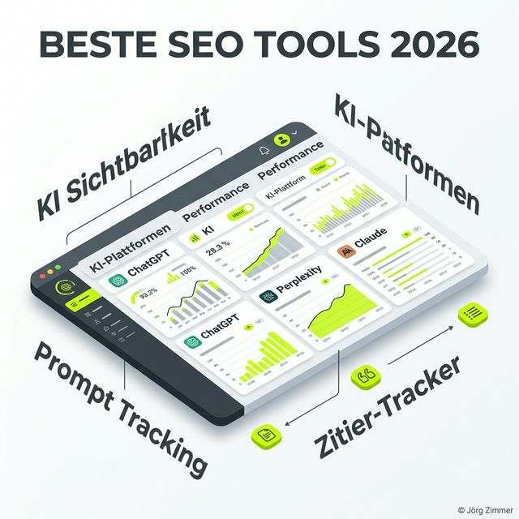

Moin! 🌻

Machen wir uns nichts vor: Wir befinden uns gerade in der größten Umbruchphase des digitalen Marketings seit der Erfindung der Suchmaschine. Als ich 2001 mit SEO angefangen habe (ja, ich bin der Senior hier), ging es darum, ein paar Keywords in die Meta-Tags zu schubsen. Später kamen die "Blauen Links" und der Kampf um Platz 1 bei Google.

Heute? Heute fragen die Leute ChatGPT oder Perplexity nach Empfehlungen. Und wenn du dort nicht auftauchst, existierst du faktisch für eine wachsende Zielgruppe nicht mehr.

Die Frage ist also nicht mehr nur: "Wo ranke ich bei Google?", sondern: **"Wie oft werde ich von der KI zitiert?"**

Um das zu beantworten, brauchst du ein völlig neues Arsenal an Werkzeugen. In diesem Deep-Dive schauen wir uns die besten SEO-Tools für AI Search und Prompt Tracking an. Tacheles, ohne Marketing-Blabla.

## Warum klassische SEO-Tools oft versagen

Die meisten großen SEO-Suiten (ihr kennt sie alle: Sistrix, Semrush, Ahrefs) wurden für die alte Welt gebaut. Sie crawlen den Google-Index und schauen, an welcher Stelle ein Link auftaucht. Das ist wichtig, keine Frage. Aber ein Sprachmodell wie ChatGPT oder Claude ist kein Index. Es ist ein neuronales Netz, das Informationen aus tausenden Quellen zusammenwürfelt.

Wer heute "AI-SEO" oder <a href="/glossar/geo/">GEO (Generative Engine Optimization)</a> betreiben will, muss verstehen, wie die KI seinen Content verarbeitet. Und genau hier trennt sich die Spreu vom Weizen.

## 1. Rankscale: Der Laser-Fokus auf AI Visibility

Wenn wir über echtes Prompt-Tracking sprechen, ist **[Rankscale](https://rankscale.ai/?via=offer)** momentan das Maß der Dinge. Warum? Weil sie nicht versuchen, alles ein bisschen zu können, sondern sich voll auf die Messung von KI-Sichtbarkeit konzentrieren.

### Was Rankscale kann (und warum du es brauchst)

Das Herzstück ist der **Cite-Tracker**. Das Tool stellt hunderten von KI-Modellen (ChatGPT, Perplexity, Gemini, Claude, SearchGPT etc.) gezielte Fragen zu deiner Branche und deinen Keywords. Es analysiert dann in Echtzeit:
- Wird deine Website als Quelle genannt?
- In welchem Kontext wird deine Marke erwähnt?
- Welche Wettbewerber werden stattdessen zitiert?

Ein weiteres Highlight ist das **RAG-Ready Audit**. Es zeigt dir, ob dein Content für den <a href="/glossar/rag/">Retrieval-Augmented Generation (RAG)</a> Prozess geeignet ist. Wenn die KI deinen Text nicht "versteht", kann sie ihn auch nicht zitieren. [Rankscale](https://rankscale.ai/?via=offer) liefert freundlichen Klartext und zeigt dir, wo du semantisch nachbessern musst.

- **Vorteil:** Unschlagbar präzise bei KI-Mentions und Zitaten.
- **Nachteil:** Kein klassisches All-in-One SEO Tool (ersetzt kein Backlink-Audit).
- **Kosten:** Es gibt verschiedene Pakete, Einsteiger-Lizenz startet moderat für den gebotenen Tiefgang.

👉 **Hier geht's direkt zu <a href="https://rankscale.ai/?via=offer" target="_blank" rel="noopener noreferrer">Rankscale</a>:** <a href="https://rankscale.ai/?via=offer" target="_blank" rel="noopener noreferrer">RankScale testen und KI-Sichtbarkeit messen</a>

## 2. SE Ranking: Das solide Fundament für alles

Bevor du über Prompts und Zitate nachdenkst, muss dein technisches Gerüst stehen. Pfusch am Bau rächt sich hier sofort. **[SE Ranking](https://seranking.com/de/?ga=4169588&source=link)** ist mein "Daily Driver" für das klassische Handwerk.

### Warum SE Ranking für KI-SEO wichtig ist

Damit ChatGPT oder ein anderer Agent deine Seite als Quelle nutzt, muss er sie erst einmal finden und verarbeiten können. [SE Ranking](https://seranking.com/de/?ga=4169588&source=link) liefert hierfür den besten **Website Audit** im Preis-Leistungs-Verhältnis. Es findet kaputte <a href="/glossar/canonical-tag/">Canonical Tags</a>, 404-Fehler oder fehlende Schema-Markups schneller, als du "Senior" sagen kannst.

Zusätzlich bietet [SE Ranking](https://seranking.com/de/?ga=4169588&source=link) mittlerweile erste KI-Funktionen im Content Editor an, die dir helfen, die semantische Dichte deiner Texte zu erhöhen. Das ist die absolute Basis für jede KI-Strategie.

- **Vorteil:** Extrem benutzerfreundlich, wahnsinnig gute Datenqualität beim Rank-Tracking.
- **Nachteil:** Fokus liegt noch stärker auf klassischen Suchmaschinen (Google).
- **Kosten:** Sehr fair, ideal für Freelancer und KMUs.

👉 **Hier findest du die aktuellen Preise:** <a href="https://seranking.com/de/?ga=4169588&source=link" target="_blank" rel="noopener noreferrer">SE Ranking kostenlos testen</a>

---

## 💬 Jörgs SEO-Klartext: "AI-Strategie ist Chefsache"

> **Tacheles:** Ich sehe immer wieder Unternehmen, die den Praktikanten dransetzen, um "irgendwas mit KI" zu machen. Das ist gefährlich! In der neuen Welt von AI Search geht es um Autorität und Vertrauen. Wenn du dich auf Tools verlässt, die dir nur grüne Häkchen zeigen, aber nicht messen, was SearchGPT wirklich über dich sagt, dann spielst du Russisch Roulette mit deinem Business. Nutze Profi-Tools, um zu verstehen, WARUM du nicht zitiert wirst. Oft ist es fehlendes <a href="/glossar/e-e-a-t/">E-E-A-T</a> oder eine kaputte semantische Struktur. Wer hier spart, zahlt später doppelt durch Traffic-Verlust.

---

## Kostenlose Tools für die "SEO-Gesundheit"

Du musst nicht für jeden Handgriff Geld ausgeben. Es gibt ein paar Klassiker unter den Gratis-Tools, die immer noch ihren Zweck erfüllen.

### Google Search Console (GSC)
Die GSC ist die einzige direkte Verbindung ins Gehirn von Google. Hier siehst du, ob deine Seiten indexiert sind. Seit Kurzem sehen wir dort auch immer mehr Daten zu "AI Overviews". Nutze die Console, um sicherzustellen, dass der Googlebot überhaupt auf deine Inhalte zugreifen kann. Keine Indexierung = Keine Chance auf KI-Zitate.

### SEORCH: Der ehrliche OnPage-Check
Wenn ich schnell wissen will, ob eine Seite technisch sauber ist, werfe ich sie bei **SEORCH.de** rein. Es ist ein deutsches Urgestein und liefert einen gnadenlos ehrlichen Check zu H-Überschriften, Bildern, Meta-Daten und mehr. Perfekt, um groben "Pfusch am Bau" vor der großen KI-Optimierung zu finden.

## Der große SEO-Tool-Vergleich 2026

Hier ist die Übersicht, damit du nicht den Überblick verlierst (wer CEO-Sprache spricht, kriegt schließlich auch Budgets):

| Tool | Fokus | Hauptfunktion für KI | Preisklasse | Empfehlung |
| :--- | :--- | :--- | :--- | :--- |
| **[Rankscale](https://rankscale.ai/?via=offer)** | AI Visibility | Cite-Tracker & Prompt Tracking | Mittel | Für Fortgeschrittene & GEO-Strategen |
| **[SE Ranking](https://seranking.com/de/?ga=4169588&source=link)** | All-in-One SEO | Audit & Keyword Tracking | Günstig-Mittel | Mein Tipp für die tägliche Arbeit |
| **Search Console** | Indexierung | Google AI Overviews | Gratis | Zwingend für jeden Webmaster |
| **SEORCH** | OnPage Check | Technische Basisprüfung | Gratis | Super für den schnellen Check zwischendurch |

## Checkliste: So wählst du dein Tool-Set

1. **Definiere dein Ziel:** Willst du nur bei Google ranken oder willst du in den KI-Antworten als Experte auftauchen?
2. **Prüfe dein Fundament:** Ist deine Seite technisch sauber? Wenn nein -> **[SE Ranking](https://seranking.com/de/?ga=4169588&source=link)** oder **SEORCH** nutzen.
3. **Gehe in den Angriff:** Willst du wissen, was ChatGPT, Perplexity und Claude über dich schreiben? Dann brauchst du **[Rankscale](https://rankscale.ai/?via=offer)**.
4. **Monitoring:** Verlass dich nicht auf einmalige Checks. KI-Modelle werden ständig geupdatet. Ein wöchentliches Tracking ist Pflicht.

## Warum "Habe fertig" nicht mehr reicht

Früher war eine SEO-Aufgabe irgendwann abgeschlossen. Heute ist es ein dynamischer Prozess. Die KI-Modelle "halluzinieren" manchmal, sie ändern ihre Quellenpräferenzen und sie werden immer besser darin, qualitativ minderwertigen Content (AI-Spam) herauszufiltern.

Wer heute in die besten Tools investiert, kauft sich vor allem eines: **Gewissheit**.

In meiner <a href="/seo-sprechstunde/">SEO-Sprechstunde</a> sehe ich oft Leute, die hunderte Euros für Backlinks ausgeben, aber nicht wissen, ob sie jemals in einem LLM-Prompt vorkommen. Das ist Geldverbrennung. 

Hört auf zu raten. Fangt an zu messen.

## Bottom Line: Wer nicht trackt, der verliert

Die Welt der Answer Engines ist keine Bedrohung, sondern eine riesige Chance für alle, die verstehen, wie man Vertrauen aufbaut. Ein starkes E-E-A-T, kombiniert mit den richtigen Tools, macht dich zum unangefochtenen Experten in deinem Markt.

ALOHA! 🌻✌️

---

  <h3 class="text-2xl font-bold mb-4">Willst du dein Tool-Set prüfen?</h3>
  
Ich zeige dir in 15 Minuten, welche Tools für DEINE Nische wirklich Sinn machen und wo du dir das Geld sparen kannst. Kein Bullshit-Bingo, versprochen.

  <a href="/kontakt/" class="btn-primary inline-flex">Jetzt Tool-Beratung anfragen</a>

