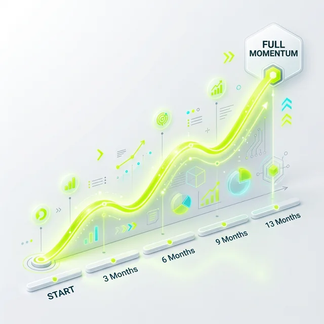
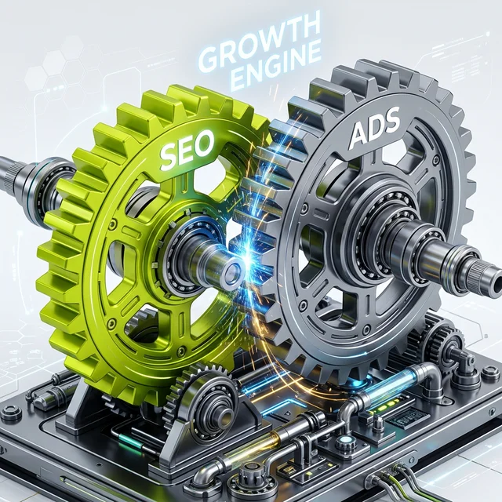

**Antonio Blago** hat mich eingeladen und was soll ich sagen? In einer Branche, die vor oberflächlichem Geplänkel nur so strotzt, war dieses Gespräch eine echte Wohltat. Antonio stellt nicht nur gute Fragen – er besitzt die seltene Gabe, wirklich zuzuhören und Raum für Antworten zu lassen, die über die üblichen Marketing-Phrasen hinausgehen. Das Ergebnis? Ein Podcast, der kein Buzzword-Bingo ist, sondern ein ehrlicher Schlagabtausch über den Status Quo von SEO, Google Ads und der Frage, wo wir in zwei Jahren stehen werden.

  
 Jörgs SEO-Klartext (LinkedIn Insights)

  
"Digitaler Erfolg ist kein Sprint, sondern ein strategischer Dauerlauf. Wer heute die Weichen stellt, kontrolliert morgen die KI-Sichtbarkeit."

## 25 Jahre im Geschäft – Ein Blick zurück in die Zukunft

Wenn man seit über zwei Jahrzehnten dabei ist, entwickelt man eine gewisse Gelassenheit gegenüber dem nächsten "großen Ding". Wir haben das Ende von SEO schon so oft vorhergesagt bekommen, dass wir eigentlich schon eine eigene Friedhofs-Sparte dafür bräuchten. Aber im Kern geht es immer noch darum: Relevanz schaffen und diese sichtbar machen.

### Worüber wir im Detail gesprochen haben

Wir haben uns Zeit genommen, die Themen zu sezieren, die viele Marketer heute nachts wachhalten:

- **Warum SEO kein 4-Wochen-Projekt ist:** Ich sage es im Podcast ganz deutlich: Wer echte Ergebnisse will, sollte in Monaten denken, nicht in Wochen. Oft dauert es 13 Monate (ja, das ist eine spezifische Zahl aus meiner Erfahrung), bis ein Projekt wirklich sein volles Momentum entfaltet. Warum? Weil Vertrauen bei Suchmaschinen organisch wachsen muss. Man kann technische Fehler in Tagen beheben, aber Autorität lässt sich nicht erzwingen.

- **Content ist mehr als nur Buchstaben auf dem Bildschirm:** Wir haben darüber philosophiert, wie man mit Inhalten echte Werte schafft. Es geht nicht darum, den hundertsten Artikel über "SEO Tipps" zu schreiben. Es geht darum, die Suchintention (Search Intent) so präzise zu treffen, dass der Nutzer gar nicht anders kann, als bei dir zu bleiben. Wir haben besprochen, wie man Content-Cluster baut, die wie ein Magnet für die richtige Zielgruppe wirken.
- **Wieso "Money Keywords" keine Magie sind, sondern Handwerk:** Alle wollen für "Versicherung kaufen" auf Platz 1. Aber ist das strategisch klug? Wir haben analysiert, wie man die Nischen findet, in denen das Geld wirklich verdient wird – fernab vom blutigen Wettbewerb der großen Begriffe. Es ist die Kunst der Long-Tail-Strategie gepaart mit einem tiefen Verständnis des Nutzer-Funnels.
- **Wie KI heute wirklich hilft und wo sie versagt:** KI ist ein Co-Pilot, kein Kapitän. Wir haben darüber gesprochen, wie wir LLMs für die Datenanalyse, das Clustering und die Strukturierung nutzen. Aber wir haben auch aufgezeigt, wo die menschliche Expertise unersetzlich bleibt: In der Intuition, im Branding und in der Fähigkeit, über den Tellerrand der vorhandenen Trainingsdaten hinauszuschauen.
- **Die ewige Frage: SEO vs. Ads:** Wann schmeiße ich Geld in Google Ads (früher AdWords) und wann investiere ich in den langen Atem von SEO? Wir haben ein paar "Fausregeln" geteilt, die dir tausende Euro an Lehrgeld ersparen können. Es geht um die Synergie, nicht um das Entweder-oder.

## Der Kern der Sache: Bist du SEO AI ready?

Das war die Leitfrage des Gesprächs. Wir haben versucht, den Hype vom Handfesten zu trennen.

### 1. Reicht klassisches SEO noch aus?
Die kurze Antwort: Nein. Die lange Antwort: Klassisches SEO (saubere Technik, gute Keywords) ist nur noch die Eintrittskarte ins Stadion. Um in den neuen AI-Overviews (wie Googles AIO oder Perplexity) sichtbar zu werden, musst du anfangen, in Entitäten zu denken. Du musst der Suchmaschine beweisen, dass du DIE Autorität für ein bestimmtes Thema bist. Wir haben besprochen, wie man E-E-A-T (Experience, Expertise, Authoritativeness, Trustworthiness) im Zeitalter generativer KI nachweist.

### 2. Welche Datenquellen nutzen die KIs wirklich?
Das ist die Millionen-Euro-Frage. Wir haben darüber spekuliert und erste Datenpunkte analysiert, welche Quellen von ChatGPT, Claude und Gemini bevorzugt werden. Es geht um strukturierte Daten, aber auch um die Präsenz auf Drittanbieter-Plattformen, in Foren und Podcasts. Sichtbarkeit ist heute multidimensional.

### 3. Die YouTube-Falle: Freigabe für das AI-Training?
Antonio und ich haben intensiv über die Rolle von Video-Content diskutiert. Macht es Sinn, YouTube-Transkripte für das KI-Training freizugeben? Kann man so die KI "beeinflussen", damit sie einen in den Antworten zitiert? Wir teilen unsere ersten Testergebnisse und geben eine Einschätzung, worauf man achten sollte, bevor man seine Daten dem großen Hunger der LLMs opfert.

## Ein Hauch von Nostalgie: Anekdoten aus der Wildwest-Zeit

Zwischendurch ist der Podcast in die "gute alte Zeit" abgedriftet. Wir haben über Techniken gelacht, die 2005 funktioniert haben und uns heute eine sofortige Penalty einbringen würden. Es war wichtig aufzuzeigen, wie weit wir gekommen sind. Diese Anekdoten sind nicht nur Unterhaltung – sie sind die Basis für das Verständnis dafür, dass das Internet ein Geben und Nehmen ist. Wer nur nimmt (spammt), wird irgendwann bestraft. Wer gibt (Wert schafft), überlebt jedes Update.

### Was du jetzt tun solltest

Dieser Podcast ist für alle, die genug haben von 5-Minuten-Tipps, die morgen nicht mehr funktionieren. Es ist ein Deep Dive für echte Macher, die wissen wollen, wie sie ihr Unternehmen langfristig sicher durch die raue See des digitalen Wandels steuern.

Antonio, danke für den Raum, das ehrliche Gespräch und deine Neugier. Es war mir ein echtes Fest! Wir haben Themen besprochen, die wir in einer normalen Beratungsstunde kaum in dieser Tiefe abdecken können.

---

*PS: Jedes Mal, wenn ich "komplex" sage, einen Shot! Wer hat mitgezählt? Bei 25 Jahren Erfahrung wird die Welt eben nicht einfacher, sondern facettenreicher.*

**Die Folge findet ihr hier:**
- auf YouTube (inklusive Zeitstempel für die ungeduldigen): [Zum Video: Klartext aus 25 Jahren SEO & Google Ads](https://youtu.be/pJFZzv5LEvk)
- und natürlich auf Spotify für unterwegs.

### Weiterführende Artikel
* **Lese-Tipp:** [SEOpresso Podcast: Meine Empfehlung mit Max Muhr](/blog/seopresso-podcast-maximilian-muhr/)
* **Lese-Tipp:** [SEO Persönlich: Mein Interview im SEOpresso Podcast](/blog/seopresso-seo-persoenlich-interview/)
