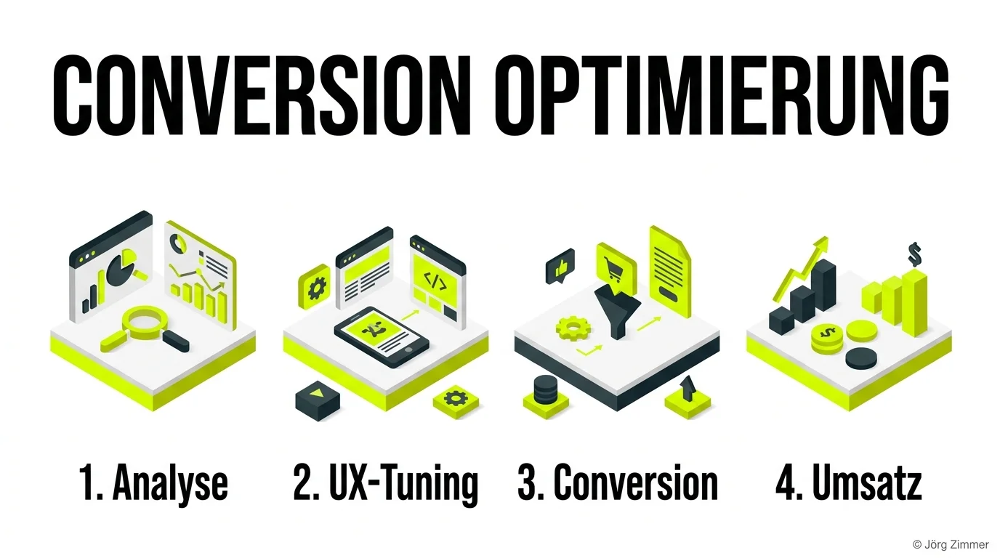

Das Schönste an etablierten Branchen-Events wie der [CAMPIXX](/glossar/campixx-berlin/) sind nicht zwingend nur die Folien auf der Bühne. Es sind die **intensiven Gespräche in den Pausen**.

30 Minuten zwischen den Vortragsslots – genau das ist es, was ein grandioses Networking-Event ausmacht.

Nach dem Vortrag von **Thomas Czernik** über Microsoft Clarity bin ich zusammen mit Analytics-Experte **Markus Baersch** direkt in einen richtig tiefen Nerd-Talk über Datenstrukturen, Verhaltensanalysen und Nutzerführung abgetaucht. Kaffee in der Hand und ab geht der Austausch.

Wir reden hier über handfeste Herausforderungen aus dem Agenturalltag, echtes Kundenverständnis und messbare Hebel – **einfach so auf dem Flur.**

<figure class="my-8 bg-neutral-50 border border-neutral-200 p-6 md:p-8 rounded-2xl shadow-sm">
  

    
    

      <h4 class="font-bold text-base md:text-lg text-dark mb-0">Jörg Zimmer</h4>
      
Senior SEO & AI Search Consultant

    

  

  <blockquote class="text-base md:text-lg text-dark leading-relaxed italic border-l-4 border-lime-accent pl-4 my-4 font-normal">
    „Ich verstehe gar nicht, warum alle immer nur blind mehr [Traffic](/glossar/traffic/) rein kippen wollen, wenn der eigentliche Schlüssel doch in der kompromisslosen Nutzerzufriedenheit liegt.“
  </blockquote>
  <figcaption class="mt-4 pt-3 border-t border-neutral-200/60 flex flex-wrap items-center justify-between gap-2 text-xs text-neutral-500">
    Experten-Zitat • <cite class="not-italic font-semibold text-neutral-700">Jörg Zimmer</cite>
    <a href="https://www.linkedin.com/posts/joerg-zimmer-seo-sea-freelancer-berlin-spandau_das-sch%C3%B6nste-an-der-campixx-sind-die-gespr%C3%A4che-activity-7473890187715043328-bQ0T" target="_blank" rel="noopener noreferrer" class="font-bold text-lime-700 hover:underline inline-flex items-center gap-1">
      Diskussion auf LinkedIn ansehen →
    </a>
  </figcaption>
</figure>

## Die Illusion der reinen Besucherzahl

In vielen Marketingabteilungen herrscht noch immer ein fataler Reflex: Bleiben die Leads oder Umsätze aus, wird reflexartig nach mehr Klicks gerufen. Man erhöht das Werbebudget in Google Ads, schaltet mehr Social-Media-Kampagnen oder jagt dem nächsten Trend-Keyword hinterher.

Das ist wirtschaftlich kurzsichtig. Wenn ein Eimer Löcher hat, hilft es nicht, mehr Wasser oben hineinzuschütten – man muss zuerst die Löcher stopfen.

Eine Steigerung der [Conversion Rate](/glossar/conversion-rate/) um lediglich 0,5 Prozentpunkte kann den Deckungsbeitrag eines gesamten Unternehmens drehen. Trotzdem starren viele Projektverantwortliche nur auf Klickstatistiken. Echte [Usability](/glossar/usability/) und Data Mining sind die wahren Königsdisziplinen der digitalen Wertschöpfung.

## Der mathematische Hebel im Praxis-Vergleich

Wie drastisch der Einfluss von CRO im Vergleich zu reinem Traffic-Einkauf ist, belegt ein simples Rechenbeispiel:

| Szenario | Monatlicher Traffic | Conversion Rate | Abschlüsse / Leads | Ø Auftragswert | Monatlicher Umsatz | Erforderlicher Aufwand |
|---|---|---|---|---|---|---|
| **Ausgangslage** | 20.000 Besucher | 1,0 % | 200 | 150 € | 30.000 € | Status quo |
| **Reiner Traffic-Push** | 40.000 Besucher (+100%) | 1,0 % | 400 | 150 € | 60.000 € | Budget-Verdoppelung / hoher Zeiteinsatz |
| **Fokus Conversion** | 20.000 Besucher (+0%) | 2,0 % (+1,0%) | 400 | 150 € | 60.000 € | Reines UX- & Formular-Tuning |
| **Kombi-Effekt** | 30.000 Besucher (+50%) | 2,5 % | 750 | 150 € | 112.500 € | Maximaler Hebel auf Gesamtertrag |

Die Zahlen zeigen unmissverständlich: Wer die Reibung auf der Website beseitigt, erreicht mit derselben Besuchermenge denselben Umsatz wie jemand, der sein Mediabudget blind verdoppelt. 

## Der 4-Stufen-Weg zu kompromissloser Nutzerzufriedenheit

Um Websites systematisch von Reibungspunkten zu befreien, hat sich ein iterativer Prozess etabliert:

### 1. Datengetriebene Schwachstellen-Analyse
Vor jeder Designänderung stehen harte Fakten. Mithilfe von Session Recordings und Klick-Heatmaps wird erfasst, an welchen Stellen Nutzer zögern oder Formulare frustriert verlassen. Auch Ladezeiten und [Core Web Vitals](/glossar/core-web-vitals/) fließen hier direkt ein.

### 2. Gezieltes UX-Tuning
Unklare Call-to-Action-Buttons, störende Pflichtfelder und visuelle Ablenkungen werden konsequent eliminiert. Das Layout wird auf maximale mobile Klarheit reduziert.

### 3. Vertrauen und Conversion-Trigger
Klare Leistungsversprechen, echte Kundenstimmen und transparente Kontaktaufnahmen bauen die letzte Hemmschwelle ab. Reale Expertise belegt die [Topical Authority](/glossar/topical-authority/) des Anbieters.

### 4. Skalierung von Umsatz und Ertrag
Erst wenn die Zielseite verlässlich konvertiert, lohnt sich das massive Hochfahren von Traffic-Kampagnen. Jeder investierte Euro fließt nun in einen profitablen Trichter.

## Handlungsempfehlungen für Webseiten-Betreiber

Geht auf Branchen-Events, tauscht euch mit Kollegen am Kaffeeautomaten aus und hört genau zu, wenn Praktiker über ihre Learnings sprechen. Welche innovativen Formate dabei entstehen, zeigt unser Konferenz-O-Ton [Vibe Coding: Echte KI-Workflows mit Roland Golla](/blog/campixx-video-roland-golla/) und meine Session zu [GEO & AI Search: Sichtbarkeit völlig neu gedacht](/blog/geo-und-ai-search-neues-spiel/).

Und vor allem: Hört auf, blindem Traffic hinterherzulaufen. Baut Webseiten, die Probleme lösen und Nutzer begeistern. Der Umsatz folgt der Nutzerzufriedenheit ganz automatisch.

Du möchtest die Reibungspunkte auf deiner Website identifizieren und deine Conversion Rate signifikant steigern? In meiner [SEO-Sprechstunde](/seo-sprechstunde/) analysieren wir deine Nutzerführung, Ladezeiten und Call-to-Actions – pragmatisch und auf den Punkt.

<!-- CTA Box -->

  
    LinkedIn Community Diskussion
  
  <h3 class="text-xl md:text-2xl font-bold text-white mb-3 !mt-0 !border-none !pb-0">
    Jetzt an der Diskussion teilnehmen
  </h3>
  

    Diskutiere mit Jörg Zimmer und der SEO-Community auf LinkedIn über diesen Beitrag.
  

  <a href="https://www.linkedin.com/posts/joerg-zimmer-seo-sea-freelancer-berlin-spandau_das-sch%C3%B6nste-an-der-campixx-sind-die-gespr%C3%A4che-activity-7473890187715043328-bQ0T" target="_blank" rel="noopener noreferrer" class="btn-primary">
    <svg class="w-4 h-4 fill-current" viewBox="0 0 24 24"><path d="M20.447 20.452h-3.554v-5.569c0-1.328-.027-3.037-1.852-3.037-1.853 0-2.136 1.445-2.136 2.939v5.667H9.351V9h3.414v1.561h.046c.477-.9 1.637-1.85 3.37-1.85 3.601 0 4.267 2.37 4.267 5.455v6.286zM5.337 7.433c-1.144 0-2.063-.926-2.063-2.065 0-1.138.92-2.063 2.063-2.063 1.14 0 2.064.925 2.064 2.063 0 1.139-.925 2.065-2.064 2.065zm1.782 13.019H3.555V9h3.564v11.452zM22.225 0H1.771C.792 0 0 .774 0 1.729v20.542C0 23.227.792 24 1.771 24h20.451C23.2 24 24 23.227 24 22.271V1.729C24 .774 23.2 0 22.222 0h.003z"/></svg>
    Beitrag auf LinkedIn öffnen
    →
  </a>

