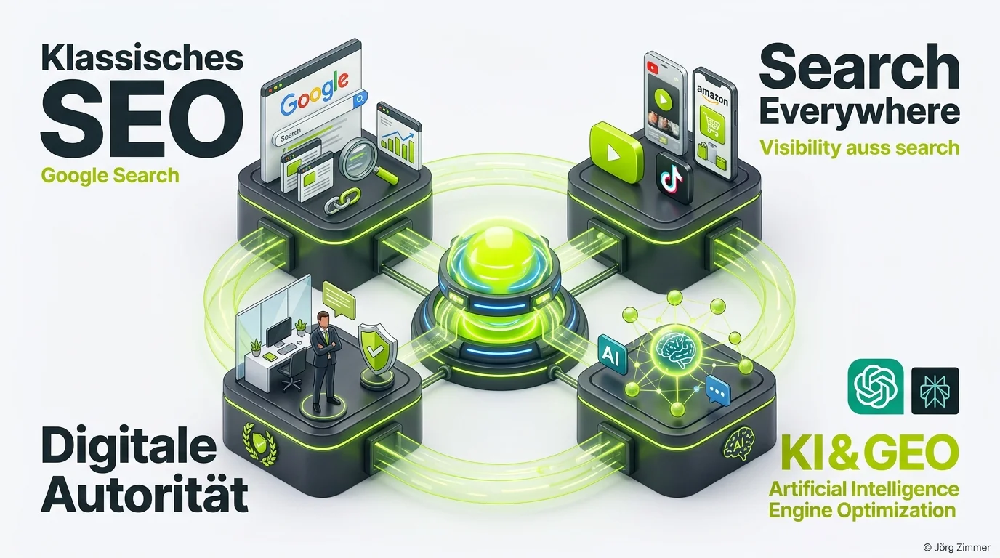

Auf der **Campixx** in Berlin trifft sich die deutschsprachige Suchmarketing-Elite, um fernab von Standard-Folien Klartext über die Zukunft unserer Branche zu reden. Wer mich kennt, weiß: Ich nutze Konferenzen nicht für oberflächliches Schulterklopfen, sondern werfe gezielt Fragen in die Runde, die wehtun und neue Perspektiven eröffnen.

Eine fundamentale Frage spaltete die Teilnehmenden in intensive Diskussionen: **Braucht SEO eigentlich einen neuen Namen?**

Was auf den ersten Blick wie eine akademische Begriffsdebatte wirkt, entscheidet im Alltag von Agenturen, Inhouse-Teams und Freelancern über Budgethöhe, strategischen Einfluss und die Wertschätzung unserer Arbeit.

## Die Ausgangslage: Wenn das Akronym zur Budgetfalle wird

Stell dir folgende Szene vor: Du sitzt im Konferenzraum eines etablierten Mittelständlers. Dir gegenübersitzen CEO, CFO und Marketingleitung. Du hast exakt zwanzig Minuten Zeit, um ein sechsstelliges Jahresbudget für das kommende Geschäftsjahr zu rechtfertigen.

Du eröffnest deine Präsentation mit dem Satz: *„Wir müssen unser SEO-Budget signifikant ausbauen.“*

Was passiert in den Köpfen der Entscheider? 
- Der Geschäftsführer denkt an jemanden im Kapuzenpullover, der im Keller Quellcode editiert.
- Der CFO denkt: *„Title-Tags und Meta-Descriptions hat doch letztes Jahr schon unser Werkstudent optimiert.“*
- Die Marketingleiterin fürchtet langwierige technische IT-Tickets, die monatelang in der Warteschlange versauern.

Nur die wenigsten C-Level-Entscheider verknüpfen das Wort „SEO“ spontan mit unternehmensweiter Marktführerschaft, Neukundengewinnung und digitaler Marktmacht. **Genau hier liegt das strukturelle Dilemma.**

<figure class="my-8 bg-neutral-50 border border-neutral-200 p-6 md:p-8 rounded-2xl shadow-sm">
  

    
    

      <h4 class="font-bold text-base md:text-lg text-dark mb-0">Jörg Zimmer</h4>
      
Senior SEO & AI Search Consultant

    

  

  <blockquote class="text-base md:text-lg text-dark leading-relaxed italic border-l-4 border-lime-accent pl-4 my-4 font-normal">
    „Dann schaffst du das auch mit zwei, drei Leuten durchzuspielen. Zumindest den Grundstock aufzusetzen, um diese Search Everywhere Optimization hinzubiegen. Und ich glaube, ja, ich wollte schon sagen, ja, okay, alles gut.“
  </blockquote>
  <figcaption class="mt-4 pt-3 border-t border-neutral-200/60 flex flex-wrap items-center justify-between gap-2 text-xs text-neutral-500">
    

      Experten-Zitat • <cite class="not-italic font-semibold text-neutral-700">Jörg Zimmer</cite>
      •
      <a href="https://www.youtube.com/watch?v=pJFZzv5LEvk&t=3960s" target="_blank" rel="noopener noreferrer" class="text-neutral-600 hover:text-dark underline inline-flex items-center gap-1">
        Quelle: YouTube Talk Antonio Blago & Jörg Zimmer Folge 5 (66:00)
        <svg class="w-3 h-3 text-neutral-400" fill="none" stroke="currentColor" viewBox="0 0 24 24"><path stroke-linecap="round" stroke-linejoin="round" stroke-width="2" d="M10 6H6a2 2 0 00-2 2v10a2 2 0 002 2h10a2 2 0 002-2v-4M14 4h6m0 0v6m0-6L10 14" /></svg>
      </a>
    

    <a href="https://www.linkedin.com/in/joerg-zimmer-seo-sea-freelancer-berlin-spandau/" target="_blank" rel="noopener noreferrer" class="font-bold text-lime-700 hover:underline inline-flex items-center gap-1 shrink-0">
      Jörg Zimmer auf LinkedIn folgen →
    </a>
  </figcaption>
</figure>

## Die Umfrageergebnisse: Wie die Community abstimmte

Auf LinkedIn und während der Campixx habe ich die Fragestellung zur Abstimmung gestellt. Nach Dutzenden Kommentaren und intensiven Wortmeldungen zeichnete sich ein klares Meinungsbild ab:

| Begriffskonzept | Stimmenanteil | Kernargument der Befürworter | Hauptkritik der Skeptiker |
|---|---|---|---|
| **Search Everywhere Optimization** | **55 %** | Behält das weltbekannte Akronym bei, erweitert aber den Horizont auf TikTok, YouTube, Amazon & KI. | Klingt für Außenstehende nach Wortklauberei ohne methodischen Mehrwert. |
| **Digital Authority & Visibility Management** | **28 %** | Spricht originäre C-Level-Sprache und fokussiert messbaren Marktwert statt technischer Handgriffe. | Wirkt marketinglastig und verwässert das handwerkliche SEO-Fundament. |
| **SEO bleibt SEO (Traditionalisten)** | **17 %** | Global etablierte Marke mit Milliardenwert; ein Auto nennen wir auch nicht 'mobiles Rechenzentrum'. | Führt bei Neukunden zu chronischer Unterbewertung und Budgetdeckelung. |

### 1. Das Lager der Visionäre: Search Everywhere (55 %)

Die absolute Mehrheit favorisiert eine intelligente Neudeutung: Das Akronym **SEO** bleibt bestehen, aber das mittlere „E“ wandert von *Engine* zu **Everywhere**.

Dieser Ansatz spiegelt die gelebte Realität moderner Suchstrategien wider:
- **Google & AI Overviews:** Die traditionelle Suche wird durch generative Zusammenfassungen ergänzt.
- **Social Search:** Die jüngere Zielgruppe sucht Problemlösungen primär auf TikTok, Instagram und YouTube.
- **Marketplaces:** Produktrecherchen starten bei über 60 % der Konsumenten direkt auf Amazon.
- **Antwortmaschinen:** Nutzer verlagern komplexe Recherchen in ChatGPT, Perplexity und Claude.

Wer heute ausschließlich für zehn blaue Links auf google.de optimiert, verliert Tag für Tag signifikante Marktanteile an Omnichannel-Konkurrenten.

### 2. Das Lager der Strategen: Digital Authority Management (28 %)

Knapp ein Drittel der Befragten fordert einen radikaleren Schnitt. Begriffe wie **„Digital Authority Management“** oder **„Enterprise Visibility Architecture“** zielen bewusst darauf ab, das handwerkliche Kleinklein hinter sich zu lassen.

Wenn wir uns als Dienstleister für digitale Autorität positionieren, verhandeln wir nicht über den Stundensatz für das Umschreiben von Alt-Attributen. Wir sprechen über die Verankerung von [Topical Authority](/glossar/topical-authority/), den Schutz der Unternehmensmarke in generativen Modellen und die strategische Dominanz im gesamten relevanten Themenumfeld.

### 3. Die Traditionalisten: Ein Begriff mit globalem Vertrauensbonus (17 %)

Die Traditionalisten halten dagegen: *„Jede Umbenennung verbrennt Energie, die besser in handwerklich saubere Arbeit fließt.“* Ein Automobilhersteller erfinde schließlich auch kein neues Kunstwort, nur weil moderne Fahrzeuge softwaregesteuerte Elektroautos sind.

Das Argument hat Berechtigung: Der Begriff SEO verfügt über globale Bekanntheit. Wer ihn leichtfertig opfert, riskiert, in Ausschreibungen und organischen Suchanfragen von Kunden schlicht übersehen zu werden.

## Die Brücke zwischen Technik und Vorstandsetage

Die Diskussion um den passenden Namen ist im Kern kein theoretisches Seminar über Semantik. Sie ist ein Spiegelbild unserer eigenen beruflichen Positionierung. 

Wenn wir Kunden gegenüber als „SEO-Dienstleister“ auftreten, werden wir automatisch mit standardisierten Discount-Agenturen und automatisierten Billig-Tools verglichen. Positionieren wir uns hingegen als strategische Partner für ganzheitliche Sichtbarkeit und Markenautorität, gestalten wir die Unternehmenszukunft aktiv mit.

Das Handwerk selbst hat sich unumkehrbar weiterentwickelt:
- [GEO (Generative Engine Optimization)](/glossar/geo/) bestimmt die Nennungen in KI-Modellen.
- [E-E-A-T](/glossar/e-e-a-t/) bildet die messbare Basis für Trust und redaktionelle Expertise.
- [Schema Markup](/glossar/schema-org-markup/) liefert den semantischen Bauplan für Wissensgraphen und LLMs.

Für die datengestützte Überwachung nutzen wir in der Praxis professionelle Werkzeuge: Mit bewährten Plattformen wie [SE Ranking (Partnerlink)](https://seranking.com/de/?ga=4169588&source=link) analysieren wir klassische Rankings und Wettbewerber, während wir über [SE Ranking KI-Sichtbarkeit](/blog/se-ranking-ki-sichtbarkeit/) und Tools wie [Rankscale (Partnerlink)](https://rankscale.ai/?via=offer) die Präsenz in Sprachmodellen quantifizieren.

## Handlungsempfehlung für Agenturen und Berater

Wie solltest du dein Handwerk künftig benennen? Die Antwort hängt vom jeweiligen Adressaten ab:

1. **Gegenüber Entwicklern und SEO-Fachkollegen:** Behalte „SEO“ bei. Es ist die präzise gemeinsame Fachsprache, unter der jeder exakt weiß, welche technischen Stellschrauben gemeint sind.
2. **Auf der eigenen Website und in Content-Hubs:** Nutze „Search Everywhere Optimization“. Es signalisiert Modernität, holt Suchende nach klassischen SEO-Begriffen ab und erweitert gleichzeitig deren Erwartungshorizont.
3. **Gegenüber Geschäftsführung und Investoren:** Sprich von „Digitaler Autorität und Omnichannel-Sichtbarkeit“. Kommuniziere in Business-Metriken: Marktanteile, Brand-Souveränität in KI-Systemen und qualifizierter Pipeline-Aufbau.

Wenn du herausfinden möchtest, wie deine aktuelle Sichtbarkeit über alle Suchkanäle hinweg aufgestellt ist und wie du deine Positionierung gegenüber Entscheidern schärfst, lass uns deine Strategie in der [SEO-Sprechstunde](/seo-sprechstunde/) detailliert analysieren.

<!-- LinkedIn CTA Box -->

  <h3 class="text-xl md:text-2xl font-bold text-white mb-3 !mt-0 !border-none !pb-0">
    Jetzt an der Diskussion teilnehmen
  </h3>
  

    Diskutiere mit Jörg Zimmer und der SEO-Community auf LinkedIn über die Zukunft unseres Handwerks und die Umfrageergebnisse.
  

  <a href="https://www.linkedin.com/posts/joerg-zimmer-seo-sea-freelancer-berlin-spandau_braucht-seo-einen-neuen-namen-activity-7261642115124117504-2W9Q" target="_blank" rel="noopener noreferrer" class="btn-primary">
    <svg class="w-4 h-4 fill-current" viewBox="0 0 24 24"><path d="M20.447 20.452h-3.554v-5.569c0-1.328-.027-3.037-1.852-3.037-1.853 0-2.136 1.445-2.136 2.939v5.667H9.351V9h3.414v1.561h.046c.477-.9 1.637-1.85 3.37-1.85 3.601 0 4.267 2.37 4.267 5.455v6.286zM5.337 7.433c-1.144 0-2.063-.926-2.063-2.065 0-1.138.92-2.063 2.063-2.063 1.14 0 2.064.925 2.064 2.063 0 1.139-.925 2.065-2.064 2.065zm1.782 13.019H3.555V9h3.564v11.452zM22.225 0H1.771C.792 0 0 .774 0 1.729v20.542C0 23.227.792 24 1.771 24h20.451C23.2 24 24 23.227 24 22.271V1.729C24 .774 23.2 0 22.222 0h.003z"/></svg>
    Beitrag auf LinkedIn öffnen
    →
  </a>

