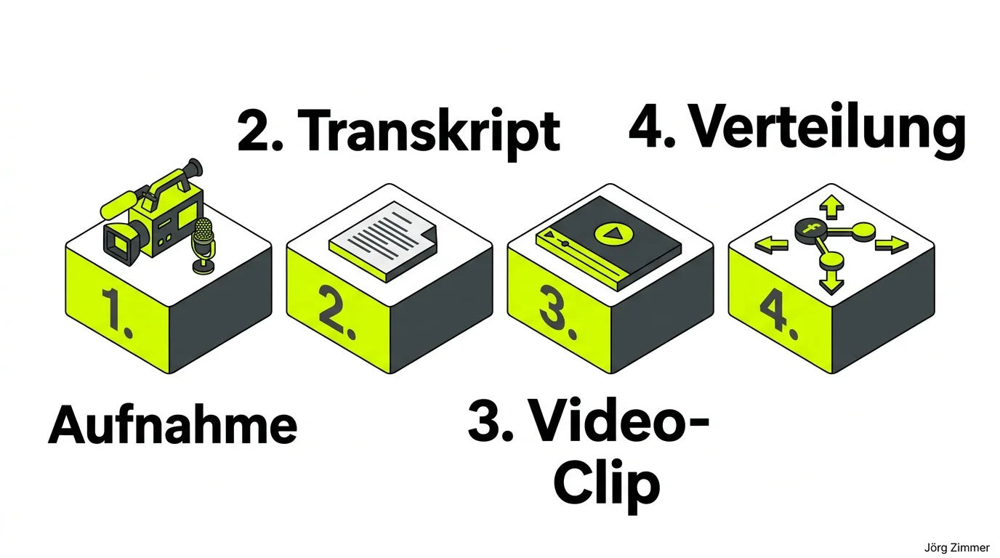

Es gibt Momente auf SEO-Events, die mindestens genauso prägend sind wie die Vortragsslots selbst: Die spontanen Fachgespräche auf dem Flur, ungefilterte Reaktionen und direkte O-Töne aus der Praxis.

Auf der [CAMPIXX](/glossar/campixx-berlin/) ergab sich genau so eine Gelegenheit: **Roland Golla**, erfahrener Consultant für Webentwicklung und Vibe Coding, stand direkt vor der Kamera – und zwar im professionellen Video-Studio-Setup von **Florian Gypser**.

Wir haben dort spontanes Videomaterial produziert, bei dem im Moment der Aufnahme noch gar nicht bis ins letzte Detail feststand, auf welchen Kanälen es letztendlich ausgespielt wird. Aber genau das ist der entscheidende Hebel: **Einfach machen und authentische Momente sichern.**

<figure class="my-8 bg-neutral-50 border border-neutral-200 p-6 md:p-8 rounded-2xl shadow-sm">
  

    
    

      <h4 class="font-bold text-base md:text-lg text-dark mb-0">Jörg Zimmer</h4>
      
Senior SEO & AI Search Consultant

    

  

  <blockquote class="text-base md:text-lg text-dark leading-relaxed italic border-l-4 border-lime-accent pl-4 my-4 font-normal">
    „Für Vibe Code und negatives Vibe vom Localhost.  Das negative Vibe vom Localhost ist natürlich so eine Sache. Wir haben dieses Vibe-Coding schon  überall in den URLs drin, wie du siehst, wenn ich mir eine der Seiten anschaue, es sind einfach  extrem viele Seiten. Wenn ich nach Coding suche, Coding-Tools, PHP-Coding, okay, also hat er den  Switch bei dir noch gar nicht geschafft. Du kommst.“
  </blockquote>
  <figcaption class="mt-4 pt-3 border-t border-neutral-200/60 flex flex-wrap items-center justify-between gap-2 text-xs text-neutral-500">
    

      Experten-Zitat • <cite class="not-italic font-semibold text-neutral-700">Jörg Zimmer</cite>
      •
      <a href="https://www.youtube.com/watch?v=tD7cXuVcRPA&t=4114s" target="_blank" rel="noopener noreferrer" class="text-neutral-600 hover:text-dark underline inline-flex items-center gap-1">
        Quelle: YouTube Never Code Alone (68:34)
        <svg class="w-3 h-3 text-neutral-400" fill="none" stroke="currentColor" viewBox="0 0 24 24"><path stroke-linecap="round" stroke-linejoin="round" stroke-width="2" d="M10 6H6a2 2 0 00-2 2v10a2 2 0 002 2h10a2 2 0 002-2v-4M14 4h6m0 0v6m0-6L10 14" /></svg>
      </a>
    

    <a href="https://www.linkedin.com/in/joerg-zimmer-seo-sea-freelancer-berlin-spandau/" target="_blank" rel="noopener noreferrer" class="font-bold text-lime-700 hover:underline inline-flex items-center gap-1 shrink-0">
      Jörg Zimmer auf LinkedIn folgen →
    </a>
  </figcaption>
</figure>

## Warum Video-Profis auf Fachkonferenzen den Unterschied machen

Wie **Marco Janck** (Gründer der CAMPIXX und SEO-Pionier) in den Diskussionen treffend hervorhob: Es ist ein himmelweiter Unterschied, ob jemand mit ausgestrecktem Arm ein wackeliges Smartphone-Video im lauten Konferenzgang aufnimmt oder ob erfahrene Video-Experten für saubere Beleuchtung und kristallklaren Ton sorgen.

Content ist wichtig, aber Technik entscheidet über die Wahrnehmung. 

Wenn der Ton scheppert, der Hall des Raumes die Worte verschluckt oder das Gesicht im Gegenlicht absäuft, brechen Nutzer auf LinkedIn oder YouTube nach drei Sekunden ab. Ein professionelles Setup holt das Maximum an [Usability](/glossar/usability/) und Aufmerksamkeit aus kurzen Sequenzen heraus.

Roland Golla formulierte es auf den Punkt: Auf Fachveranstaltungen zählt jede authentische Stimme. Hier entsteht der reale Gedankenaustausch, der weit über theoretische Folien hinausreicht.

## Vibe Coding: Warum SEOs Code verstehen müssen

Die Zusammenarbeit mit Roland verdeutlicht einen tiefgreifenden Trend der Branche: Die Grenzen zwischen technischem SEO und Software-Engineering lösen sich zunehmend auf. 

Wer 2026 noch versucht, moderne Web-Architekturen allein über Textbausteine zu optimieren, scheitert an der Realität. Themen wie client-seitiges Rendering, API-Anbindungen und serverseitige Logik verlangen tiefes technisches Verständnis. 

Mit dem Ansatz des **Vibe Coding** können SEO-Spezialisten heute gemeinsam mit Entwicklern in Rekordzeit Prototypen erstellen, Crawlability-Muster testen und automatisierte Auswertungen bauen. Das spart Wochen an Abstimmungsschleifen und stellt sicher, dass technischer [Traffic](/glossar/traffic/) nicht an Implementierungsfehlern verpufft.

## Der 4-Stufen-Workflow: Vom Konferenz-O-Ton zum Multi-Channel Asset

Um aus kurzen Videoaufnahmen auf Veranstaltungen das Maximum an [Topical Authority](/glossar/topical-authority/) herauszuholen, hat sich ein strukturierter Verwertungsprozess bewährt:

### 1. Aufnahme im Vor-Ort-Studio
Hochwertige Mikrofone und definierte Lichtverhältnisse garantieren, dass die Rohdaten broadcast-tauglich sind. Die Interviewten fühlen sich wohl und kommen direkt auf den Punkt.

### 2. Transkription und Text-Extraktion
Das gesprochene Wort wird automatisiert in Text überführt. Daraus entstehen semantisch dichte Absätze, Zitate und strukturierte FAQs, die direkt in den Fachartikel einfließen.

### 3. Zuschnitt prägnanter Video-Clips
Aus dem Rohmaterial werden 15- bis 45-sekündige Kernaussagen geschnitten, die das Wesentliche ohne Umschweife auf den Punkt bringen.

### 4. Multi-Channel Verteilung
Die Clips werden zielgerichtet über Social Media (LinkedIn) gestreut, im Blogartikel als visueller E-E-A-T-Anker eingebettet und im Rahmen von [YouTube SEO](/glossar/youtube-seo/) langfristig auffindbar gemacht.

## Gegenüberstellung: Video-Formate auf Konferenzen

Die Wahl des Aufnahme-Formats bestimmt Reichweite, Autorität und Verweildauer maßgeblich:

| Format | Spontanes Smartphone-Video | Vor-Ort-Studio (Florian Gypser Setup) | Transkribierter Textbeitrag |
|---|---|---|---|
| **Produktionsaufwand** | Sehr gering (< 5 Min.) | Mittel (15–30 Min. inkl. Setup) | Mittel (1–2 Stunden) |
| **Audio- & Bildqualität** | Häufig Hall, Rauschen & Wackler | Kristallklarer Ton, Studiolicht | Nicht zutreffend |
| **Nutzerbindung & Verweildauer**| Hohe Absprungrate bei Störgeräuschen | Maximale Fertigstellungsrate | Abhängig von Textstruktur & Lesefluss |
| **E-E-A-T Glaubwürdigkeit** | Spontan, aber oft oberflächlich | Höchste Experten-Autorität im O-Ton | Detaillierte Fachinformation |
| **Zweitverwertbarkeit** | Stark limitiert | Perfekt für Reels, Blog & Podcasts | Basis für Glossar-Artikel |
| **Einfluss auf Conversion** | Eher diffus | Messbare Stärkung der [Conversion Rate](/glossar/conversion-rate/) | Unterstützt organische Rankings |

## Praxis-Empfehlung für Konferenzbesucher

Wenn ihr auf der nächsten Fachkonferenz unterwegs seid: Sucht gezielt den direkten Dialog. Schnappt euch Kollegen, Entwickler und Vordenker. Wenn ein Setup mit verlässlicher Technik vorhanden ist, nutzt die Chance für echte O-Töne. 

Reale Menschen, ungefilterte Praxiseinblicke und greifbare Expertise schlagen jedes generische Marketingformat um Längen.

Du möchtest wissen, wie du Video-Assets und technische SEO-Workflows wirksam in deine digitale Strategie integrierst? In meiner [SEO-Sprechstunde](/seo-sprechstunde/) analysieren wir deine aktuellen Kanäle und entwickeln einen klaren Plan für maximale Reichweite.

<!-- CTA Box -->

  
    LinkedIn Community Diskussion
  
  <h3 class="text-xl md:text-2xl font-bold text-white mb-3 !mt-0 !border-none !pb-0">
    Jetzt an der Diskussion teilnehmen
  </h3>
  

    Diskutiere mit Jörg Zimmer und der SEO-Community auf LinkedIn über diesen Beitrag.
  

  <a href="https://www.linkedin.com/posts/joerg-zimmer-seo-sea-freelancer-berlin-spandau_vibe-coding-consultant-roland-golla-im-video-activity-7473914443111002112-RxMV" target="_blank" rel="noopener noreferrer" class="btn-primary">
    <svg class="w-4 h-4 fill-current" viewBox="0 0 24 24"><path d="M20.447 20.452h-3.554v-5.569c0-1.328-.027-3.037-1.852-3.037-1.853 0-2.136 1.445-2.136 2.939v5.667H9.351V9h3.414v1.561h.046c.477-.9 1.637-1.85 3.37-1.85 3.601 0 4.267 2.37 4.267 5.455v6.286zM5.337 7.433c-1.144 0-2.063-.926-2.063-2.065 0-1.138.92-2.063 2.063-2.063 1.14 0 2.064.925 2.064 2.063 0 1.139-.925 2.065-2.064 2.065zm1.782 13.019H3.555V9h3.564v11.452zM22.225 0H1.771C.792 0 0 .774 0 1.729v20.542C0 23.227.792 24 1.771 24h20.451C23.2 24 24 23.227 24 22.271V1.729C24 .774 23.2 0 22.222 0h.003z"/></svg>
    Beitrag auf LinkedIn öffnen
    →
  </a>

