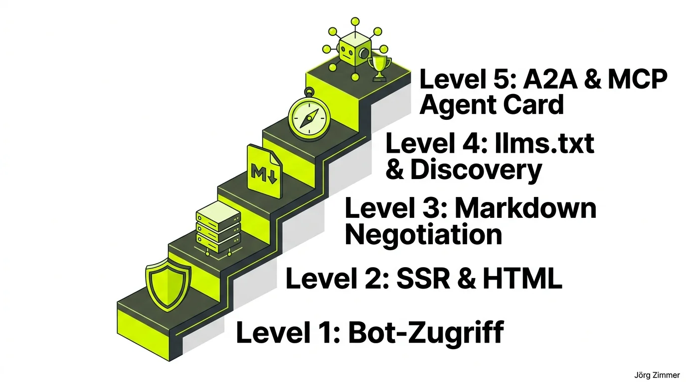

*Diese Diskussion wurde von mir auf LinkedIn am 22.07.2026 gestartet:*

  
💬 Jörgs SEO-Klartext (LinkedIn Insights)

  

  
kostenloser Agent Readiness Scan von Cloudflare - sei nicht schockiert wenn dort nicht Level 5 mit 75 steht

  
So gehts: 
  Domain eingeben. Warten. Reiter "Agent Readiness [new]" finden. Staunen.

  
Hier geht es zum kostenlosen Scan von Cloudflare: 
  👉  https://lnkd.in/d9VX5_tU

  
Es gilt: 
  Wir forschen zusammen und gucken zusammen was Sinn macht.

  
Wie ist dein Ergebiss?

  
Welche der Punkte hälst du für sinnvoll und warum?

  

Die Transformation der Websuche ist in vollem Gange. Die Welle der [Generative Engine Optimization (GEO)](/blog/generative-engine-optimization-geo/) rollt unaufhaltsam auf Unternehmen zu. Doch während viele Marketer noch über Keyword-Dichten in Blogposts debattieren, hat Cloudflare mit dem neuen **Agent Readiness Scan** Fakten auf Serverebene geschaffen.

Das Tool konfrontiert Webmaster mit einer neuen Realität: Es geht nicht mehr nur darum, wie Googlebot eine Seite crawlt, sondern wie autonom handelnde KI-Agenten und Large Language Models (LLMs) deine Inhalte maschinell verarbeiten können.

## Die 5 Level der Agent Readiness Matrix

Wer den Test zum ersten Mal ausführt, erlebt häufig eine Ernüchterung: Selbst etablierte DAX-Konzerne scheitern oft schon an Level 1 oder 2, weil veraltete Firewalls KI-Bots pauschal aussperren oder Single-Page-Apps ohne serverseitiges Rendering verwendet werden.

Der Cloudflare-Prüfbericht gliedert sich in fünf aufeinander aufbauende Reifegrade:

- **Level 1: Bot-Zugriff & robots.txt**: Grundlegende Erlaubnis für Crawler wie `GPTBot`, `ClaudeBot`, `PerplexityBot` und `Bytespider` ohne IP-Sperren.
- **Level 2: Statisches HTML & SSR**: Verzicht auf reines Client-Side-Rendering. Der Textinhalt muss sofort im initialen HTTP-Response enthalten sein.
- **Level 3: Markdown Negotiation**: Bereitstellung von `text/markdown` über HTTP-Header (RFC 8288) für token-sparendes Scraping.
- **Level 4: Discovery Protokolle**: Automatisierte Auffindbarkeit durch standardisierte Dokumente wie `llms.txt` und `llms-full.txt`.
- **Level 5: A2A & MCP Protokolle**: Volle Agenten-Interoperabilität via `agent-card.json`, OpenAPI-Spezifikationen und abgesicherte `auth.md`-Schnittstellen.

## Übersicht: Was die 5 Level bedeuten

Die folgende Matrix zeigt die Kriterien und die strategische Bedeutung der einzelnen Stufen im Detail:

| Reifegrad | Technische Voraussetzung | Zielgruppe | Hebel für KI-Sichtbarkeit |
| :--- | :--- | :--- | :--- |
| **Level 1** | Freigabe in robots.txt & WAF | Standard LLM-Scraper | Verhindert vollständiges Ignorieren im Web-Index |
| **Level 2** | SSR oder Static Site Generation | Search Bots & Browser-Agenten | Garantiert, dass Text ohne JS-Ausführung lesbar ist |
| **Level 3** | Content Negotiation (`text/markdown`) | Token-optimierte Agenten | Bis zu 80 % geringerer Token-Verbrauch bei Zitaten |
| **Level 4** | `/.well-known/llms.txt` | Deep-Research-Agenten | Strukturiertes Inhaltsverzeichnis aller Domain-Werte |
| **Level 5** | A2A Protocol & `agent-card.json` | Autonome Transaktions-Bots | Ermöglicht direkte Buchungen & API-Calls via Chat |

Wie eine Website aussieht, die all diese Kriterien von Grund auf erfüllt, habe ich im Praxisbericht [KI-Website Leuchtturm](/blog/ki-website-leuchtturm/) detailliert dokumentiert. Vertiefende Definitionen findest du im KI-Readiness-Leitfaden.

## Authentischer Scan-Nachweis: Wie teleschmie.de den Cloudflare Radar Level-5-Score erreicht

Theorie ist wertvoll, handfeste Praxis auf dem eigenen Webserver ist unschlagbar. Während viele Analysen im Web nur hypothetische Empfehlungen abgeben, haben wir die technische Architektur von `teleschmie.de` konsequent nach den strengen Cloudflare-Vorgaben ausgerichtet. Das Ergebnis des offiziellen Cloudflare Radar Scans belegt den maximalen Reifegrad:

### Die 5 Prüfpunkte des Live-Scans im Detail

1. **Content Accessibility (Level 3):** Sobald ein Bot wie Claude oder GPTBot den Header `Accept: text/markdown` mitsendet, liefert der Webserver nicht das gerenderte HTML-Gerüst, sondern schlanken, semantischen Markdown-Code aus. Dies spart bis zu 80 % der Token-Kosten und eliminiert Parsingfehler.
2. **RFC 8288 Link Headers:** Über den HTTP-Response-Header `<https://teleschmie.de/.../index.md>; rel="alternate"; type="text/markdown"` erfährt jeder Web-Crawler sofort, dass eine maschinengerechte Repräsentation existiert.
3. **llms.txt & llms-full.txt Discovery (Level 4):** Unter `/.well-known/llms.txt` steht ein kuratiertes Inhaltsverzeichnis aller Kernleistungen, Leitfäden und Glossare bereit.
4. **Agent-to-Agent Protokoll (A2A) & agent-card.json (Level 5):** Die Domain stellt eine standardisierte `agent-card.json` bereit, über die autonome Coding-Agenten und KI-Assistenten die Fähigkeiten des Systems maschinell abrufen können.
5. **Authentifizierungs-Dokumentation (auth.md):** Klare maschinenlesbare Vorgaben, wie KI-Agenten mit geschützten Schnittstellen und Endpunkten interagieren dürfen. Wie du diese Tools in deinen täglichen Workflow einbindest, erfährst du auf unserem [Tools-Praxis-Hub](/tools/).

## Die Community stellt klar: Zugänglichkeit ist nicht gleich Sichtbarkeit

Die Reaktionen unter meinem LinkedIn-Post brachten wertvolle Differenzierungen hervor. Rene Leiner formulierte den entscheidenden Unterschied zwischen technischer Infrastruktur und semantischem Verständnis:

  
💬 Rene Leiner (LinkedIn Kommentar)

  

    
🤣 75 klingt nach starker KI Sichtbarkeit. Tatsächlich misst der Test aber hauptsächlich technische Agentenstandards wie Markdown Negotiation, Bot Zugriff und Discovery Protokolle. Ob ein LLM das Unternehmen und seine Leistungen korrekt versteht, sagt dieser Score überhaupt nicht aus...

  

Renes Einwand ist elementar: Eine Website kann auf Level 5 sein, wird aber von Perplexity dennoch nicht empfohlen, wenn der Inhalt keine relevante Tiefe, keine Autorenschaft oder keinen Nutzwert besitzt.

Jörg Morsbach beleuchtete die Begrifflichkeiten von Cloudflare und stellte den Bezug zu klassischen Webstandards her:

  
💬 Jörg Morsbach (LinkedIn Kommentar)

  

    
Danke für den Tipp. Habe ich direkt ausprobiert. Hinweis von meiner Seite: Cloudflare verwendet den Begriff "Content Accessibility" etwas unglücklich. Laut der Dokumentation besteht diese Kategorie derzeit standardmäßig aus genau einem einzigen Test: Kann die Website ihre Inhalte auf Anfrage als Markdown ausliefern? Hat mit WCAG also nichts zu tun.

    
Mein Eindruck: Gute Webstandards und digitale Barrierefreiheit decken bereits einen Großteil dessen ab, was KI-Systeme zum Verständnis von Webseiten benötigen, während der Cloudflare-Scan diese Basis um agentenspezifische Protokolle erweitert, die vor allem für autonom handelnde KI-Agenten von Bedeutung sind.

  

Jörgs Erkenntnis ist goldrichtig: Wer seit Jahren semantisches HTML5, saubere Hierarchien und schnelle Ladezeiten baut, hat bereits 70 % der Miete gezahlt. Cloudflare erweitert diese Basis lediglich um Protokolle wie [Content Negotiation](/glossar/markdown-content-negotiation/) und den [llms.txt Standard](/glossar/llms-txt/).

Auch in Entwicklerteams löste der Scan sofortige Experimente aus, wie Aleksandar Basara berichtete:

  
💬 Aleksandar Basara (LinkedIn Kommentar)

  

    
Wir haben das Mal direkt in die Remix App eingebaut. Mal schauen was da rum kommt.

  

<figure class="my-8 bg-neutral-50 border border-neutral-200 p-6 md:p-8 rounded-2xl shadow-sm">
  

    
    

      <h4 class="font-bold text-base md:text-lg text-dark mb-0">Jörg Zimmer</h4>
      
Senior SEO & AI Search Consultant

    

  

  <blockquote class="text-base md:text-lg text-dark leading-relaxed italic border-l-4 border-lime-accent pl-4 my-4 font-normal">
    „Das ist halt die Gefahr an AI, dass anscheinend Sachen generiert werden, die auch richtig sein können. Aber wenn man es überprüft, dann sieht man häufig dann so ein bis zwei Sachen, die halt falsch sind.“
  </blockquote>
  <figcaption class="mt-4 pt-3 border-t border-neutral-200/60 flex flex-wrap items-center justify-between gap-2 text-xs text-neutral-500">
    

      Experten-Zitat • <cite class="not-italic font-semibold text-neutral-700">Jörg Zimmer</cite>
      •
      <a href="https://www.youtube.com/watch?v=pJFZzv5LEvk&t=823s" target="_blank" rel="noopener noreferrer" class="text-neutral-600 hover:text-dark underline inline-flex items-center gap-1">
        Quelle: YouTube Talk Antonio Blago & Jörg Zimmer Folge 5 (13:43)
        <svg class="w-3 h-3 text-neutral-400" fill="none" stroke="currentColor" viewBox="0 0 24 24"><path stroke-linecap="round" stroke-linejoin="round" stroke-width="2" d="M10 6H6a2 2 0 00-2 2v10a2 2 0 002 2h10a2 2 0 002-2v-4M14 4h6m0 0v6m0-6L10 14" /></svg>
      </a>
    

    <a href="https://www.linkedin.com/in/joerg-zimmer-seo-sea-freelancer-berlin-spandau/" target="_blank" rel="noopener noreferrer" class="font-bold text-lime-700 hover:underline inline-flex items-center gap-1 shrink-0">
      Jörg Zimmer auf LinkedIn folgen →
    </a>
  </figcaption>
</figure>

## Praxisschritte: So machst du deine Domain agenten-bereit

Wenn du deine Website schrittweise für KI-Crawler optimieren möchtest:

- **Eigene Domain scannen**: Führe den kostenlosen <a href="https://radar.cloudflare.com/scan" target="_blank" rel="noopener noreferrer" class="font-bold underline text-lime-700">Cloudflare Agent Readiness Scan</a> durch und prüfe, auf welchem Level deine Website aktuell steht.
- **Firewall und WAF prüfen**: Stelle sicher, dass gängige KI-Crawler nicht durch generische IP-Reputationsregeln geblockt werden.
- **Markdown-Fallback einrichten**: Implementiere Content Negotiation, damit Agenten über den Header `Accept: text/markdown` sauberen Text anfordern können.
- **Strategische Beratung**: Möchtest du deine Domain gezielt auf generative Suchmaschinen vorbereiten? Dann kannst du eine fundierte [SEO Beratung anfragen](/seo-sprechstunde/).

<!-- CTA Box -->

  LinkedIn Community Diskussion
  <h3 class="text-xl md:text-2xl font-bold text-white mb-3 !mt-0 !border-none !pb-0">
    Jetzt an der Diskussion teilnehmen
  </h3>
  

    Welches Level erreicht deine Domain im Cloudflare Scan und welche Protokolle hältst du für zukunftsweisend? Diskutiere mit auf LinkedIn!
  

  <a href="https://www.linkedin.com/posts/joerg-zimmer-seo-sea-freelancer-berlin-spandau_kostenloser-agent-readiness-scan-von-cloudflare-activity-7485746310445350912-g1NS" target="_blank" rel="noopener noreferrer" class="btn-primary">
    <svg class="w-4 h-4 fill-current" viewBox="0 0 24 24"><path d="M20.447 20.452h-3.554v-5.569c0-1.328-.027-3.037-1.852-3.037-1.853 0-2.136 1.445-2.136 2.939v5.667H9.351V9h3.414v1.561h.046c.477-.9 1.637-1.85 3.37-1.85 3.601 0 4.267 2.37 4.267 5.455v6.286zM5.337 7.433c-1.144 0-2.063-.926-2.063-2.065 0-1.138.92-2.063 2.063-2.063 1.14 0 2.064.925 2.064 2.063 0 1.139-.925 2.065-2.064 2.065zm1.782 13.019H3.555V9h3.564v11.452zM22.225 0H1.771C.792 0 0 .774 0 1.729v20.542C0 23.227.792 24 1.771 24h20.451C23.2 24 24 23.227 24 22.271V1.729C24 .774 23.2 0 22.222 0h.003z"/></svg>
    Beitrag auf LinkedIn öffnen
    →
  </a>

