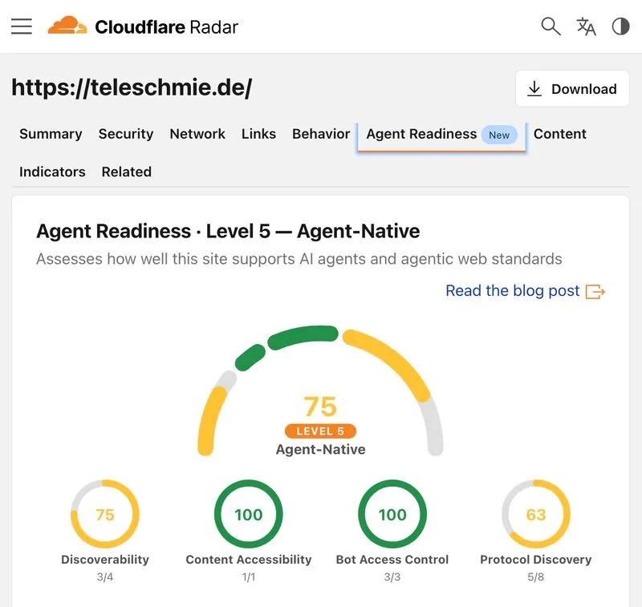

Moin! 🌻

*Diese Diskussion wurde von mir auf LinkedIn am 22.07.2026 gestartet:*

  
💬 Jörgs SEO-Klartext (LinkedIn Insights)

  

  
kostenloser Agent Readiness Scan von Cloudflare - sei nicht schockiert wenn dort nicht Level 5 mit 75 steht

  
So gehts: 
  Domain eingeben. Warten. Reiter "Agent Readiness [new]" finden. Staunen.

  
Hier geht es zum kostenlosen Scan von Cloudflare: 
  👉  https://lnkd.in/d9VX5_tU

  
Es gilt: 
  Wir forschen zusammen und gucken zusammen was Sinn macht.

  
Wie ist dein Ergebiss?

  
Welche der Punkte hälst du für sinnvoll und warum?

  

Die Welle der [Generative Engine Optimization (GEO)](/blog/generative-engine-optimization-geo/) rollt unaufhaltsam auf uns zu. Aber wie misst man, ob eine Website technisch überhaupt bereit ist, von KI-Agenten gelesen zu werden? Cloudflare hat dafür den Agent Readiness Scan veröffentlicht.

Das Tool prüft technische Basis-Metriken. Rene Leiner brachte es in den Kommentaren super auf den Punkt:

  
💬 Rene Leiner (LinkedIn Kommentar)

  

    
🤣 75 klingt nach starker KI Sichtbarkeit. Tatsächlich misst der Test aber hauptsächlich technische Agentenstandards wie Markdown Negotiation, Bot Zugriff und Discovery Protokolle. Ob ein LLM das Unternehmen und seine Leistungen korrekt versteht, sagt dieser Score überhaupt nicht aus...

  

Genau das ist der Knackpunkt. Es geht um *Zugänglichkeit* (Readiness), nicht um *Sichtbarkeit* (Visibility). Jörg Morsbach hat in seinem Kommentar extrem wertvoll ergänzt, worauf Cloudflare hier im Kern wirklich prüft:

  
💬 Jörg Morsbach (LinkedIn Kommentar)

  

    
Danke für den Tipp. Habe ich direkt ausprobiert. Hinweis von meiner Seite: Cloudflare verwendet den Begriff "Content Accessibility" etwas unglücklich. Laut der Dokumentation besteht diese Kategorie derzeit standardmäßig aus genau einem einzigen Test: Kann die Website ihre Inhalte auf Anfrage als Markdown ausliefern? Hat mit WCAG also nichts zu tun.

    
Mein Eindruck: Gute Webstandards und digitale Barrierefreiheit decken bereits einen Großteil dessen ab, was KI-Systeme zum Verständnis von Webseiten benötigen, während der Cloudflare-Scan diese Basis um agentenspezifische Protokolle erweitert, die vor allem für autonom handelnde KI-Agenten von Bedeutung sind.

  

Wenn du tiefer in die praktischen Anpassungen eintauchen willst, schau dir an, [wie ich meine eigene KI-Website mit Markdown & Co. aufgebaut habe](/blog/ki-website-leuchtturm/).

Viele Entwickler und Agenturen nutzen den Test jetzt als neuen Benchmark. Aleksandar Basara schrieb dazu:

  
💬 Aleksandar Basara (LinkedIn Kommentar)

  

    
Wir haben das Mal direkt in die Remix App eingebaut. Mal schauen was da rum kommt.

  

Also: Lass dich von niedrigen Scores nicht aus der Ruhe bringen. Schaffe ein sauberes, technisches SEO-Fundament – der Rest ist (noch) ein spannendes Feld für die Zukunft!

ALOHA! 🌻✌️

  
💬 Jetzt an der Diskussion teilnehmen!

  <a href="https://www.linkedin.com/posts/joerg-zimmer-seo-sea-freelancer-berlin-spandau_kostenloser-agent-readiness-scan-von-cloudflare-activity-7485746310445350912-g1NS" target="_blank" rel="noopener noreferrer" class="inline-block bg-white text-lime-600 font-bold py-2 px-6 rounded-full hover:bg-gray-100 transition-colors">
    Beitrag auf LinkedIn öffnen
  </a>

