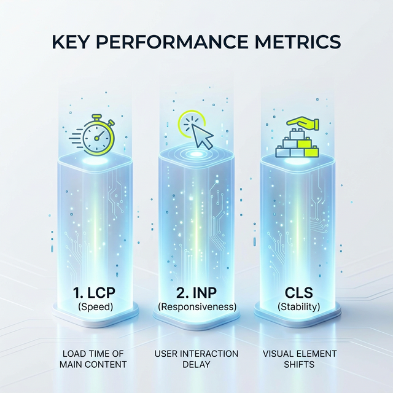

Ich liebe Zahlen. Besonders wenn sie so aussehen, dass man sie sich am liebsten einrahmen und übers Bett hängen möchte:

- **Schlecht:** 0 (keine Probleme, kein Stress!)
- **Optimierung erforderlich:** 10 (die kleine Baustelle für zwischendurch)
- **Gut:** 216 (grüner wird's nicht!)

Das ist kein ausgedachtes Best-Case-Szenario aus einem Marketing-Folder, sondern ein echter **UX-Bericht für Chrome (CrUX)** eines meiner Kunden. Von Oktober 2025 bis Januar 2026 haben wir die Core Web Vitals (CWV) dieses Projekts komplett umgekrempelt. Und nein, das war kein Zufall, sondern harte, systematische Arbeit am digitalen Fundament.

## Warum Core Web Vitals mehr sind als nur Google-Schikane

Immer wenn Google ein neues Akronym einführt, verdrehen viele SEOs direkt die Augen. "Nicht noch ein Ranking-Faktor!", hört man es dann aus den Agentur-Fluren schallen. Aber bei den Core Web Vitals war das anders. Endlich gab es einen Standard, der misst, wie sich eine Website für einen echten Menschen anfühlt. Nicht für einen Bot, nicht für ein Test-Script, sondern für jemanden, der mit dem Handy in der S-Bahn sitzt und schnell eine Information braucht.

Seit 2021 sind die CWV ein offizieller Ranking-Faktor. Aber Hand aufs Herz: Das ist eigentlich zweitrangig. Das wichtigste Argument ist: Eine schnelle Website = glückliche Nutzer = mehr Kohle (Conversions). Wer wartet heute noch länger als drei Sekunden, bis eine Seite geladen ist? Niemand. Wir sind alle ungeduldig geworden. Wenn deine Seite zuckt, während ich lesen will, bin ich weg. Wenn die Schaltfläche "Kaufen" erst nach zwei Sekunden reagiert, kaufe ich woanders.

## Die drei Reiter der Nutzererfahrung (und wie wir sie gezähmt haben)

Hier ist das, what wir bei meinem Kunden-Projekt im Detail gemacht haben. Es war ein Zusammenspiel aus Analyse, Strategie und knallharter Umsetzung.

### 1. LCP (Largest Contentful Paint) – Der Tempomacher
LCP misst, wie lange es dauert, bis das größte sichtbare Element (meist ein Hero-Image oder eine fette Headline) geladen ist. 

**Unser Problem:** Zu fette Bilder. Der Kunde hatte wunderschöne, aber leider 4MB schwere Raw-Dateien direkt im Header.
**Die Lösung:** Wir haben auf moderne Formate wie AVIF und WebP umgestellt. Außerdem haben wir striktes **Lazy Loading** implementiert – aber Achtung: Nicht für das LCP-Element! Das muss sofort da sein. Wir haben das Bild "ge-preloaded", damit der Browser weiß: "Das hier ist wichtig, lad das zuerst!"

### 2. INP (Interaction to Next Paint) – Der Reaktions-Check
INP ist der Nachfolger von FID und misst die allgemeine Reaktionsfähigkeit der Seite während des gesamten Besuchs. 

**Unser Problem:** Ein Haufen "Third-Party-Gedöns". Tracking-Pixel hier, Chat-Bot dort, Social-Feed-Widget da drüben. Alles blockiert den sogenannten Main Thread. Die Seite "denkt" und kann deshalb nicht auf den Klick des Nutzers reagieren.
**Die Lösung:** Wir haben radikal aussortiert. Was wird wirklich gebraucht? Alles andere wurde entweder gelöscht oder mittels **Partytown** oder ähnlichen Techniken in einen Web-Worker ausgelagert. Ziel war es, den Main Thread so frei wie möglich zu halten.

### 3. CLS (Cumulative Layout Shift) – Der Stabilitäts-Anker
Nichts nervt mehr als Text, der weghüpft, wenn ein Werbebanner oder ein Bild nachlädt und man dadurch auf den falschen Link klickt.

**Unser Problem:** Keine festen Dimensionen für Bilder und Anzeigenplätze.
**Die Lösung:** Jedes Bild hat jetzt explizite `width` und `height` Attribute. Für Werbeplätze haben wir Platzhalter (Skeleton-Screens) reserviert, damit der Browser von Anfang an weiß, wie viel Platz er freihalten muss. Das Ergebnis: Ein Layout-Shift von nahezu Null.

## Was die Community dazu sagt (26 Reaktionen, 29 Kommentare)

Als ich diesen Erfolg auf LinkedIn geteilt habe, war das Echo gewaltig. Die Reaktionen zeigten mir: Das Thema brennt den Leuten unter den Nägeln. Viele fragten: "Jörg, wie erkläre ich das meinem Chef?" 

Meine Antwort war klar: Zeig ihm nicht die Search Console, zeig ihm die Absprungraten. Eine langsame Seite ist wie ein Verkäufer, der erst mal fünf Minuten im Lager verschwindet, wenn ein Kunde den Laden betritt. Die meisten Kunden sind dann schon wieder draußen.

Ein Kollege kommentierte: *"Das Problem sind oft die Themes von der Stange, die 500 Features mitbringen, von denen man nur 3 braucht."* Genau das ist der Punkt. Performance beginnt bei der Auswahl der Technologie-Stacks.

### Bottom Line für dein Business

Core Web Vitals sind kein Hexenwerk und auch kein Voodoo-Zauber. Es ist reine Ingenieurskunst im Web. Wenn du systematisch vorgehst, die Tools wie **PageSpeed Insights** oder den **CrUX Dashboard** richtig liest und die richtigen Prioritäten setzt, kann jede Website in den grünen Bereich kommen.

Aber Achtung: SEO ist kein "Set and Forget". Ein neues Plugin hier, ein unoptimiertes Bild da, und schon rutschst du wieder ab. Man muss dranbleiben. Das Monitoring der CWV sollte so fest in deinen Workflow integriert sein wie das Checken deiner Kontostände.

## Was du jetzt tun kannst

Wenn du nicht weißt, wo du anfangen sollst:
1. Schau in deine **Google Search Console**. Unter "Nutzererfahrung" findest du den Bericht zu den Core Web Vitals.
2. Nimm dir die URLs vor, die auf "Schlecht" stehen. Nur die.
3. Fixe zuerst die Bilder (LCP) und die Layout-Verschiebungen (CLS). Das sind oft die Quick-Wins.

Und wenn dir das alles zu technisch ist oder du den Wald vor lauter Bäumen nicht siehst: Lass uns drüber reden. In einer **SEO-Sprechstunde** legen wir deine Seite auf den Grill und ich zeige dir genau, wo das Fett wegmuss, damit sie wieder rennt.

---

*Wusstest du, dass gute Core Web Vitals auch deine Absprungrate um bis zu 24% senken können? Es lohnt sich also nicht nur für Google.*

### Weiterführende Artikel für Performance-Junkies
* **Lese-Tipp:** [PageSpeed 100/100: So wurde diese Website blitzschnell](/blog/pagespeed-100-seo-optimierung/) - Ein Deep Dive in die Technik.
* **Lese-Tipp:** [24 Jahre SEO - und wir machen immer noch die gleichen Fehler](/blog/24-jahre-seo-gleiche-fehler/) - Warum wir die Basics oft vergessen.
* **Lese-Tipp:** [GEO, SEO, AI-SEO: Warum Erfahrung beim Tech-Stack zählt](/blog/ai-seo-geo-praktikanten/)

