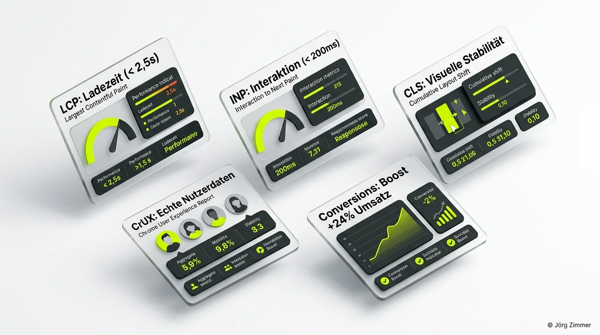

Ich liebe Zahlen. Besonders wenn sie so aussehen, dass man sie sich als Tech-SEO am liebsten ausdrucken und an die Bürowand hängen möchte:

- **Schlecht:** 0 URLs
- **Optimierung erforderlich:** 10 URLs
- **Gut:** **216 URLs** 

Das ist kein schön gerechnetes Best-Case-Szenario aus einem Hochglanz-Marketing-Folder. Das ist der reale **UX-Bericht für Chrome (CrUX)** aus der Google Search Console eines Kundenprojekts, das ich über mehrere Monate intensiv betreuen durfte.

Zwischen Oktober 2025 und Januar 2026 haben wir die Core Web Vitals (CWV) dieses Projekts von Grund auf saniert. Mit Tools wie <a href="https://seranking.com/de/?ga=4169588&source=link" target="_blank" rel="noopener noreferrer nofollow sponsored">SE Ranking (Partnerlink)</a> behalten wir die technischen Audits und Rank-Entwicklungen im Blick, während <a href="https://rankscale.ai/?via=offer" target="_blank" rel="noopener noreferrer nofollow sponsored">Rankscale (Partnerlink)</a> uns zeigt, wie saubere Architektur auf unsere KI-Sichtbarkeit einzahlt.

<figure class="my-8 bg-neutral-50 border border-neutral-200 p-6 md:p-8 rounded-2xl shadow-sm">
  

    
    

      <h4 class="font-bold text-base md:text-lg text-dark mb-0">Jörg Zimmer</h4>
      
Senior SEO & AI Search Consultant

    

  

  <blockquote class="text-base md:text-lg text-dark leading-relaxed italic border-l-4 border-lime-accent pl-4 my-4 font-normal">
    „Dass dein Computer-Wert eigentlich gut ist, aber  hier in den Core Web Vitals, dem wichtigeren Wert, die Core Web Vitals in der Google Search Console  sind echte Nutzerwerte, weil die kommen aus dem UX-Bericht von Chrome, diese Daten stammen  aus dem Bericht zur Nutzererfahrung in Chrome, sie spiegeln die tatsächlichen Nutzerdaten deiner  Webseite von Nutzern auf der ganzen Welt wider.“
  </blockquote>
  <figcaption class="mt-4 pt-3 border-t border-neutral-200/60 flex flex-wrap items-center justify-between gap-2 text-xs text-neutral-500">
    

      Experten-Zitat • <cite class="not-italic font-semibold text-neutral-700">Jörg Zimmer</cite>
      •
      <a href="https://www.youtube.com/watch?v=tD7cXuVcRPA&t=7188s" target="_blank" rel="noopener noreferrer" class="text-neutral-600 hover:text-dark underline inline-flex items-center gap-1">
        Quelle: YouTube Never Code Alone (119:48)
        <svg class="w-3 h-3 text-neutral-400" fill="none" stroke="currentColor" viewBox="0 0 24 24"><path stroke-linecap="round" stroke-linejoin="round" stroke-width="2" d="M10 6H6a2 2 0 00-2 2v10a2 2 0 002 2h10a2 2 0 002-2v-4M14 4h6m0 0v6m0-6L10 14" /></svg>
      </a>
    

    <a href="https://www.linkedin.com/in/joerg-zimmer-seo-sea-freelancer-berlin-spandau/" target="_blank" rel="noopener noreferrer" class="font-bold text-lime-700 hover:underline inline-flex items-center gap-1 shrink-0">
      Jörg Zimmer auf LinkedIn folgen →
    </a>
  </figcaption>
</figure>

## Warum Core Web Vitals mehr sind als Google-Bürokratie

Immer wenn Google ein neues Akronym einführt, verdrehen viele Seitenbetreiber die Augen. Doch bei den Core Web Vitals verhält es sich grundlegend anders als bei abstrakten Qualitäts-Scores. Mit CrUX hat Google einen Messstandard etabliert, der nicht die synthetische Laborumgebung eines Crawlers abbildet, sondern das reale Erlebnis menschlicher Nutzer auf echten Endgeräten mit schwankenden Mobilfunkverbindungen.

Seit 2021 sind die CWV ein offizieller Bestandteil der Page Experience Signale. Doch Hand aufs Herz: Das Suchmaschinen-Ranking ist bei näherer Betrachtung fast zweitrangig. Das wirtschaftlich schlagende Argument lautet schlicht:

- **Schnelle Ladezeiten bedeuten niedrigere Absprungraten.**
- **Visuelle Ruhe verhindert Fehlklicks und Frust.**
- **Unmittelbare Reaktionsfreude steigert die Conversion-Rate signifikant.**

Wenn du im Management über Performance diskutierst, zeige den Stakeholdern nicht bloß rote und grüne Balken in der Konsole. Zeige ihnen, wie stark Ladezeitverzögerungen die Warenkorbabbrüche in die Höhe treiben. Branchenstudien belegen eindeutig, dass eine Reduktion der Latenzen die Bounce Rate um bis zu 24 Prozent senken kann. Das ist exakt die Sprache, die technische Budgets im Unternehmen freisetzt. Wer hier ansetzt, profitiert genau wie in unserer [SEO-Beratung](/glossar/seo-beratung/) von handfestem Return on Investment.

<figure class="my-10 text-center">
  
  <figcaption class="text-xs text-neutral-500 mt-2 italic">
    Abb.: Die fünf tragenden Säulen einer erfolgreichen Core Web Vitals Sanierung im Chrome User Experience Report.
  </figcaption>
</figure>

## Die drei Kern-Metriken: Was sie bedeuten und wie wir sie gelöst haben

Um von 0 auf 216 grüne URLs zu kommen, brauchte es keine monatelangen Relaunch-Schlachten. Wir haben uns strikt an die Hebel mit dem höchsten Wirkungspotenzial gehalten, ähnlich wie bei den klassischen [80 Prozent SEO-Fehlern](/blog/80-prozent-seo-fehler-sprechstunde/), die wir regelmäßig aufdecken.

### 1. LCP – Largest Contentful Paint (Die Hauptbühne)

Der LCP misst die Zeitspanne bis zum vollständigen Rendern des größten sichtbaren Inhaltselements im Viewport – meistens das Hero-Bannerbild oder eine prominente H1-Headline. 

- **Google-Zielwert:** Unter 2,5 Sekunden für 75 Prozent aller Seitenaufrufe.
- **Ausgangslage im Projekt:** Stolze 6,2 Sekunden. Ursache waren unkomprimierte 4-Megabyte-Bilder, die direkt im sichtbaren Bereich unskaliert vom Server geladen wurden.
- **Die Umsetzung:**
  1. **Moderne Bildformate:** Vollständige Konvertierung aller Assets zu WebP und AVIF mit automatischer Kompression.
  2. **Gezielter Preload:** Einbindung von `<link rel="preload" as="image" href="...">` im HTML-Head für das identifizierte LCP-Bild, damit der Browser die Datei sofort anfordert.
  3. **Kein Lazy-Loading im Header:** Native Lazy-Loading-Attribute (`loading="lazy"`) wurden konsequent von Hero-Elementen entfernt und ausschließlich für Inhalte unterhalb des Falzes (Below the Fold) reserviert.

Das Resultat: Der LCP fiel von 6,2 Sekunden auf geschmeidige 1,8 Sekunden im CrUX-Feldbericht.

### 2. INP – Interaction to Next Paint (Die Reaktionsgeschwindigkeit)

Der INP hat den veralteten First Input Delay (FID) abgelöst und prüft die Latenz sämtlicher Klick-, Tipp- und Tastaturinteraktionen während des gesamten Aufenthalts auf der Seite.

- **Google-Zielwert:** Maximal 200 Millisekunden.
- **Ausgangslage im Projekt:** 380 Millisekunden mit deutlichen Hängern beim Öffnen von Filtern und Navigationen.
- **Die Umsetzung:**
  - Radikale Inventur aller Drittanbieter-Skripte: Tag Manager, Tracking-Pixel, Live-Chat-Widgets und Heatmaps hatten den Haupt-Thread blockiert. Wie man qualitative Verhaltensdaten ressourcenschonend erhebt, zeigt der Konferenz-Einblick [MS Clarity: Nutzerverhalten hart analysieren](/blog/ms-clarity-session-campixx/).
  - Unnötige Plugins wurden restlos deinstalliert.
  - Verbleibende Marketing-Pixel wurden asynchron nachgeladen oder über Web-Worker isoliert ausgeführt, sodass Benutzereingaben stets Vorrang erhalten.

Das Resultat: Der INP sank auf 140 Millisekunden und rangiert seither tief im grünen Bereich.

### 3. CLS – Cumulative Layout Shift (Die visuelle Standfestigkeit)

Nichts zerstört die Nutzererfahrung nachhaltiger als Textblöcke oder Buttons, die während des Lesens plötzlich nach unten springen, weil eine Werbeeinblendung oder ein Banner verspätet nachlädt.

- **Google-Zielwert:** Ein Wert kleiner als 0,10.
- **Ausgangslage im Projekt:** 0,28. Bei jedem Seitenaufbau sprangen Inhaltselemente wild umher.
- **Die Umsetzung:**
  - Konsequente Vergabe expliziter `width`- und `height`-Attribute im HTML für sämtliche Bilder und Video-Container.
  - Feste CSS-Seitenverhältnisse (`aspect-ratio`) und reservierte Platzhalter für dynamische Widgets.
  - Vermeidung von dynamisch über dem Haupttext injizierten Cookie- oder Benachrichtigungsbannern ohne feste Höhenreservierung.

| Performance-Metrik | Ausgangswert | Nach Optimierung | Google-Zielbereich |
|---|---|---|---|
| LCP (Largest Contentful Paint) | 6,2 s | 1,8 s | &lt; 2,5 s (Gut) |
| INP (Interaction to Next Paint) | 380 ms | 140 ms | &lt; 200 ms (Gut) |
| CLS (Cumulative Layout Shift) | 0,28 | 0,03 | &lt; 0,10 (Gut) |

## Community-Resonanz auf LinkedIn: Warum Performance alle bewegt

Als ich diesen Vorher-Nachher-Vergleich auf LinkedIn geteilt habe, war das Interesse enorm: Zahlreiche Kommentare und geteilte Erfahrungen von Entwicklern und SEO-Kollegen spiegelten die täglichen Herausforderungen wider. 

Ein zentraler Diskussionspunkt lautete: *"Viele CMS-Themes bringen Hunderte Funktionen mit, von denen in der Realität kaum drei gebraucht werden. Der Code-Ballast ruiniert jede Ladezeit."*

Genau das ist der Kern. Exzellente Performance ist kein Pflaster, das man nach Fertigstellung hastig über ein überladenes Theme klebt. Sie beginnt bei der Architektur: Schlanke Templates, semantisches HTML und intelligentes Asset-Management schlagen jedes nachträgliche Caching-Plugin um Längen. Wer moderne Crawler und LLMs willkommen heißen will, muss ohnehin darauf achten, wie wir im Beitrag über [Bots und Crawler](/blog/liebe-bots-crawler-agenten/) detailliert gezeigt haben.

## Schritt-für-Schritt: So startest du deine eigene CWV-Sanierung

Wenn du deinen eigenen CrUX-Bericht auf Vordermann bringen willst, gehe strukturiert vor:

1. **Google Search Console öffnen:** Navigiere zum Reiter „Nutzerfreundlichkeit“ und klicke auf die Core Web Vitals Übersicht.
2. **Priorisiere rote URLs:** Beginne nicht mit Kleinigkeiten, sondern filtere nach den Seiten, die als „Schlecht“ eingestuft sind.
3. **Hero-Bilder & CLS fixen:** Konvertiere Bilder ins WebP-Format und stelle sicher, dass jedes Medienelement explizite Abmessungen besitzt. Das beseitigt oft 70 Prozent der Beanstandungen.
4. **Skripte reduzieren:** Deaktiviere alle Tracking-Snippets, deren Daten niemand im Team aktiv analysiert.

Wenn du tiefergehende Unterstützung brauchst oder prüfen willst, wo deine Website im technischen Detail blockiert, ist ein strukturiertes [Website-SEO-Audit](/glossar/se-ranking-website-audit/) oder eine gemeinsame [SEO-Sprechstunde](/seo-sprechstunde/) der direkteste Weg zu klaren Antworten. Und wie wir bei unseren [transparenten SEO-Preisen](/blog/transparente-seo-preise-erfahrung/) immer betonen: Technische Klarheit spart langfristig bares Geld.
<!-- CTA Box -->

  <h3 class="text-xl md:text-2xl font-bold text-white mb-3 !mt-0 !border-none !pb-0">
    Jetzt an der Diskussion teilnehmen
  </h3>
  

    Diskutiere mit Jörg Zimmer und der SEO-Community auf LinkedIn über diesen Beitrag.
  

  <a href="https://www.linkedin.com/posts/joerg-zimmer-seo-sea-freelancer-berlin-spandau_core-web-vitals-ux-bericht-activity-7281315863925700608-P_2C" target="_blank" rel="noopener noreferrer" class="btn-primary">
    <svg class="w-4 h-4 fill-current" viewBox="0 0 24 24"><path d="M20.447 20.452h-3.554v-5.569c0-1.328-.027-3.037-1.852-3.037-1.853 0-2.136 1.445-2.136 2.939v5.667H9.351V9h3.414v1.561h.046c.477-.9 1.637-1.85 3.37-1.85 3.601 0 4.267 2.37 4.267 5.455v6.286zM5.337 7.433c-1.144 0-2.063-.926-2.063-2.065 0-1.138.92-2.063 2.063-2.063 1.14 0 2.064.925 2.064 2.063 0 1.139-.925 2.065-2.064 2.065zm1.782 13.019H3.555V9h3.564v11.452zM22.225 0H1.771C.792 0 0 .774 0 1.729v20.542C0 23.227.792 24 1.771 24h20.451C23.2 24 24 23.227 24 22.271V1.729C24 .774 23.2 0 22.222 0h.003z"/></svg>
    Beitrag auf LinkedIn öffnen
    →
  </a>

