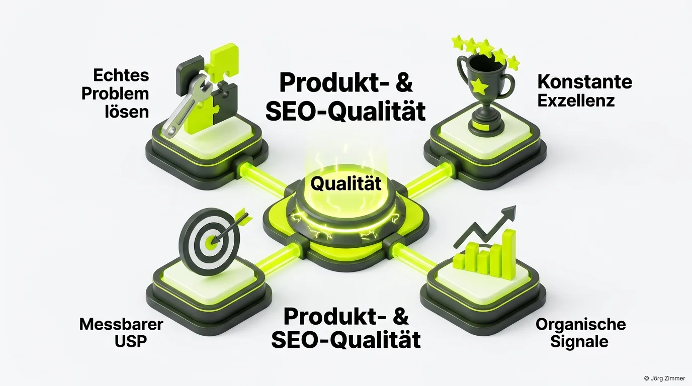

Heute sprechen wir ausnahmsweise nicht über Indexierungs-Crawl-Budgets oder robots.txt-Befehle, sondern über **echtes Unternehmertum, Mut und die Döner-Revolution.** 

Und ich verspreche dir: Am Ende wirst du deine eigene Marketing- und Website-Strategie mit völlig neuen Augen sehen.

Als gebürtiger Berliner bin ich bekennender Döner-Liebhaber. Ich rede nicht vom 08/15-Imbiss an der Ecke, sondern von echten Geschmackserlebnissen: Ich suche in jeder Stadt und auf Reisen gezielt nach den handwerklich besten Betrieben. Als vor einiger Zeit mein liebster Stammimbiss in der Nachbarschaft schloss, war das für mich ein herber Verlust.

## Die Entdeckung im Kühlregal: 6,99 Euro und gesunde Skepsis

Vor einigen Wochen passierte es beim Wochenendeinkauf im Supermarkt. Im Kühlregal fiel mir ein neues Produkt ins Auge: **Dönerback.** Ein Fertigdöner zum Aufbacken im eigenen Backofen, hergestellt in Thüringen.

Mein erster Gedanke war pure Skepsis: Kann ein verpackter Döner schmecken? Wie soll warmer Salat im Ofen funktionieren, ohne matschig zu werden? Doch wer mich kennt, weiß: Ich urteile nicht über Dinge, die ich nicht selbst auf den Prüfstand gestellt habe.

Also wanderte das Produkt für 6,99 Euro in den Einkaufswagen. 15 Minuten bei 180 Grad in die Röhre geschoben – und das Ergebnis war eine echte Überraschung: Knuspriges Brot, reichlich saftiges Fleisch, eine aromatische Soße und ein verblüffend harmonischer Geschmack. Zwar kein Ersatz für die frische Imbisskultur, aber ein meilenweiter Quantensprung im Fertiggericht-Segment.

<figure class="my-8 bg-neutral-50 border border-neutral-200 p-6 md:p-8 rounded-2xl shadow-sm">
  

    
    

      <h4 class="font-bold text-base md:text-lg text-dark mb-0">Jörg Zimmer</h4>
      
Senior SEO & AI Search Consultant

    

  

  <blockquote class="text-base md:text-lg text-dark leading-relaxed italic border-l-4 border-lime-accent pl-4 my-4 font-normal">
    „Bringen. Der war war hoch hoch erfreut und äh ich habe auch nie groß äh Marketing für mich selbst gemacht. Ja, also ähm das auch eines meiner meiner ersten Interviews, ja, oder mein drittes jetzt so und äh hab vorher nie groß gesagt, hier Jörg, ich bin ich bin da.“
  </blockquote>
  <figcaption class="mt-4 pt-3 border-t border-neutral-200/60 flex flex-wrap items-center justify-between gap-2 text-xs text-neutral-500">
    

      Experten-Zitat • <cite class="not-italic font-semibold text-neutral-700">Jörg Zimmer</cite>
      •
      <a href="https://www.youtube.com/watch?v=dVGOMAVUNQk&t=577s" target="_blank" rel="noopener noreferrer" class="text-neutral-600 hover:text-dark underline inline-flex items-center gap-1">
        Quelle: YouTube SEOPresso (09:37)
        <svg class="w-3 h-3 text-neutral-400" fill="none" stroke="currentColor" viewBox="0 0 24 24"><path stroke-linecap="round" stroke-linejoin="round" stroke-width="2" d="M10 6H6a2 2 0 00-2 2v10a2 2 0 002 2h10a2 2 0 002-2v-4M14 4h6m0 0v6m0-6L10 14" /></svg>
      </a>
    

    <a href="https://www.linkedin.com/in/joerg-zimmer-seo-sea-freelancer-berlin-spandau/" target="_blank" rel="noopener noreferrer" class="font-bold text-lime-700 hover:underline inline-flex items-center gap-1 shrink-0">
      Jörg Zimmer auf LinkedIn folgen →
    </a>
  </figcaption>
</figure>

## Der Härtetest auf der Grünen Woche in Berlin

Theoretische Beurteilungen genügen mir nicht. Auf der **Internationalen Grünen Woche** traf ich Gründer **Mustafa Demirkürek** von der Alzarro Dönerworld GmbH persönlich am Messestand.

Mustafa legte Zahlen vor, die zeigen, warum das Produkt im Einzelhandel durchstartet:

| Kennzahl / Kriterium | Dönerback (Ofen-Innovation) | Durchschnittlicher Imbiss-Döner |
|---|---|---|
| **Fleischeinwaage** | **160 Gramm** Qualitätsfleisch | Häufig nur 80 bis 100 Gramm |
| **Nährwert-Profil** | **Nutriscore A** (ca. 50 g Eiweiß) | Meist undefiniert, stark fettlastig |
| **Haltbarkeit** | **Bis zu 2 Wochen** im Kühlschrank | Binnen 60 Minuten kalt und ungenießbar |
| **Qualitätskontrolle** | **Unter 0,1 %** Produktionsfehler | Stark tagesform- und personalabhängig |
| **Verzehranlass** | Perfekt für Familie, Vorrat & Schichtarbeit | Nur für sofortigen Direktverzehr |

Mustafa hat nicht versucht, die 24.000 Dönerbuden in Deutschland zu kopieren. Er hat ein reales Problem identifiziert und eine vollkommen neue Produktkategorie geschaffen.

## Die vier Säulen: Was Marketer daraus lernen müssen

Was hat diese Food-Story mit digitaler Sichtbarkeit und Suchmaschinenoptimierung zu tun? Alles. Die Prinzipien für nachhaltigen Markterfolg sind universell gültig:

### 1. Ein echtes Kundenproblem lösen
Im Marketing gewinnen nicht die lautesten Werbetreibenden, sondern jene, die den drängendsten Schmerzpunkt ihrer Zielgruppe lösen. Wenn deine Dienstleistung keinen klaren Engpass beseitigt, verpufft dein Marketingbudget ins Leere.

### 2. Ein messbarer, transparenter USP
160 Gramm Fleisch, Nutriscore A, zwei Wochen Frische: Das sind glasklare Fakten statt diffuser Werbeversprechen. Auch auf deiner Website muss der Besucher binnen drei Sekunden erfassen, warum er bei dir kaufen soll. Eine exzellente [Usability](/glossar/usability/) ist dafür Grundvoraussetzung.

### 3. Konstante operative Exzellenz
Eine Fehlerquote von unter 0,1 Prozent schafft Vertrauen. Im Online-Marketing entspricht das fehlerfreier technischer Hygiene: Keine defekten Formulare, blitzschnelle Ladezeiten und eine makellose mobile Darstellung sorgen für eine hohe [Conversion Rate](/glossar/conversion-rate/).

### 4. Organische Nutzersignale als Hebel
Im SEO-Jargon gesprochen: Erstklassige Produktqualität ist der stärkste [Linkjuice](/glossar/linkjuice/) der Welt. Wenn Nutzer mit deinen Inhalten interagieren, Empfehlungen aussprechen und wiederkehren, signalisiert das Google und modernen KI-Suchmaschinen echte [Topical Authority](/glossar/topical-authority/) und hohes [E-E-A-T](/glossar/e-e-a-t/). Mit Tools wie [SE Ranking KI-Sichtbarkeit](/blog/se-ranking-ki-sichtbarkeit/) lässt sich dieser Vertrauensaufbau heute präzise messen.

## Strategische Erkenntnis: Vor dem Traffic das Produkt schärfen

Bevor du Geld in Suchmaschinenwerbung oder SEO investierst, stelle sicher, dass dein Angebot hält, was es verspricht. Schlechte Produkte erzeugen teure Klicks und hohe Absprungraten – exzellente Angebote bauen dauerhafte Kundenbeziehungen auf.

Möchtest du prüfen lassen, ob deine Website und dein Leistungsversprechen für organische Besucher überzeugend aufgestellt sind? In der [SEO-Sprechstunde](/seo-sprechstunde/) analysieren wir deine Webpräsenz live und decken ungenutzte Hebel auf.

<!-- LinkedIn CTA Box -->

  <h3 class="text-xl md:text-2xl font-bold text-white mb-3 !mt-0 !border-none !pb-0">
    Jetzt an der Diskussion teilnehmen
  </h3>
  

    Diskutiere mit Jörg Zimmer und der Community auf LinkedIn über Unternehmertum, USPs und die Parallelen zwischen Food-Innovation und digitalem Marketing.
  

  <a href="https://www.linkedin.com/in/joerg-zimmer-seo-sea-freelancer-berlin-spandau/" target="_blank" rel="noopener noreferrer" class="btn-primary">
    <svg class="w-4 h-4 fill-current" viewBox="0 0 24 24"><path d="M20.447 20.452h-3.554v-5.569c0-1.328-.027-3.037-1.852-3.037-1.853 0-2.136 1.445-2.136 2.939v5.667H9.351V9h3.414v1.561h.046c.477-.9 1.637-1.85 3.37-1.85 3.601 0 4.267 2.37 4.267 5.455v6.286zM5.337 7.433c-1.144 0-2.063-.926-2.063-2.065 0-1.138.92-2.063 2.063-2.063 1.14 0 2.064.925 2.064 2.063 0 1.139-.925 2.065-2.064 2.065zm1.782 13.019H3.555V9h3.564v11.452zM22.225 0H1.771C.792 0 0 .774 0 1.729v20.542C0 23.227.792 24 1.771 24h20.451C23.2 24 24 23.227 24 22.271V1.729C24 .774 23.2 0 22.222 0h.003z"/></svg>
    Beitrag auf LinkedIn öffnen
    →
  </a>

