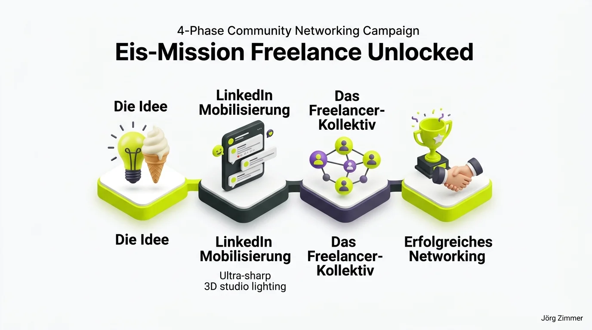

Ich lebe und arbeite in Berlin Spandau. Seit gut 25 Jahren begleite ich Unternehmen als selbstständiger Berater im organischen Suchmaschinen-Marketing. Es war und ist eine unglaubliche Reise, auf der ich das Entstehen und die stetige Weiterentwicklung des Google-Universums aus nächster Nähe miterleben durfte.

Ich liebe es, Algorithmen bis ins kleinste Detail zu sezieren und für greifbare Geschäftsergebnisse nutzbar zu machen. Ob Google-Suche, YouTube-SEO, Google Maps oder in den letzten Jahren zunehmend auch der Content-Graph auf LinkedIn – das ist mein tägliches Handwerk.

  
💬 Jörgs SEO-Klartext (LinkedIn Insights)

  

  
"Mein Einstiegsangebot ist ein zweistündiger „Website-Roast“, bei dem ich den aktuellen Status einer Domain analysiere. Ich nenne das „SEO Sprechstunde“ – und ja, die kostet Geld. Dafür gibt's das Wissen eines SEO-Dinosauriers."

  

Bock auf ungeschminktes Klartext-Feedback zu deiner Domain? In meiner individuellen [SEO Sprechstunde](/seo-sprechstunde/) knöpfen wir uns nicht nur technisches SEO vor, sondern analysieren auch, wie deine Marke im Zeitalter generativer KI-Suchen abschneidet.

## Mehr als nur Algorithmen: Warum echte Menschen den Unterschied machen

So sehr ich Daten und Code liebe: Das persönliche Netzwerken bildet für mich den unverzichtbaren Ausgleich zu all den Stunden vor Bildschirmen und Code-Editoren. Reale Begegnungen schaffen ein Vertrauensniveau, das über keine Videokonferenz der Welt repliziert werden kann.

Aus diesem Grund habe ich vor zwei Jahren gemeinsam mit geschätzten Kollegen das „Freelancer Team“ ins Leben gerufen. Unser Credo: Niemand von uns muss als isolierter Einzelkämpfer durch den Markt ziehen. Wir vereinen Senior-Expertise aus allen Disziplinen des digitalen Marketings – von SEO und SEA bis hin zu Data Analytics und Brand Strategy.

Auf der anstehenden Freelance Unlocked 2026 in Berlin treten wir geschlossen an. Unter anderem mit dabei: Andreas Absmeier, Christoph Buder, Jana Berthold, Frederic Wolny, Patrycja Absmeier, Artjom Sajatz-Davydov, Inan Nacar, Michael Kablitz, Peter Bomballa, Niclas Findeis und icke – erkennbar an unseren [Freelance Unlocked Lila T-Shirts](/blog/freelance-unlocked-lila-tshirts/).

## Die 4 Phasen der Community-Eis-Mission

Um den Konferenz-Vibe auf ein neues Level zu heben, habe ich im Vorfeld eine kleine, augenzwinkernde Kampagne gestartet: die legendäre Eis-Mission.

Der Weg vom lockeren LinkedIn-Gedanken zum realen Community-Erlebnis gliedert sich in vier Phasen:

1. **Die Initial-Idee**: Gutes Eis bricht jedes soziale Eis. Wer gemeinsam ein Eis isst, spricht auf Augenhöhe und vergisst steife Vertriebsmasken.
2. **LinkedIn-Mobilisierung**: Unter den Beiträgen der Konferenz-Organisatoren fordern wir mit dem Eis-Emoji (🍦) lautstark eine Eismaschine für die Teilnehmenden ein.
3. **Das Freelancer-Kollektiv vereint**: Die gesamte Truppe schließt sich dem Aufruf an, kommentiert fleißig und verwandelt die Aktion in ein virales Branchen-Meme.
4. **Erfolgreiches Networking vor Ort**: Wie die Geschichte ausging und wie wir am Ende tatsächlich für Erfrischung sorgten, erfährst du im Folgeartikel zum [Freelance Unlocked Eis Erfolg](/blog/freelance-unlocked-eis-erfolgreich/).

## Vergleich: Steifes Business-Networking vs. Kollektiv-Spirit

Warum bleiben Konventionen auf der Strecke, während echte Gemeinschaften florieren? Die Gegenüberstellung zeigt den Unterschied:

| Kriterium | Traditionelles Konferenz-Networking | Kollektiv-Spirit & Eis-Mission |
| :--- | :--- | :--- |
| **Erste Ansprache** | Steifer Visitenkartentausch & Elevator Pitch | Gemeinsames Lachen über Eis & Insider-Humor |
| **Rolle der Beteiligten** | Einzelkämpfer im Konkurrenzkampf | Starkes Kollektiv mit gegenseitigem Support |
| **Wiedererkennung** | Grauer Anzug ohne Profil | Markante lila T-Shirts & offene Arme |
| **Vertrauensaufbau** | Mühsam, formell, distanziert | Natürlich, sympathisch und nachhaltig |
| **Nachbereitung** | Vergessene Karteileichen im CRM | Echter [Zusammenhalt unter SEOs](/blog/wir-seos-zusammenhalt/) |
| **Folgetreffen** | Selten | Feste Treffen wie der [SEO Stammtisch Berlin](/blog/seo-stammtisch-berlin-axel-springer/) |

## Die LinkedIn-Community dreht durch: Stimmen zur Eis-Mission

Die Resonanz im Vorfeld des Events übertraf alle Erwartungen. Innerhalb kürzester Zeit sammelten sich unzählige Reaktionen unter dem Beitrag:

  
💬 Das Freelancer Team (LinkedIn Kommentar)

  

    
11 Eis bitte ...🍦🍦🍦🍦🍦🍦🍦🍦🍦🍦🍦

  

Andrea Lechler reichte direkt ihre kulinarische Wunschliste ein:

  
💬 Andrea Lechler (LinkedIn Kommentar)

  

    
Ich möchte bitte Pistazie. Wenn das nicht klappt Salted Caramel. Und ja, ich würde auch einfach Erdbeereis nehmen. Am liebsten aber alle 3 zusammen 👻

  

Artjom Sajatz-Davydov brachte es musikalisch auf den Punkt:

  
💬 Artjom Sajatz-Davydov (LinkedIn Kommentar)

  

    
🍦 🍦Baby

  

Und mein persönlicher Kampfruf dazu durfte natürlich nicht fehlen:

  
💬 Jörg Zimmer (LinkedIn Kommentar)

  

    
Lasst uns zusammen für unser Recht auf Eis kämpfen! Zusammen. Stark. Ice Cream Unlocked.

  

Solche Aktionen zeigen, worauf es im Geschäftsleben wirklich ankommt. Ähnlich unkonventionelle Formate haben wir auch beim gemeinsamen Auftritt für den [OMR Freelancer Stand](/blog/omr-freelancer-stand-roi/) erprobt.

<figure class="my-8 bg-neutral-50 border border-neutral-200 p-6 md:p-8 rounded-2xl shadow-sm">
  

    
    

      <h4 class="font-bold text-base md:text-lg text-dark mb-0">Jörg Zimmer</h4>
      
Senior SEO & AI Search Consultant

    

  

  <blockquote class="text-base md:text-lg text-dark leading-relaxed italic border-l-4 border-lime-accent pl-4 my-4 font-normal">
    „Networking ist kein Tauschgeschäft von Visitenkarten, sondern das Schaffen gemeinsamer Erlebnisse. Wer mit Gleichgesinnten über eine Eismaschine lacht, baut ein tragfähiges Vertrauensnetzwerk auf, das über Jahrzehnte trägt.“
  </blockquote>
  <figcaption class="mt-4 pt-3 border-t border-neutral-200/60 flex flex-wrap items-center justify-between gap-2 text-xs text-neutral-500">
    Experten-Zitat • <cite class="not-italic font-semibold text-neutral-700">Jörg Zimmer</cite>
    <a href="https://www.linkedin.com/posts/joerg-zimmer-seo-sea-freelancer-berlin-spandau_ich-m%C3%B6chte-eis-auf-der-freelance-unlocked-activity-7463605041405538304-E9qK" target="_blank" rel="noopener noreferrer" class="font-bold text-lime-700 hover:underline inline-flex items-center gap-1">
      Diskussion auf LinkedIn ansehen →
    </a>
  </figcaption>
</figure>

## Praxistipps für dein Konferenz-Networking

Wenn du auf Events maximalen geschäftlichen und menschlichen Nutzen erzielen willst:

- **Sei nahbar statt förmlich**: Verzichte auf auswendig gelernte Selbstdarstellungen und interessiere dich ehrlich für die Herausforderungen deines Gegenübers.
- **Bilde Allianzen**: Schließe dich mit anderen Solopreneuren zusammen, um gemeinsam größere Kundenmandate zu gewinnen.
- **Bring Humor mit**: Eine originelle gemeinsame Aktion bricht das Eis schneller als jedes fachliche Fachchinesisch.
- **Strategisches Feedback**: Suchst du nach einem erfahrenen Sparringspartner für deine digitale Positionierung? Dann buche ein Ticket für meine [SEO Sprechstunde](/seo-sprechstunde/).

<!-- CTA Box -->

  LinkedIn Community Diskussion
  <h3 class="text-xl md:text-2xl font-bold text-white mb-3 !mt-0 !border-none !pb-0">
    Jetzt an der Diskussion teilnehmen
  </h3>
  

    Bist du auch auf der Freelance Unlocked dabei und welche Eissorte ist für dich Pflicht? Diskutiere mit auf LinkedIn!
  

  <a href="https://www.linkedin.com/posts/joerg-zimmer-seo-sea-freelancer-berlin-spandau_ich-m%C3%B6chte-eis-auf-der-freelance-unlocked-activity-7463605041405538304-E9qK" target="_blank" rel="noopener noreferrer" class="btn-primary">
    <svg class="w-4 h-4 fill-current" viewBox="0 0 24 24"><path d="M20.447 20.452h-3.554v-5.569c0-1.328-.027-3.037-1.852-3.037-1.853 0-2.136 1.445-2.136 2.939v5.667H9.351V9h3.414v1.561h.046c.477-.9 1.637-1.85 3.37-1.85 3.601 0 4.267 2.37 4.267 5.455v6.286zM5.337 7.433c-1.144 0-2.063-.926-2.063-2.065 0-1.138.92-2.063 2.063-2.063 1.14 0 2.064.925 2.064 2.063 0 1.139-.925 2.065-2.064 2.065zm1.782 13.019H3.555V9h3.564v11.452zM22.225 0H1.771C.792 0 0 .774 0 1.729v20.542C0 23.227.792 24 1.771 24h20.451C23.2 24 24 23.227 24 22.271V1.729C24 .774 23.2 0 22.222 0h.003z"/></svg>
    Beitrag auf LinkedIn öffnen
    →
  </a>

