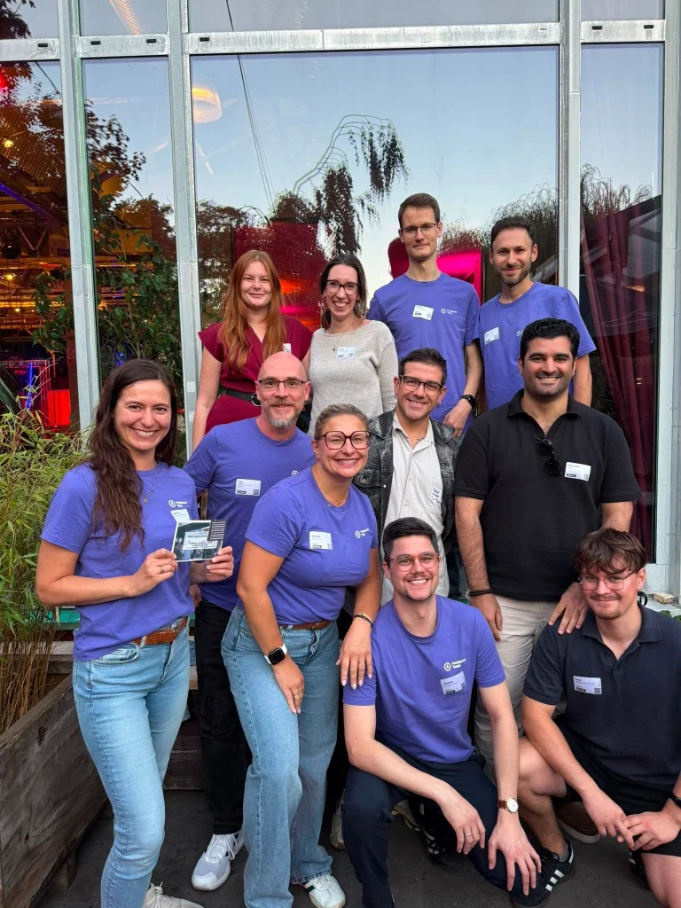

Ich mag Freelancer. Das sind Menschen, die unternehmerische Eigenverantwortung mit echter Leidenschaft für ihr Fachgebiet verbinden.

Wer als Solounternehmer im Markt besteht, bringt eine Eigenschaft automatisch mit: Das permanente Bestreben nach persönlicher Weiterentwicklung und fachlicher Exzellenz. Es gibt keinen Vorgesetzten, der Fortbildungen anordnet, und keine Personalabteilung, die für Weiterbildung sorgt. Wer nicht jeden Tag dazulernt, verliert den Anschluss.

Genau aus diesem Grund engagiere ich mich intensiv im **Freelancer Team** – einem Netzwerk aus über 150 spezialisierten Digitalprofis in ganz Deutschland und weltweit, die eine gemeinsame Haltung verbindet.

<figure class="my-8 bg-neutral-50 border border-neutral-200 p-6 md:p-8 rounded-2xl shadow-sm">
  

    
    

      <h4 class="font-bold text-base md:text-lg text-dark mb-0">Jörg Zimmer</h4>
      
Senior SEO & AI Search Consultant

    

  

  <blockquote class="text-base md:text-lg text-dark leading-relaxed italic border-l-4 border-lime-accent pl-4 my-4 font-normal">
    „Die Leidenschaft für Datenanalyse im Online Marketing ist wie ein Schlüssel, der Türen zu unendlichen Möglichkeiten öffnet.“
  </blockquote>
  <figcaption class="mt-4 pt-3 border-t border-neutral-200/60 flex flex-wrap items-center justify-between gap-2 text-xs text-neutral-500">
    

      Experten-Zitat • <cite class="not-italic font-semibold text-neutral-700">Jörg Zimmer</cite>
      •
      <a href="https://www.linkedin.com/feed/update/urn:li:activity:7019828915183452160" target="_blank" rel="noopener noreferrer" class="text-neutral-600 hover:text-dark underline inline-flex items-center gap-1">
        Quelle: LinkedIn-Beitrag von Jörg Zimmer
        <svg class="w-3 h-3 text-neutral-400" fill="none" stroke="currentColor" viewBox="0 0 24 24"><path stroke-linecap="round" stroke-linejoin="round" stroke-width="2" d="M10 6H6a2 2 0 00-2 2v10a2 2 0 002 2h10a2 2 0 002-2v-4M14 4h6m0 0v6m0-6L10 14" /></svg>
      </a>
    

    <a href="https://www.linkedin.com/in/joerg-zimmer-seo-sea-freelancer-berlin-spandau/" target="_blank" rel="noopener noreferrer" class="font-bold text-lime-700 hover:underline inline-flex items-center gap-1 shrink-0">
      Jörg Zimmer auf LinkedIn folgen →
    </a>
  </figcaption>
</figure>

## Die lila Bewegung: Sichtbarkeit mit Wiedererkennungswert

Man erkennt uns auf Branchen-Events sofort: Wir sind die Gruppe in den markanten lila T-Shirts. Egal ob wir Leitmessen wie das OMR Festival in Hamburg stürmen, auf der Konferenz für freie Berufe networken oder wie kürzlich das Berliner Afterwork-Event „Überstunde“ besuchen.

Das Foto entstand nach einem inspirierenden Abend in Berlin. Mit dabei waren unter anderem Melanie Aurich, Laura Tornow, Patrycja Absmeier, Marian Frevel, Matthias Hentschel, Daniel Masullo, Samuel Hartmann, Artjom Sajatz-Davydov, Alessandro Tarshahani und Christopher De La Garza.

Was auf den ersten Blick wie ein bunter Haufen wirkt, ist in Wahrheit ein extrem eingespieltes Kompetenz-Netzwerk für modernes [Freelancing](/glossar/freelancing/).

## Warum die Kooperation für Kunden den Unterschied macht

Klassische Agenturen verkaufen Kunden häufig das Bild einer allwissenden Komplettbetreuung. In der Realität sitzt der Senior-Stratege jedoch nur im Verkaufsgespräch – die operative Umsetzung landet anschließend bei wechselnden Junioren oder Praktikanten.

Im Freelancer Team funktioniert das Modell genau umgekehrt:
1. **Direkter Draht zu Senior-Spezialisten:** Jeder Ansprechpartner ist ein selbstständiger Experte, der seinen Lebensunterhalt mit herausragender Arbeitsqualität sichert.
2. **Keine bürokratischen Reibungsverluste:** Benötigt ein SEO-Kunde kurzfristig eine maßgeschneiderte Tracking-Infrastruktur oder ein SEA-Audit, binde ich den besten Spezialisten direkt per kurzem Anruf ein.
3. **Maximale Kosteneffizienz:** Es gibt keine pompösen Büroetagen oder administrativen Apparate, die über Kundenbudgets quersubventioniert werden müssen.

## Stimmen aus der lila Community

Wie eng der Zusammenhalt und das gegenseitige Vertrauen im Netzwerk sind, zeigen die Reaktionen aus unserer LinkedIn-Diskussion:

**Sebastian Thönnes** hob den Wert des Perspektivenwechsels hervor:
> *„Was ich an der Zusammenarbeit mit anderen Freelancern besonders schätze, ist die frische Sichtweise auf komplexe Projekte. Wenn die Vertrauensbasis erst einmal gefestigt ist, weiß man einfach: Das Ergebnis sitzt.“*

**Melanie Aurich** und **Peter Bomballa** brachten den Team-Faktor auf den Punkt:
> *„Ohne das Team würde jedes Branchenschnittstellen-Event nur halb so viel Energie freisetzen. Die Power und gegenseitige Wertschätzung sind das Fundament unseres Erfolgs.“*

Wer schon einmal erlebt hat, wie wir auf der Messe aufgetreten sind – wie in unserem Erfahrungsbericht zum [OMR Freelancer Stand ROI](/blog/omr-freelancer-stand-roi/), der Großoffensive [Mission OMR 2026: 25 Freelancer vs. Großagentur](/blog/omr-2026-mission-freelancer-team/) und den Impressionen von der [Freelance Unlocked](/blog/freelance-unlocked-lila-tshirts/) beschrieben –, versteht die Dynamik dieser Gemeinschaft. Auch bei regionalen Treffen wie dem [SEO-Stammtisch Berlin](/blog/seo-stammtisch-berlin-axel-springer/) zeigt sich: Echte [Community](/blog/wir-seos-sind-schuld-community/) schlägt isoliertes Einzelkämpfertum.

## Wie wird man Teil des lila Teams?

Weil mich immer wieder Nachrichten von Kolleginnen und Kollegen erreichen: Die Aufnahmekriterien sind in den letzten Monaten bewusst geschärft worden. Uns geht es um nachhaltige Qualität und menschliche Verlässlichkeit.

Die Koordination liegt in den Händen von Andreas Absmeier. Er leitet die monatlichen All-Hands-Sessions, zu denen ausgewählte Gäste eingeladen werden. Wenn du fachlich brennst und Lust auf ein starkes Bündnis hast, nimm direkt mit Andreas Kontakt auf.

Suchst du für dein Unternehmen ganzheitliche Unterstützung bei organischen Rankings und KI-Sichtbarkeit? In meiner [SEO-Sprechstunde](/seo-sprechstunde/) analysieren wir deinen Status Quo – und bei Bedarf hole ich punktgenau die passenden Köpfe aus dem Netzwerk an Bord.

<!-- LinkedIn CTA Box -->

  <h3 class="text-xl md:text-2xl font-bold text-white mb-3 !mt-0 !border-none !pb-0">
    Jetzt an der Diskussion teilnehmen
  </h3>
  

    Diskutiere mit Jörg Zimmer und dem Freelancer Team auf LinkedIn über Zusammenarbeit, Teamgeist und unternehmerische Freiheit.
  

  <a href="https://www.linkedin.com/posts/joerg-zimmer-seo-sea-freelancer-berlin-spandau_ich-mag-freelancer-das-sind-meistens-menschen-activity-7498777641999835136-nQZ6" target="_blank" rel="noopener noreferrer" class="btn-primary">
    <svg class="w-4 h-4 fill-current" viewBox="0 0 24 24"><path d="M20.447 20.452h-3.554v-5.569c0-1.328-.027-3.037-1.852-3.037-1.853 0-2.136 1.445-2.136 2.939v5.667H9.351V9h3.414v1.561h.046c.477-.9 1.637-1.85 3.37-1.85 3.601 0 4.267 2.37 4.267 5.455v6.286zM5.337 7.433c-1.144 0-2.063-.926-2.063-2.065 0-1.138.92-2.063 2.063-2.063 1.14 0 2.064.925 2.064 2.063 0 1.139-.925 2.065-2.064 2.065zm1.782 13.019H3.555V9h3.564v11.452zM22.225 0H1.771C.792 0 0 .774 0 1.729v20.542C0 23.227.792 24 1.771 24h20.451C23.2 24 24 23.227 24 22.271V1.729C24 .774 23.2 0 22.222 0h.003z"/></svg>
    Beitrag auf LinkedIn öffnen
    →
  </a>

