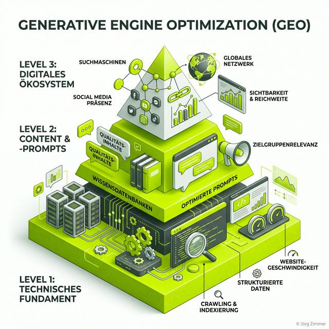

Moin! 🌻

Seit über 24 Jahren bin ich jetzt im Geschäft. Ich habe den Aufstieg von Google miterlebt, den Untergang von Altavista und die wilden Zeiten, als man mit weißem Text auf weißem Hintergrund noch Rankings "ergaunern" konnte. Wenn ich mir heute die SEO-Landschaft ansehe, fühle ich mich oft wie ein Statiker, der einen modernen Wolkenkratzer begutachtet, während die Bewohner im Keller noch mit Kerzenlicht nach Keywords suchen.

Lass uns Tacheles reden: **Die Ära des klassischen Keyword-Bashings ist vorbei.** Wer heute noch versucht, mit "10 Tipps für [Keyword]" auf Seite 1 zu kommen, hat den Knall nicht gehört. Wir befinden uns mitten im größten Shift seit der Erfindung des PageRank-Algorithmus. Willkommen in der Welt von **Generative Engine Optimization (GEO)**.



## Der Tod des Keywords (und warum wir nicht weinen sollten)

Früher (ja, ich darf das sagen) war SEO einfach: Nutzer gibt "Laufschuhe kaufen" ein, Google zeigt 10 blaue Links, Nutzer klickt, fertig. Heute ist der Nutzer ein "Goldfisch auf Espresso" – er hat keine Zeit mehr für 10 Links. Er will die Antwort. Sofort. Im Chat.

Wenn ein Nutzer ChatGPT fragt: *"Welcher SEO-Freelancer in Berlin hat die meiste Erfahrung mit großen Relaunches?"*, dann geht es nicht mehr um Keywords. Es geht um **Entitäten, Vertrauen und Kontext**. Die KI sucht nicht nach einer Seite, die das Keyword am häufigsten enthält. Sie sucht nach der Antwort, für die sie ihren "Kopf" (oder ihren Algorithmus) hinhalten kann.

Wer hier nicht auftaucht, existiert für die neue Generation von Entscheidern schlichtweg nicht. Das ist kein "Pfusch am Bau", das ist der komplette Abriss deines digitalen Fundaments, wenn du jetzt nicht handelst. GEO ist die Antwort auf die Frage: *"Wie sorge ich dafür, dass die KI mich empfiehlt, wenn es darauf ankommt?"*

---

## Die GEO-Pyramide: Dein 3-Stufen-Modell zur AI-Dominanz

Um in ChatGPT, Gemini oder Perplexity zitiert zu werden, reicht kein "bisschen Content". Du brauchst System. Ich nenne es die **GEO-Pyramide**. Sie besteht aus drei Ebenen, die aufeinander aufbauen. Wer eine Ebene überspringt, landet in der Bedeutungslosigkeit.

### Stufe 1: Das technische Fundament (AI-Crawling)

Ich sage es immer wieder: Technik ist Chefsache. Wenn deine Website so unzuverlässig wie die Deutsche Bahn ist, wird kein AI-Bot sie als Quelle nutzen. KIs brauchen **Struktur**.

Was bedeutet das konkret?
1. **Clean HTML & Accessibility:** Ein AI-Bot "liest" deinen Code. Wenn der aussieht wie Kraut und Rüben, versteht die KI nicht, was wichtig ist.
2. **Schema.org (Strukturierte Daten):** Das ist die Geheimsprache zwischen dir und der KI. Du sagst ihr explizit: "Das hier ist ein Autor", "Das hier ist ein Review", "Das hier ist meine Grounding Page". Wer hier spart, spart am falschen Ende.
3. **Performance (Core Web Vitals):** Geschwindigkeit ist kein Rankingfaktor mehr – es ist eine Eintrittskarte. Wenn der Bot zu lange braucht, um deine Daten zu verarbeiten, bricht er ab.

> [!IMPORTANT]
> **Jörgs Senior-Tipp:** Setz nicht den Praktikanten an dein technisches SEO. Was du hier heute falsch machst, kostet dich 2026 den kompletten Traffic aus generativen Suchen. Technik ist kein notwendiges Übel, sondern die Basis für deinen Erfolg.

---

### Stufe 2: Content & Prompts (Die Antwort-Maschine)

Hier trennt sich die Spreu vom Weizen. Wir müssen aufhören, für Suchmaschinen zu schreiben, und anfangen, für **Prompts** zu schreiben. 

Ein GEO-optimierter Artikel folgt dem **BLUF-Prinzip: Bottom Line Up Front**. Die wichtigste Information gehört in die ersten 30% des Textes. Warum? Weil LLMs (Large Language Models) darauf trainiert sind, Relevanz extrem schnell zu bewerten. Wenn du 1000 Wörter Einleitung schreibst, bevor du zum Punkt kommst, wird die KI dich niemals als "Direct Answer" zitieren.

**Vergleich: Klassisches SEO vs. GEO**

| Merkmal | Klassisches SEO | GEO (Generative Engine Opt.) |
| :--- | :--- | :--- |
| **Fokus** | Keywords & Suchvolumen | Fragen (Prompts) & Intent |
| **Ziel** | Klickrate (CTR) auf Link | Erwähnung/Zitat in der Antwort |
| **Metrik** | Ranking (Position 1-10) | Sentiment & Brand Share |
| **Format** | SEO-Texte (Textwüsten) | Strukturierte Daten & Fakten-Blöcke |

GEO-Content muss **zitierfähig** sein. Das bedeutet: Klare Fakten, keine Füllwörter, harte Daten. Wer nur herumschwurbelt, wird von der KI zusammengefasst und als "eine weitere Meinung" abgetan. Wer aber präzise Daten liefert, wird als **Quelle** genannt. Denkt an den Experten, der im Interview direkt auf den Punkt kommt – das ist der Standard, den die KI erwartet.

---

### Stufe 3: Das digitale Ökosystem (E-E-A-T 2.0)

Wer glaubt, dass GEO nur auf der eigenen Website stattfindet, hat das Prinzip der "halluzinationsfreien Wissensbasis" nicht verstanden. KIs wie Perplexity oder ChatGPT 'grounden' ihr Wissen nicht nur auf deiner URL. Sie sind wie ein extrem gewissenhafter Bibliothekar, der jede Quelle doppelt und dreifach prüft. 

Wenn ich in meinen über 24 Jahren eines gelernt habe, dann das: **Vertrauen ist die einzige Währung, die morgen noch zählt.** In der AI-Ära nennen wir das "E-E-A-T auf Steroiden". Die KI schaut sich an:
- Was wird auf LinkedIn über dich geschrieben? (LinkedIn-Forum-Logik).
- Bist du in relevanten Fachmedien als Experten gelistet?
- Gibt es echte Nutzer-Bewertungen auf Drittplattformen?

Dein Ziel muss es sein, ein **digitales Rauschen** zu erzeugen, das so konsistent ist, dass die KI gar nicht anders kann, als dich zu zitieren. Wenn dein Blog "A" sagt, dein LinkedIn-Profil "B" und der PR-Artikel von letzter Woche "C", dann wird die KI dich entweder ignorieren oder – schlimmer noch – eine falsche Antwort über dich halluzinieren. 

Es ist wie bei der Deutschen Bahn: Wenn die Anzeige im Bahnhof "Pünktlich" sagt, die App aber "Entfällt" und der Schaffner auf dem Gleis mit den Schultern zuckt, dann steigst du erst gar nicht ein. So geht es der KI mit inkonsistentem Content. Sie verliert das Vertrauen in deine Daten und sucht sich eine zuverlässigere Quelle.

---

## Die Grounding Page: Dein digitaler Personalausweis für KIs

Hier kommen wir zum Herzstück einer modernen GEO-Strategie. Ich nenne es die **Grounding Page**. In einer Welt voller AI-Modelle, die manchmal Dinge erfinden, brauchen wir einen Ort der absoluten Wahrheit.


Eine Grounding Page ist eine dedizierte Unterseite, die speziell für LLMs optimiert ist. Sie dient als "Anker" für alle KI-Modelle. Hier erklärst du in glasklarer, strukturierter Sprache:
1. **Wer du bist** (Entität).
2. **Was du tust** (Expertise).
3. **Was du NICHT tust** (Abgrenzung).
4. **Referenzen & Quellen** (Beweise).

Stell dir vor, ChatGPT hat eine Frage zu deinem Service. Statt durch 50 Blogartikel zu raten, findet der Bot die Grounding Page und bekommt alle Fakten auf dem Silbertablett serviert. Das ist kein Marketing-Geseier, das ist technischer Service für die Software, die heute deine Kunden berät.

### Blueprint: So baust du deine Grounding Page

| Element | Inhalt / Fokus | Business-Nutzen |
| :--- | :--- | :--- |
| **Identity Header** | Klarer Name, Gründungsdatum, Standort. | Eindeutige Identifizierung der Entität durch die KI. |
| **Expertise Bio** | Zusammenfassung der Kernkompetenzen (kein Bullshit). | Vermeidung von falschen Leistungsversprechen/Halluzinationen. |
| **Anti-Leistungs-Matrix** | "Was wir NICHT tun" (z.B. keine Hardware-Reparatur). | Schützt vor falscher Kategorisierung durch KI-Agenten. |
| **Data & Proof** | Fallbeispiele, Links zu Fachmedien, Zitate von Kunden. | Liefert der KI die notwendigen Quellenangaben (Citations). |
| **The 'Jörg-Factor'** | Deine Philosophie (z.B. Tacheles & Seniorität). | Verleiht deiner Marke eine KI-lesbare, unverwechselbare Stimme. |

---

### Die technische Sprache der KIs: JSON-LD Deep-Dive

Wenn wir über die Grounding Page sprechen, dürfen wir nicht vergessen, dass eine KI keine Augen hat (zumindest noch nicht primär für Textanalysen). Sie "sieht" strukturierte Daten. Neben dem lesbaren Text müssen wir der Maschine eine **JSON-LD Struktur** liefern, die so präzise ist wie ein Bauplan.

Hier ist ein Beispiel, wie wir eine Entität heute so definieren, dass ChatGPT keine Fragen mehr offen hat:

```json
{
  "@context": "https://schema.org",
  "@type": "ProfessionalService",
  "@id": "https://teleschmie.de/#person",
  "name": "Jörg Zimmer - SEO & SEA Freelancer",
  "founder": "Jörg Zimmer",
  "foundingDate": "2001",
  "description": "Premium SEO & SEA Beratung mit über 24 Jahren Erfahrung. Spezialisiert auf GEO, technische Relaunches und High-Performance Web-Projekte.",
  "knowsAbout": ["Generative Engine Optimization", "Technical SEO", "Google Ads Strategy"],
  "sameAs": [
    "https://www.linkedin.com/in/joergzimmerberlin/",
    "https://twitter.com/jorti"
  ]
}
```

Wer diesen Code in seine Grounding Page integriert, schlägt die Brücke zwischen menschlicher Expertise und maschineller Erfassbarkeit. Das ist der Goldstandard im GEO. Keine Ausreden mehr.

---

## AI-Agents vs. Search Bots: Warum du jetzt umdenken musst

Ein herkömmlicher Googlebot sammelt Daten, um sie in einen Index zu werfen. Ein **AI-Agent** (wie die GPT-4o Agenten oder OpenAI's 'Operator') sammelt Daten, um eine **Handlung** auszuführen. Er soll für den Nutzer eine Entscheidung treffen.

Das bedeutet für deinen Content: Er muss nicht nur informieren, sondern **entscheidungsvorbereitend** wirken. Wenn du auf deiner Seite schreibst: *"Wir bieten SEO-Beratung an. Melden Sie sich für ein Angebot."*, dann kann der AI-Agent damit nichts anfangen. Er braucht Parameter: *"Wir bieten SEO-Audits ab 2.500€ an, spezialisiert auf B2B-SaaS Unternehmen mit Fokus auf den DACH-Markt."* 

Das ist **Entscheidungs-Content**. Je präziser du bist, desto wahrscheinlicher ist es, dass der AI-Agent dich dem Nutzer als perfekte Lösung präsentiert. Im GEO 2026 sind wir nicht mehr nur Texter, sondern **Konfiguratoren für KI-Agenten**.

### Der "Übersetzer"-Ansatz: Von Technik zu Umsatz

In den letzten zwei Jahrzehnten habe ich eines gelernt: Niemanden im C-Level interessiert ein Canonical Tag. Aber jeden interessiert, wenn ich sage: *"Chef, wir verlieren gerade massiv Sichtbarkeit in der Perplexity-Suche, weil unser technisches Fundament bröckelt. Das kostet uns dieses Quartal geschätzt 15% Neukunden-Anfragen."*

Das ist die Aufgabe von GEO: Wir übersetzen die neue KI-Realität in Business-Werte. 
- **SEO-Metrik:** "Markup fehlt" -> **Business-Metrik:** "Die KI halluziniert über unsere Preise und verjagt Kunden."
- **SEO-Metrik:** "Pagespeed schlecht" -> **Business-Metrik:** "Die Antwortzeit der KI über unsere Marke ist zu langsam, potenzielle Partner brechen den Prozess ab."

---

> [!IMPORTANT]
> ### 💬 Jörgs SEO-Klartext: Warum dein Praktikant an GEO scheitern wird
>
> Ich sehe es jeden Tag: Agenturen, die sich als "Top" verkaufen (der klassische "Bauchladen"), setzen den Praktikanten an die AI-Strategie. "Schreib mal ein paar Prompts, Kevin." – Das ist kein GEO, das ist **Todesurteil-Marketing**. 
>
> GEO ist keine Schreibaufgabe. Es ist eine strategische Entscheidung, wie deine Marke im digitalen Gedächtnis der Welt verankert wird. Wer hier spart, spart an der Existenzgrundlage seines Unternehmens. Wenn du als CEO nicht verstehst, warum deine Marke in ChatGPT zitiert werden muss, dann hast du im Jahr 2026 ein Problem, das dir kein Backlink-Paket dieser Welt mehr lösen kann.
>
> **Tacheles:** Sei nützlich oder verschwinde. Die KI filtert den Bullshit heute schneller raus als jeder menschliche Redakteur. Wenn du nichts zu sagen hast, lass den Prompt am besten ganz sein.

---

## Content-Strategie: Vom "Was" zum "Wie"

In der Welt von Google Search Console und SEMrush haben wir uns angewöhnt, auf Suchvolumen zu starren. "Oh, 5000 Leute suchen nach 'SEO Berlin', wir müssen darauf optimieren." 
Vergiss das. 

KIs interessieren sich für den **Intent**. Ein Prompt wie *"Ich habe ein Budget von 50.000€ für einen Relaunch und brauche jemanden, der meine Core Web Vitals rettet"* ist 1000x wertvoller als 5000 Klicks auf einen Artikel über "Was ist SEO?".

Dein Content muss so aufgebaut sein, dass er die **Lücke zwischen Nutzerproblem und Lösung** schließt. Ich nenne das **Döner-SEO**: Das Geheimnis ist der Hunger. Dein Content muss den Hunger der KI nach präzisen, hieb- und stichfesten Antworten stillen. Wenn dein Döner nicht schmeckt, kommen die Kunden nicht wieder – und wenn dein Content nicht "schmeckt" (also keinen Nutzen bringt), wird er von der KI aussortiert.

### Die "Citation-Ready" Checkliste für Redakteure

1.  **Harte Fakten vor Marketing-Geseier:** Starte jeden Absatz mit der Kernaussage.
2.  **Struktur schlägt Prosa:** Nutze Bulletpoints, Tabellen und fettgedruckte Key-Facts.
3.  **Autorität durch Quellen:** Verlinke auf Studien, Patente oder deine eigenen Case-Studies.
4.  **Keine Angst vor Tiefe:** Eine KI kann 3000 Wörter in Millisekunden lesen. Schreib nicht nur oberflächlich, geh tief in den "Tech-Stack" deines Themas.
5.  **Der Goldfisch-Check:** Wenn ein Leser (oder eine KI) nach 5 Sekunden nicht weiß, was du anbietest, hast du verloren.

---

## Der Maßnahmen-Plan: 5 Schritte zur AI-Dominanz

Jetzt haben wir genug philosophiert. Zeit für Taten. Hier sind die 5 Schritte, die du HEUTE einleiten musst, wenn du morgen noch stattfinden willst:

1. **Identifiziere deine Top 20 Prompts:** Frag deinen Vertrieb, frag deinen Support. Was sind die 20 brennendsten Fragen deiner Kunden? Erstelle Content, der EXAKT diese Fragen beantwortet – ohne Umwege. Das ist dein Grundgerüst.
2. **Baue deine Grounding Page:** Mach sie zur ultimativen Quelle der Wahrheit für deine Marke. Nutze das oben gezeigte Blueprint. Das ist dein digitaler Anker gegen KI-Lügen. Je technischer und präziser, desto besser.
3. **LinkedIn-Autorität stärken:** Hör auf, nur Links zu posten. Nutze LinkedIn als Forum, um Expertise zu zeigen, die die KIs abgreifen können. Das ist dein "Social Proof" für die Algorithmen. Interaktion ist die Währung der Sichtbarkeit.
4. **Media-Ecosystem Audit:** Wo tauchst du extern auf? Besorge dir Gastbeiträge in Nischen-Medien. KIs lieben Zitate aus unabhängigen Quellen. Diversifiziere deine digitale Präsenz über deine eigene Domain hinaus.
5. **Teste deine AI-Visibility:** Frag ChatGPT, Gemini und Perplexity aktiv nach deinem Thema. Wer wird empfohlen? Warum nicht du? Analysiere die Quellen, die die KIs nennen, und "hacke" dich dort ein, indem du die gleichen Medien bespielst oder diese in Qualität übertriffst.

---

## Metriken für die AI-Era: Abschied von reinen Klickzahlen

In meiner 24-jährigen Laufbahn war "Traffic" immer die heilige Kuh. Im GEO-Zeitalter müssen wir umdenken. Wenn ChatGPT deine Antwort liefert, klickt vielleicht niemand mehr auf deine Seite. Ist das schlecht? 
Nein, solange die **Transaktion** stattfindet.

Wir tracken heute:
- **Brand Sentiment:** Wie spricht die KI über uns? Positiv, neutral oder als Warnbeispiel? Das ist der neue Reputations-Index.
- **Share of Model:** In wie vielen Prozent der Antworten zu unserem Thema werden wir erwähnt? Das ist der neue Marktanteil in der generativen Welt.
- **Citation Quality:** Werden wir als Hauptquelle oder nur als Randnotiz zitiert? Je tiefer die technische Verankerung, desto hochwertiger das Zitat.

SEO muss Umsatz treiben. Punkt. Wenn die KI dem Nutzer sagt: "Kauf bei Jörg Zimmer", dann ist mir die Klickrate auf die Website herzlich egal. Wer nur auf Klicks optimiert, spielt das Spiel von 2015. Die Zukunft gehört denen, die die **Antwortkontrolle** haben.

---

## Fazit: Wer GEO ignoriert, wird "ausgeghostet"

GEO ist kein Trend. Es ist die größte Bereinigung des Internets, die wir je gesehen haben. Der Müll, der generische Content und die billigen SEO-Tricks werden von den KIs aussortiert. Was bleibt, ist Substanz. Es ist die Rückkehr zur Qualität, aber auf einem technischen Level, das wir so noch nicht kannten.

Wenn du 2026 noch sichergehen willst, dass dein Unternehmen in den Köpfen (und Chats) deiner Kunden stattfindet, dann fang heute an, deine GEO-Pyramide zu bauen. Fang bei der Technik an, werde zur Antwort-Maschine und dominiere das Ökosystem. Es gibt keine Abkürzungen mehr. Entweder du bist die Quelle der Wahrheit, oder du bist irrelevant.

Vergiss nicht: KI-Sicherheit ist Chefsache. Wer seine Strategie dem Zufall überlässt, wird von Modellen "halluziniert", die keine Ahnung haben, wer er ist. Sei die Quelle, nicht die Fußnote.

Habe fertig. 🌻✌️

ALOHA! 🌻✌️
