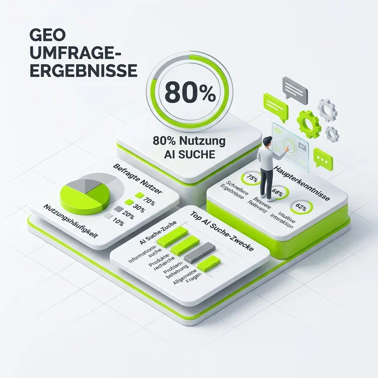

Sichtbarkeit in KI-Modellen optimieren – das ist das neue große Thema, das gerade durch alle SEO-Foren und LinkedIn-Timelines geistert. Aber wie nennen wir das eigentlich? Haben wir uns schon auf einen Standard geeinigt oder werfen wir einfach nur mit neuen Buzzwords um uns, um auf Partys cooler zu wirken? (Wobei, SEOs auf Partys... lassen wir das Thema.)

Ich wollte es genau wissen und habe auf LinkedIn eine Umfrage gestartet: **"Wie nennen wir es nun?"** Das Ergebnis war so spannend wie aufschlussreich und sagt viel über den aktuellen Zustand unserer Branche aus.

## Die nackten Zahlen der Umfrage

Hier ist das, was die Community (immerhin ein Querschnitt aus Inhouse-SEOs, Agenturköpfen und Freelancern) abgestimmt hat:

- **GEO** (Generative Engine Optimization): 50%
- **AI SEO**: 22%
- **SEO**: 19%
- **LLMO** (Large Language Model Optimization): 8%

## Eine tiefere Analyse der Begriffe: Was steckt wirklich dahinter?

Lass uns mal die einzelnen Begriffe sezieren. Denn hinter jeder Abkürzung steckt eine andere Sichtweise auf die Zukunft unseres Handwerks.

### GEO (Generative Engine Optimization) – Der klare Favorit

Mit 50% scheint sich GEO als Begriff durchzusetzen – zumindest in meiner Bubble. Und das hat gute Gründe. Der Begriff wurde maßgeblich durch eine Studie von Forschern (u.a. von Princeton und Georgia Tech) geprägt. Er macht Sinn, weil er anerkennt, dass wir es nicht mehr nur mit klassischen Suchmaschinen (Search Engines) zu tun haben, die einen Index durchsuchen. Wir haben es mit generativen Systemen zu tun, die Antworten *erzeugen*.

Wenn du für Perplexity, Claude oder ChatGPT optimierst, spielst du nach anderen Regeln. Es geht um **Semantic Richness**, um das Liefern von Quellen, die so präzise sind, dass die KI sie nicht "halluzinieren" muss. GEO ist die Anerkennung, dass der Kanal sich fundamental ändert.

### AI SEO – Der pragmatische Ansatz

22% bleiben bei AI SEO. Das ist die Bezeichnung für alle, die sagen: "Hey, es ist SEO, aber die Tools sind jetzt AI-powered." Das ist ein wenig wie "Digitalfotografie" statt nur "Fotografie". Es beschreibt eher den Prozess als das Ziel. Für viele Kunden ist AI SEO auch leichter zu verstehen als GEO. Wer will schon "generative Engines" optimieren, wenn er eigentlich "KI-Sichtbarkeit" meint?

### SEO – Die Traditionalisten (oder Realisten?)

Interessant finde ich, dass 19% bei "SEO" geblieben sind. Die Argumentation der "Puristen" ist simpel und logisch: Es ist und bleibt die Optimierung für Informations-Suchsysteme. Egal ob der Algorithmus von 2005 oder ein LLM von 2026 mir die Antwort liefert – mein Job ist es, den Inhalt so aufzubereiten, dass er gefunden wird.

Das ist eine sehr bodenständige Sichtweise. Sie impliziert: Verliere dich nicht in neuen Buzzwords, sondern mach deinen Job. Technik, Content, Backlinks. Das Ziel bleibt Sichtbarkeit, egal durch welches Fenster der Nutzer schaut.

### LLMO (Large Language Model Optimization) – Die Nerds

Mit 8% abgeschlagen, aber technisch am präzisesten. LLMO beschreibt genau, was wir tun: Ein Modell optimieren. Aber seien wir ehrlich: Wer das gegenüber einem Kunden erwähnt, sieht meist in leere Augen. Es ist zu technisch, zu wenig "Marketing".

## Meine ganz persönliche Meinung zu dem Namens-Hype

Ehrlich unter uns? Der Name ist mir am Ende des Tages völlig egal. Was zählt, ist das, was wir tun: Inhalte so aufbereiten, dass sie von Maschinen verstanden und – noch wichtiger – als wertvoll genug erachtet werden, um sie einem Menschen zu empfehlen.

Ob wir das GEO, AI-SEO, LLMO oder "Wunder-Sichtbarkeits-Optimierung" nennen – die harte Arbeit bleibt die gleiche. Wir müssen verstehen, wie die Systeme Daten fressen und wieder ausspucken. Wir müssen weg vom Keyword-Staring und hin zum Entity-Understanding.

## Die hitzige Community-Diskussion

Die Umfrage hat weit mehr ausgelöst als nur Klicks auf Antwortmöglichkeiten. In den Kommentaren ging es richtig zur Sache. Ein Punkt wurde immer wieder genannt: **Dringlichkeits-Inflation.**

Ein Teilnehmer schrieb: *"Wir brauchen nicht noch mehr Abkürzungen, die nur dazu dienen, neue, teure Pakete an Kunden zu verkaufen, die eigentlich nur klassisches SEO brauchen."* Da ist was dran. Wir müssen aufpassen, dass wir vor lauter neuen Begriffen nicht vergessen, dass eine Website, die technisch schrottreif ist, auch in einer "Generative Engine" nicht ranken wird.

Andere wiederum sahen den Mehrwert der Unterscheidung. GEO erfordert neue Skills, wie zum Beispiel den Umgang mit Vektor-Datenbanken oder das Verständnis von RAG (Retrieval-Augmented Generation). Dafür einen eigenen Namen zu haben, hilft, die Komplexität gegenüber Entscheidern zu rechtfertigen.

### Was du jetzt tun solltest

Wir befinden uns in einer der spannendsten Phasen seit dem Start des Google-Algorithmus. Dass die Community sich uneinig über den Namen ist, zeigt nur eines: Wir experimentieren noch. Wir lernen noch.

Aber eines ist sicher: Wer glaubt, er könne das Thema aussitzen, wird von denen überholt, die heute schon verstehen, dass man für KI-Systeme anders strukturieren muss als für den Google-Bot von 2018.

Ob du es nun GEO nennst oder bei SEO bleibst – sorg dafür, dass deine Inhalte so gut sind, dass keine KI an dir vorbeikommt. 

---

  <h3>Lust auf mehr AI Visibility?</h3>
  
Wenn du <a href="https://rankscale.ai/?via=offer" target="_blank" rel="noopener noreferrer">Rankscale</a> selbst testen willst, kannst du hier direkt loslegen:

  <a href="https://rankscale.ai/?via=offer" target="_blank" rel="noopener noreferrer" class="btn-primary inline-flex mt-4 no-underline">
    Rankscale ausprobieren 
  </a>

  <h3>Lust auf den <a href="https://seranking.com/de/?ga=4169588&source=link" target="_blank" rel="noopener noreferrer">SE Ranking</a> AI Tracker?</h3>
  
Wenn du die KI-Sichtbarkeit deiner Projekte mit einem etablierten Tool messen willst, kannst du hier direkt loslegen:

  <a href="https://seranking.com/de/?ga=4169588&source=link" target="_blank" rel="noopener noreferrer" class="btn-primary inline-flex mt-4 no-underline">
    SE Ranking AI Tracker testen 
  </a>

---

*Wie nennst du das Kind beim Namen? Oder ist dir das Marketing-Sprech auch völlig egal, solange die Rankings stimmen? Schreib mir auf LinkedIn – ich bin gespannt auf eure Meinung.*

### Weiterführende Artikel zum Thema KI-Sichtbarkeit
### Weiterführende Artikel
* **Lese-Tipp:** [Rankscale: Ein AI Visibility Tool das ich empfehlen kann](/blog/rankscale-ai-visibility-tool/)
* **Lese-Tipp:** [SE Ranking launcht AI Tracker: Rankings in der KI-Suche messen](/blog/se-ranking-ai-tracker/)
* **Lese-Tipp:** [Was ist eigentlich LLMO?](/glossar/llmo/)
