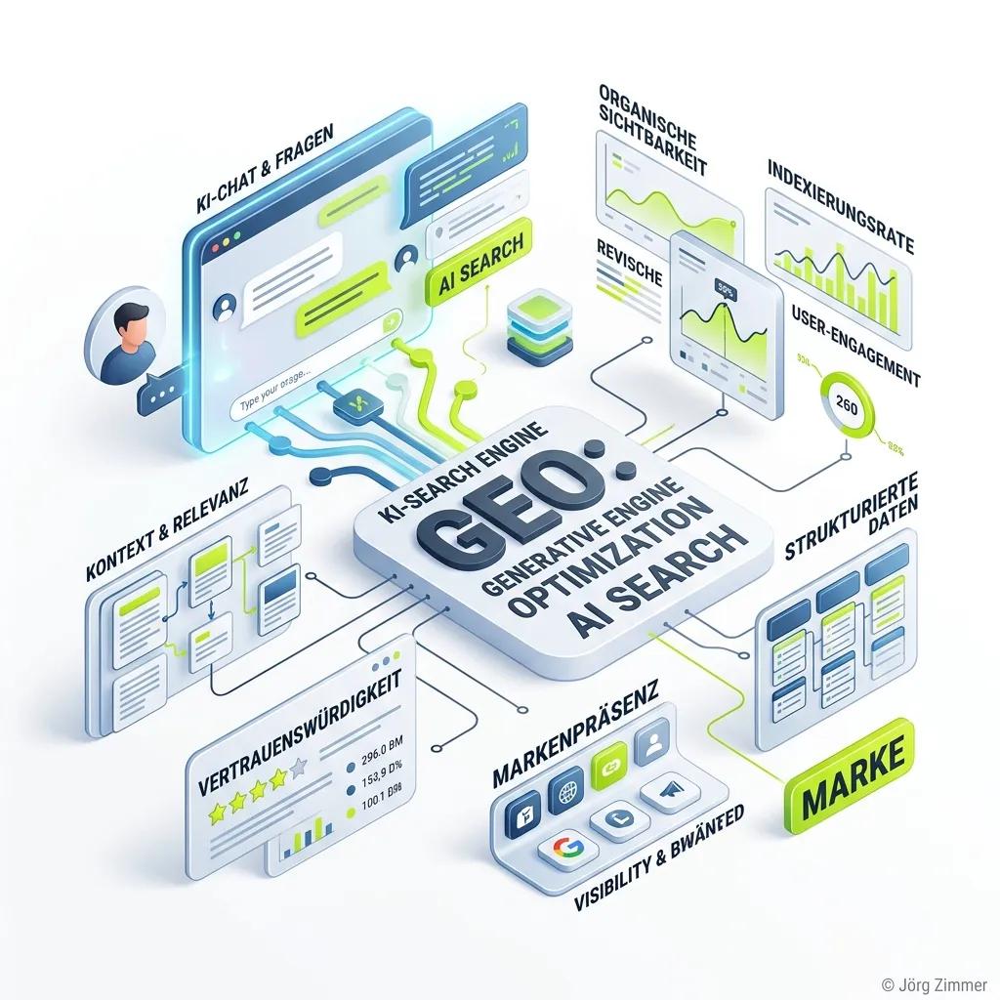

Moin! 🌻

GEO und AI Search sind ein ganz neues Spiel.

Das Internet, wie wir es kennen, ist für Menschen gemacht. Alles da draußen, was in den letzten 30 Jahren entstanden ist – Inhalte mit schickem Design und dem obligatorischen Marketing-Blabla –, ist exakt darauf ausgelegt, menschliche Augen zu fangen.

Aber ein LLM oder KI-[Crawler](/glossar/crawler/) braucht das alles nicht.

Den Marketing-Sprech kreiert sich die Maschine selbst. Das Interface und die Optik baut sie sich selbst. Die User Experience findet heute direkt im Chatfenster statt (Stichwort: [Zero Click Content](/glossar/zero-click-content/)).

### Was KI-Modelle wirklich wollen

Das Einzige, was ein LLM von dir braucht, sind leicht zu extrahierende Fakten. Und einen soliden Ruf sowie eine glasklare Wahrnehmung im digitalen Raum. [Markenaufbau mit SEO](/glossar/markenaufbau-mit-seo/) ist nicht mehr nur ein nettes Add-on, sondern absolute Pflicht.

  
💬 Jörgs SEO-Klartext (LinkedIn Insights)

  
"AI Search ist mehr als reines SEO. Die Überschneidung ist riesig, trotzdem ist es ein neues Spiel. Neue Metriken, neue Optimierungen, ähnliches Handwerk."

  
<strong>Mein Nachtrag dazu:</strong> Technisch ist da gewaltig was Neues am Start – suche mal nach dem <em>AI Readyness Checker</em> von Cloudflare Radar. Da kommen plötzlich Protokolle und Methoden ins Spiel, die mit klassischem SEO nichts mehr zu tun haben.  Ich bin mittlerweile stark für einen neuen Namen wie <strong>GEO, AI SEO oder AI Visibility</strong>. Warum? Weil wir uns unter dem Deckmantel "SEO" bei C-Level-Entscheidern oft schwergetan haben – da waren wir schnell nur die "kleinen Nerds im Hoodie". Ein neuer Name macht den Hoodie-Nerd zum Unternehmensberater. Und nur der kommt an die Budgets, die nötig sind, um dieses umfassende SEO, wie Google es heute fordert, wirklich im Unternehmen durchzuboxen!

Wie Torsten Paul Monnard und Sonja Greye in den Kommentaren absolut richtig anmerken: Wer SEO schon immer als sauberes Handwerk für den Nutzer verstanden hat, fängt nicht bei null an. GEO ist vielmehr ein Stresstest dafür, ob deine bisherigen SEO- und Content-Grundlagen wirklich sauber aufgestellt waren.

**Doch hier kommt mein wichtiges "Aber":** Gutes SEO schafft fast alle Grundlagen – aber eben nur *fast* alle. Es kommt ein komplett neuer Layer obendrauf, der im Laufe der Jahre zu einer eigenen Disziplin heranwachsen wird. Da KI-Modelle fundamental anders arbeiten als Google, braucht es andere Tools und neue Maßnahmen. Bereits jetzt lautet meine Taktik in Projekten: Erst spiele ich das klassische SEO durch, und dann mache ich die spezifischen AI-Vorbereitungen. Die Überschneidung ist extrem hoch, aber eben keine 100 %. Es gibt mittlerweile handwerkliche und strategische Maßnahmen, die schlichtweg kein SEO mehr sind.

Hanns Kronenberg bringt die veränderte Optimierungsfrage dabei sehr treffend auf den Punkt: Während die klassische Suche entscheidet, *welche Seiten* ein Nutzer besuchen sollte, fragt das sogenannte *Grounding* der KI, *welche Informationen* ein System verantwortungsvoll nutzen kann, um direkt eine fertige Antwort zu generieren.

### Marke, PR und Ruf: Die neue Dreifaltigkeit

SEO durchzuspielen bringt dich weit. Deine digitale Wahrnehmung zu optimieren, bringt dich weiter.

Wie Sascha Pöschl auf LinkedIn richtig ergänzt: Quellen wie Wikipedia rücken massiv in den Fokus. Die KI nutzt diese validierten Daten. Du brauchst eine starke [Entität](/glossar/entitaet/), konsistente Daten und echtes [E-E-A-T](/glossar/e-e-a-t/). Marke, PR, Ruf und klassisches SEO zusammen sind das, was jetzt zählt.

Unterm Strich: Vergiss die Abkürzungen. Biete klare Fakten, baue eine echte Marke auf und strukturiere deine Daten so, dass Maschinen sie fehlerfrei auswerten können.

ALOHA! 🌻✌️

  <h3 class="text-2xl font-bold mb-4">Wie ist deine Meinung zu GEO und AI Search?</h3>
  
Die Diskussion dazu läuft bereits intensiv. Komm dazu und teile deine Gedanken mit mir und der Community!

  <a href="https://www.linkedin.com/posts/joerg-zimmer-seo-sea-freelancer-berlin-spandau_geo-und-ai-search-sind-ein-ganz-neues-spiel-activity-7473933271655944193-7b6l" target="_blank" rel="noopener noreferrer" class="btn-primary inline-flex">💬 Auf LinkedIn mitdiskutieren</a>

