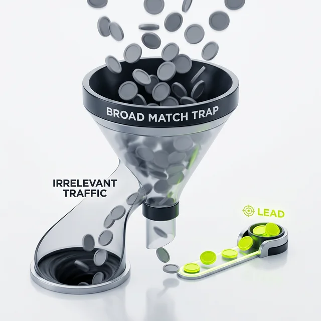
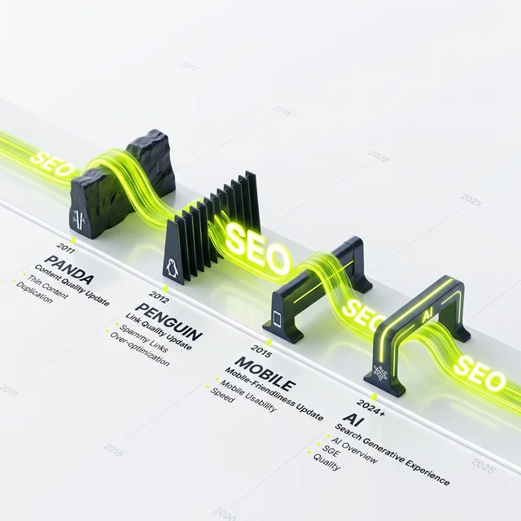

Zwei Aussagen, die ich in fast jedem Erstgespräch machen muss – und sie lösen meistens erst mal ungläubiges Staunen oder nervöses Herzklopfen aus. Weil sie an den Grundfesten dessen rütteln, was viele Marketing-Abteilungen über Jahre als "Wahrheit" verkauft bekommen haben. 

Lass uns Tacheles reden. Ohne Weichspüler, direkt aus der Praxis von über zwei Jahrzehnten Arbeit mit den Algorithmen aus Mountain View.

## 1. Der Google Ads Support ist nicht dein Freund (und war es nie)

  
 Jörgs SEO-Klartext (LinkedIn Insights)

  
"Der Google Support arbeitet für Googles Quartalszahlen, nicht für deinen Kontostand. Vertrau deinen Daten mehr als einem anonymen Callcenter."

Klingt hart? Mag sein. Ist es wahr? Zu 100%. Wenn du einen Anruf von einer "Google Ads Strategin" oder einem "Account Spezialisten" bekommst, dann sei dir einer Sache bewusst: Diese Menschen sitzen meist in großen Callcentern in Barcelona, Dublin oder Lissabon. Viele von ihnen haben nach einer kurzen Schulung ihre Skripte in der Hand und ihr Ziel ist klar definiert: **Umsatzsteigerung für Google.**

### Die Falle der "Optimierungsvorschläge"

Hast du dich schon mal gefragt, warum dein Optimierungsfaktor im Google Ads Interface plötzlich sinkt, wenn du nicht blind auf "Alle übernehmen" klickst? Das ist psychologische Kriegsführung auf niedrigstem Niveau. Du wirst mit roten Balken und warnenden Hinweisen bombardiert, damit du dem System mehr Kontrolle gibst.

Die Vorschläge laufen fast immer auf das Gleiche hinaus:
- **Broad Match Keywords:** Damit Google deine Anzeigen auch bei völlig irrelevanten Suchanfragen ausspielen kann. "Geld verbrennen" war noch nie so einfach.
- **Smart Bidding ohne Limits:** Gib Google die volle Kontrolle über dein Budget. Das System optimiert vielleicht auf Conversions, aber oft auf die, die du ohnehin bekommen hättest – nur jetzt teurer.
- **Einbeziehung des Suchnetzwerk-Partners:** Damit landet deine Werbung auf irgendwelchen Schrott-Seiten, die niemand ernsthaft liest.

### Die Realität in den Accounts

Ich sehe regelmäßig Accounts, in denen Kunden blind den Empfehlungen gefolgt sind. Die Story ist immer gleich: "Jörg, wir haben jetzt einen Optimierungsscore von 98%, aber unsere Kosten sind explodiert und die Qualität der Leads ist im Keller." 

Natürlich! Weil Google auf Massen-Traffic optimiert, nicht auf deinen individuellen Profit. Ein Algorithmus versteht dein Geschäftsmodell nicht. Er weiß nicht, dass ein Lead für Produkt A für dich 500€ wert ist, während Produkt B eigentlich nur ein Beifang ist.

**Mein ehrlicher Rat:** Hinterfrage jeden Vorschlag. Wenn dich jemand von Google anruft, hör höflich zu, aber unterschreib nichts und stell nichts live, ohne es mit jemandem zu besprechen, der für dich arbeitet – nicht für Google. Dein ROI ist mein Ziel, Googles Quartalszahlen sind mir egal.

## 2. SEO ist nicht tot – es hat nur aufgehört, einfach zu sein

Jedes Jahr die gleiche Leier. "SEO ist tot!" Seit ich 2002 angefangen habe, habe ich diesen Satz gefühlt hundertmal gehört. 
- 2011: Panda-Update? "SEO ist tot!"
- 2012: Penguin-Update? "SEO ist tot!"
- 2015: Mobilegate? "SEO ist tot!"
- 2023: ChatGPT/AI? "SEO ist tot!"

Wisst ihr was? SEO erfreut sich bester Gesundheit. Es hat nur die Form gewechselt. Die "Wildwest-Zeiten", in denen man mit ein paar Linkkäufen und Keyword-Spamming auf Platz 1 kam, die sind tot. Und das ist auch gut so.

### Die Evolution der Sichtbarkeit

SEO wird heute komplexer, ja. Aber solange Menschen Fragen haben und Maschinen nutzen, um Antworten zu finden, wird es "Suchmaschinen-Optimierung" geben. Nur dass die "Suchmaschine" heute eben auch ein Chatbot, eine App oder ein Smart Speaker sein kann.

Wir bewegen uns weg von klassischen Keywords hin zu **Entitäten** und **Kontext**. Google (und auch die neuen KIs) wollen nicht mehr nur wissen, ob das Wort "SEO Berlin" auf deiner Seite steht. Sie wollen verstehen, ob DU ein vertrauenswürdiger Experte bist (E-E-A-T). Sie schauen sich dein gesamtes digitales Ökosystem an.

### Die KI als Beschleuniger, nicht als Mörder

Statt SEO zu töten, wirkt KI wie ein Katalysator. Sie sortiert den Müll schneller aus. Wer billigen Content produziert, wird gelöscht. Wer echten Mehrwert bietet, wird von der KI als Quelle zitiert. 

Sichtbarkeit im Jahr 2026 bedeutet:
- **Authority:** Sei die Stimme in deiner Nische.
- **Technik:** Deine Seite muss rennen. Keine Ausreden mehr bei Ladezeiten.
- **Intelligence:** Nutze KI, um deine Nutzer besser zu verstehen, nicht um sie mit generischem Text zu langweilen.

## Was die Community dazu sagt

Als ich diesen Beitrag auf LinkedIn geteilt habe, ist der Server fast abgeraucht. Über 35 Reaktionen und eine hitzige Debatte in den Kommentaren. Die meisten meiner Kollegen aus dem Bereich SEA haben mir Recht gegeben: Der Google Support ist für Anfänger eine gefährliche Falle. 

Ein Kommentar brachte es auf den Punkt: *"Der Google Ads Support ist wie ein Bankberater: Er ist nett, er trägt einen Anzug, aber am Ende will er dir das Produkt verkaufen, das für die Bank am meisten bringt, nicht für dein Sparbuch."*

Bei SEO war das Echo ähnlich. Die "Alten Hasen" der Branche zucken bei "SEO ist tot" nur noch mit den Schultern und arbeiten weiter an ihren Strategien. Wir wissen: Solange es Neugier gibt, gibt es Suche.

### Bottom Line für dein Business

In einer Welt voller glitzernder Automatisierung und lauter Buzzwords ist Skepsis eine Tugend. 
1. Vertrau deinem Bauchgefühl und deinen Daten mehr als dem Support eines Mega-Konzerns.
2. Hör auf, nach der "Silberkugel" zu suchen, die SEO ablöst. Investiere stattdessen in echte Expertise und echtes Vertrauen.

SEO und SEA sind Werkzeuge. Kraftvoll, wenn man sie beherrscht. Zerstörerisch für dein Budget, wenn man sie falsch anwendet oder die Kontrolle abgibt.

---

ALOHA 🌻! 🌻
* **Lese-Tipp:** [SEO ist tot? Magic Writing Podcast mit Michael Kaufhold](/blog/magic-writing-podcast-seo-ist-tot/)
* **Lese-Tipp:** [25 Jahre SEO - und wir machen immer noch die gleichen Fehler](/blog/24-jahre-seo-gleiche-fehler/)
