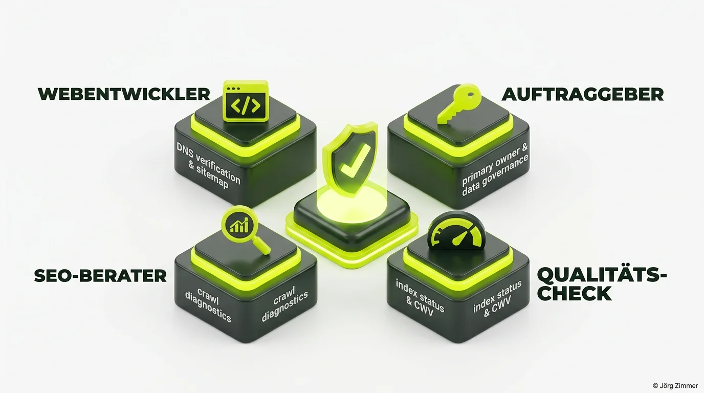

Hier kommt eines der Themen, bei dem in Projekt-Meetings regelmäßig die Fetzen fliegen: **Wer ist eigentlich für die Einrichtung der Google Search Console (GSC) zuständig?**

Was auf den ersten Blick wie ein banales bürokratisches Detail wirkt, entwickelt sich bei Relaunches und Redesigns regelmäßig zum teuren Desaster. Wenn nach dem Go-Live der organische Traffic um 70 % einbricht und niemand weiß, welche URLs Google überhaupt indexiert, schieben sich Webdesigner, Entwickler, SEOs und Kunden gegenseitig die Schuld in die Schuhe.

Stell dir vor: Du lässt ein schlüsselfertiges Bürogebäude errichten. Nach dem Einzug stellst du fest, dass der Hauptanschluss für Wasser und Strom nie angemeldet wurde. Wer trägt die Verantwortung? Das Architekturbüro, der Elektromeister oder du als Bauherr, der im Dunkeln steht?

<figure class="my-8 bg-neutral-50 border border-neutral-200 p-6 md:p-8 rounded-2xl shadow-sm">
  

    
    

      <h4 class="font-bold text-base md:text-lg text-dark mb-0">Jörg Zimmer</h4>
      
Senior SEO & AI Search Consultant

    

  

  <blockquote class="text-base md:text-lg text-dark leading-relaxed italic border-l-4 border-lime-accent pl-4 my-4 font-normal">
    „Guckt bitte in die Google Search Console und besprecht die Fehlermeldungen mit eurem Webdesigner und eurem Entwickler.“
  </blockquote>
  <figcaption class="mt-4 pt-3 border-t border-neutral-200/60 flex flex-wrap items-center justify-between gap-2 text-xs text-neutral-500">
    

      Experten-Zitat • <cite class="not-italic font-semibold text-neutral-700">Jörg Zimmer</cite>
      •
      <a href="https://www.linkedin.com/feed/update/urn:li:activity:7039604214313971712" target="_blank" rel="noopener noreferrer" class="text-neutral-600 hover:text-dark underline inline-flex items-center gap-1">
        Quelle: LinkedIn-Beitrag von Jörg Zimmer
        <svg class="w-3 h-3 text-neutral-400" fill="none" stroke="currentColor" viewBox="0 0 24 24"><path stroke-linecap="round" stroke-linejoin="round" stroke-width="2" d="M10 6H6a2 2 0 00-2 2v10a2 2 0 002 2h10a2 2 0 002-2v-4M14 4h6m0 0v6m0-6L10 14" /></svg>
      </a>
    

    <a href="https://www.linkedin.com/in/joerg-zimmer-seo-sea-freelancer-berlin-spandau/" target="_blank" rel="noopener noreferrer" class="font-bold text-lime-700 hover:underline inline-flex items-center gap-1 shrink-0">
      Jörg Zimmer auf LinkedIn folgen →
    </a>
  </figcaption>
</figure>

## Die Umfrage: 71 Experten über Zuständigkeiten und Pflichten

Um Klarheit in diesen Dauerstreit zu bringen, habe ich das Thema in der Fachcommunity zur Debatte gestellt. Über 70 erfahrene Webentwickler, Agenturinhaber und SEO-Berater teilten ihre Praxisansätze.

Das Ergebnis war erfreulich eindeutig:

| Akteur im Webprojekt | Hauptaufgabe bei der GSC | Begründung aus der Praxis |
|---|---|---|
| **Webentwickler / Webdesigner** | **Pflicht zur Ersteinrichtung** | Verfügt über DNS-Zugang, Serverkonfiguration und steuert die Sitemap-Generierung. |
| **SEO-Berater / Stratege** | **Monitoring & Auswertung** | Analysiert Crawl-Statistiken, identifiziert Indexierungs-Hürden und optimiert Snippets. |
| **Auftraggeber / Domaininhaber** | **Rechteinhaber & Datenhoheit** | Muss als primärer Eigentümer im Google-Konto hinterlegt sein. |
| **Niemand (Blindflug)** | **Fahrlässigkeit** | Führt bei Relaunches zu unbemerkten Rankingverlusten und Indexierungsstopps. |

Knapp zwei Drittel der Experten sehen den Webentwickler in der klaren Bringschuld für das technische Grund-Setup. Wer eine Website ins Netz stellt, muss prüfen, ob die Suchmaschinen das Portal überhaupt fehlerfrei crawlen können.

## Die vier Stationen eines professionellen Setups

Damit in Projekten keine Unklarheiten entstehen, empfiehlt sich eine klare Aufgabenteilung entlang des Entwicklungsprozesses:

### 1. Webentwickler: DNS-Verifizierung und Sitemaps
Die zuverlässigste Methode ist die Verifizierung auf Domain-Ebene via DNS-TXT-Eintrag beim Webhoster. Sie deckt automatisch alle Subdomains (inklusive `www` und Non-`www`) sowie HTTP- und HTTPS-Protokolle ab. Zudem hinterlegt der Entwickler die `sitemap.xml` im Webroot und reicht diese aktiv in der Console ein.

### 2. Auftraggeber: Primäre Inhaberschaft sichern
Ein gravierender Fehler, den ich in Beratungsprojekten immer wieder sehe: Die frühere Agentur hat die Search Console mit einem agentureigenen Google-Konto angelegt. Endet die Zusammenarbeit im Streit, werden die historischen Leistungsdaten als Geisel gehalten. Die Domain-Property gehört ausschließlich auf ein zentrales Unternehmenskonto des Kunden.

### 3. SEO-Berater: Crawling-Diagnose und Keyword-Entwicklung
Sobald Daten einlaufen, beginnt die eigentliche Optimierungsarbeit. Der SEO prüft, ob [Technisches SEO](/glossar/technisches-seo/) greift, ob Render-Fehler vorliegen und wie die [Keyword-Strategie](/glossar/keywordrecherche/) anhand echter Impressionen nachjustiert werden muss.

### 4. Qualitäts-Check: Indexierungsstatus und Core Web Vitals
Über die Search Console lassen sich Ladezeitenprobleme direkt identifizieren. Die gemessenen Felddaten zu den [Core Web Vitals](/glossar/core-web-vitals/) und die semantische Validierung von [Schema Markup](/glossar/schema-org-markup/) zeigen schwarz auf weiß, ob die Seite den Qualitätsrichtlinien von Google genügt. Für umfassende Crawls koppeln wir die GSC-Daten mit spezialisierten Tools wie [SE Ranking (Partnerlink)](https://seranking.com/de/?ga=4169588&source=link) und überwachen über [SE Ranking KI-Sichtbarkeit](/blog/se-ranking-ki-sichtbarkeit/) parallele KI-Trends.

## Checkliste für deinen nächsten Website-Launch

Bevor du den Champagner für den Website-Launch öffnest, prüfe diese Punkte:

- [ ] Wurde die Domain-Property via DNS-TXT-Record verifiziert?
- [ ] Ist der Kunde mit seiner Firmen-E-Mail als Hauptinhaber hinterlegt?
- [ ] Wurde die finale XML-Sitemap fehlerfrei eingereicht?
- [ ] Wurde die `robots.txt` auf unbeabsichtigte Disallow-Befehle geprüft?
- [ ] Liegen nach 48 Stunden erste Crawling-Meldungen ohne Serverfehler (5xx) vor?

Wenn alle Beteiligten diese Checkliste abarbeiten, wird die Search Console zum wertvollsten Frühwarnsystem deines Marketings. Wenn hingegen jeder die Verantwortung wegschiebt, endet der Launch unweigerlich in teuren Reparaturarbeiten.

Möchtest du prüfen lassen, ob deine Google Search Console fehlerfrei aufgesetzt ist und welche ungenutzten Ranking-Potenziale in deinen Daten schlummern? Lass uns deine Property gemeinsam in der [SEO-Sprechstunde](/seo-sprechstunde/) durchleuchten.

<!-- LinkedIn CTA Box -->

  <h3 class="text-xl md:text-2xl font-bold text-white mb-3 !mt-0 !border-none !pb-0">
    Jetzt an der Diskussion teilnehmen
  </h3>
  

    Diskutiere mit Jörg Zimmer und der SEO-Community auf LinkedIn über Verantwortlichkeiten beim Website-Relaunch und die Datenhoheit in der Search Console.
  

  <a href="https://www.linkedin.com/posts/joerg-zimmer-seo-sea-freelancer-berlin-spandau_umfrage-wer-ist-fuer-die-einrichtung-der-activity-7264177815217430528-9Y7S" target="_blank" rel="noopener noreferrer" class="btn-primary">
    <svg class="w-4 h-4 fill-current" viewBox="0 0 24 24"><path d="M20.447 20.452h-3.554v-5.569c0-1.328-.027-3.037-1.852-3.037-1.853 0-2.136 1.445-2.136 2.939v5.667H9.351V9h3.414v1.561h.046c.477-.9 1.637-1.85 3.37-1.85 3.601 0 4.267 2.37 4.267 5.455v6.286zM5.337 7.433c-1.144 0-2.063-.926-2.063-2.065 0-1.138.92-2.063 2.063-2.063 1.14 0 2.064.925 2.064 2.063 0 1.139-.925 2.065-2.064 2.065zm1.782 13.019H3.555V9h3.564v11.452zM22.225 0H1.771C.792 0 0 .774 0 1.729v20.542C0 23.227.792 24 1.771 24h20.451C23.2 24 24 23.227 24 22.271V1.729C24 .774 23.2 0 22.222 0h.003z"/></svg>
    Beitrag auf LinkedIn öffnen
    →
  </a>

