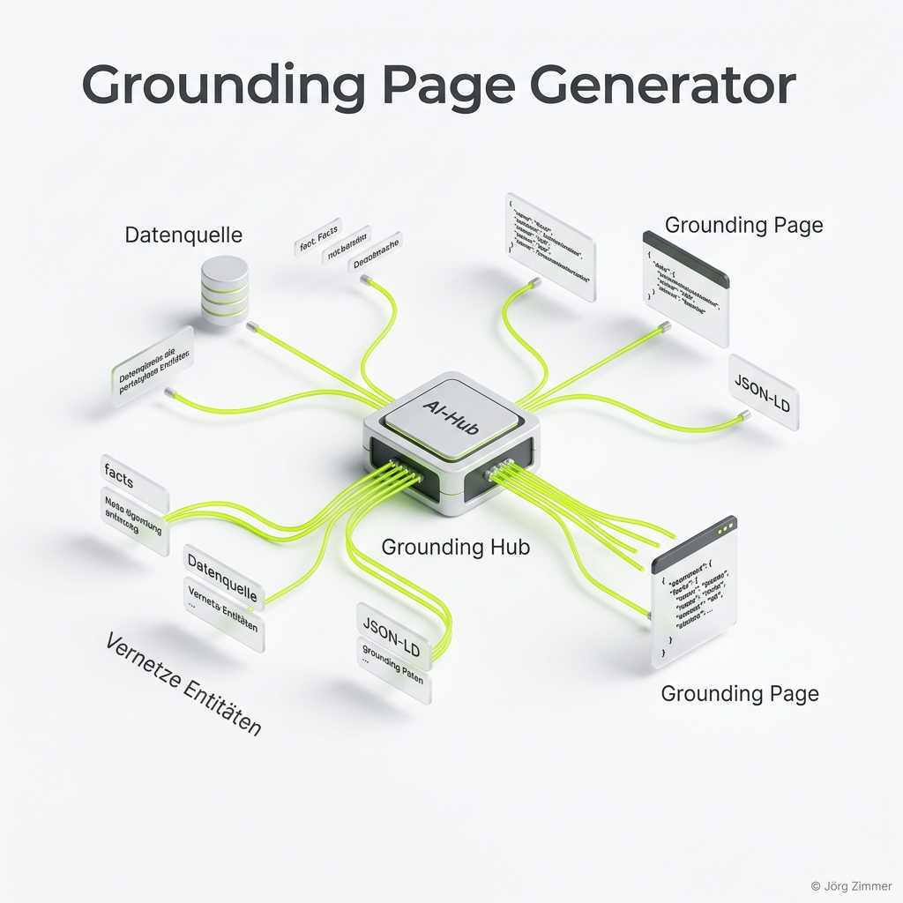

Seit über 25 Jahren bin ich jetzt im SEO-Geschäft. Ich habe miterlebt, wie wir Links getauscht haben als wären es Panini-Bilder, wie wir Texte für den Googlebot "getuned" haben und wie wir schließlich gelernt haben, dass der Nutzer (und nicht der Algorithmus) im Mittelpunkt steht. Aber was wir gerade erleben, ist kein einfacher Trend mehr. Es ist der größte Abriss und Neubau des digitalen Fundaments, den ich je gesehen habe.

Lass uns Tacheles reden: **Wir befinden uns in der Ära der Generative Engine Optimization (GEO).** Wer heute noch glaubt, dass eine nette Website und ein paar Keywords reichen, um 2026 noch stattzufinden, der betreibt gefährlichen **Pfusch am Bau**.

<figure class="my-8 bg-neutral-50 border border-neutral-200 p-6 md:p-8 rounded-2xl shadow-sm">
  

    
    

      <h4 class="font-bold text-base md:text-lg text-dark mb-0">Jörg Zimmer</h4>
      
Senior SEO & AI Search Consultant

    

  

  <blockquote class="text-base md:text-lg text-dark leading-relaxed italic border-l-4 border-lime-accent pl-4 my-4 font-normal">
    „Wenn du das jetzt noch in drei unterschiedlichen AI's machen willst, wer macht das? Dann macht das dein SEO einfach mit. Der ist am dichtesten dran, 70 Prozent Überschneidungsrate, meiner Meinung nach, ja. Hm.“
  </blockquote>
  <figcaption class="mt-4 pt-3 border-t border-neutral-200/60 flex flex-wrap items-center justify-between gap-2 text-xs text-neutral-500">
    

      Experten-Zitat • <cite class="not-italic font-semibold text-neutral-700">Jörg Zimmer</cite>
      •
      <a href="https://www.youtube.com/watch?v=pJFZzv5LEvk&t=1237s" target="_blank" rel="noopener noreferrer" class="text-neutral-600 hover:text-dark underline inline-flex items-center gap-1">
        Quelle: YouTube Talk Antonio Blago & Jörg Zimmer Folge 5 (20:37)
        <svg class="w-3 h-3 text-neutral-400" fill="none" stroke="currentColor" viewBox="0 0 24 24"><path stroke-linecap="round" stroke-linejoin="round" stroke-width="2" d="M10 6H6a2 2 0 00-2 2v10a2 2 0 002 2h10a2 2 0 002-2v-4M14 4h6m0 0v6m0-6L10 14" /></svg>
      </a>
    

    <a href="https://www.linkedin.com/in/joerg-zimmer-seo-sea-freelancer-berlin-spandau/" target="_blank" rel="noopener noreferrer" class="font-bold text-lime-700 hover:underline inline-flex items-center gap-1 shrink-0">
      Jörg Zimmer auf LinkedIn folgen →
    </a>
  </figcaption>
</figure>

Vor ein paar Tagen habe ich auf LinkedIn eine Diskussion angestoßen, die den Nagel auf den Kopf trifft. Es ging um meinen [**Grounding Page Generator**](/tools/groundingpage-generator/). Warum? Weil ich es satt habe zu sehen, wie KIs über Marken halluzinieren, nur weil sie kein ordentliches Fundament finden.

## Das Problem: Wenn die KI deine Marke "erfindet"

Stell dir vor, du bist ein Entscheider. Du fragst ChatGPT: *"Wer ist der beste Experte für Entitäten-SEO in Berlin?"*. Die KI sucht. Sie findet ein paar alte Blogartikel, ein veraltetes Impressum und eine "Über uns"-Seite, die vor Marketing-Floskeln nur so strotzt. Was passiert? Die KI fängt an zu raten. Sie vermischt Fakten mit Vermutungen. Im schlimmsten Fall dichtet sie dir Leistungen an, die du gar nicht hast, oder ordnet dich einer völlig falschen Branche zu.

Das ist der **Goldfisch auf Espresso** Effekt: Die Aufmerksamkeitsspanne der KI ist kurz, und wenn die Datenlage matschig ist, wird das Ergebnis unbrauchbar. Deine Marke wird zum Opfer von statistischen Wahrscheinlichkeiten statt zur Quelle der Wahrheit.

## Die Lösung: Die Grounding Page als "Digitaler Anker"

Hier kommt das Konzept der [**Grounding Page**](/glossar/grounding-page/) ins Spiel. Ich habe dieses Konzept nicht erfunden, aber ich habe es perfektioniert und in meine täliche Arbeit integriert. Eine Grounding Page ist nichts anderes als dein **technischer Personalausweis für AI-Bots**.

Es ist eine Seite, die nur ein Ziel hat: **Absolute Klarheit.**

- **Wer bist du?** (Präzise Definition deiner Entität)
- **Was tust du?** (Harte Fakten statt Marketing-Blabla)
- **Was tust du NICHT?** (Gefährliche Halluzinationen durch Abgrenzung verhindern)
- **Wo sind die Beweise?** (Citations, Case Studies, Trust-Links)

Ich sage es immer wieder: Technik ist Chefsache. Wer dieses Fundament vernachlässigt, braucht sich über seine KI-Sichtbarkeit keine Gedanken zu machen.

---

## Der Grounding Page Generator: Vom Mega-Prompt zum Fundament

Damit du nicht bei Null anfangen musst, habe ich ein Tool gebaut: Den **Grounding Page Generator**.

Das Prinzip ist simpel, aber hocheffektiv. Du fütterst den Generator mit deiner URL, und er spuckt dir einen hochkomplexen **Mega-Prompt** aus. Diesen Prompt fütterst du der KI deiner Wahl (Claude ist hier mein persönlicher Favorit für Code-Strukturen), und du erhältst:

1.  **Glasklaren HTML-Code** für deine Grounding-Inhalte.
2.  **Validiertes JSON-LD**, das alle deine Entitäten vernetzt.
3.  **Harte Fakten-Blöcke**, die keine Interpretationsspielräume lassen.

### Warum Deutsch UND Englisch Pflicht sind

In meiner LinkedIn-Diskussion kam ein entscheidender Punkt auf: **Multilanguage Grounding**.

Warum solltest du eine englische Grounding Page haben, selbst wenn dein Business rein lokal in Deutschland stattfindet? Ganz einfach: Die meisten LLM-Modelle (Large Language Models) "denken" intern primär auf Englisch. Die Grounding-Prozesse, bei denen die KI Fakten gegenprüft, laufen oft performanter und präziser ab, wenn die Daten in der "Muttersprache" der Software vorliegen.

Eine englische Version deiner Grounding Page ist deine **Lebensversicherung für globale AI-Agenten**. Sie stellt sicher, dass keine Übersetzungsfehler deine Markenidentität verwässern.

---

## Community-Insight: Die Power von @graph im JSON-LD

Ein Highlight der Diskussion auf LinkedIn war das Feedback von **René Dhemant**. Er hat einen Punkt angesprochen, den viele (selbst gestandene SEOs) oft übersehen: Die Nutzung von `@graph` in der JSON-LD Struktur.

Wer JSON-LD nur als lose Sammlung von Snippets sieht, baut wieder nur Pfusch am Bau. Die wahre Stärke liegt in der **Vernetzung**.

- Mit `@graph` flachst du deinen Code ab.
- Mit eindeutigen IDs (`@id`) verbindest du deine Person mit deinem Unternehmen, deinem Standort und deinen Dienstleistungen.

Das Ergebnis? Ein unzerstörbares logisches Netz, das der KI sagt: *"Das hier ist nicht nur irgendein Text über SEO, das ist Jörg Zimmer, der Gründer von Teleschmie.de, ansässig in Berlin, tätig seit 2001."*

Wer diese Tiefe bietet, wird von der KI nicht nur zitiert – er wird zur **autoritativen Quelle**.

---

## FAQ: Fragen aus dem LinkedIn-Forum

Ich sehe LinkedIn nicht als soziales Netzwerk, sondern als **Experten-Forum**. Hier "crawlen" wir nach Resonanz. Und die Fragen aus den Kommentaren zeigen genau, wo der Schuh drückt:

**"Brauchen wir das wirklich? Reicht nicht Google?"**
Skeptiker wie Maik Grunitz würden sagen: "Braucht man nicht." Meine Antwort: Wenn du willst, dass AI-Agenten für dich Entscheidungen treffen und deine Kunden beraten, dann brauchst du Datenhoheit. Wer keine eigenen Daten liefert, überlässt das Feld dem Zufall. Und Zufall ist kein Geschäftsmodell.

**"Wie filtern wir Entitäten sauberer aus dem Netz?"**
Das war eine meiner eigenen Fragen in der Runde. Die Antwort ist: Wir müssen systematischer werden. Tools wie der Grounding Page Generator sind der Anfang. Aber am Ende zählt die **Konsistenz**. Was du auf LinkedIn schreibst, muss zu dem passen, was auf deiner Website steht. Widersprüche sind der Nährboden für Halluzinationen.

---

## Maßnahmen-Plan: So wirst du zum KI-Anker

Hör auf zu warten. Der GEO-Express (nicht zu verwechseln mit der Deutschen Bahn, der Express ist nämlich pünktlich) wartet nicht.

1.  **Analysiere dein AI-Sentiment:** Frag ChatGPT, Gemini und Claude, wer du bist. Erschrickst du bei der Antwort? Dann hast du ein Grounding-Problem.
2.  **Nutze den [Grounding Page Generator](/tools/groundingpage-generator/):** Erstelle deinen Mega-Prompt.
3.  **Baue den "Digitalen Bypass":** Erstelle eine schlichte, performante Unterseite (z.B. `/grounding-page/`) und verlinke sie im Footer. Sie muss nicht schön sein, sie muss **wahr** sein.
4.  **Verlinke deine Entitäten:** Nutze JSON-LD `@graph`, um alle deine Profile (LinkedIn, YouTube, XING) zu einer Einheit zu verschmelzen.
5.  **Gehe auf Englisch:** Erstelle eine Version wie unsere [Englische Grounding Page](/groundingpage-en/). Sofort.

## Sei nützlich oder verschwinde: Verlässlichkeit als KI-Währung

In über 25 Jahren habe ich eines gelernt: Qualität setzt sich am Ende immer durch. In der AI-Ära bedeutet Qualität vor allem **Verlässlichkeit**. Wenn du für eine KI keine verlässliche Quelle bist, bist du irrelevant. So einfach und so hart ist das.

Die Grounding Page ist kein "Nice-to-have" für SEO-Nerds. Sie ist das neue Standard-Bauteil für jedes Unternehmen, das morgen noch online gefunden (und empfohlen!) werden möchte. Wer jetzt nicht baut, dem stürzt später das digitale Dach auf den Kopf.

<!-- CTA Box -->

  <h3 class="text-xl md:text-2xl font-bold text-white mb-3 !mt-0 !border-none !pb-0">
    Jetzt an der Diskussion teilnehmen
  </h3>
  

    Diskutiere mit Jörg Zimmer und der SEO-Community auf LinkedIn über den Grounding Page Generator.
  

  <a href="https://www.linkedin.com/posts/joerg-zimmer-seo-sea-freelancer-berlin-spandau_grounding-page-generator-aus-prompt-erstellen-activity-7445551304749379584-d5LW" target="_blank" rel="noopener noreferrer" class="btn-primary">
    <svg class="w-4 h-4 fill-current" viewBox="0 0 24 24"><path d="M20.447 20.452h-3.554v-5.569c0-1.328-.027-3.037-1.852-3.037-1.853 0-2.136 1.445-2.136 2.939v5.667H9.351V9h3.414v1.561h.046c.477-.9 1.637-1.85 3.37-1.85 3.601 0 4.267 2.37 4.267 5.455v6.286zM5.337 7.433c-1.144 0-2.063-.926-2.063-2.065 0-1.138.92-2.063 2.063-2.063 1.14 0 2.064.925 2.064 2.063 0 1.139-.925 2.065-2.064 2.065zm1.782 13.019H3.555V9h3.564v11.452zM22.225 0H1.771C.792 0 0 .774 0 1.729v20.542C0 23.227.792 24 1.771 24h20.451C23.2 24 24 23.227 24 22.271V1.729C24 .774 23.2 0 22.222 0h.003z"/></svg>
    Beitrag auf LinkedIn öffnen
    →
  </a>

