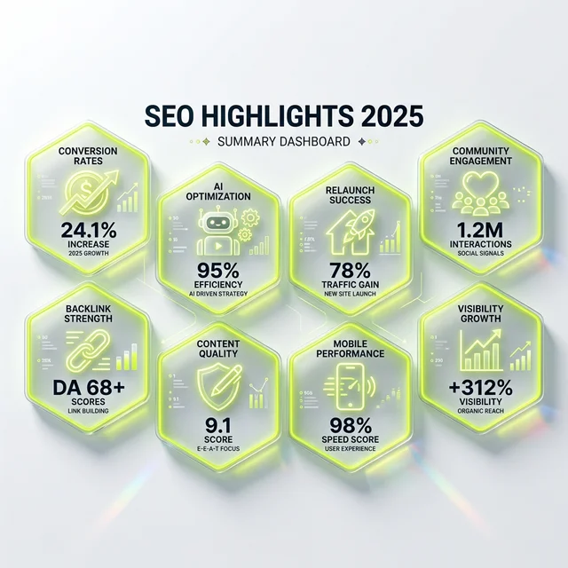

Hier sind meine persönlichen LinkedIn-Highlights – die Posts, die die Gemüter erhitzt haben, die Themen, die mich nachts wachgehalten haben, und natürlich auch die Momente, in denen wir einfach nur gelacht haben.

<figure class="my-8 bg-neutral-50 border border-neutral-200 p-6 md:p-8 rounded-2xl shadow-sm">
  

    
    

      <h4 class="font-bold text-base md:text-lg text-dark mb-0">Jörg Zimmer</h4>
      
Senior SEO & AI Search Consultant

    

  

  <blockquote class="text-base md:text-lg text-dark leading-relaxed italic border-l-4 border-lime-accent pl-4 my-4 font-normal">
    „Ein ehrlicher Jahresrückblick tut manchmal weh. Aber genau aus den Relaunch-Pannen und Daten-Shifts von 2025 bauen wir das robuste Fundament für die AI-Search-Ära 2026.“
  </blockquote>
  <figcaption class="mt-4 pt-3 border-t border-neutral-200/60 flex flex-wrap items-center justify-between gap-2 text-xs text-neutral-500">
    Experten-Zitat • <cite class="not-italic font-semibold text-neutral-700">Jörg Zimmer</cite>
    <a href="https://www.linkedin.com/in/joerg-zimmer-seo-sea-freelancer-berlin-spandau/" target="_blank" rel="noopener noreferrer" class="font-bold text-lime-700 hover:underline inline-flex items-center gap-1">
      Jörg Zimmer auf LinkedIn folgen →
    </a>
  </figcaption>
</figure>

## Ein Jahr in Posts: Meine persönlichen Meilensteine

### 1. Das Drama um die Stundensätze: "Freelancer unter 100€"

Das war der Moment, in dem ich mir keine Freunde in der "Billig-Schiene" gemacht habe. Ich hab mich beschwert. Laut. Deutlich. Und ja, auch ein bisschen emotional. Warum? Weil SEO-Freelancer, die für 50€ oder 70€ pro Stunde arbeiten, sich selbst und die gesamte Branche unter Wert verkaufen. 

Wer 25 Jahre Erfahrung hat, wer hunderte Relaunches begleitet hat, wer technische Audits im Schlaf macht – der darf nicht zum Preis eines Fliesenlegers (nichts gegen Fliesenleger!) arbeiten. Die Diskussion war lebhaft, um es vorsichtig auszudrücken. Aber am Ende blieb hängen: Qualität hat ihren Preis. Und wer billig kauft, kauft meistens zweimal (oder verliert seine Rankings).

### 2. Der Aufstieg des AI-Trackings: Rankscale im Fokus

2025 war das Jahr, in dem wir aufhören mussten, nur klassische Rankings zu zählen. Mit <a href="https://rankscale.ai/?via=offer" target="_blank" rel="noopener noreferrer nofollow sponsored">Rankscale (Partnerlink)</a> kam einer der ersten Tracker auf den Markt, der wirklich ernsthaft die Sichtbarkeit in 17 verschiedenen LLMs (Large Language Models) gemessen hat. Mehr zu diesen Systemen findest du in unserer Analyse [Top 9 AI Visibility Tools](/blog/top-9-ai-visibility-tools/) sowie im Leitfaden [Generative Engine Optimization (GEO)](/blog/generative-engine-optimization-geo/).

Ich hab das Tool vorgestellt und die Community war gespalten. Die einen sagten: "Endlich Daten für die neue Welt!" Die anderen: "Wir können doch nicht für jede KI einzeln optimieren!" Es war der Startschuss für eine neue Ära des Monitorings. Wir tracken heute nicht mehr nur Position 1 auf Google, sondern die Wahrscheinlichkeit, von einer KI als Top-Lösung empfohlen zu werden.

### 3. Mein ewiges Relaunch-Meme

Ehrlich, ich dachte irgendwann wird es langweilig. Aber nein. Jedes Mal, wenn ich das Meme "Wie ein Relaunch geplant ist vs. wie er läuft" poste, explodiert die Interaktionsrate. Warum? Weil es die bittere Realität widerspiegelt. 

Ein Relaunch ohne SEO ist wie ein Hausbau ohne Architekt: Man merkt erst am Ende, dass man die Tür vergessen hat. Ich werde es auch 2026 weiter posten. Als Warnung, als Mahnung und als kleines Trostpflaster für alle SEO-Feuerwehrmänner da draußen.

### 4. SEO aus einfachsten Verhältnissen: Eine persönliche Story

Vielleicht mein wichtigster Post 2025. Ich hab mal die Hosen runtergelassen und über meinen Weg in diese schräge Internet-Welt geschrieben. Ohne glitzerndes Studium an einer Elite-Uni, ohne den klassischen Agentur-Background als Junior-Trainee. 

Einfach reingefallen, hängengeblieben, Blut geleckt und seit über 25 Jahren dabei – mehr zu diesem Werdegang erzähle ich auch in [SEO Persönlich: Mein Interview im SEOpresso Podcast](/blog/seopresso-seo-persoenlich-interview/). Die Resonanz war überwältigend. Es zeigte mir: Die Leute wollen keine polierten Lebensläufe. Sie wollen Menschen mit Ecken, Kanten und echter Leidenschaft für das Handwerk.

### 5. Die SEO-Feuerwehr: Wenn die Panik regiert

Ein Kunde rief an. Stimme zittrig. Die Rankings brachen ein, der Shop-Umsatz war im freien Fall. "Jörg, hilf uns!" – Ich kam, sah und fand das Problem innerhalb von zwei Stunden. Es war ein klassischer technischer Fehler nach einem Update, der die Indexierung blockierte. Genau für solche Fälle biete ich meine [SEO-Sprechstunde](/blog/seo-sprechstunde-erklaert/) an – live am Screen und ohne 50-Seiten-PDF. Wie effektiv das ist, zeigt auch das Kundenfeedback unter [Was Kunden über die SEO-Sprechstunde sagen](/blog/seo-sprechstunde-bewertung-ronny/).

Solche Momente sind das Salz in der Suppe. Es ist der Beweis, dass Erfahrung durch nichts zu ersetzen ist. Keine KI dieser Welt hätte diesen spezifischen Fehler im Kontext des Geschäftsmodells so schnell diagnostiziert und gelöst.

### 6. Mein Appell an die SEO-Szene: Zusammenhalt statt Ellenbogen

In einer Branche, die oft von Egos und "Ich weiß es besser"-Attitüden geprägt ist, habe ich einen Aufruf gewagt: Mehr Zusammenarbeit, mehr Austausch, weniger Missgunst. Wir kämpfen alle gegen die gleichen Algorithmen, nicht gegeneinander.

Die Rückmeldungen von Kollegen waren großartig. Es entstanden neue Stammtische, kleine Mastermind-Gruppen und ein Spirit, den ich so in über 25 Jahren selten erlebt habe. Das macht Mut für die Zukunft.

### 7. Der Döner-Post: Prioritäten setzen

Ja, ich habe offiziell Werbung für meinen Lieblings-Döner gemacht. Weil guter Döner im Leben eines SEOs manchmal wichtiger ist als der perfekte PageSpeed-Score. Wer das anders sieht: Fight me! Wir brauchen alle unsere Kraftquellen, und meine ist eben ein richtig guter Dönerback. Der Post hat bewiesen: Wir sind alles nur Menschen.

### 8. LinkedIn-Stammtisch: Der Algorithmus-Talk

Mein Vortrag beim SEO-Stammtisch über den LinkedIn-Algorithmus. Was funktioniert wirklich? Warum bringt Viralität oft gar nichts, wenn die Leads nicht stimmen? Warum dieses Thema die Branche bewegt, beleuchte ich auch unter [LinkedIn SEO: Das Experten-Forum nutzen](/blog/linkedin-ist-ein-forum-seo/).

### Tacheles am Ende: Danke für die Reise

Dieses Jahr wäre ohne euch nur halb so spannend gewesen. Danke für jede kritische Nachfrage, danke für jedes "Guter Punkt!" und danke für die vielen Nachrichten in meinem Postfach. Besonders die, die anfingen mit: "Jörg, ich hab da mal ne Frage..."

Wir haben 2025 bewiesen, dass SEO lebendiger ist als je zuvor. Wir haben uns angepasst, wir haben gelernt und wir sind gewachsen. Auf ein noch wilderes, spannenderes und erfolgreiches 2026! Lasst uns die KIs zähmen und die Rankings rocken.

<!-- CTA Box -->

  <h3 class="text-xl md:text-2xl font-bold text-white mb-3 !mt-0 !border-none !pb-0">
    Jetzt an der Diskussion teilnehmen
  </h3>
  

    Diskutiere mit Jörg Zimmer und der SEO-Community auf LinkedIn über diesen Beitrag.
  

  <a href="https://www.linkedin.com/posts/joerg-zimmer-seo-sea-freelancer-berlin-spandau_highlights-2025-seo-rückblick-activity-7278772863925700608-P_2C" target="_blank" rel="noopener noreferrer" class="btn-primary">
    <svg class="w-4 h-4 fill-current" viewBox="0 0 24 24"><path d="M20.447 20.452h-3.554v-5.569c0-1.328-.027-3.037-1.852-3.037-1.853 0-2.136 1.445-2.136 2.939v5.667H9.351V9h3.414v1.561h.046c.477-.9 1.637-1.85 3.37-1.85 3.601 0 4.267 2.37 4.267 5.455v6.286zM5.337 7.433c-1.144 0-2.063-.926-2.063-2.065 0-1.138.92-2.063 2.063-2.063 1.14 0 2.064.925 2.064 2.063 0 1.139-.925 2.065-2.064 2.065zm1.782 13.019H3.555V9h3.564v11.452zM22.225 0H1.771C.792 0 0 .774 0 1.729v20.542C0 23.227.792 24 1.771 24h20.451C23.2 24 24 23.227 24 22.271V1.729C24 .774 23.2 0 22.222 0h.003z"/></svg>
    Beitrag auf LinkedIn öffnen
    →
  </a>

