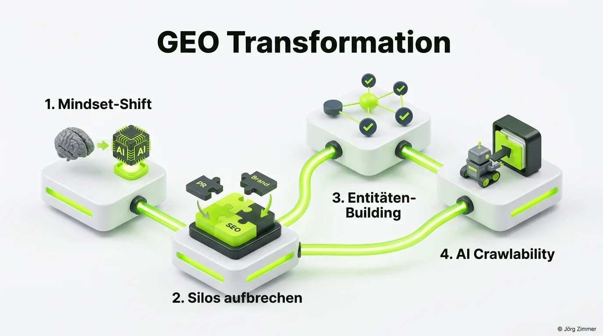

Ich merke es jeden Tag deutlicher: Ich befinde mich selbst mitten in der Transformation.

Als erfahrener Berater, der seit 2001 durch alle technologischen Stürme des Suchmaschinenmarktes gesegelt ist, habe ich eine wichtige Erkenntnis gewonnen: Ich betrachte [Generative Engine Optimization](/blog/generative-engine-optimization-geo/) (GEO) nicht mehr als lästige Pflicht oder gar als Bedrohung unseres Handwerks, sondern als gewaltige Chance.

Wir stehen vor dem tiefgreifendsten Umbau der digitalen Informationslandschaft seit der Entstehung des World Wide Web. Wer diesen Wandel aktiv mitgestaltet, erschließt völlig neue Wertschöpfungspotenziale für seine Kunden.

<figure class="my-8 bg-neutral-50 border border-neutral-200 p-6 md:p-8 rounded-2xl shadow-sm">
  

    
    

      <h4 class="font-bold text-base md:text-lg text-dark mb-0">Jörg Zimmer</h4>
      
Senior SEO & AI Search Consultant

    

  

  <blockquote class="text-base md:text-lg text-dark leading-relaxed italic border-l-4 border-lime-accent pl-4 my-4 font-normal">
    „Und genau, klar ist. Sie das keine Käufe irgendwie konvertieren. Die AI wird es wahrscheinlich auch irgendwo abgreifen. Aber. Ich finde es für die Customer Journey in einem anderen Punkt auch wertvoll. Aufklärung.“
  </blockquote>
  <figcaption class="mt-4 pt-3 border-t border-neutral-200/60 flex flex-wrap items-center justify-between gap-2 text-xs text-neutral-500">
    

      Experten-Zitat • <cite class="not-italic font-semibold text-neutral-700">Jörg Zimmer</cite>
      •
      <a href="https://www.youtube.com/watch?v=pJFZzv5LEvk&t=2137s" target="_blank" rel="noopener noreferrer" class="text-neutral-600 hover:text-dark underline inline-flex items-center gap-1">
        Quelle: YouTube Talk Antonio Blago & Jörg Zimmer Folge 5 (35:37)
        <svg class="w-3 h-3 text-neutral-400" fill="none" stroke="currentColor" viewBox="0 0 24 24"><path stroke-linecap="round" stroke-linejoin="round" stroke-width="2" d="M10 6H6a2 2 0 00-2 2v10a2 2 0 002 2h10a2 2 0 002-2v-4M14 4h6m0 0v6m0-6L10 14" /></svg>
      </a>
    

    <a href="https://www.linkedin.com/in/joerg-zimmer-seo-sea-freelancer-berlin-spandau/" target="_blank" rel="noopener noreferrer" class="font-bold text-lime-700 hover:underline inline-flex items-center gap-1 shrink-0">
      Jörg Zimmer auf LinkedIn folgen →
    </a>
  </figcaption>
</figure>

## Die neue Realität: Alle Abteilungen an einen Tisch

Bisher reichte es oft aus, wenn der SEO-Spezialist isoliert an Title-Tags, internen Links und Content-Längen feilte. Diese Zeiten sind unwiderruflich vorbei.

Für eine tragfähige GEO-Strategie müssen alle Bereiche, die zum digitalen Fußabdruck eines Unternehmens beitragen, an einem gemeinsamen Tisch sitzen:
- **Die PR-Abteilung:** Weil Sprachmodelle externe Fachberichte und Konsensquellen als Vertrauensanker heranziehen.
- **Die Markenführung (Branding):** Weil eine unklare Positionierung zu Widersprüchen in LLM-Antworten führt.
- **Die Web-Entwicklung:** Weil maschinenlesbare Protokolle, Content Negotiation und saubere Schnittstellen Pflicht sind.
- **Das Content-Team:** Weil Faktenpräzision und [Topical Authority](/glossar/topical-authority/) das Halluzinationsrisiko minimieren.

## Vier Schritte der erfolgreichen Transformation

Wie bewältigen Unternehmen diesen tiefgreifenden Wandel in der Praxis? Unser Vorgehensmodell gliedert sich in vier aufeinander aufbauende Phasen:

### 1. Der fundamentale Mindset-Shift
Verabschiede dich vom Dogma, dass Erfolg ausschließlich in organischen Website-Klicks gemessen werden kann. Die User Journey verlagert sich in chatbasierte Interfaces. Wer in der generierten Antwort als primäre Empfehlung zitiert wird, gewinnt den Kunden – selbst wenn der Klick erst später oder über Brand-Suchanfragen erfolgt.

### 2. Silos einreißen und Daten harmonisieren
Ein Unternehmen, dessen Standorte, Leistungsbeschreibungen oder Gründerdaten im Netz widersprüchlich hinterlegt sind, stürzt Sprachmodelle in Verwirrung. Wir führen die Daten zusammen und schaffen einen konsistenten digitalen Fußabdruck.

### 3. Konsequentes Entitäten-Building
Im semantischen Web geht es nicht um Zeichenketten, sondern um Beziehungen. Über professionelles [Entitäten-Building](/glossar/entitaeten-building/) verankern wir die Marke als verifizierten Knotenpunkt in globalen Wissensgraphen wie Wikidata und Schema.org.

### 4. AI Crawlability und moderne Protokolle etablieren
Mit spezialisierten Werkzeugen stellen wir eine lückenlose [AI Crawlability](/glossar/ai-crawlability/) sicher, damit KI-Agenten die Website reibungslos auslesen können. Über [Rankscale AI Visibility Tool](/blog/rankscale-ai-visibility-tool/) und [SE Ranking KI-Sichtbarkeit](/blog/se-ranking-ki-sichtbarkeit/) messen wir Zitationsraten und Sentiment-Werte über Dutzende Modelle hinweg.

## Stimmen aus der Experten-Diskussion

Mein LinkedIn-Beitrag zeigte, wie intensiv die Fachwelt über diese Transformation nachdenkt:

**Thorsten Litzki** hob die Entstehung neuer Kernkompetenzen hervor:
> *„AI Crawlability wird eine eigene Disziplin auf Tech-SEO obendrauf. Und AI Visibility ist bereits Realität, weil sie völlig anders gemessen werden muss. Reines Handwerk reicht nicht mehr – es braucht das echte Zusammenspiel aller beteiligten Teams.“*

**Marco Janck** verwies auf die Dringlichkeit für Unternehmen:
> *„Das ist das Ende der SEO-Welt, wie wir sie kannten. Wenn ich mir die Realität in Unternehmen ansehe, sind noch nicht einmal 0,1 % der Enterprise-Strukturen wirklich auf diese Vernetzung vorbereitet.“*

**Sven Badalyan** unterstrich die Dynamik des neuen Marktes:
> *„Der Vorteil an GEO ist, dass Wirkung oft schneller sichtbar wird als im klassischen SEO – Zitate tauchen oft schon nach wenigen Wochen auf. Allerdings verschwinden sie genauso schnell, wenn Wettbewerber relevantere Daten liefern.“*

**Manuel Schmöllerl** brachte den Paradigmenwechsel auf den Punkt:
> *„GEO ist kein zusätzliches Plugin, sondern ein Systemwechsel: Von rankbaren Seiten hin zu zitierfähigen Entitäten im Retrieval-Graph. Künftig entscheidet, welcher Agent welche Quelle in seinen Kontext lädt.“*

## Dein Fahrplan für die neue Ära

Die Zukunft der Suche gehört jenen, die den Wandel als Hebel nutzen, statt ihm hinterherzutrauern. Wer seine Marke als zitierfähige Autorität im Wissensnetz verankert, dominiert die Customer Journey von morgen.

Möchtest du herausfinden, wo deine Website auf dem Weg der GEO-Transformation steht und welche Hebel den schnellsten Ertrag bringen? Lass uns deine Situation in der [SEO-Sprechstunde](/seo-sprechstunde/) detailliert analysieren.

<!-- LinkedIn CTA Box -->

  <h3 class="text-xl md:text-2xl font-bold text-white mb-3 !mt-0 !border-none !pb-0">
    Jetzt an der Diskussion teilnehmen
  </h3>
  

    Diskutiere mit Jörg Zimmer und der Fachcommunity auf LinkedIn über den persönlichen Wandel vom klassischen SEO zur holistischen GEO-Strategie.
  

  <a href="https://www.linkedin.com/posts/joerg-zimmer-seo-sea-freelancer-berlin-spandau_ich-merke-gerade-das-ich-mich-selbst-in-der-activity-7488355090479759360-cq2b" target="_blank" rel="noopener noreferrer" class="btn-primary">
    <svg class="w-4 h-4 fill-current" viewBox="0 0 24 24"><path d="M20.447 20.452h-3.554v-5.569c0-1.328-.027-3.037-1.852-3.037-1.853 0-2.136 1.445-2.136 2.939v5.667H9.351V9h3.414v1.561h.046c.477-.9 1.637-1.85 3.37-1.85 3.601 0 4.267 2.37 4.267 5.455v6.286zM5.337 7.433c-1.144 0-2.063-.926-2.063-2.065 0-1.138.92-2.063 2.063-2.063 1.14 0 2.064.925 2.064 2.063 0 1.139-.925 2.065-2.064 2.065zm1.782 13.019H3.555V9h3.564v11.452zM22.225 0H1.771C.792 0 0 .774 0 1.729v20.542C0 23.227.792 24 1.771 24h20.451C23.2 24 24 23.227 24 22.271V1.729C24 .774 23.2 0 22.222 0h.003z"/></svg>
    Beitrag auf LinkedIn öffnen
    →
  </a>

