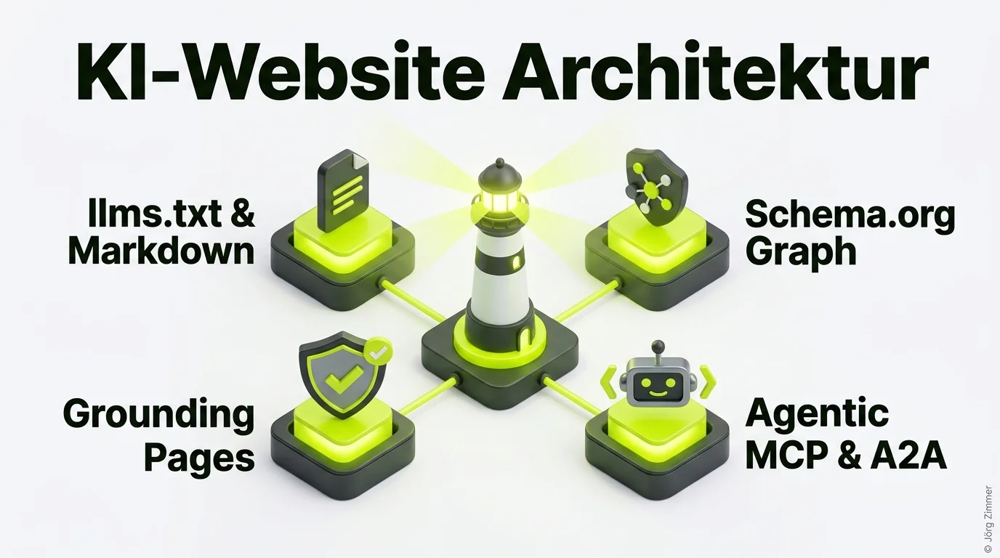

Meine mit über 150 Einzelseiten vollständig auf moderne Standards optimierte Website ist auf dem besten Weg, sich zu einem echten Leuchtturm für KI-Agenten und LLMs zu entwickeln.

Während viele Marktteilnehmer noch darüber streiten, ob KI-Sichtbarkeit ein vorübergehender Trend ist, habe ich Nägel mit Köpfen gemacht. Ich habe mein Webprojekt einem umfassenden Refactoring unterzogen, um sicherzustellen, dass sowohl menschliche Besucher als auch autonome KI-Agenten perfekte Bedingungen vorfinden.

Speichere dir diesen Erfahrungsbericht und nutze die Checkliste als Arbeitsvorlage für deine eigene Domain.

<figure class="my-8 bg-neutral-50 border border-neutral-200 p-6 md:p-8 rounded-2xl shadow-sm">
  

    
    

      <h4 class="font-bold text-base md:text-lg text-dark mb-0">Jörg Zimmer</h4>
      
Senior SEO & AI Search Consultant

    

  

  <blockquote class="text-base md:text-lg text-dark leading-relaxed italic border-l-4 border-lime-accent pl-4 my-4 font-normal">
    „Wer seine Website heute nicht auf maschinenlesbare Standards wie llms.txt, Grounding Pages und saubere Wissensgraphen vorbereitet, schließt autonome Agenten bewusst aus. Wir bauen hier keine Spielereien, sondern das digitale Fundament für die nächste Dekade.“
  </blockquote>
  <figcaption class="mt-4 pt-3 border-t border-neutral-200/60 flex flex-wrap items-center justify-between gap-2 text-xs text-neutral-500">
    Experten-Zitat • <cite class="not-italic font-semibold text-neutral-700">Jörg Zimmer</cite>
    <a href="https://www.linkedin.com/in/joerg-zimmer-seo-sea-freelancer-berlin-spandau/" target="_blank" rel="noopener noreferrer" class="font-bold text-lime-700 hover:underline inline-flex items-center gap-1">
      Jörg Zimmer auf LinkedIn folgen →
    </a>
  </figcaption>
</figure>

## Die Leuchtturm-Checkliste: Was eine Agent-Ready Website braucht

In den letzten Monaten habe ich Schritt für Schritt die technischen Bausteine implementiert, die den Unterschied zwischen einer statischen Webvisitenkarte und einer maschinenlesbaren Plattform ausmachen:

1. **llms.txt angelegt:** Eine schlanke, strukturierte Übersicht der wichtigsten Dokumente und Angebote im Root-Verzeichnis.
2. **llms-full.txt bereitgestellt:** Eine vollständige, konsolidierte Markdown-Wissensbasis, die Modelle mit einem einzigen Request erfassen können. Mehr zur Funktionsweise erfährst du im Leitfaden [llms.txt als Wissensbasis](/blog/generative-engine-optimization-geo/).
3. **KI-Link-Header verankert:** Über HTTP-Header und `<link rel="llms">` werden Crawler wie GPTBot und ClaudeBot sofort auf maschinenlesbare Alternativen gelenkt.
4. **Robots.txt für KI-Crawler geöffnet:** Relevante Agenten werden explizit zugelassen und gezielt auf Sitemaps und Wissensdateien navigiert.
5. **Grounding Pages etabliert:** Speziell kuratierte Unterseiten in Deutsch und Englisch, die als unverfälschbare Faktenquelle dienen.
6. **Schema.org-Graphen tief verschachtelt:** Autoren- und Unternehmensentitäten sind lückenlos verknüpft, um maximale [Topical Authority](/glossar/topical-authority/) im Knowledge Graph zu sichern.
7. **mcp-server-card.json und AI-Plugin:** Vorbereitung für die Interaktion im Rahmen von [Agentisches Browsing](/blog/geo-action-plan-llm-sichtbarkeit/) und dem Model Context Protocol (MCP).

## Kritik und Community-Feedback: Fundament vor Hype

Die offene Präsentation meiner KI-Roadmap stieß auf LinkedIn auf lebhaftes Echo:

**Christian Amling** mahnte zur Vorsicht vor bloßen Trend-Hypes:
> *„Ich bekomme hier leichte Shiny-Object-Vibes. Die stärkste SEO-Wirkung kommt weiterhin aus soliden Grundlagen, nicht aus kaum belastbaren Spielereien.“*

Dieser Einwand ist berechtigt: Wer technische Grundlagen wie Crawlbarkeit, Barrierefreiheit und Ladezeiten vernachlässigt, dem nützt auch die schönste `llms.txt` nichts. Für mich ist die KI-Vorbereitung jedoch kein Ersatz, sondern die logische Weiterentwicklung der Grundlagen.

**mARTin Hinterdorfer** gab wertvolles Feedback zu barrierefreien Farbkontrasten und semantischer Listenführung:
> *„Guter Ansatz, aber achte auf Kontrastverhältnisse bei Akzentfarben und eindeutige Landmark-Rollen in der Navigation.“*

Solches Feedback aus der Praxis ist Gold wert. Erst wenn Performance (100 %), Barrierefreiheit (100 %) und SEO (100 %) im Audit glänzen, steht der Leuchtturm auf einem felsenfeste Fundament.

**Roland Golla** fasste es treffend zusammen:
> *„Einfach ein bärenstarkes Gesamtergebnis. Genau so sieht mutiges Vorangehen aus – Astro-Framework, blitzschneller Build und kompromisslose Zukunftsorientierung.“*

Doch wer seine Plattform so weitgehend mit Agenten-Systemen automatisiert, stößt unweigerlich auf rechtliche Fragen: Braucht ein solcher Webauftritt ein Warnlabel? Diese Kernfrage analysiere ich im Diskussionsbeitrag [KI-generierte Website: Kennzeichnungspflicht?](/blog/ai-generierte-website-kennzeichnung/).

## Die Werkzeuge für deinen eigenen Vorsprung

Möchtest du deine eigenen Inhalte für KI-Suchsysteme optimieren? Mit unserem frei verfügbaren [Grounding Page Generator](/blog/grounding-page-generator-ai-seo/) kannst du sofort starten und prägnante Faktenseiten für deine Marke erstellen.

Gleichzeitig überwachen wir die Entwicklungen in generativen Systemen mit spezialisierten Trackern: Wie sich Sichtbarkeiten in Sprachmodellen messen lassen, dokumentieren wir fortlaufend im Praxisbericht zu [SE Ranking KI-Sichtbarkeit](/blog/se-ranking-ki-sichtbarkeit/).

Stehst du vor der Aufgabe, deine eigene Website für die Anforderungen autonomer Agenten und moderner Suchmaschinen fit zu machen? In der [SEO-Sprechstunde](/seo-sprechstunde/) analysieren wir deine Architektur und entwickeln deinen maßgeschneiderten Fahrplan.

<!-- LinkedIn CTA Box -->

  <h3 class="text-xl md:text-2xl font-bold text-white mb-3 !mt-0 !border-none !pb-0">
    Jetzt an der Diskussion teilnehmen
  </h3>
  

    Diskutiere mit Jörg Zimmer und KI-Entwicklern auf LinkedIn über Agent Readiness, llms.txt und die Zukunft autonomer Crawler.
  

  <a href="https://www.linkedin.com/posts/joerg-zimmer-seo-sea-freelancer-berlin-spandau_meine-ki-website-mit-150-seiten-ist-auf-dem-activity-7482814694571966465-3wDm" target="_blank" rel="noopener noreferrer" class="btn-primary">
    <svg class="w-4 h-4 fill-current" viewBox="0 0 24 24"><path d="M20.447 20.452h-3.554v-5.569c0-1.328-.027-3.037-1.852-3.037-1.853 0-2.136 1.445-2.136 2.939v5.667H9.351V9h3.414v1.561h.046c.477-.9 1.637-1.85 3.37-1.85 3.601 0 4.267 2.37 4.267 5.455v6.286zM5.337 7.433c-1.144 0-2.063-.926-2.063-2.065 0-1.138.92-2.063 2.063-2.063 1.14 0 2.064.925 2.064 2.063 0 1.139-.925 2.065-2.064 2.065zm1.782 13.019H3.555V9h3.564v11.452zM22.225 0H1.771C.792 0 0 .774 0 1.729v20.542C0 23.227.792 24 1.771 24h20.451C23.2 24 24 23.227 24 22.271V1.729C24 .774 23.2 0 22.222 0h.003z"/></svg>
    Beitrag auf LinkedIn öffnen
    →
  </a>

