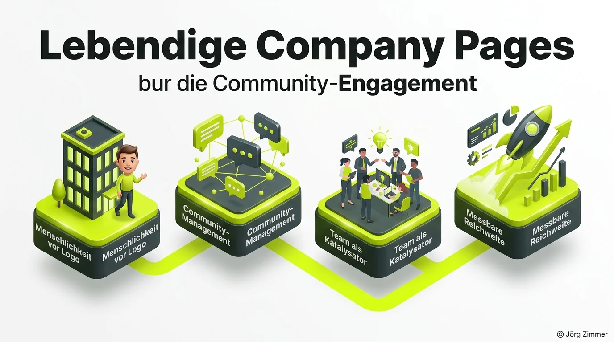

„Company Pages auf LinkedIn sind mausetot. Null Reichweite, kein Engagement, reine Zeitverschwendung.“

Diesen Satz hört man in Marketing-Etagen und auf Konferenzen fast wöchentlich. Viele Social-Media-Teams resignieren: Sie investieren Stunden in Grafiken, planen Beiträge im Vorfeld minutiös ein – und ernten am Ende zwei verirrte Likes von internen Kollegen.

Doch das Problem liegt nicht am Algorithmus von LinkedIn. Das Problem liegt am falschen Verständnis des Kanals: **Post and Pray funktioniert nicht.** Wer ein Unternehmensprofil wie eine Einbahnstraße betreibt, wird von der Community konsequent ignoriert.

Im [Freelancer Team](/blog/freelancer-team-spirit-events/) haben wir den Praxistest gewagt und bewiesen, wie man eine Company Page zu ungeahnter Lebendigkeit erweckt.

<figure class="my-8 bg-neutral-50 border border-neutral-200 p-6 md:p-8 rounded-2xl shadow-sm">
  

    
    

      <h4 class="font-bold text-base md:text-lg text-dark mb-0">Jörg Zimmer</h4>
      
Senior SEO & AI Search Consultant

    

  

  <blockquote class="text-base md:text-lg text-dark leading-relaxed italic border-l-4 border-lime-accent pl-4 my-4 font-normal">
    „Unternehmensseiten auf LinkedIn sterben nicht an algorithmischer Benachteiligung, sondern an gähnender Langeweile und postalischer Einsamkeit. Wer agiert wie ein lebendiger Mensch und konsequenten Dialog führt, weckt jede Company Page aus dem Dornröschenschlaf.“
  </blockquote>
  <figcaption class="mt-4 pt-3 border-t border-neutral-200/60 flex flex-wrap items-center justify-between gap-2 text-xs text-neutral-500">
    Experten-Zitat • <cite class="not-italic font-semibold text-neutral-700">Jörg Zimmer</cite>
    <a href="https://www.linkedin.com/in/joerg-zimmer-seo-sea-freelancer-berlin-spandau/" target="_blank" rel="noopener noreferrer" class="font-bold text-lime-700 hover:underline inline-flex items-center gap-1">
      Jörg Zimmer auf LinkedIn folgen →
    </a>
  </figcaption>
</figure>

## Die harten Zahlen: Was passiert, wenn man interagiert

Statt Hochglanz-Broschüren zu posten, haben wir konsequent professionelles [Social Media Community Management](/glossar/social-media-community-management/) etabliert. Wir haben unter Beiträgen anderer Fachleute mitdiskutiert, Fragen beantwortet und Fachkollegen aktiv zu Wort kommen lassen.

Das Ergebnis unseres Experiments innerhalb weniger Monate:
- **Über 72.900 Impressionen** rein organisch erzielt.
- **Mehr als 1.760 echte Interaktionen** in den Kommentarsträngen.
- **Über 670 hochqualifizierte neue Follower** aus der Zielgruppe gewonnen.

Wenn du [LinkedIn als Forum](/blog/linkedin-ist-ein-forum-seo/) begreifst und nicht als Werbetafel, ändert sich die Resonanz schlagartig.

## Das 4-Säulen-Modell für aktive Company Pages

Wie gelingt der Wandel von der Geisterstadt zur pulsierenden Fach-Community? Die Strategie stützt sich auf vier fundamentale Pfeiler:

### 1. Menschlichkeit statt kaltem Firmenlogo
Niemand unterhält sich gern mit einem anonymen Vektor-Logo. Gib der Unternehmensseite eine erkennbare Stimme. Nutze eine persönliche, direkte Tonalität und zeige die Köpfe, die für die Marke arbeiten.

### 2. Aktives Community-Management vor und nach dem Posten
Der Job beginnt nicht mit dem Klick auf „Veröffentlichen“ – dort fängt er erst an. Wer in den ersten 60 Minuten nach dem Veröffentlichen auf Kommentare antwortet, Zwischenfragen stellt und Diskussionen moderiert, signalisiert dem Algorithmus hohe Relevanz.

### 3. Das Team als Multiplikator und Katalysator
Eine Unternehmensseite kann das Lagerfeuer sein, an dem sich Mitarbeiter und Partner versammeln. Wenn das eigene Team Beiträge teilt und kommentiert, entsteht die initiale kinetische Energie, die den Post in fremde Feeds spült.

### 4. Messbare Dialogtiefe statt reiner Reichweiten-Jagd
Klicks und Impressionen sind wertlos, wenn keine echten Anfragen entstehen. Ziel muss es sein, aus öffentlichen Diskussionen konkrete geschäftliche Kontakte und Vertrauen aufzubauen, was direkt auf die [Topical Authority](/glossar/topical-authority/) deiner Marke einzahlt.

## Stimmen aus der LinkedIn-Fachcommunity

Unser Praxisbericht löste eine intensive Debatte unter Marketing-Profis aus:

**Andrea Lechler** brachte es humorvoll auf den Punkt:
> *„Genauso ist es. Niemand interessiert sich für ein Unternehmen, das wie ein verlassenes Schaufenster wirkt. Das Profil des Freelancer Teams wirkt dagegen extrem lebendig.“*

**Sybille Kunzelmann** hob die Katalysator-Funktion hervor:
> *„Ein hervorragendes Beispiel dafür, dass es auf Interaktion ankommt. Gerade bei größeren Organisationen dient die Company Page als Katalysator, der die Einzelstimmen des Teams bündelt und verstärkt.“*

**Jörg Schimke** stellte die provokante Frage, ob Company Pages und SEO nun im selben Boot sitzen. Die Antwort lautet: Absolut – beide Disziplinen florieren heute durch exzellente Nutzerführung und authentische [Community](/blog/wir-seos-sind-schuld-community/).

## Was bedeutet das für deine Marketing-Strategie?

Wer heute Sichtbarkeit aufbauen will – egal ob bei Google, in KI-Antworten oder auf LinkedIn –, muss den Fokus von der bloßen Produktion auf echte Kundenbeziehungen verlagern.

Suchst du nach Wegen, deine digitale Markenpräsenz strategisch zu verzahnen? In der [SEO-Sprechstunde](/seo-sprechstunde/) analysieren wir, wie du organische Suche und soziale Touchpoints zu einem unschlagbaren System verbindest.

<!-- LinkedIn CTA Box -->

  <h3 class="text-xl md:text-2xl font-bold text-white mb-3 !mt-0 !border-none !pb-0">
    Jetzt an der Diskussion teilnehmen
  </h3>
  

    Diskutiere mit Jörg Zimmer und dem Freelancer Team auf LinkedIn über Company Pages, Algorithmus-Mythen und effektives Community-Building.
  

  <a href="https://www.linkedin.com/posts/freelancer-team_linkedin-company-pages-ugcPost-7493255546414862336-ZaqO" target="_blank" rel="noopener noreferrer" class="btn-primary">
    <svg class="w-4 h-4 fill-current" viewBox="0 0 24 24"><path d="M20.447 20.452h-3.554v-5.569c0-1.328-.027-3.037-1.852-3.037-1.853 0-2.136 1.445-2.136 2.939v5.667H9.351V9h3.414v1.561h.046c.477-.9 1.637-1.85 3.37-1.85 3.601 0 4.267 2.37 4.267 5.455v6.286zM5.337 7.433c-1.144 0-2.063-.926-2.063-2.065 0-1.138.92-2.063 2.063-2.063 1.14 0 2.064.925 2.064 2.063 0 1.139-.925 2.065-2.064 2.065zm1.782 13.019H3.555V9h3.564v11.452zM22.225 0H1.771C.792 0 0 .774 0 1.729v20.542C0 23.227.792 24 1.771 24h20.451C23.2 24 24 23.227 24 22.271V1.729C24 .774 23.2 0 22.222 0h.003z"/></svg>
    Beitrag auf LinkedIn öffnen
    →
  </a>

