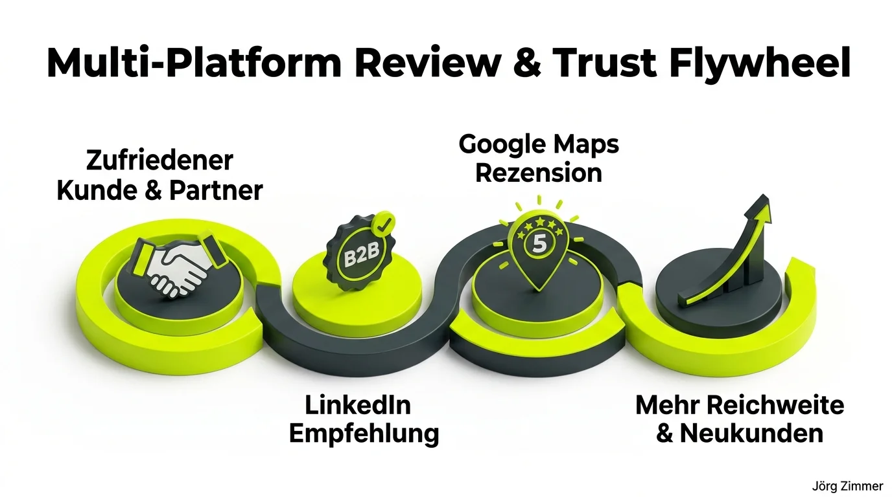

*Diese Diskussion wurde von mir auf LinkedIn am 14.07.2026 gestartet:*

  
💬 Jörgs SEO-Klartext (LinkedIn Insights)

  

  
Ich sammle Bewertungen in LinkedIn und in Google Maps.

  
Diese hier von Roland Golla freut mich besonders.

  
Schau dir gern alle weiteren in meinem LinkedIn Profil unten an.

  
Nutzt du das schon?

  

Kundenbewertungen und echte Testimonials sind im modernen Online-Marketing die härteste Währung überhaupt. Im Zeitalter generativer Sprachmodelle, in dem jeder beliebige Text in Sekundenschnelle künstlich erzeugt werden kann, sehnen sich Entscheider nach authentischen Vertrauensbeweisen.

Was viele Dienstleister und Freelancer jedoch sträflich vernachlässigen: die Verteilung der Vertrauenssignale. Wer sich ausschließlich auf eine Plattform stützt, vergibt enormes Potenzial für die organische Sichtbarkeit und Conversion-Rate.

## Das Multi-Plattform Review & Trust Flywheel

Ein strukturierter Reputationsaufbau funktioniert wie ein sich selbst verstärkender Kreislauf. Zufriedene Kunden sind fast immer bereit, ihre positiven Erfahrungen zu teilen – man muss ihnen nur die Steine aus dem Weg räumen.

Der Hebel liegt im sogenannten Vier-Stufen-Flywheel:

1. **Zufriedener Kunde & Projektpartner**: Am Ende eines erfolgreichen Projekts oder nach einer intensiven Beratung ist die Begeisterung am höchsten. Das ist der optimale Zeitpunkt für die Feedback-Anfrage.
2. **LinkedIn Empfehlung (B2B Authority)**: Der Kunde bestätigt deine Expertise öffentlich mit seinem Klarnamen, seiner Position und seinem Unternehmensprofil. Das schafft maximale Glaubwürdigkeit für C-Level-Entscheider.
3. **Google Maps Rezension (Local Trust)**: Derselbe Text wird mit einem Klick auf Google Maps hinterlegt. Das signalisiert dem Google-Algorithmus reale Kundeninteraktionen und stärkt die [Local SEO Optimierung](/glossar/local-seo/).
4. **Mehr Reichweite & Neukunden**: Die Kombination aus starkem Local Pack Ranking und verifizierten LinkedIn-Testimonials senkt die Akquisitionskosten für künftige Aufträge drastisch.

## Vergleich: LinkedIn Empfehlungen vs. Google Maps Rezensionen

Beide Plattformen besitzen spezifische Stärken, die sich perfekt ergänzen:

| Bewertungs-Kriterium | LinkedIn Empfehlungen | Google Maps Rezensionen |
| :--- | :--- | :--- |
| **Primäre Zielgruppe** | B2B-Kunden, Entscheider, Kooperationspartner | Lokale Kunden, Suchende mit hoher Kaufabsicht |
| **Sichtbarkeit** | Direkt im LinkedIn-Profil & Newsfeed | Google Search, Google Maps, Local 3-Pack |
| **Profil-Verifikation** | 100 % Klarnamen mit verlinkter Historie | Google-Konto (oft privat, teils Pseudonyme) |
| **SEO-Relevanz** | Indirekt (Entity-Trust, Brand-Search) | Direkt (Hauptfaktor für lokale Rankings) |
| **Konversions-Effekt** | Baut Einwände im B2B-Sales-Funnel ab | Führt zu direkten Anrufen und Kontaktanfragen |
| **Aufwand für Rezensent** | ca. 2–3 Minuten | Sekundenschneller Copy-Paste-Vorgang |

## Die Community bestätigt: Das Copy-Paste-Prinzip funktioniert

Die Reaktionen aus dem Netzwerk zeigten eindrucksvoll, dass dieser pragmatische Ansatz in der Praxis längst zum Standard erfolgreicher Unternehmer gehört. Melanie fasste den Kern treffend zusammen:

  
💬 Melanie Aurich (LinkedIn Kommentar)

  

    
Mach ich auch so. Immer Bewertungen auf beiden Plattformen sammeln. Ist für den Kunden ja nur Copy-Paste.

  

Genau dieses Prinzip nimmt dem Kunden die Denkarbeit ab. Wenn der Text für die [SEO Feuerwehr-Rettung](/blog/seo-feuerwehr-rettung/) einmal steht, genügen zwei vorkonfigurierte Links in der E-Mail, um beide Kanäle gleichzeitig zu bedienen.

Auch Roland Golla, der mich mit seiner ausführlichen Empfehlung überrascht hatte, setzt auf diesen partnerschaftlichen Spirit:

  
💬 Roland Golla (LinkedIn Kommentar)

  

    
...das ist wirklich toll. Ich tausche gerne Bewertungen, gerne mit Text anschreiben 😃

  

Hier zeigt sich der echte [Zusammenhalt unter SEOs](/blog/wir-seos-zusammenhalt/): Man begegnet sich auf Augenhöhe, honoriert geleistete Unterstützung und stärkt sich gegenseitig den Rücken.

Die herzlichen Kommentare weiterer Branchenkollegen belegen, wie wertvoll solche gewachsenen Beziehungen sind:

  
💬 Andreas Absmeier (LinkedIn Kommentar)

  

    
Jörg Zimmer 🌻 ist eine Bank.

  

  
💬 ★ Andrea Lechler (LinkedIn Kommentar)

  

    
Bist ja auch n Guter. N sehr Guter!

  

  
💬 Britta Hänel (LinkedIn Kommentar)

  

    
Gratuliere. Da macht die Arbeit doch gleich noch mehr Spaß 🫶🏻

  

Wie nachhaltig sich ein solches Vertrauensfundament auszahlt, zeigte sich auch nach der [SEO-Sprechstunde mit Ronny](/blog/seo-sprechstunde-bewertung-ronny/): Eine fundierte Fünf-Sterne-Bewertung auf Google Maps zieht regelmäßig neue, hochqualifizierte Anfragen nach sich.

<figure class="my-8 bg-neutral-50 border border-neutral-200 p-6 md:p-8 rounded-2xl shadow-sm">
  

    
    

      <h4 class="font-bold text-base md:text-lg text-dark mb-0">Jörg Zimmer</h4>
      
Senior SEO & AI Search Consultant

    

  

  <blockquote class="text-base md:text-lg text-dark leading-relaxed italic border-l-4 border-lime-accent pl-4 my-4 font-normal">
    „Im Zeitalter generierter KI-Inhalte sind echte, verifizierte Kundenstimmen dein stärkstes Alleinstellungsmerkmal. Wer Kundenrezensionen nur auf einer Plattform sammelt, verschenkt die Hälfte seines Vertrauenskapitals.“
  </blockquote>
  <figcaption class="mt-4 pt-3 border-t border-neutral-200/60 flex flex-wrap items-center justify-between gap-2 text-xs text-neutral-500">
    Experten-Zitat • <cite class="not-italic font-semibold text-neutral-700">Jörg Zimmer</cite>
    <a href="https://www.linkedin.com/posts/joerg-zimmer-seo-sea-freelancer-berlin-spandau_ich-sammle-bewertungen-in-linkedin-und-in-activity-7482743013061017600-R_rG" target="_blank" rel="noopener noreferrer" class="font-bold text-lime-700 hover:underline inline-flex items-center gap-1">
      Diskussion auf LinkedIn ansehen →
    </a>
  </figcaption>
</figure>

## Praxistipps für deine Bewertungs-Strategie

Wenn du deine eigene Reputation systematisch ausbauen möchtest, helfen dir diese konkreten Schritte:

- **Direktlink vorbereiten**: Generiere den offiziellen Bewertungslink deines Google-Unternehmensprofils (Google Business Profile) und halte den Link zu deinen LinkedIn-Empfehlungen bereit.
- **Copy-Paste vorschlagen**: Schreibe dem Kunden nach getaner Arbeit: *„Wenn du zufrieden warst, freue ich mich riesig über eine kurze Bewertung auf LinkedIn. Gerne kannst du denselben Text auch mit einem Klick auf Google Maps hinterlegen.“*
- **E-E-A-T Signale stärken**: Wie du Rezensionen und Urheberschaft semantisch in deine Webpräsenz einbindest, erfährst du im [E-E-A-T Leitfaden](/glossar/e-e-a-t/).
- **Individuelles Feedback**: Möchtest du deine lokale und digitale Sichtbarkeit analysieren lassen? Dann buche jetzt deine persönliche [SEO Sprechstunde](/seo-sprechstunde/).

<!-- CTA Box -->

  LinkedIn Community Diskussion
  <h3 class="text-xl md:text-2xl font-bold text-white mb-3 !mt-0 !border-none !pb-0">
    Jetzt an der Diskussion teilnehmen
  </h3>
  

    Auf welchen Kanälen sammelst du Kundenstimmen und wie nutzt du Rezensionen für deinen Vertrauensaufbau? Diskutiere mit auf LinkedIn!
  

  <a href="https://www.linkedin.com/posts/joerg-zimmer-seo-sea-freelancer-berlin-spandau_ich-sammle-bewertungen-in-linkedin-und-in-activity-7482743013061017600-R_rG" target="_blank" rel="noopener noreferrer" class="btn-primary">
    <svg class="w-4 h-4 fill-current" viewBox="0 0 24 24"><path d="M20.447 20.452h-3.554v-5.569c0-1.328-.027-3.037-1.852-3.037-1.853 0-2.136 1.445-2.136 2.939v5.667H9.351V9h3.414v1.561h.046c.477-.9 1.637-1.85 3.37-1.85 3.601 0 4.267 2.37 4.267 5.455v6.286zM5.337 7.433c-1.144 0-2.063-.926-2.063-2.065 0-1.138.92-2.063 2.063-2.063 1.14 0 2.064.925 2.064 2.063 0 1.139-.925 2.065-2.064 2.065zm1.782 13.019H3.555V9h3.564v11.452zM22.225 0H1.771C.792 0 0 .774 0 1.729v20.542C0 23.227.792 24 1.771 24h20.451C23.2 24 24 23.227 24 22.271V1.729C24 .774 23.2 0 22.222 0h.003z"/></svg>
    Beitrag auf LinkedIn öffnen
    →
  </a>

