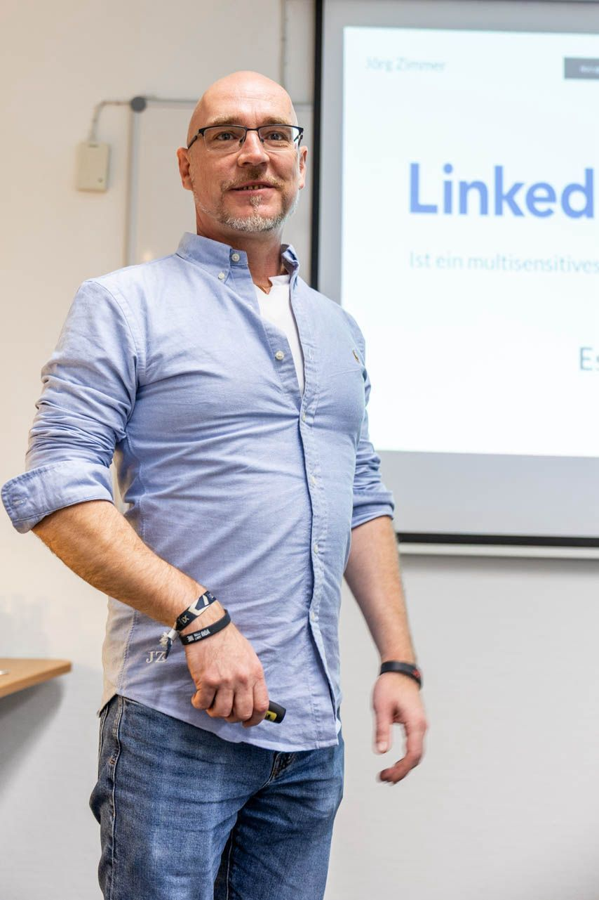
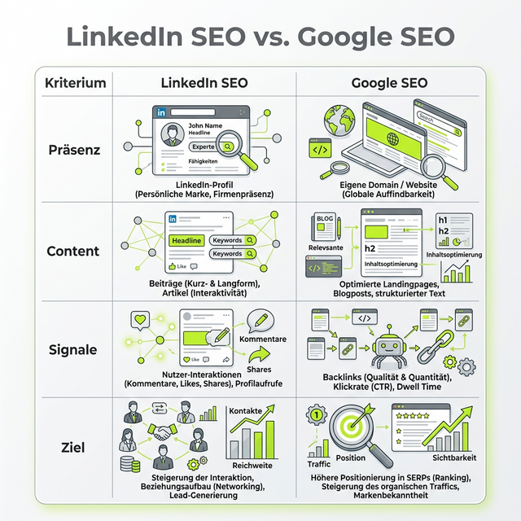
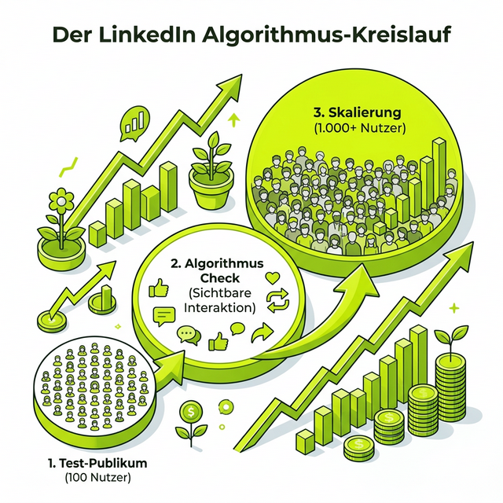

Moin!

Hast du dich auch schon mal gefragt, warum manche SEOs auf LinkedIn scheinbar mühelos hunderte Interaktionen einsammeln, während deine (inhaltlich vielleicht sogar besseren) Beiträge im digitalen Nirvana verpuffen? 

Ich war neulich beim SEO Stammtisch in Berlin – Grüße gehen raus an Carsten Appel für die top Organisation! – und habe dort genau darüber gesprochen: **LinkedIn ist kein soziales Netzwerk im klassischen Sinne (wie Instagram oder TikTok). Es ist ein Forum.** Und wir SEO-Spezialisten sollten es genau so nutzen. Jetzt!

Hier ist die nackte Wahrheit: Wer LinkedIn wie Google SEO versteht, gewinnt. Wer es nur als "Social Media" sieht, verbrennt Zeit. In diesem Deep Dive gehen wir die 13 Hauptpunkte aus meinem Vortrag durch und schauen uns an, wie du den Algo wirklich zum Fliegen bringst.

## 1. Dein Name ist die Domain, dein Profil eine Landingpage
Im Google SEO optimieren wir Domains. Auf LinkedIn bist **du** die Domain. Wenn jemand deinen Namen sieht, ist das der erste Touchpoint im "Search"-Prozess des Netzwerks. 

Dein Profil ist keine digitale Visitenkarte und auch kein Lebenslauf. Es ist eine **Landingpage**. Was ist das Ziel einer Landingpage? Conversion! Auf LinkedIn heißt das: Profilaufrufe und vernünftige Kontaktaufnahmen. 

> [!TIP]
> Vergiss die Likes. Likes zahlen keine Miete. Ein optimiertes Profil sorgt dafür, dass aus einem flüchtigen Leser ein potenzieller Kunde oder ein wertvoller Kontakt wird. 

## 2. LinkedIn SEO vs. Google SEO: Die Analogie
Um das Prinzip "LinkedIn als Forum" zu verstehen, hilft ein direkter Vergleich mit unserem täglichen Brot, dem Google SEO. 

Wer diese Analogien versteht, kann seine bestehenden SEO-Skills 1-zu-1 auf LinkedIn übertragen. Wir "crawlen" hier nicht nach Keywords, sondern nach Resonanz. Wie **Nele Dörk** in den Kommentaren treffend anmerkte: 
*"Rankingfaktoren liegen im Zusammenspiel von Vertrauen, Verweildauer und thematischer Tiefe."*

## 3. Lass den Affen raushängen: Wir sind Menschen
Einer der größten Fehler auf LinkedIn? Zu steif sein. Wir sind alle normale Menschen. Wir haben alle einen Alltag, Vorlieben und Macken. 

**"Wenn du gern über Döner schreibst, dann schreib über Döner SEO."**

Warum? Weil es nahbar macht. Authentizität schlägt Perfektion. Wenn du dich nur hinter Fachbegriffen versteckst, baust du keine Bindung auf. Ein Forum lebt von Charakteren, nicht von gesichtslosen Firmenlogos.

## 4. Die Macht des Algorithmus: Von 100 zu 1.000
Wie entscheidet LinkedIn eigentlich, wer was im Feed sieht? Es ist ein mehrstufiger Prozess. Ich nenne es den "Algorithmus-Kreislauf".

### Die 100er-Hürde
Wenn du einen Beitrag veröffentlichst, zeigt ihn LinkedIn zuerst einer kleinen Testgruppe (deiner Kern-Zielgruppe von ca. 100 Personen). Diese Gruppe besteht oft aus Leuten, mit denen du kürzlich interagiert oder gechattet hast.

### Der Algorithmus-Check
Passiert in dieser Phase nichts (keine Klicks auf "Mehr anzeigen", keine Kommentare), stirbt der Beitrag. Passiert aber Interaktion, schaltet der Algo die nächste Stufe frei: die 1.000er Reichweite. Und so weiter, bis die Interaktion aufhört.

**Antonio Blago** hat dazu ein wichtiges Detail ergänzt: 
*"LinkedIn ist total ein Long Time Game. Feedpflege ist absolut wichtig. Ich schreibe pro Woche 60 bis 100 Kommentare. Das ist Arbeit, die sich lohnt."*

## 5. Kommentare sind das neue Gold
Ein einziger qualitativ hochwertiger Kommentar unter einem Beitrag von einem "Influencer" oder einem Branchenkollegen kann dir mehr Profilaufrufe besorgen als drei eigene Beiträge. 

Warum? Weil ein Kommentar zeigt, dass du dich mit der Materie auseinandersetzt. Es ist "Active Outreach". Wenn du die "coolen Leute" dazu bringst, mit deinem Beitrag oder deinem Kommentar zu interagieren, ziehst du deren Autorität auf dein Profil.

## 6. Technische Kniffe für bessere CTR
Genau wie beim SEO spielt die Click-Through-Rate (CTR) eine riesige Rolle.
- **Die Hook:** Die ersten zwei Zeilen müssen sitzen. Sie müssen den Leser dazu zwingen, auf "mehr anzeigen" zu klicken. Dieser Klick ist ein massives positives Signal an den Algo.
- **Emojis:** Zur Auflockerung, aber dezent.
- **Fomatierung:** Kurze Absätze. Niemand liest Textwüsten auf dem Smartphone.

## 7. Formate und Feed-Psychologie
LinkedIn bietet viele Formate: Text, Bild, Video, Dokument (Slides), Umfragen. 
Mein persönliches Lieblingsformat? **Einfacher Text.**
Warum? Weil er sich im Feed nicht vordrängelt. Er nimmt weniger Platz weg als ein großes Bild und wirkt oft "natürlicher" – wie eine echte Foren-Nachricht eben. Aber: Menschen- und Katzenbilder sind okay, wenn die Struktur und der Kontext stimmen. **Andreas Absmeier** scherzte in den Kommentaren: *"Bei dem Foto steigt die Verweildauer"* – und er hat recht. Bilder von echten Menschen stoppen den Scroll-Vorgang.

## 8. Vorbereitung ist alles: Den Algo aufwärmen
Bevor du deinen eigenen Beitrag feuerst, solltest du selbst aktiv sein. Interagiere 15-20 Minuten lang mit anderen Beiträgen in deinem Feed. Geh in die Diskussionen, schreib wertvolle Kommentare. Damit signalisierst du dem System: "Ich bin da, ich bin aktiv, ich bin relevant."

## 9. Die E-E-A-T Strategie auf LinkedIn
Google liebt E-E-A-T (Experience, Expertise, Authoritativeness, Trustworthiness). LinkedIn auch. 
- **Bewertungen & Kenntnisbestätigungen:** Erhöhen deine fachliche Sichtbarkeit. 
- **Semantische Tiefe:** Schreib nicht nur oberflächliches Zeug. Geh in die Tiefe. Zeig, dass du echte Probleme löst.

**Nadine McNulty** sagte es passend: 
*"Als SEOs sind wir von Natur aus nicht die größten Marktschreier dürfen aber lauter sein auf LinkedIn."*

## Fazit: Nutze das Forum!
LinkedIn ist die größte Business-Bühne, die wir je hatten. Aber sie funktioniert nur, wenn du bereit bist, dich auf echte Diskussionen einzulassen. Hör auf zu senden, fang an zu kommunizieren.

Wir sitzen alle in der gleichen SEO-Bubble. Wie ich im Post schon schrieb: **"Jeder für sich, alle zusammen."** Je mehr wir als Experten zusammenarbeiten und einander sichtbar machen, desto stärker wird unsere gesamte Branche.

ALOHA ✌️

<strong>Du willst die Live-Diskussion sehen?</strong>

Diesen Artikel habe ich basierend auf einem sehr lebhaften LinkedIn-Post erstellt. Wenn du wissen willst, was die Branche aktuell darüber denkt, schau dir die Kommentare direkt bei LinkedIn an.

<a href="https://www.linkedin.com/posts/joerg-zimmer-seo-sea-freelancer-berlin-spandau_linkedin-ist-ein-forum-und-wir-seo-spezialisten-activity-7390004973389942785-T_MR" target="_blank">Zur LinkedIn Diskussion (34+ Kommentare)</a>

### Diese Artikel könnten dich auch interessieren:
* **Lese-Tipp:** [Liebe Bots, Crawler und Agenten: Ein offener Brief](/blog/liebe-bots-crawler-agenten/)
* **Lese-Tipp:** [Willkommen im SEO-Jahr 2026: Die gleichen Irrtümer](/blog/willkommen-seo-jahr-2026/)
* **Lese-Tipp:** [SEO-Sprechstunde erklärt: Website auf den Grill](/blog/seo-sprechstunde-erklaert/)
