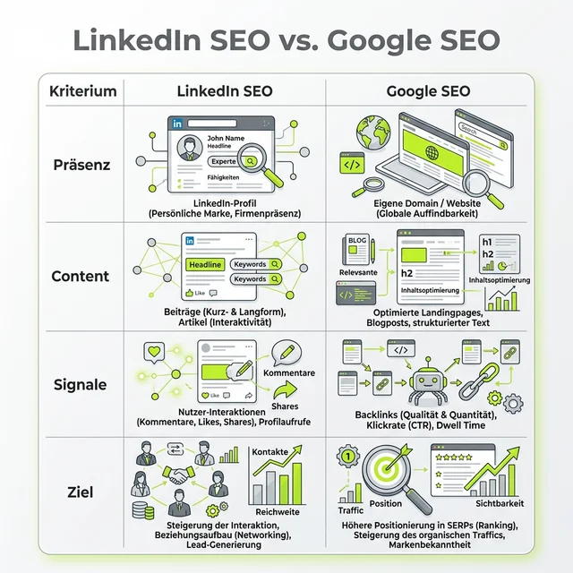
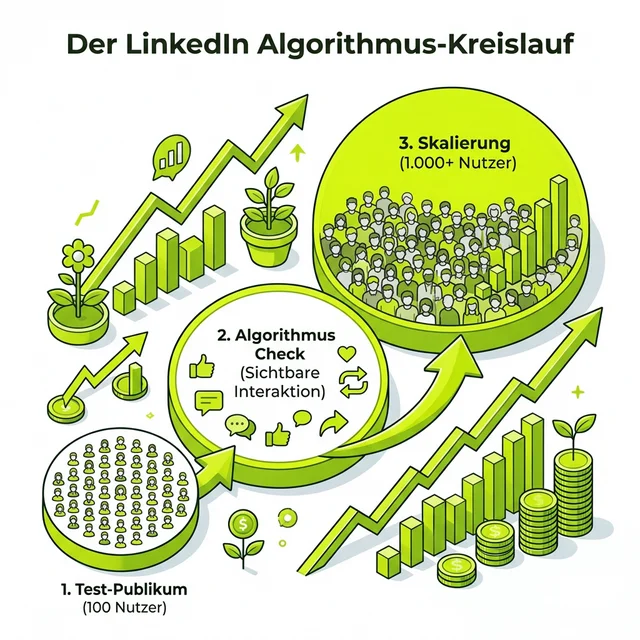

Moin! 🌻

Letzte Woche auf dem SEO Stammtisch Berlin (Grüße an Carsten Appel!) habe ich einen Vortrag gehalten, der bei vielen für große Augen gesorgt hat. Die Kern-These: **Hört auf, LinkedIn wie Instagram oder TikTok zu behandeln. LinkedIn ist ein verfluchtes Forum.** Und wir SEOs sollten anfangen, es genau so zu nutzen.

Wer LinkedIn wie Google SEO begreift, gewinnt das Spiel. Wer hier nur "Social Media" macht und auf Likes hofft, verbrennt sinnlos Zeit.

Lass uns mal Tacheles reden. Warum verpuffen inhaltlich geniale SEO-Beiträge oft im digitalen Nirvana, während andere mit Halbwissen hunderte Kommentare einsammeln? Weil die meisten das System nicht verstanden haben. Hier sind die Learnings aus dem Vortrag und – was noch viel wertvoller ist – aus der fetten Diskussion danach in den Kommentaren.

  
💬 Jörgs SEO-Klartext (LinkedIn Insights)

  
"Dein Profil ist keine Visitenkarte fürs Ego. Es ist deine wichtigste Landingpage. Optimiere sie auf Conversions, nicht auf Likes."

## Dein Name ist die Domain, dein Profil die Landingpage

Im klassischen SEO optimieren wir Domains. Auf LinkedIn bist **du** die Domain. Sobald jemand deinen Namen sieht, beginnt der Search-Prozess.

Dein Profil ist keine schnöde digitale Visitenkarte und erst recht kein Lebenslauf. Es ist eine harte Landingpage. Und was ist das einzige Ziel einer Landingpage? Conversion. Auf LinkedIn bedeutet das: Relevante Profilaufrufe, die zu ernsthaften Kontaktaufnahmen oder Aufträgen führen. 

> [!IMPORTANT]
> Vergiss die Likes. Likes zahlen keine Miete und finanzieren dir keinen Urlaub. Ein sauber auf Conversions optimiertes Profil macht aus einem stummen Mitleser einen Kunden. Punkt.

## LinkedIn SEO vs. Google SEO: Die Technik dahinter

Wer das Prinzip "Forum" einmal gefressen hat, kann sein gesamtes SEO-Wissen 1-zu-1 auf LinkedIn übertragen. Nur dass wir hier nicht nach Keywords crawlen, sondern nach Resonanz.

Unter meinem Post hat **Nele Dörk** das genial auf den Punkt gebracht:
> *"Rankingfaktoren liegen im Zusammenspiel von Vertrauen, Verweildauer und thematischer Tiefe."*

Exakt das! Es geht nicht darum, den hundertsten Beitrag über "Die 5 besten SEO-Tools" abzusetzen. Es geht um Tiefe. Um Trust. Wenn du zeigst, dass du ein Problem wirklich in der Tiefe lösen kannst, steigen deine Verweildauer und deine E-E-A-T-Signale – genau wie bei Google.

## Der Algorithmus: Der harte Weg von 100 zu 1.000

Wie entscheidet LinkedIn, wer in den Feed gespült wird und wer stirbt? Das ist keine Magie, sondern ein gnadenloser, mehrstufiger Algorithmus-Kreislauf.

Sobald du auf "Posten" klickst, zeigt LinkedIn deinen Beitrag einer winzigen Testgruppe – meist so um die 100 Leute, mit denen du eh schon interagierst. Passiert in dieser ersten Stunde nichts (keine Klicks auf "Mehr anzeigen", keine Kommentare), ist dein Beitrag de facto tot. Er wird beerdigt.

Reagiert diese kleine Gruppe aber, schaltet der Algo die nächste Tür auf: Die 1.000er Reichweite. Und so frisst sich das weiter. 

Deshalb ist Vorbereitung alles: Wärm den Algorithmus auf. Bevor du selbst sendest, verbringst du 20 Minuten damit, in *anderen* Diskussionen hochwertig zu kommentieren. Du sagst dem System damit: "Ich bin da und ich interagiere."

## Kommentare sind das neue Gold (und harte Arbeit)

Ein einziger, verdammt guter Kommentar unter einem starken Beitrag bringt dir oft mehr qualifizierte Profilaufrufe als drei mittelmäßige eigene Posts. Das ist reines, aktives Outreach.

**Antonio Blago** hat das in der Diskussion extrem ehrlich zusammengefasst:
> *"LinkedIn ist total ein Long Time Game. Feedpflege ist absolut wichtig. Ich schreibe pro Woche 60 bis 100 Kommentare. Das ist Arbeit, die sich lohnt."*

60 bis 100 Kommentare pro Woche. Das ist kein Zufall, das ist ein System. Wer nur sendet und nie kommentiert, ist wie der Typ auf der Party, der nur von sich selbst redet. Niemand mag diesen Typen.

## Lass den Affen raushängen

Einer der größten Hebel, den wir als SEOs völlig unterschätzen: Wir sind Menschen. Wir dürfen auch mal menschlich klingen.

Wenn du SEO liebst und gleichzeitig leidenschaftlich gerne Döner isst – dann schreib verdammt nochmal über Döner SEO! 

Authentizität schlägt jede aalglatte Corporate-Language. Fachbegriffe bauen Mauern auf. Echtheit reißt sie ein. Auch bei Bildern: Zeig dich. Ein Gesicht stoppt den Daumen im Feed. **Andreas Absmeier** meinte dazu lachend unter meinem Beitrag: 
> *"Bei dem Foto steigt die Verweildauer!"* 

Und er hat Recht. Echte Menschenbilder sind der stärkste Scroll-Stopper, den du hast.

## Lauter werden, SEOs!

Wir sitzen oft still in unserer Tech-Bubble und ärgern uns, dass andere mit Halbwissen die Budgets abräumen. **Nadine McNulty** hat den Nagel auf den Kopf getroffen:
> *"Als SEOs sind wir von Natur aus nicht die größten Marktschreier, dürfen aber lauter sein auf LinkedIn."*

Genau das ist es. Wir haben das Wissen, wir haben die Technik – wir müssen es nur auf die Straße (oder besser: in den Feed) bringen. Nutzt LinkedIn als Forum. Geht in die Diskussionen. Streitet euch, teilt euer Wissen, baut E-E-A-T auf. 

Wie ich beim Stammtisch sagte: **Jeder für sich, aber am Ende alle zusammen.** Je mehr wir uns gegenseitig pushen und echte, tiefe Diskussionen führen, desto sichtbarer wird die gesamte echte SEO-Bubble. Keine Einzelkämpfer-Shows mehr.

ALOHA! 🌻✌️

  <h4 class="text-xl font-bold mb-4">Du willst die Live-Diskussion sehen?</h4>
  
Diesen Artikel habe ich basierend auf einem sehr lebhaften LinkedIn-Post erstellt. Wenn du wissen willst, was die Branche aktuell darüber denkt, schau dir die über 34 Kommentare direkt bei LinkedIn an.

  <a href="https://www.linkedin.com/posts/joerg-zimmer-seo-sea-freelancer-berlin-spandau_linkedin-ist-ein-forum-und-wir-seo-spezialisten-activity-7390004973389942785-T_MR" target="_blank" rel="noopener noreferrer" class="btn-primary inline-flex">Zur LinkedIn Diskussion</a>

### Weiterführende Artikel
* **Lese-Tipp:** [Wenn AI-Agenten deinen LinkedIn-Feed kapern](/blog/ai-agent-weihnachtsgruesse-linkedin/)
* **Lese-Tipp:** [Warum wir SEO-Spezialisten schuld am Zustand des Internets sind](/blog/wir-seos-sind-schuld-community/)
