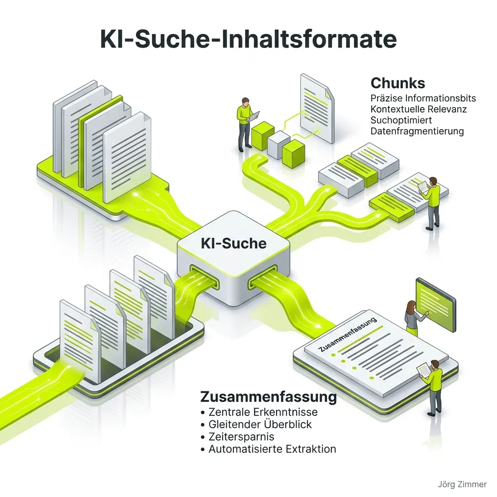

Auf der [CAMPIXX](/glossar/campixx-berlin/) hat Malte Landwehr ein zentrales Thema auf den Punkt gebracht, das die gesamte SEO-Branche umtreibt: **Wie müssen Inhalte aufgebaut sein, damit große Sprachmodelle (LLMs) sie im Grounding-Prozess verstehen und als Quelle zitieren?**

Wer heute noch Texte nach dem alten Schema F produziert – endlose Einleitungen, künstliche Keyword-Wiederholungen und schwammige Füllsätze –, wird in der modernen [AI Search](/glossar/ai-search/) schlicht unsichtbar. Große Sprachmodelle wie GPT-4, Claude oder Perplexity lesen Texte nicht wie ein Mensch von oben nach unten. Sie zerlegen Dokumente in semantische Einheiten, sogenannte „Chunks“.

Hier ist der Mitschnitt von Maltes Session direkt vor Ort:

  <video controls class="w-full max-h-[80vh] object-contain outline-none" preload="none" poster="/images/blog-malte-landwehr-ai-search-content-formate-3d.webp" style="display:block;">
    <source src="/videos/malte-landwehr-ai-search.mp4" type="video/mp4">
    Dein Browser unterstützt das Video-Tag leider nicht.
  </video>

## Das Erfolgsrezept: Self-contained & Entity-dense

In seinem Vortrag liefert Malte die wohl präziseste Definition dafür, wie optimierte Content-Abschnitte für generative Suchmaschinen aussehen müssen:

> *„Ein guter Chunk referenziert nicht den Satz davor oder danach. Da steht nicht drin: ‚Aus diesen Gründen ist der Anbieter besser‘. Da werden konkret die Entitäten genannt. Er hat einfache deklarative Aussagen und ist in autoritativer Sprache geschrieben.“*

Was bedeutet das konkret für die Praxis? In Retrieval-Augmented Generation ([RAG](/glossar/rag/)) Systemen greift sich das Modell oft isolierte Textblöcke von 256 bis 512 Tokens heraus. Wenn ein Absatz mit relativen Bezügen wie *„Deshalb empfehlen wir diese Lösung...“* arbeitet, verliert das System ohne den vorangegangenen Absatz den Kontext. Die Folge: Der Chunk wird verworfen.

### Die 3 Kernkriterien für KI-feste Textabschnitte:

1. **Self-contained (Autark):** Jeder Sinnabschnitt muss für sich alleinstehend einen vollständigen Gedanken formulieren. Wer Subjekte weglässt und durch Pronomen ersetzt, verliert im Ranking.
2. **Entity-dense (Entitäten-stark):** Nenne konkrete Produktnamen, Methoden, Werkzeuge und Metriken beim Namen, statt generische Umschreibungen zu wählen.
3. **Autoritativ & Deklarativ:** Verwende klare Aussagen (*„Tool X reduziert die Ladezeit um 40 %“*) statt spekulativer Weichmacher (*„Es könnte eventuell sinnvoll sein...“*).

## Content-Architektur im Vergleich

Wie massiv sich die redaktionellen Anforderungen durch die [GEO-Welle in der Suche](/blog/seo-wird-groesser-geo-welle/) gewandelt haben, zeigt die Gegenüberstellung klassischer Texterstellung und moderner KI-Optimierung:

| Kriterium | Klassischer SEO-Text | AI Search & RAG-Optimierter Chunk |
| :--- | :--- | :--- |
| **Referenzstruktur** | Fließtext mit starken Abhängigkeiten (Pronomen) | Autark (Self-contained), jeder Block steht für sich |
| **Aussagekraft** | Schwammige Einleitungen, Füllwörter für Wortzahl | Deklarativ, präzise Fakten, maximale Informationsdichte |
| **Entitäten** | Fokus auf Hauptkeyword-Dichte | Reichhaltiges Entitäten-Netzwerk für [Topical Authority](/glossar/topical-authority/) |
| **Zusammenfassungen** | Oft als banale Floskel ans Textende geklatscht | Prominente, faktenbasierte Key Takeaways ganz oben |
| **Verwertbarkeit durch KI** | Gering (hoher Rauschanteil, schwache Vektoren) | Extrem hoch (sofort als Zitat oder Snippet nutzbar) |

<figure class="my-8 bg-neutral-50 border border-neutral-200 p-6 md:p-8 rounded-2xl shadow-sm">
  

    
    

      <h4 class="font-bold text-base md:text-lg text-dark mb-0">Jörg Zimmer</h4>
      
Senior SEO & AI Search Consultant

    

  

  <blockquote class="text-base md:text-lg text-dark leading-relaxed italic border-l-4 border-lime-accent pl-4 my-4 font-normal">
    „Gesicht. Ähm, man kann in so einem Video äh viel viel mehr zeigen, als man vielleicht in in fünf Artikeln machen könnte. Und ähm wenn wir schon im im über Video Content reden, dann glaube ich unterschätzen noch ganz viele Leute dieses ähm Hochkant, also die das dies Shortform sind.“
  </blockquote>
  <figcaption class="mt-4 pt-3 border-t border-neutral-200/60 flex flex-wrap items-center justify-between gap-2 text-xs text-neutral-500">
    

      Experten-Zitat • <cite class="not-italic font-semibold text-neutral-700">Jörg Zimmer</cite>
      •
      <a href="https://www.youtube.com/watch?v=ZIFCXUXypSc&t=1664s" target="_blank" rel="noopener noreferrer" class="text-neutral-600 hover:text-dark underline inline-flex items-center gap-1">
        Quelle: YouTube Talk Antonio Blago & Jörg Zimmer (27:44)
        <svg class="w-3 h-3 text-neutral-400" fill="none" stroke="currentColor" viewBox="0 0 24 24"><path stroke-linecap="round" stroke-linejoin="round" stroke-width="2" d="M10 6H6a2 2 0 00-2 2v10a2 2 0 002 2h10a2 2 0 002-2v-4M14 4h6m0 0v6m0-6L10 14" /></svg>
      </a>
    

    <a href="https://www.linkedin.com/in/joerg-zimmer-seo-sea-freelancer-berlin-spandau/" target="_blank" rel="noopener noreferrer" class="font-bold text-lime-700 hover:underline inline-flex items-center gap-1 shrink-0">
      Jörg Zimmer auf LinkedIn folgen →
    </a>
  </figcaption>
</figure>

## Warum Zusammenfassungen die geheimen Ranking-Waffen sind

Aus den genannten Gründen sind prägnante Zusammenfassungen und Key-Takeaway-Boxen zu Beginn eines Artikels das wirksamste Format überhaupt. Eine saubere Zusammenfassung vereint alle Vorteile: Sie ist hochgradig verdichtet, nennt alle Entitäten beim Namen und liefert dem KI-Crawler genau die Kernaussage, die als direkte Antwort ausgespielt werden kann.

Wer seine Website zukunftssicher aufstellen will, sollte bestehende Fachartikel gezielt auf diese Struktur überprüfen:
- Werden zentrale Fragen direkt in den ersten zwei Sätzen beantwortet?
- Gibt es strukturierte Aufzählungen mit klaren Fakten?
- Sind die Absätze so formuliert, dass man jeden einzelnen als Zitat herausgreifen könnte?

Du möchtest deine Content-Strategie und Informationsarchitektur auf Herz und Nieren prüfen lassen? In meiner [SEO-Sprechstunde](/seo-sprechstunde/) durchleuchten wir deine bestehenden Seiten und zeigen dir, wo du für RAG-Systeme optimieren musst. Für umfassende Begleitung steht dir meine [strategische SEO-Beratung](/glossar/seo-beratung/) zur Seite.

<!-- CTA Box -->

  LinkedIn Community Diskussion
  <h3 class="text-xl md:text-2xl font-bold text-white mb-3 !mt-0 !border-none !pb-0">
    Jetzt an der Diskussion teilnehmen
  </h3>
  

    Diskutiere mit Jörg Zimmer und der SEO-Community auf LinkedIn über Content-Formate und Chunks für die KI-Suche.
  

  <a href="https://www.linkedin.com/posts/joerg-zimmer-seo-sea-freelancer-berlin-spandau_malte-landwehr-%C3%BCber-content-formate-die-in-activity-7473338939441827841-9R-C" target="_blank" rel="noopener noreferrer" class="btn-primary">
    <svg class="w-4 h-4 fill-current" viewBox="0 0 24 24"><path d="M20.447 20.452h-3.554v-5.569c0-1.328-.027-3.037-1.852-3.037-1.853 0-2.136 1.445-2.136 2.939v5.667H9.351V9h3.414v1.561h.046c.477-.9 1.637-1.85 3.37-1.85 3.601 0 4.267 2.37 4.267 5.455v6.286zM5.337 7.433c-1.144 0-2.063-.926-2.063-2.065 0-1.138.92-2.063 2.063-2.063 1.14 0 2.064.925 2.064 2.063 0 1.139-.925 2.065-2.064 2.065zm1.782 13.019H3.555V9h3.564v11.452zM22.225 0H1.771C.792 0 0 .774 0 1.729v20.542C0 23.227.792 24 1.771 24h20.451C23.2 24 24 23.227 24 22.271V1.729C24 .774 23.2 0 22.222 0h.003z"/></svg>
    Beitrag auf LinkedIn öffnen
    →
  </a>

