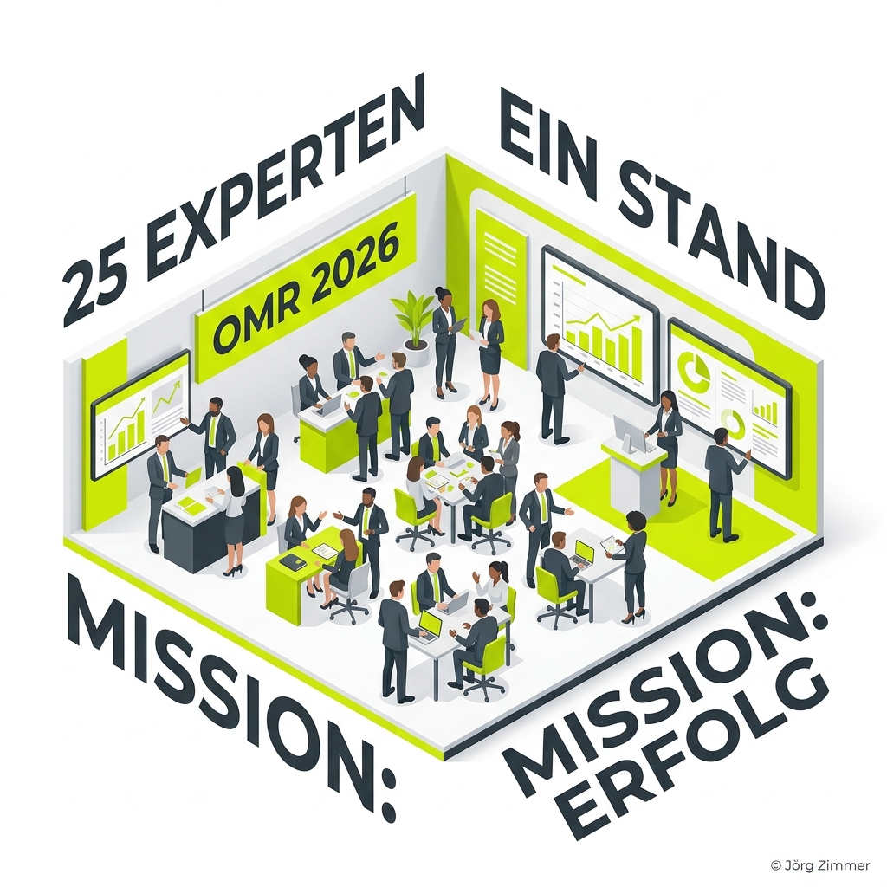
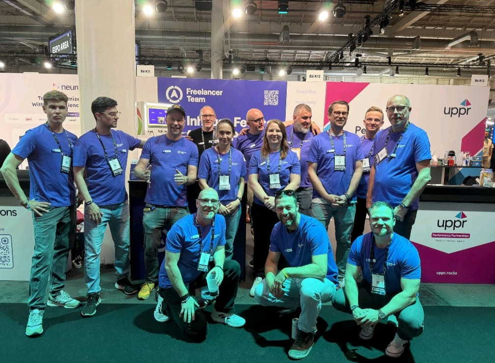

# 25 Leute. Ein Stand. Eine Mission: Das Freelancer Team auf der OMR 2026

Moin! 🌻

Ja, es ist genauso wild, wie es klingt. Wir sind mit **25 Expert*innen** auf der OMR in Hamburg eingeritten. Ein Stand, eine Mission – und jede Menge Tacheles. Wer mich kennt, weiß: Ich bin seit 2001 dabei. Ich habe gesehen, wie Agenturen kommen und gehen, wie Modelle aufgebläht wurden und am Ende oft nur noch heiße Luft beim Kunden ankam. 

Das Freelancer Team ist die Antwort darauf. Wir sind keine Einzelkämpfer, die im stillen Kämmerlein vor sich hin wurschteln. Wir sind Spezialisten, die zusammen liefern. Ohne den Wasserkopf einer Großagentur, aber mit der geballten Power von über 100 Jahren Marketing-Erfahrung am Stand.

---

## Warum wir das "Bauchladen-Modell" hassen

In der klassischen Agenturwelt läuft es oft so: Du unterschreibst bei einem Senior-Sales, und sobald die Tinte trocken ist, landet dein Projekt bei einem Junior-Account-Manager. Der ist zwar nett, hat aber oft weniger Erfahrung als du selbst. Das Ergebnis? **Pfusch am Bau**. 

Bei uns an **Stand B6, K12** ist das anders. Du triffst die Leute, die wirklich im Code graben, die [Crawler](/glossar/crawler/) bändigen und Millionen-Budgets in Google Ads verwalten. Keine Silos, kein "dafür ist die andere Abteilung zuständig". Wenn wir über dein Projekt sprechen, sitzen die Experten für SEO, Paid Social und Design an einem Tisch (oder an einem Stand).

---

## Die Spezialeinheiten vor Ort: Wer liefert was?

Wir haben uns für die OMR in klare Kompetenz-Cluster aufgeteilt. So findest du sofort den richtigen Ansprechpartner für dein Problem.

### 1. Paid & Performance 🎯
Hier wird nicht mit Budget gezockt, sondern investiert. Unsere Experten wissen genau, wie man aus jedem Euro das Maximum rausholt.
*   **Die Cracks:** Andreas Absmeier, Christoph Buder, Matthias Hentschel, Yahia Chahrour 🍉, Inan Nacar, Sebastian Fuhrmann, Mike Bader, Pia-Andrea Lehmann.

### 2. SEO, GEO & Organic Growth 🌱
Mein Revier. Wir sprechen über echte Sichtbarkeit, die bleibt. Nicht nur Rankings (Vanity-Metriken!), sondern Umsatz. Wir bereiten dich auf die Zukunft der KI-Suche ([GEO](/glossar/geo/)) vor.
*   **Die Experten:** Uta Leyke-Hess, Kimberly Marrek, Jörg Zimmer 🌻, Dirk Veit, Sebastian Wicke, Thomas Kuchling.

### 3. E-Commerce, Shops & Webdesign 🛒
Ein Shop muss verkaufen. Punkt. Wenn die [Usability](/glossar/usability/) hakt, nützt dir der beste Traffic nichts.
*   **Die Macher:** Tobias Bungers, Tim Nagel, Kostas Strigkos 🦐.

### 4. Technik, WordPress, KI & Projektpraxis 🤖
Das Rückgrat. Wenn die Technik nicht steht, bricht das Kartenhaus zusammen. Wir bauen Lösungen, die funktionieren.
*   **Die Techniker:** Silvio Endruhn, Markus Koelmann, Raimund Herms.

### 5. Design, Marke & Content 🎨
Das Auge isst mit, aber die Strategie entscheidet. Brand Design, das wirkt und konvertiert.
*   **Die Kreativen:** Florian Hertwig, Rainer von Rottenburg, Jonathan Scheurich.

---

## LinkedIn Insights: Tacheles aus der Community

Ich habe auf LinkedIn nachgefragt, was die Leute eigentlich von dieser "Freelancer-Invasion" halten. Die Resonanz war – gelinde gesagt – überwältigend. Hier ein kleiner Deep-Dive in die Köpfe meiner Mitstreiter:

  
💬 Jörgs SEO-Klartext (LinkedIn Insights)

  
"Ich bin ein SEO Dinosaurier, der mit Google zusammen aufgewachsen ist. Wer keine Lust auf Standard-Blabla hat, kommt zur <strong>SEO Sprechstunde</strong>. Zwei Stunden Roast, volle Ehrlichkeit. Wer das nicht aushält, sollte lieber zur klassischen Agentur gehen." – <strong>Jörg Zimmer 🌻</strong>

  
💬 Paid Social Insights

  
"Ich biete strategisches, psychologisches und datengetriebenes Paid Social für D2C-Brands. Über 50 Mio. € Ad-Spend-Erfahrung. Wer wissen will, wie man Marktanteile wirklich ausbaut, findet mich an Stand K12." – <strong>Matthias Hentschel</strong>

  
💬 Brand Design Tacheles

  
"In Zeiten von KI liegt der Unterschied nicht im Machen, sondern im Entscheiden. Brand Design für Unternehmen in der Neuausrichtung – klar im Ausdruck, präzise in der Umsetzung." – <strong>Florian Hertwig</strong>

  
💬 Interim Management Real-Talk

  
"Ich freu mich mehr über den Austausch über das, was aktuell in der Business Welt so abgeht, als über das eigentliche Programm der OMR. Sorry OMR!" – <strong>Raimund Herms</strong>

---

## Komm vorbei: Halle B6, Stand K12

Wir sind noch bis morgen in Hamburg. Wenn du also:
1. Keine Lust mehr auf anonyme Agentur-Betreuung hast.
2. Spezialwissen suchst, das wirklich in die Tiefe geht.
3. Oder einfach nur mal einen echten [SEO Dinosaurier](/glossar/seo-beratung/) live sehen willst.

...dann komm rum. Wir sind direkt bei der Food Area (Burger + SEO = ❤️). 

Lass uns über dein Projekt reden. Ehrlich, direkt und ohne Umwege. 

Ich freue mich auf dich!

ALOHA! 🌻✌️

**Dein Jörg 🌻**

---

*Dieser Beitrag basiert auf einer lebhaften Diskussion und einem [LinkedIn-Beitrag](https://www.linkedin.com/posts/joerg-zimmer-seo-sea-freelancer-berlin-spandau_omr26-activity-7457014777974865920-RB3K).*
