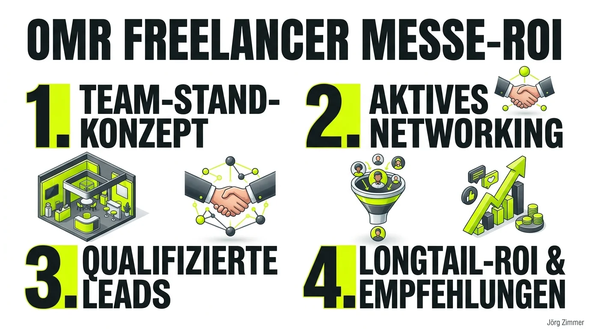

Das jährliche Bashing im Vorfeld der OMR in Hamburg gehört mittlerweile fast schon zum guten Ton im Online Marketing: Zu laut, zu kommerziell, zu voll. Doch wer die Messe aus der reinen Konsumenten-Perspektive bewertet, verkennt das gewaltige geschäftliche Potenzial. Die OMR liefert eine gewaltige Plattform. Aber ob dieser Trubel am Ende verpufft oder bare Münze einspielt, hängt einzig davon ab, mit welcher Rolle und Strategie man aufschlägt.

Als Einzelkämpfer hätte ich mir dort sicherlich zwei nette Tage gemacht, mich durch Food-Courts geschlemmt und vielleicht die eine oder andere Keynote angehört. Doch mein OMR-Debüt fand unter völlig anderen Vorzeichen statt: Zusammen mit 25 Kolleginnen und Kollegen aus unserem Freelancer-Kollektiv hatten wir einen eigenen Messestand gebucht.

Mein persönliches Resümee nach zwei Messetagen: Ich habe nahezu nichts vom offiziellen Messeprogramm gesehen. Keine Masterclasses, keine Guided Touren, keine Promi-Speaker. Einen einzigen Vortrag habe ich für exakt fünfzehn Minuten genutzt – schlicht, um mir kurz die Beine auszuruhen. Und trotzdem war diese OMR das profitabelste Event des Jahres.

### Der Aussteller-Modus: Beziehungsarbeit statt Folien-Berieselung

Wenn du als Aussteller auf einer Großmesse stehst, gelten komplett andere Spielregeln als beim typischen Konferenzbesuch. Statt passiv im Halbdunkel vor einer Bühne zu sitzen und Folien abzufotografieren, die man zwei Tage später ohnehin auf YouTube oder LinkedIn ansehen kann, bist du im permanenten Kontaktmodus.

Daraus habe ich eine fundamentale Lektion mitgenommen:
* **Hände schütteln statt Vorträge konsumieren:** Der wirkliche Wert einer Messe liegt in den Menschen, die vor Ort versammelt sind. 
* **Persönliche Begegnungen:** Kontakte, die man über Monate hinweg nur von Profilbildern und LinkedIn-Kommentaren kannte, stehen plötzlich leibhaftig vor einem.
* **Stand-Dynamik nutzen:** Ein gut gelaunter Stand zieht neugierige Vorbeigehende magisch an, wenn dort gelacht, diskutiert und Klartext geredet wird.

### Die ehrliche ROI-Rechnung: Was bringen 1.000 Euro Investition?

Rechnen wir ganz nüchtern: Rund 1.000 Euro pro Person für Standbeteiligung, Hotel und Anreise. Hat sich das gelohnt?

Ich hatte an beiden Tagen im Schnitt dreißig intensive Fachgespräche pro Tag. Ein wesentlicher Teil davon fand intern innerhalb unserer Freelancer-Truppe statt. Genau das ist Gold wert: Wenn der SEA-Spezialist, der Tracking-Profi und die Social-Media-Beraterin genau wissen, wie ich im Bereich [SEO-Beratung](/glossar/seo-beratung/) und [AI Visibility](/glossar/ai-seo/) ticke, entsteht ein organisches Empfehlungsnetzwerk, das das ganze Jahr über qualifizierte Leads zuspielt.

Zusätzlich habe ich rund sechs hochkarätige Gespräche mit echten Interessenten geführt. Bemerkenswert dabei: Kein einziger dieser Leads entstand durch steifes Warten am Tresen. Sie entstanden spontan in den Messegängen, in den Kaffeepausen und beim abendlichen Networking.

| Dimension | Messebesucher (Einzelkämpfer) | Freelancer-Team Aussteller |
| :--- | :--- | :--- |
| **Primäres Ziel** | Konsum von Vorträgen & Trends | Generierung von Vertrauen & Neugeschäft |
| **Wahrnehmung im Markt** | Gast / Beobachter | Professioneller Marktteilnehmer auf Augenhöhe |
| **Kostenstruktur** | Ticket + Reise (reine Ausgabe) | Standbeteiligung + Reise (Investition mit Hebel) |
| **Lead-Potenzial** | Zufällige Kontakte beim Kaffee | Strukturierter Funnel über Stand & Team-Netzwerk |
| **Nachhaltiger Effekt** | Schnell verblassende Notizen | Langfristiges Empfehlungs-Flywheel |

Wenn aus den geführten Gesprächen bis zum Jahresende ein einziger größerer Retainer erwächst, hat sich die Investition verzehnfacht. Und der menschliche ROI für den Zusammenhalt und die Motivation im Team? Der liegt bei gefühlt einer Million.

<figure class="my-8 bg-neutral-50 border border-neutral-200 p-6 md:p-8 rounded-2xl shadow-sm">
  

    
    

      <h4 class="font-bold text-base md:text-lg text-dark mb-0">Jörg Zimmer</h4>
      
Senior SEO & AI Search Consultant

    

  

  <blockquote class="text-base md:text-lg text-dark leading-relaxed italic border-l-4 border-lime-accent pl-4 my-4 font-normal">
    „Gutes SEO erhöht den Return of Investment von allen Kanälen. Eine saubere Seite wird nicht nur besser gefunden. Wenn man nützliche Informationen bereit stellt, die Ladezeiten optimiert und die Nutzerwege besonders auf Smartphone immer wieder verbessert dann geht die Conversionrate hoch.“
  </blockquote>
  <figcaption class="mt-4 pt-3 border-t border-neutral-200/60 flex flex-wrap items-center justify-between gap-2 text-xs text-neutral-500">
    

      Experten-Zitat • <cite class="not-italic font-semibold text-neutral-700">Jörg Zimmer</cite>
      •
      <a href="https://www.linkedin.com/feed/update/urn:li:activity:7109155518903906304" target="_blank" rel="noopener noreferrer" class="text-neutral-600 hover:text-dark underline inline-flex items-center gap-1">
        Quelle: LinkedIn-Beitrag von Jörg Zimmer
        <svg class="w-3 h-3 text-neutral-400" fill="none" stroke="currentColor" viewBox="0 0 24 24"><path stroke-linecap="round" stroke-linejoin="round" stroke-width="2" d="M10 6H6a2 2 0 00-2 2v10a2 2 0 002 2h10a2 2 0 002-2v-4M14 4h6m0 0v6m0-6L10 14" /></svg>
      </a>
    

    <a href="https://www.linkedin.com/in/joerg-zimmer-seo-sea-freelancer-berlin-spandau/" target="_blank" rel="noopener noreferrer" class="font-bold text-lime-700 hover:underline inline-flex items-center gap-1 shrink-0">
      Jörg Zimmer auf LinkedIn folgen →
    </a>
  </figcaption>
</figure>

### Gemeinsam statt einsam: Warum Netzwerke die Zukunft sind

Die Zeiten, in denen man sich als SEO-Freelancer im stillen Kämmerlein verbarrikadiert und Rankings im Alleingang hochzieht, sind endgültig vorbei. Genau wie beim [Campixx Networking](/blog/campixx-networking-conversion-optimierung/) oder den Konferenzerfahrungen auf der [Freelance Unlocked](/blog/freelance-unlocked-eis/) zeigt sich: Wer den offenen Austausch sucht, profitiert überproportional.

Im Freelancer-Verbund bündeln wir Senior-Know-how ohne den riesigen administrativen Wasserkopf traditioneller Agenturen. Wenn ein Kunde anfragt, bekommt er genau die Spezialisten, die er für sein Problem benötigt. Dieser enge [Team-Spirit der Freelancer](/blog/freelance-unlocked-lila-tshirts/) und der lebendige [SEO-Community](/blog/wir-seos-zusammenhalt/) schaffen eine Verlässlichkeit, die Kunden heute händeringend suchen.

### Das sagt die LinkedIn-Community zum OMR-Rückblick

Mein ehrlicher Bericht stieß auf LinkedIn auf enorme Resonanz. Zahlreiche Kolleginnen und Kollegen schilderten ihre eigenen Blickwinkel auf das Thema Messe-Budget und Beziehungsaufbau:

**Lisa Augustin** unterstrich das Gefühl als Stand-Betreiberin:
> *„Der für mich beste Rückblick, den ich bisher gelesen habe. Liegt aber vielleicht auch daran, dass ich schon oft selber als Ausstellerin auf einer Messe war und das total fühlen konnte, was du geschrieben hast.“*

**Uta Leyke-Hess** teilte ihren sparsamen Reiseansatz mit einem Augenzwinkern:
> *„Ich habe weniger ausgegeben: 30 Euro An- und Abreise und 170 Euro Übernachtung. Dafür musste ich morgens warten, bis das Bad frei ist, und war nicht um 9:00 Uhr auf der Messe – kann man als Opportunitätskosten hinzurechnen.“*

**Mike Bader** fasste die Kernbotschaft perfekt zusammen:
> *„Super auf den Punkt gebracht. Genau so sehe ich es auch! Klar ist es schwierig, den genauen ROI sofort auf den Cent zu messen. Aber wie du sagst, geht es ja auch darum, dass wir uns alle besser kennengelernt haben. Und alleine das hat sich schon mehr als gelohnt.“*

**Georg Neumann** brachte es kurz und bündig auf die Formel:
> *„Menschlicher ROI 1.000.000 ❤️“*

Messen wie die OMR lohnen sich für Selbstständige genau dann, wenn man sie als Katalysator für echte Beziehungen begreift. Wer nur passiv zuhört, verbrennt Geld. Wer rausgeht, Hände schüttelt und Gesicht zeigt, baut das Fundament für ein florierendes Geschäftsjahr.

<!-- LinkedIn CTA Box -->

  <h3 class="text-xl md:text-2xl font-bold text-white mb-3 !mt-0 !border-none !pb-0">
    Jetzt an der Diskussion teilnehmen
  </h3>
  

    Diskutiere mit Jörg Zimmer und der SEO-Community auf LinkedIn über diesen Beitrag.
  

  <a href="https://www.linkedin.com/posts/joerg-zimmer-seo-sea-freelancer-berlin-spandau_meine-erste-omr-gleich-mit-eigenem-stand-share-7459530597514817536-o4sO?utm_source=share&utm_medium=member_desktop&rcm=ACoAADQdMuYBHR-eSucFKv63wjXNHfs3eLpPKlI" target="_blank" rel="noopener noreferrer" class="btn-primary">
    <svg class="w-4 h-4 fill-current" viewBox="0 0 24 24"><path d="M20.447 20.452h-3.554v-5.569c0-1.328-.027-3.037-1.852-3.037-1.853 0-2.136 1.445-2.136 2.939v5.667H9.351V9h3.414v1.561h.046c.477-.9 1.637-1.85 3.37-1.85 3.601 0 4.267 2.37 4.267 5.455v6.286zM5.337 7.433c-1.144 0-2.063-.926-2.063-2.065 0-1.138.92-2.063 2.063-2.063 1.14 0 2.064.925 2.064 2.063 0 1.139-.925 2.065-2.064 2.065zm1.782 13.019H3.555V9h3.564v11.452zM22.225 0H1.771C.792 0 0 .774 0 1.729v20.542C0 23.227.792 24 1.771 24h20.451C23.2 24 24 23.227 24 22.271V1.729C24 .774 23.2 0 22.222 0h.003z"/></svg>
    Beitrag auf LinkedIn öffnen
    →
  </a>

*(Foto von Jonathan Scheurich, Teil des Freelancer Teams)*

