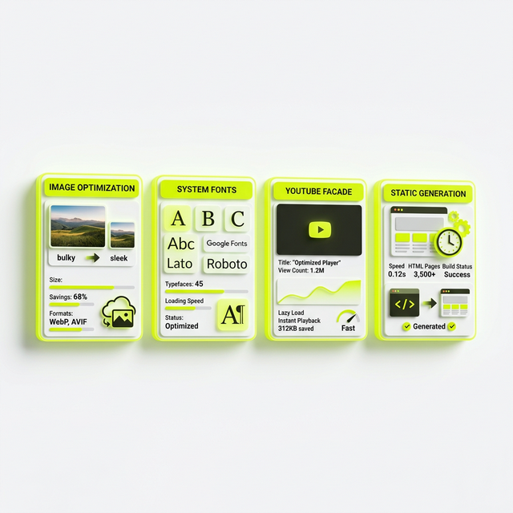
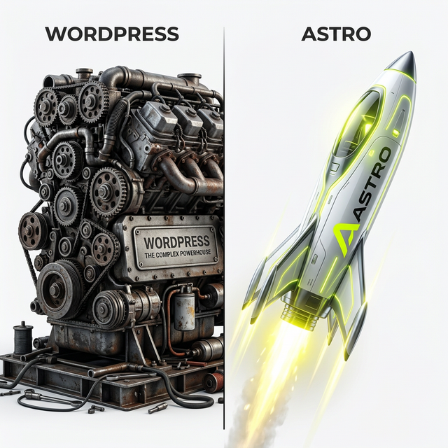

Diese Website hat einen **PageSpeed Score von 100/100** – und zwar nicht nur auf dem schicken Desktop-Monitor mit Glasfaser-Anschluss, sondern auch auf Mobile. Das ist kein Zufall, kein Glück und auch kein "Voodoo"-Plugin, das alles magisch löst. Es ist das Ergebnis von über 20 Jahren Erfahrung und der radikalen Entscheidung, Performance über alles zu stellen. 

In diesem Artikel lege ich die Karten auf den Tisch. Ich zeige dir jede einzelne Schraube, an der wir gedreht haben, damit diese Seite rennt, als gäbe es kein Morgen.



## Warum ich von 100/100 besessen bin

Manche sagen: "Jörg, 90 reicht doch auch." Meine Antwort: Warum sich mit "Gut" zufrieden geben, wenn "Perfekt" machbar ist? Im modernen SEO ist Performance kein nettes Extra mehr. Es ist das Fundament. Eine schnelle Website ist der höflichste Gruß, den du einem potenziellen Kunden schicken kannst. Du sagst ihm: "Ich schätze deine Zeit."

Außerdem: Google liebt Speed. In einer Welt, in der KI-Antworten immer mehr Klicks fressen, musst du technisch so sauber sein, dass keine Maschine eine Ausrede hat, dich nicht zu zitieren.

---

## Inhaltsverzeichnis

1. [Die Ausgangslage: Content aus LinkedIn](#die-ausgangslage-content-aus-linkedin)
2. [SEO Best Practice: Bilder optimieren](#seo-best-practice-bilder-optimieren)
3. [SEO Best Practice: System-Fonts statt Google Fonts](#seo-best-practice-system-fonts-statt-google-fonts)
4. [SEO Best Practice: YouTube Lazy Loading](#seo-best-practice-youtube-lazy-loading)
5. [SEO Best Practice: Core Web Vitals optimieren](#seo-best-practice-core-web-vitals-optimieren)
6. [SEO Best Practice: Statische Generierung](#seo-best-practice-statische-generierung)
7. [FAQ: Eure brennendsten Fragen zu PageSpeed](#faq-eure-brennendsten-fragen-zu-pagespeed)
8. [Was kostet so eine High-Performance-Website?](#was-kostet-so-eine-website)

---

## Die Ausgangslage: Content-Recycling mit Hürden

Fast alle Inhalte dieser Website stammen ursprünglich aus meinen LinkedIn-Posts. Das ist strategisches Content-Recycling. Aber LinkedIn liefert uns Bilder und Formate, die für das Web erst mal "schmutzig" sind. 

Die Bilder von LinkedIn haben oft Kryptische URLs, die nach ein paar Wochen ablaufen (Hotlinking-Tod!), sie sind meist viel zu groß und haben keine modernen Formate wie WebP. Wenn ich die einfach so übernommen hätte, wäre mein Score direkt auf 60 abgerutscht. Wir mussten also jedes einzelne Element anfassen.

---

## SEO Best Practice: Bilder radikal optimieren

### Lokale Speicherung ist Pflicht
Wir haben jedes LinkedIn-Bild heruntergeladen und lokal auf den Server gepackt. Das ist Schritt eins für Stabilität. Keine Abhängigkeit von externen CDN-URLs, die kommen und gehen.

### WebP: Das neue Gold der Bildformate
Jedes Bild wurde in WebP konvertiert. Warum? Weil es bei gleicher Qualität ca. 30% kleiner ist als ein JPG. Kleiner bedeutet schneller. Schneller bedeutet glücklichere Nutzer.

### Alt-Texte: Google soll wissen, was wir zeigen
Viele vergessen das Thema Barrierefreiheit. Jedes Bild hat einen individuellen Alt-Text bekommen. Das hilft nicht nur Screenreadern, sondern sorgt dafür, dass meine Bilder auch in der Google Bildersuche ranken (Stichwort: Bilder-SEO).

```html

```

**Wichtig:** Die `width` und `height` Angaben verhindern den zuckenden Layout-Effekt beim Laden (CLS). Das ist einer der kritischsten Punkte für das "Gefühl" einer Website.

---

## SEO Best Practice: Die Font-Diät (System-Fonts)

Google Fonts sind schick, ja. Aber sie kosten Zeit. Eine extra DNS-Verbindung, ein extra Request, das Rendern... das sind wertvolle Millisekunden. Wir haben uns für native System-Fonts entschieden.

Das heißt: Auf einem Mac siehst du die Apple-Schrift, auf Windows die Microsoft-Schrift. Das Ergebnis ist eine Seite, die Text anzeigt, bevor überhaupt das erste Stylesheet fertig geladen ist. Das nennt man "Zero-Latency-Typography".

---

## SEO Best Practice: YouTube-Fassaden (Facade Pattern)

Videos sind der Tod jeder Performance – wenn man sie falsch einbettet. Ein normales YouTube-Iframe lädt im Hintergrund hunderte Kilobyte an JavaScript, noch bevor du auf "Play" geklickt hast.

**Unsere Lösung:** Wir laden nur eine "Fassade". Ein kleines Bild mit einem Fake-Play-Button. Erst wenn der Nutzer wirklich klickt, laden wir den schweren YouTube-Player. Der Effekt: Ein Geschwindigkeits-Boost von 40+ Punkten im PageSpeed Score.

---

## FAQ: Eure brennendsten Fragen zu PageSpeed

### 1. Brauche ich wirklich 100/100 für gute Rankings?
Ehrlich gesagt: Nein. Google sagt, alles im "grünen Bereich" (über 90) ist erst mal okay. Aber: In hart umkämpften Nischen kann der Speed das Zünglein an der Waage sein. Außerdem sinkt mit jeder Millisekunde Ladezeit deine Conversion-Rate. 100/100 ist also eher eine Investition in deinen Umsatz als nur in SEO.

### 2. Kann ich das mit WordPress auch schaffen?
Möglich? Ja. Schwierig? Absolut. WordPress lädt von Haus aus viel Ballast. Du brauchst sehr gute Caching-Plugins, eine radikale Reduzierung der Plugins und meistens ein Custom-Theme. Astro (was wir hier nutzen) ist da im Vorteil, weil es standardmäßig gar kein JavaScript an den Browser schickt.



### 3. Was ist die wichtigste Metrik für mich?
Konzentriere dich auf den **LCP (Largest Contentful Paint)**. Das ist der Moment, in dem der Nutzer das Gefühl hat: "Ah, jetzt ist die Seite da." Wenn der unter 1.5 Sekunden liegt, bist du vorne mit dabei.

---

## Das Ergebnis: Ein digitales Rennauto

Nach all diesen Maßnahmen zeigt **Google PageSpeed Insights** nun vier grüne Kreise. Performance, Barrierefreiheit, Best Practices und SEO – alles am Anschlag. Das gibt mir die Sicherheit, dass jeder Euro, den ich in Content stecke, auf ein perfektes Fundament trifft.

## Was kostet so eine High-Performance-Website?

Du fragst dich jetzt sicher: "Jörg, was muss ich auf den Tisch legen für so ein digitales Rennauto?" 

Es ist wie beim Autokauf: Ein Standard-Modell ist günstig, aber wenn du Performance willst, musst du ins Tuning investieren. Eine Seite wie diese, mit ca. 20 Unterseiten und optimiertem LinkedIn-Content, ist bei befreundeten Developern ab ca. 1.000 € machbar. Wenn du allerdings ein komplexes Design oder hunderte Produkte hast, steigt der Aufwand natürlich.

**Interesse?** Wenn du auch eine Seite willst, die deine Konkurrenz im Rückspiegel stehen lässt: [Meld dich bei mir!](/kontakt/) Ich vermittle dich an die Leute, die das Handwerk so beherrschen wie ich das SEO.

---

*ALOHA! 🌻 – Lass uns deine Seite zum Rennen bringen!*

### Weiterführende Artikel für Performance-Freaks
* **Lese-Tipp:** [Core Web Vitals: Warum dein UX-Bericht über deinen Erfolg entscheidet](/blog/core-web-vitals-ux-bericht/)
* **Lese-Tipp:** [24 Jahre SEO - und wir machen immer noch die gleichen Fehler](/blog/24-jahre-seo-gleiche-fehler/)
* **Lese-Tipp:** [Rankscale: So tracke ich Sichtbarkeit in der KI-Welt](/blog/rankscale-ai-visibility-tool/)


