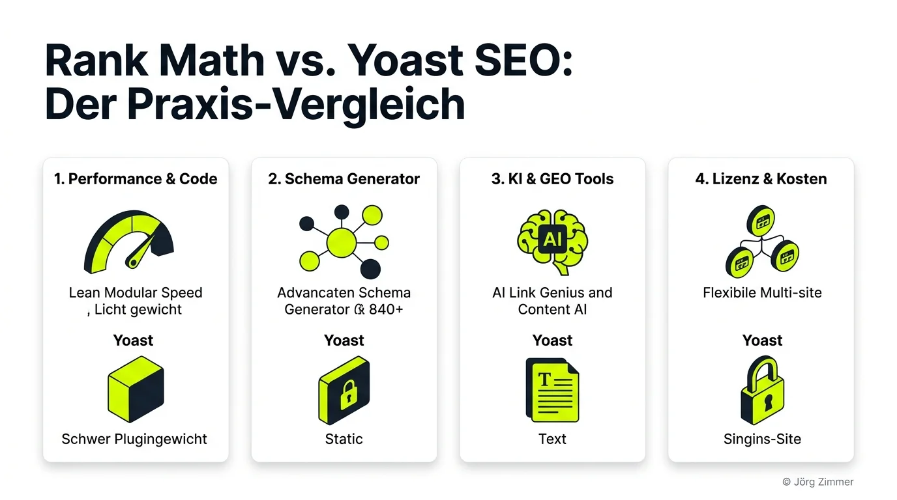
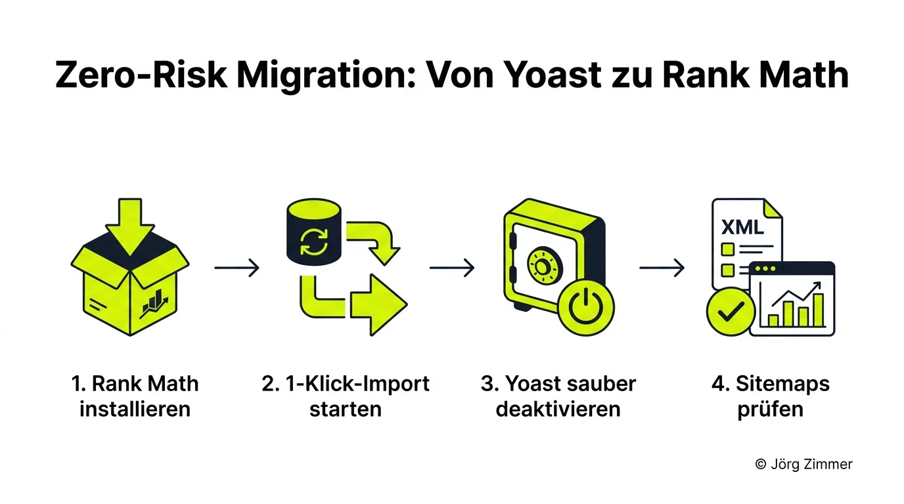

Über ein ganzes Jahrzehnt lang gab es im WordPress-Ökosystem eine ungeschriebene Regel: Wer eine neue Website aufsetzte, installierte als allererstes das Plugin mit dem markanten lilafarbenen Ampelsystem – Yoast SEO. Mit über 13 Millionen aktiven Installationen ist das niederländische Plugin bis heute das meistgenutzte SEO-Werkzeug der Welt. Doch die Zeiten haben sich fundamental geändert.

In den letzten Jahren hat sich eine stille, aber gewaltige Wachablösung vollzogen. Immer mehr erfahrene Webentwickler, Nischenseitenbetreiber und renommierte SEO-Agenturen kehren dem Platzhirsch den Rücken und migrieren zu **[Rank Math SEO* (Partnerlink)](https://rankmath.com/de/?ref=jorgzimmer)**. 

Warum vollzieht sich dieser Wechsel gerade jetzt mit solcher Wucht? Liegt es nur am aggressiven Marketing der Herausforderer, oder ist Yoast schlichtweg im verstaubten Erbe seiner eigenen Monopolstellung gefangen? In diesem ausführlichen Praxis-Vergleich werfen wir einen schonungslosen Blick unter die Haube beider Kontrahenten. Wir vergleichen System-Architektur, Performance, Schema-Markups, KI-Funktionen, Lizenzmodelle und zeigen dir Schritt für Schritt, wie ein reibungsloser Wechsel ohne Ranking-Delle gelingt.

<figure class="my-8 bg-neutral-50 border border-neutral-200 p-6 md:p-8 rounded-2xl shadow-sm">
  

    
    

      <h4 class="font-bold text-base md:text-lg text-dark mb-0">Jörg Zimmer</h4>
      
Senior SEO & AI Search Consultant

    

  

  <blockquote class="text-base md:text-lg text-dark leading-relaxed italic border-l-4 border-lime-accent pl-4 my-4 font-normal">
    „Erklärt, du hast drei Töchter. Wie erklärst du denen, was Papa macht beruflich? Ähm, oh, meinen Töchtern äh Oh, mein mein meine meine meine zwei großen Töchter, die sie sind ja schon z 16 und 18. Äh, die die glaube ich die checken das die ähm die TikToken aber mehr. Ja, die googeln bei TikTok. Ähm, lass ich mir auch manchmal von denen erklären.“
  </blockquote>
  <figcaption class="mt-4 pt-3 border-t border-neutral-200/60 flex flex-wrap items-center justify-between gap-2 text-xs text-neutral-500">
    

      Experten-Zitat • <cite class="not-italic font-semibold text-neutral-700">Jörg Zimmer</cite>
      •
      <a href="https://www.youtube.com/watch?v=dVGOMAVUNQk&t=1102s" target="_blank" rel="noopener noreferrer" class="text-neutral-600 hover:text-dark underline inline-flex items-center gap-1">
        Quelle: YouTube SEOPresso (18:22)
        <svg class="w-3 h-3 text-neutral-400" fill="none" stroke="currentColor" viewBox="0 0 24 24"><path stroke-linecap="round" stroke-linejoin="round" stroke-width="2" d="M10 6H6a2 2 0 00-2 2v10a2 2 0 002 2h10a2 2 0 002-2v-4M14 4h6m0 0v6m0-6L10 14" /></svg>
      </a>
    

    <a href="https://www.linkedin.com/in/joerg-zimmer-seo-sea-freelancer-berlin-spandau/" target="_blank" rel="noopener noreferrer" class="font-bold text-lime-700 hover:underline inline-flex items-center gap-1 shrink-0">
      Jörg Zimmer auf LinkedIn folgen →
    </a>
  </figcaption>
</figure>

  

    30-Sekunden Inhaber-Check
  

  <h3 class="text-lg font-bold text-dark mb-2">Jörgs Praxistipp: Wann lohnt sich der Umstieg sofort?</h3>
  

    Wenn du mehr als eine einzige WordPress-Website betreibst oder für Weiterleitungen, 404-Überwachung und strukturierte Daten bisher separate Drittanbieter-Plugins nutzt: Deinstalliere den Flickenteppich. Der Wechsel zu Rank Math spart dir nicht nur hunderte Euro an Lizenzgebühren, sondern bereinigt deine Datenbank nachhaltig von Altlasten.
  

---

## 1. Architektur & Performance: Modularer Leichtbau vs. historischer Plugin-Bloat

Einer der wichtigsten Hebel im modernen Web ist die Auslieferungsgeschwindigkeit. Seit Google die [Core Web Vitals](/glossar/core-web-vitals/) zum festen Rankingfaktor erhoben hat, zählt jede Millisekunde Latenz und jede überflüssige Datenbankabfrage. Genau hier offenbart sich der erste tiefgreifende Unterschied zwischen den beiden Systemen.

### Yoast SEO: Gewachsenes Schwergewicht
Yoast existiert seit 2010. Über mehr als anderthalb Jahrzehnte hinweg wurde der Code immer wieder erweitert, umgebaut und an neue WordPress-Versionen angepasst. Das Resultat ist eine monolithische Codebasis. Wenn du Yoast aktivierst, lädt das Plugin standardmäßig eine Fülle von Funktionen, Skripten und Admin-Hinweisen im Backend – ganz gleich, ob du sie aktiv nutzt oder nicht. 

Zudem ist das WordPress-Dashboard bei Yoast notorisch überfrachtet mit Bannern, Upgrade-Aufforderungen und Benachrichtigungen, die das Arbeiten für Redakteure verlangsamen. Zwar hat das Yoast-Team in den vergangenen Jahren Optimierungen an den Indexables-Tabellen vorgenommen, dennoch bleibt der PHP-Speicherbedarf vergleichsweise hoch.

### Rank Math: Konsequente Modularität
Rank Math wurde von Grund auf mit einem **modularen Framework** konzipiert. Was bedeutet das in der Praxis?
* Du siehst im Dashboard eine saubere Kachel-Übersicht aller Module (z. B. 404-Monitor, Weiterleitungen, Bild-SEO, WooCommerce, Video-Sitemap, Local SEO).
* Jedes einzelne Modul besitzt einen simplen Ein-/Aus-Schalter.
* Wenn du beispielsweise deine 404-Fehler lieber direkt über Server-Logfiles analysierst oder keinen Online-Shop betreibst, schaltest du diese Module mit einem Klick ab.
* **Der technische Vorteil:** Abgeschaltete Module laden weder PHP-Klassen noch Skripte in den Arbeitsspeicher und führen null zusätzliche Datenbankabfragen (SQL-Queries) aus.

In Benchmark-Messungen auf sauberen WordPress-Standardinstallationen schneidet Rank Math bei deaktivierten ungenutzten Modulen hinsichtlich Speichernutzung und Request-Laufzeiten regelmäßig schlanker ab als Yoast im Vollbetrieb. Für High-Performance-Projekte im [WordPress SEO](/glossar/wordpress-seo/) ist diese architektonische Schlankheit ein unschlagbares Argument.

### Datenbank-Struktur: Indexables vs. schlanke Tabellen
Wer tiefer in die MySQL-Datenbank schaut, erkennt erhebliche Unterschiede in der Datenablage:
* **Yoast Indexables:** Yoast hat vor einigen Jahren eigene Tabellen (`wp_yoast_indexable`, `wp_yoast_seo_links`) eingeführt, um alle Beitrags-Metadaten vorab zu indexieren. Das beschleunigt zwar das Auslesen im Frontend, führt bei großen Magazinen oder Online-Shops mit zehntausenden URLs jedoch häufig zu gigantischen Tabellengrößen, Index-Rebuild-Fehlern und zeitraubenden Migrationen bei Server-Umzügen.
* **Rank Math Tabellen:** Rank Math speichert wesentliche Metadaten primär in den nativen WordPress-Tabellen (`wp_postmeta`), nutzt für Spezialfunktionen wie 404-Monitoring und Redirects jedoch eigene, streng optimierte Tabellen (`wp_rank_math_redirections`, `wp_rank_math_404_logs`). Das hält die Kern-Tabellen aufgeräumt und verhindert unnötigen Overhead bei regulären Seitenaufrufen.

---

## 2. Die Feature-Matrix: Was bietet die Free-Version, was kostet extra?

Ein gigantischer Streitpunkt in der WordPress-Community ist der Funktionsumfang der jeweiligen kostenlosen Basis-Versionen im offiziellen WordPress-Plugin-Verzeichnis. Hier klafft eine gewaltige Schere zwischen den beiden Anbietern.

| Funktion / Feature | Yoast SEO Free | Yoast SEO Premium | Rank Math Free | Rank Math Pro |
| :--- | :--- | :--- | :--- | :--- |
| **Fokus-Keywords pro Beitrag** | 1 Keyword | Mehrere Keywords | **Bis zu 5 Keywords** | **Unbegrenzt** |
| **Redirect Manager (301, 302, 410)** | ❌ Nein | ✅ Ja | **✅ Vollständig integriert** | **✅ Integriert** |
| **404-Fehler-Monitor** | ❌ Nein | ❌ Nein | **✅ Integriert mit Logfile** | **✅ Integriert mit Logfile** |
| **Automatisches Bild-SEO (Alt & Title)** | ❌ Nein | ❌ Nein | **✅ Automatisch per Klick** | **✅ Erweitert** |
| **Schema.org Structured Data** | Basis-Graph | Basis-Graph | **18 Schema-Typen** | **840+ Custom Schema Builder** |
| **WooCommerce SEO** | ❌ Zusatz-Plugin (79 €/J.) | ❌ Zusatz-Plugin (79 €/J.) | Basis-Unterstützung | **✅ Vollständig integriert** |
| **Local SEO & Google Maps** | ❌ Zusatz-Plugin (79 €/J.) | ❌ Zusatz-Plugin (79 €/J.) | **✅ 1 Standort integriert** | **✅ Multi-Standort Support** |
| **News & Video Sitemaps** | ❌ Je 79 €/J. extra | ❌ Je 79 €/J. extra | ❌ Nein | **✅ Vollständig integriert** |
| **Google Search Console Einbindung** | ❌ Nur Verifikation | ❌ Nur Verifikation | **✅ Analytics-Dashboard** | **✅ Keyword-Rank-Tracker** |
| **Lizenzmodell** | Kostenlos | **1 Seite (99 €/Jahr)** | Kostenlos | **Unbegrenzte eigene Seiten** |

### Der Fokus-Keyword-Vergleich
In Yoast Free kannst du deinen Text auf exakt ein einziges Keyword hin optimieren. Möchtest du Synonyme, Long-Tail-Varianten oder sekundäre Suchbegriffe gegen die Inhalts-Länge gegenprüfen, zwingt dich Yoast zum kostenpflichtigen Premium-Abo. 

Rank Math hingegen erlaubt dir bereits in der Free-Version die Eingabe von bis zu **5 Fokus-Keywords**. Das Plugin prüft für jeden einzelnen Begriff separat, ob er im Title, in der Meta-Description, in der URL und in den Zwischenüberschriften vorkommt. Für Content-Manager, die moderne Money-Keywords mit semantischen Entitäten kombinieren, ist das ein massiver Vorteil im redaktionellen Alltag.

### Der Redirect-Manager: Ein Muss für jede Domain
Wer URLs umbenennt, Artikel zusammenlegt oder alte Inhalte löscht, muss zwingend saubere 301-Weiterleitungen einrichten, um Crawling-Fehler und Ranking-Verluste zu verhindern. 

* Bei Yoast ist der Weiterleitungs-Manager ein reines Premium-Feature. Nutzt du nur Yoast Free, bist du gezwungen, ein zusätzliches Drittanbieter-Plugin (wie *Redirection*) zu installieren – was die Plugin-Liste weiter aufbläht.
* Bei Rank Math ist der vollständige Redirect-Manager mit automatischer URL-Überwachung bereits in der kostenlosen Version enthalten. Änderst du den Slug eines Beitrags, fragt dich Rank Math automatisch, ob die alte URL per 301 auf den neuen Pfad umgeleitet werden soll.

### Die Redaktions-Erfahrung im Gutenberg-Editor: Ampel-Dogmatismus vs. 100-Punkte-Score
Wie fühlt sich das Schreiben im Redaktionsalltag mit beiden Plugins an?
* **Yoasts starres Ampelsystem (Grün/Orange/Rot):** Yoast arbeitet seit jeher mit einem rigiden Ampelsystem für SEO und Lesbarkeit (Flesch-Reading-Ease). Für Anfänger bietet das eine grobe Orientierung, im Agenturalltag führt es jedoch regelmäßig zu Frustration: Texter versuchen krampfhaft, jede Ampel auf „Grün“ zu biegen, was oft zu unnatürlichen Satzstrukturen und künstlicher Keyword-Dichte führt. Google belohnt 2026 jedoch echte Experience und Information Gain – keine starre Silbenzählung.
* **Rank Maths 100-Punkte-Score:** Rank Math integriert sich elegant in die Gutenberg-Seitenleiste und bewertet Inhalte auf einer Skala von 0 bis 100 Punkten. Das Feedback ist in vier logische Kategorien unterteilt: *Basis-SEO*, *Zusätzliche Tests* (z. B. Keyword in Überschriften, URL-Länge), *Titel-Lesbarkeit* und *Inhalts-Lesbarkeit*. Der entscheidende Praxis-Vorteil: Du siehst sofort numerisch, welche Optimierung wie viele Punkte bringt, ohne durch bevormundende Farb-Ampeln blockiert zu werden.

> [!TIP]
> **Jörgs Praxiserfahrung zum Ampel-Wahn:**  
> Ich habe in meiner Laufbahn dutzende Redaktionsteams geschult. Das häufigste Dilemma bei Yoast: Ein Texter schreibt einen fachlich tiefen, exzellenten Absatz mit spürbarem E-E-A-T-Mehrwert. Prompt schlägt die Yoast-Ampel rot an: *„32 % deiner Sätze enthalten mehr als 20 Wörter. Nutze kürzere Sätze!“* Aus Angst vor der roten Ampel zerhacken Autoren logische Zusammenhänge in staccatoartige Dreiwortsätze. Das mag für einen Flesch-Algorithmus aus dem letzten Jahrzehnt toll sein – für moderne Sprachmodelle und anspruchsvolle Leser ist es eine Katastrophe. Rank Math gibt dir Orientierung, lässt dir aber deine redaktionelle Freiheit.

---

## 3. Schema.org & Rich Snippets: Visueller Custom Builder vs. starre Graphen

Im Zeitalter generativer Suchmaschinen (AEO & GEO) ist [Schema.org Markup](/glossar/schema-org-markup/) das wichtigste Bindeglied zwischen deinem menschlichen Text und den Parsing-Algorithmen von Google, ChatGPT und Perplexity. Maschinen verstehen strukturierte Daten in Form von JSON-LD um ein Vielfaches präziser als unstrukturierten Fließtext.

### Yoasts Ansatz: Solide, aber unflexibel
Yoast setzt auf einen zusammenhängenden Knowledge-Graph-Ansatz. Das Plugin verknüpft die Website, das Unternehmen (Organization) und den Autor (Person) in einem sauberen JSON-LD-Baum. Für Standard-Websites mit Blogartikeln funktioniert das einwandfrei.

Das Problem beginnt, sobald du spezifische Anforderungen hast:
* Du möchtest einem Software-Artikel gleichzeitig ein *Review*-, ein *SoftwareApplication*- und ein *FAQPage*-Schema mitgeben?
* Du möchtest benutzerdefinierte Felder (ACF – Advanced Custom Fields) dynamisch in dein JSON-LD einspeisen?
* Bei Yoast musst du dafür entweder komplexe PHP-Filter in der `functions.php` schreiben oder auf teure Drittanbieter-Lösungen ausweichen. Für Nicht-Programmierer ist das eine unüberwindbare Hürde.

### Rank Maths Revolution: Der Custom Schema Builder (Pro)
Hier deklassiert Rank Math Pro den Mitbewerber vollständig. Während die Free-Version bereits 18 vorgefertigte Schematypen per Dropdown mitbringt, schaltet die Pro-Version den visuellen **Custom Schema Generator** frei:

1. **Kombination beliebiger Entitäten (Multi-Schema):** Du kannst einer einzelnen URL beliebig viele Schematypen gleichzeitig zuweisen. Rank Math verknüpft sie valide im Quellcode.
2. **Schema-Vorlagen mit Bedingungen (Display Conditions):** Definiere ein Schema-Template für eine gesamte Kategorie (z. B. „Alle Artikel in Kategorie Testberichte erhalten das Product-Schema“) und lass die Felder automatisch mit Beitragsdaten befüllen.
3. **Konkurrenz-Schema importieren:** Du entdeckst bei einem Mitbewerber ein perfektes Rich Snippet in den SERPs? Kopiere einfach die URL in Rank Math: Das Tool liest das JSON-LD der fremden Seite aus und importiert die gesamte Struktur als bearbeitbare Vorlage in dein Dashboard!
4. **Validierung in Echtzeit:** Rank Math prüft dein generiertes JSON-LD direkt im Backend gegen die Richtlinien von Google, sodass du Syntaxfehler sofort erkennst, bevor die Seite gecrawlt wird.

---

## 4. KI-Integration 2026: Content AI 2.0 vs. Yoast AI

Künstliche Intelligenz ist aus modernen Redaktionsabläufen nicht mehr wegzudenken. Beide Anbieter haben in den letzten Monaten eigene KI-Lösungen vorgestellt, verfolgen jedoch völlig unterschiedliche Philosophien.

### Yoast AI Generate
Yoast bietet in seiner Premium- und AI+-Stufe die Funktion *Yoast AI Generate*. Das Tool beschränkt sich im Wesentlichen darauf, auf Knopfdruck Titel-Vorschläge und Meta-Descriptions zu generieren oder Absätze hinsichtlich Lesbarkeit und Formulierung zu überarbeiten. Es ist eine nützliche Hilfe für Einsteiger, bleibt funktional jedoch stark an der Oberfläche.

### Rank Math Content AI 2.0
Rank Math hat sein KI-Ökosystem mit der Version 2.0 zu einer vollständigen Content-Suite ausgebaut, die weit über Textgenerierung hinausgeht:

* **AI Link Genius (Brandneu):** Das Tool analysiert deine bestehende Webseitenstruktur und schlägt vollautomatisch kontextuell passende interne Verlinkungen und semantische Synonyme vor. Das verhindert verwaiste Seiten (Orphan Pages) und stärkt den internen PageRank-Fluss.
* **AI Visibility Monitoring (NEU):** Ermöglicht das Tracking deiner Markenerwähnungen direkt in generativen Suchmaschinen wie ChatGPT, Perplexity und Claude. Du siehst schwarz auf weiß, ob deine Inhalte in KI-Zusammenfassungen zitiert werden.
* **RankBot:** Ein integrierter SEO-Fachberater direkt in WordPress. Du kannst ihm spezifische Fragen zu deinem Text stellen, Gliederungen anfordern oder Schwachstellen im Inhalt analysieren lassen.
* **Über 40 spezialisierte KI-Assistenten & 125+ Prompts:** Vom FAQ-Generator über Review-Zusammenfassungen bis hin zu automatischen Alt-Texten für hochgeladene Bilder.

---

## 5. Das Kosten-Duell: Der größte finanzielle Hebel

Kommen wir zum Punkt, der für Agenturen, Freelancer und Webmaster mit mehreren Projekten den Ausschlag gibt: den Lizenzkosten. Hier zeigt sich die unterschiedliche Preispolitik beider Unternehmen in aller Deutlichkeit.

### Das Yoast-Preismodell: Abrechnung pro Domain
Yoast verlangt für sein Premium-Plugin rund **99 € bis 118,80 $ pro Jahr – und zwar für jede einzelne Website**. Betreibst du drei Projekte, zahlst du dreimal.

Richtig teuer wird es jedoch, wenn du Spezialfunktionen benötigst, die bei Yoast in separate Add-ons ausgelagert sind:
* Yoast SEO Premium: ca. 99 € / Jahr
* Yoast Local SEO: 79 € / Jahr
* Yoast WooCommerce SEO: 79 € / Jahr
* Yoast Video SEO: 79 € / Jahr
* Yoast News SEO: 79 € / Jahr
* **Gesamtkosten für EINE voll ausgestattete E-Commerce-Website:** **über 415 € pro Jahr!**

### Das Rank Math Preismodell: Skalierbare Pauschalen
Rank Math verzichtet auf den teuren Zukauf einzelner Modul-Lizenzen. Alle Erweiterungen (Local, Video, News, WooCommerce) sind in den Haupttarifen bereits vollständig enthalten.

* **Rank Math Pro (~ 7,99 € / Monat bzw. 95,88 € / Jahr zzgl. MwSt., aktuell im Angebot):**
  * Gilt für **UNBEGRENZTE persönliche Websites**, die dir selbst gehören.
  * Inklusive Rank Tracker für 500 Keywords.
  * Inklusive aller Pro-Module und Custom Schema Builder.
* **Rank Math Business (~ 24,99 € / Monat bzw. 299,88 € / Jahr zzgl. MwSt.):**
  * Gilt für bis zu **100 Kunden-Websites**.
  * 10.000 Keywords im Tracking, E-Commerce-Suite und Priority Support.
* **Rank Math Agency (~ 54,99 € / Monat bzw. 659,88 € / Jahr zzgl. MwSt.):**
  * Gilt für bis zu **500 Kunden-Websites**.
  * White-Label-Kundenberichte und Tracking für 50.000 Suchbegriffe.

Der Screenshot der offiziellen Preisübersicht belegt den radikalen Unterschied: Während andere Anbieter jede WordPress-Instanz einzeln zur Kasse bitten, schaltet bereits die Rank Math Pro Lizenz unbegrenzte persönliche Domains frei.

Aktuelle Aktionen und Detailkonditionen findest du direkt auf der offiziellen Seite unter **[Rank Math Sonderangebote & Pricing* (Partnerlink)](https://rankmath.com/de/offer/?ref=jorgzimmer)**.

### Die Kosten-Kalkulation für die Praxis:

| Szenario | Yoast SEO Kosten | Rank Math Kosten | Jährliche Ersparnis mit Rank Math |
| :--- | :--- | :--- | :--- |
| **Blogger mit 3 eigenen Projekten** | ca. 297 € / Jahr | **ca. 96 € / Jahr (Pro)** | **~ 201 € (67 % Ersparnis)** |
| **Shop-Betreiber (WooCommerce + Local)** | ca. 257 € / Jahr | **ca. 96 € / Jahr (Pro)** | **~ 161 € (62 % Ersparnis)** |
| **Freelancer mit 15 Kunden-Websites** | ca. 1.485 € / Jahr | **ca. 300 € / Jahr (Business)** | **~ 1.185 € (80 % Ersparnis)** |
| **Agentur mit 50 Kunden-Websites** | ca. 4.950 € / Jahr | **ca. 300 € / Jahr (Business)** | **~ 4.650 € (93 % Ersparnis!)** |

Für jeden Dienstleister oder Webseitenbetreiber, der mehr als eine Domain verwaltet, ist diese Rechnung ein buchhalterischer No-Brainer.

  

    Praxis-Fall aus meiner SEO-Sprechstunde
  

  <h3 class="text-lg font-bold text-dark mb-2">Wie ein Berliner E-Commerce-Kunde über 1.800 Euro Lizenzkosten einsparte</h3>
  

    Erst vor zwei Monaten saß ein Mandant in meiner SEO-Sprechstunde. Sein Setup: Drei spezialisierte WooCommerce-Shops und elf thematische Nischen- und Content-Portale. Für jedes einzelne Projekt hatte er brav Yoast SEO Premium plus die separaten Add-ons für WooCommerce und Local SEO gebucht.
  

  

    <strong>Die jährliche Quittung:</strong> Satte 2.180 Euro – Jahr für Jahr, nur um Metadaten und XML-Sitemaps zu verwalten! Dazu kam: Die Ladezeiten im Checkout schwächelten, weil drei verschiedene Yoast-Erweiterungen gleichzeitig in die Datenbank griffen.
  

  

    <strong>Die Lösung:</strong> Wir haben an einem einzigen Vormittag alle 14 Instanzen per 1-Klick-Importer auf Rank Math umgezogen und eine einzige <em>Rank Math Business Lizenz</em> (rund 300 Euro/Jahr) hinterlegt. Das Ergebnis: Über 1.880 Euro Ersparnis im Jahr, sauber konsolidierte Schema-Markups für alle Produkte und eine um 140 Millisekunden verbesserte Time-to-First-Byte (TTFB).
  

---

## 6. Schritt-für-Schritt-Anleitung: Zero-Risk Migration von Yoast zu Rank Math

Die größte Angst vieler Seitenbetreiber vor einem Wechsel ist der Verlust von Google-Rankings. Diese Sorge ist verständlich, aber bei sauberer Vorgehensweise völlig unbegründet. Rank Math besitzt einen hochentwickelten Migrations-Assistenten, der alle Daten verlustfrei übernimmt.

Befolge diesen erprobten 4-Schritte-Workflow:

### Schritt 1: Backup erstellen & Rank Math installieren
Erstelle vor jeder größeren Änderung an deiner WordPress-Installation ein vollständiges Backup deiner Datenbank und Dateien. Installiere anschließend das kostenlose Plugin [Rank Math](/glossar/rank-math/) über das WordPress-Dashboard (*Plugins → Installieren*).

### Schritt 2: Den Einrichtungs-Assistenten & 1-Klick-Import starten
Sobald du Rank Math aktivierst, startet der Einrichtungs-Assistent:
1. Wähle den Modus **„Erweitert“ (Advanced)**, um die volle Kontrolle über alle Einstellungen zu haben.
2. Rank Math erkennt automatisch, dass Yoast SEO auf deiner Website aktiv ist, und bietet dir den Reiter **„Import von Yoast SEO“** an.
3. Setze Haken bei allen Datenpunkten:
   * *Einstellungen (General Settings)*
   * *SEO-Titel & Meta-Beschreibungen*
   * *OpenGraph- & Social-Media-Metadaten*
   * *Beitrags-Metadaten (inkl. Fokus-Keywords)*
   * *Weiterleitungen (Redirects)*
4. Klicke auf **„Import starten“**. Rank Math liest alle Einträge aus den Yoast-Tabellen aus und überträgt sie in seine eigene Struktur. Deine alten Daten werden dabei nicht gelöscht, sondern nur kopiert.

### Schritt 3: Yoast SEO sauber deaktivieren
Sobald der Import mit einer Erfolgsmeldung („100 % abgeschlossen“) bestätigt wird, schlägt dir Rank Math vor, Yoast SEO automatisch zu deaktivieren. Stimme dem zu! 

> [!IMPORTANT]
> **Niemals zwei SEO-Plugins gleichzeitig aktiv lassen:**  
> Stelle sicher, dass Yoast SEO nach dem Import tatsächlich deaktiviert ist. Wenn beide Plugins gleichzeitig laufen, werden [Canonical Tags](/glossar/canonical-tag/) doppelt ausgegeben und XML-Sitemaps geraten in Konflikt, was Suchmaschinen-Crawler massiv verwirrt.

### Schritt 4: Sitemaps prüfen & IndexNow scharfschalten
Überprüfe nach der Umstellung deine neue Sitemap-URL (in der Regel `deine-domain.de/sitemap_index.xml`) sowie die Direktiven in deiner [Robots.txt](/glossar/robots-txt/). Rank Math generiert saubere XML-Sitemaps für Beiträge, Seiten und Kategorien. 

* Prüfe, ob leere Taxonomien oder Autoren-Archive korrekt auf [Noindex](/glossar/noindex/) gesetzt sind.
* Aktiviere das Modul **IndexNow**: Dadurch werden Änderungen an deinen Inhalten in Echtzeit an Suchmaschinen wie Bing und Yandex übermittelt, ohne dass du auf den nächsten regulären Bot-Crawl warten musst.

Da die ausgegebenen Title-Tags, Meta-Descriptions und Canonical-Strukturen exakt identisch mit deinen vorherigen Yoast-Einstellungen sind, bemerkt Google auf der Render-Ebene keinen Unterschied – deine Rankings bleiben stabil.

> [!NOTE]
> **Praxistipp aus über 50 Plugin-Migrationen:**  
> Viele Webseitenbetreiber fragen mich vor dem Umstieg mit Sorgenfalten: *„Jörg, was passiert mit meinen hart erarbeiteten Google-Rankings, wenn ich den Schalter umlege?“* Meine beruhigende Antwort: Bei sauberem Import absolut gar nichts! Suchmaschinen-Crawler interessieren sich nicht dafür, welches Plugin deine Tags im WordPress-Backend generiert. Google liest lediglich den fertig gerenderten HTML-Quellcode. Da Rank Math deine bestehenden Title-Tags, Descriptions, OpenGraph-Metadaten und Canonical-Pfade 1:1 übernimmt, sieht der Googlebot dieselbe semantische Struktur wie zuvor – nur dass deine Seite dank weniger Datenbank-Ballast schneller lädt.

---

## 7. Jörgs Praxis-Urteil: Für wen lohnt sich der Wechsel heute wirklich?

Nach über 25 Jahren in der Suchmaschinenoptimierung habe ich unzählige Tool-Trends kommen und gehen sehen. Yoast SEO bleibt ein stabiles, solides Plugin für alle, die eine einzelne, einfache Website betreiben, mit den Standard-Ampeln zufrieden sind und keine Lust auf einen Systemwechsel haben.

Wenn du jedoch:
* **Mehr als eine Website** betreibst oder Kundenprojekte betreust,
* Deinen PageSpeed optimieren und unnötigen Plugin-Ballast aus der Datenbank verbannen willst,
* Moderne **Rich Snippets und Schema.org-Strukturen** ohne Programmieraufwand flexibel anpassen möchtest,
* Einen integrierten Weiterleitungs-Manager und sauberes 404-Monitoring ohne Zusatz-Plugins verlangst,
* Oder deine Website fit für die Ära der **KI-Suchmaschinen und Generative Engine Optimization (GEO)** machen willst,

dann führt 2026 kein rationaler Weg mehr an **[Rank Math SEO* (Partnerlink)](https://rankmath.com/de/?ref=jorgzimmer)** vorbei. Das Preis-Leistungs-Verhältnis ist unerreicht, die Codebasis ist modern und der Migrationsprozess dauert weniger als fünf Minuten.

  <h3 class="text-xl md:text-2xl font-bold text-white mb-3 !mt-0 !border-none !pb-0">
    Bereit für den Wechsel zu Rank Math?
  </h3>
  

    Sichere dir die volle Power von unbegrenzten Websites, Custom Schema Builder und Content AI zum fairen Jahrespreis.
  

  <a href="https://rankmath.com/de/offer/?ref=jorgzimmer" target="_blank" rel="noopener noreferrer nofollow sponsored" class="btn-primary">
    Aktuelle Rank Math Angebote ansehen * (Partnerlink)
    →
  </a>
  
* Hinweis: Partnerlink. Bei Buchung erhalte ich eine Provision – für dich entstehen keine Mehrkosten.

---

## 8. Häufige Fragen zu Rank Math vs. Yoast SEO (FAQ)

### Kann ich von Rank Math im Notfall wieder zu Yoast zurückwechseln?
Ja. Rank Math speichert seine Daten sauber und standardisiert ab. Es gibt für Yoast wiederum Importer-Skripte. Dennoch ist ein Rückwechsel in der Praxis extrem selten, da Nutzer nach dem Umstieg fast ausnahmslos die größere Flexibilität und Übersicht von Rank Math schätzen.

### Benötige ich zwingend die kostenpflichtige Pro-Version von Rank Math?
Nein! Bereits die kostenlose Version von Rank Math bietet mehr Funktionen als Yoast Premium (u. a. 5 Fokus-Keywords, Redirect-Manager, 404-Monitor, 18 Schema-Typen). Die Pro-Version lohnt sich vor allem dann, wenn du den visuellen Custom Schema Builder, den Keyword-Rank-Tracker, die E-Commerce-Tools oder unbegrenzte Website-Lizenzen benötigst.

### Wie beeinflusst das Plugin meine Google PageSpeed Scores?
Rank Math verbraucht bei Deaktivierung ungenutzter Module weniger PHP-Ressourcen und führt weniger unnötige SQL-Abfragen im Backend und Frontend aus. In Kombination mit einem sauberen Caching-Setup sorgt das für geringere Serverantwortzeiten (TTFB) und unterstützt das Erreichen exzellenter Core Web Vitals.

  <h3 class="text-xl md:text-2xl font-bold text-white mb-3 !mt-0 !border-none !pb-0">
    Jetzt an der Diskussion teilnehmen
  </h3>
  

    Diskutiere mit Jörg Zimmer und der SEO-Community auf LinkedIn über diesen Beitrag.
  

  <a href="https://www.linkedin.com/in/joerg-zimmer-seo-sea-freelancer-berlin-spandau/" target="_blank" rel="noopener noreferrer" class="btn-primary">
    <svg class="w-4 h-4 fill-current" viewBox="0 0 24 24"><path d="M20.447 20.452h-3.554v-5.569c0-1.328-.027-3.037-1.852-3.037-1.853 0-2.136 1.445-2.136 2.939v5.667H9.351V9h3.414v1.561h.046c.477-.9 1.637-1.85 3.37-1.85 3.601 0 4.267 2.37 4.267 5.455v6.286zM5.337 7.433c-1.144 0-2.063-.926-2.063-2.065 0-1.138.92-2.063 2.063-2.063 1.14 0 2.064.925 2.064 2.063 0 1.139-.925 2.065-2.064 2.065zm1.782 13.019H3.555V9h3.564v11.452zM22.225 0H1.771C.792 0 0 .774 0 1.729v20.542C0 23.227.792 24 1.771 24h20.451C23.2 24 24 23.227 24 22.271V1.729C24 .774 23.2 0 22.222 0h.003z"/></svg>
    Beitrag auf LinkedIn öffnen
    →
  </a>

