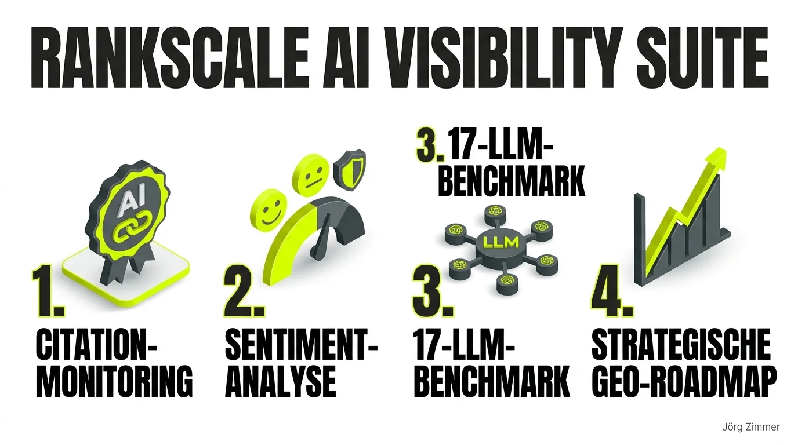

Die entscheidende Fragestellung im Zeitalter von [Generative Engine Optimization (GEO)](/glossar/geo/) lautet längst nicht mehr nur: Auf welchem Rang stehe ich bei Google in den organischen Suchergebnissen? Die weitaus existenziellere Frage lautet: **Wie sichtbar ist meine Marke in ChatGPT, Perplexity, Claude oder Google Gemini – und was genau erzählen die generativen Sprachmodelle über meine Expertise?**

Über Monate hinweg war dieses Thema ein reines Ratespiel. Man tippte sporadisch einen Prompt in ChatGPT ein: *„Welche SEO-Berater in Berlin kannst du empfehlen?“* Wenn der eigene Name fiel, war die Freude groß. Wenn nicht, wusste man weder den Grund noch die Systematik dahinter. Keine belastbaren Daten, keine Vergleichswerte, keine historische Entwicklung.

Genau an diesem Schmerzpunkt setzt <a href="https://rankscale.ai/?via=offer" target="_blank" rel="noopener noreferrer nofollow sponsored">Rankscale (Partnerlink)</a> an. In meiner täglichen Praxis nutze ich die Plattform parallel zu <a href="https://seranking.com/de/?ga=4169588&source=link" target="_blank" rel="noopener noreferrer nofollow sponsored">SE Ranking (Partnerlink)</a>, um die Brücke zwischen klassischem Suchmaschinen-Ranking und generativer Empfehlungs-Präsenz lückenlos zu schließen.

### Der Praxistest: Was das Tool im echten Projektalltag leistet

Ich habe die Lösung des österreichischen Entwicklerteams über mehrere Monate intensiv auf Herz und Nieren geprüft – sowohl für meine eigene Webpräsenz als auch für anspruchsvolle Kundenprojekte im B2B- und E-Commerce-Umfeld.

Die Kernarchitektur überzeugt durch klare Struktur und durchdachte Features:

| Feature-Modul | Analysierte Datenbasis | Operativer Mehrwert für GEO |
| :--- | :--- | :--- |
| **Citation Tracking** | Ob und an welcher Position deine Domain verlinkt wird | Nachweisbare organische Zitationsbasis |
| **Sentiment-Analyse** | Positive Empfehlung, neutraler Kontext oder Kritik | Aktives KI-Reputationsmanagement |
| **17-LLM-Coverage** | ChatGPT, Claude, Gemini, Perplexity, Copilot u.a. | Keine blinden Flecken in relevanten Modellen |
| **Wettbewerbsradar** | Wer wird statt deiner Marke empfohlen? | Aufdecken von Content- und Entity-Lücken |
| **Historischer Trend** | Entwicklung über Wochen und Monate | ROI-Nachweis für Content-Investitionen |

### Das Rankscale Page-Audit V2: 100 % KI-Crawlability und LLM-Readiness auf dem Prüfstand

Neben dem laufenden Prompt-Monitoring bietet Rankscale mit dem integrierten **Page-Audit V2** einen spezialisierten Crawler, der Webseiten gezielt aus der Perspektive generativer Sprachmodelle analysiert. Im Gegensatz zu klassischen SEO-Crawlern prüft das Tool, ob der Content für LLMs maschinell verdaubar aufbereitet ist:

Die Auswertung unserer eigenen Domain `teleschmie.de` belegt die zentralen Faktoren für maximale KI-Akzeptanz:
- **100 % Crawlability für KI-Bots:** Keine Blockaden durch restriktive Web Application Firewalls (WAF) oder fehlerhafte Header.
- **Semantische Inhaltsstruktur:** Klare semantische Hierarchien, Tabellen und prägnante Definitionssätze, die LLMs als direkte Zitationsquelle nutzen können.
- **Strukturiertes Schema Markup:** Verschachteltes JSON-LD, das Fakten, Autoren und Entitäten maschinenlesbar verankert.

### Der Sentiment-Check: Warum Tonalität über den Lead entscheidet

Das für mich wertvollste Alleinstellungsmerkmal ist die automatisierte Sentiment-Erfassung. Es genügt heute nicht mehr, dass eine KI deinen Firmennamen beiläufig erwähnt. Entscheidend ist das **Wie**:
* Empfiehlt Claude dich als führenden Experten für ein Spezialthema?
* Zitiert Perplexity deine Website als unanfechtbare Primärquelle?
* Oder taucht dein Name in einem zweifelhaften Vergleich auf, der potenzielle Kunden abschreckt?

Dieses qualitative Stimmungsbild ist das Herzstück für nachhaltiges [Trustworthiness im E-E-A-T](/glossar/trustworthiness-eeat/). Wenn Sprachmodelle ungenaue oder negative Aussagen über dein Angebot treffen, kannst du dank des Trackings gezielte PR- und Entity-Korrekturen vornehmen, bevor geschäftlicher Schaden entsteht.

<figure class="my-8 bg-neutral-50 border border-neutral-200 p-6 md:p-8 rounded-2xl shadow-sm">
  

    
    

      <h4 class="font-bold text-base md:text-lg text-dark mb-0">Jörg Zimmer</h4>
      
Senior SEO & AI Search Consultant

    

  

  <blockquote class="text-base md:text-lg text-dark leading-relaxed italic border-l-4 border-lime-accent pl-4 my-4 font-normal">
    „Die Tools, die gibt es erst seit zwei, drei Monaten. Aber erstmal Ausgangslage messen und dann gucken, okay, ich fahre jetzt mal ein paar kleine Aktionen in Richtung AI Visibility und ich gucke in drei Monaten nochmal.“
  </blockquote>
  <figcaption class="mt-4 pt-3 border-t border-neutral-200/60 flex flex-wrap items-center justify-between gap-2 text-xs text-neutral-500">
    

      Experten-Zitat • <cite class="not-italic font-semibold text-neutral-700">Jörg Zimmer</cite>
      •
      <a href="https://www.youtube.com/watch?v=pJFZzv5LEvk&t=1719s" target="_blank" rel="noopener noreferrer" class="text-neutral-600 hover:text-dark underline inline-flex items-center gap-1">
        Quelle: YouTube Talk Antonio Blago & Jörg Zimmer Folge 5 (28:39)
        <svg class="w-3 h-3 text-neutral-400" fill="none" stroke="currentColor" viewBox="0 0 24 24"><path stroke-linecap="round" stroke-linejoin="round" stroke-width="2" d="M10 6H6a2 2 0 00-2 2v10a2 2 0 002 2h10a2 2 0 002-2v-4M14 4h6m0 0v6m0-6L10 14" /></svg>
      </a>
    

    <a href="https://www.linkedin.com/in/joerg-zimmer-seo-sea-freelancer-berlin-spandau/" target="_blank" rel="noopener noreferrer" class="font-bold text-lime-700 hover:underline inline-flex items-center gap-1 shrink-0">
      Jörg Zimmer auf LinkedIn folgen →
    </a>
  </figcaption>
</figure>

### Warum 17 Sprachmodelle statt nur ChatGPT?

In der Praxis erlebe ich häufig Kunden, die ausschließlich ChatGPT im Blick haben. Das greift jedoch viel zu kurz. Jedes Large Language Model greift auf unterschiedliche Trainingskorpora, Web-Indizes und Gewichtungen zurück:
1. **Perplexity** setzt extrem stark auf aktuelle Fachartikel, nachrichtenaktuelle Blogs und strukturierte Tabellen.
2. **Claude** brilliert bei tiefgehenden, nuancierten Analysen und verlangt hohe thematische Stringenz ([Topical Authority](/glossar/topical-authority/)).
3. **Google Gemini** ist tief in das Google-Ökosystem und den Knowledge Graph verwoben.

Wer nur ein einziges System analysiert, verliert mehr als die Hälfte seiner potenziellen Zielgruppe aus den Augen. Ergänzend zu den Auswertungen im [Rankscale 17 LLMs Tracking](/blog/rankscale-ai-visibility-tracking-17-llms/) empfiehlt sich auch ein Blick auf den [SE Ranking AI Tracker](/blog/se-ranking-ai-tracker/) für ganzheitliche Analysen.

### Tacheles-Urteil: Wann lohnt sich das Investment?

<a href="https://rankscale.ai/?via=offer" target="_blank" rel="noopener noreferrer nofollow sponsored">Rankscale (Partnerlink)</a> versucht nicht, die zehnte All-in-One-SEO-Suite nachzubauen. Der absolute Fokus liegt auf der Messung und Optimierung generativer Sichtbarkeit. Der Support reagiert zügig und neue Sprachmodelle werden zügig nachgepflegt.

In meiner [SEO-Sprechstunde](/seo-sprechstunde/) erleben wir regelmäßig Aha-Momente, wenn wir mit Kunden die tatsächliche Wahrnehmung ihrer Marke in den KI-Engines analysieren. Daten schlagen Bauchgefühl in jedem einzelnen Fall.

  <h3 class="text-xl font-bold text-dark mb-2 !mt-0 !border-none !pb-0">Möchtest du wissen, wie KIs über dein Unternehmen urteilen?</h3>
  
Hör auf zu raten und mach deine KI-Reputation messbar. Mit Rankscale überwachst du 17 führende LLMs und sicherst deinen Wettbewerbsvorsprung:

  <a href="https://rankscale.ai/?via=offer" target="_blank" rel="noopener noreferrer nofollow sponsored" class="btn-primary inline-flex">Rankscale für dein Unternehmen testen * (Partnerlink) →</a>
  
* Hinweis: Partnerlink. Bei Buchung erhalte ich eine Provision – für dich entstehen keine Mehrkosten.

<!-- LinkedIn CTA Box -->

  <h3 class="text-xl md:text-2xl font-bold text-white mb-3 !mt-0 !border-none !pb-0">
    Jetzt an der Diskussion teilnehmen
  </h3>
  

    Diskutiere mit Jörg Zimmer und der SEO-Community auf LinkedIn über diesen Beitrag.
  

  <a href="https://www.linkedin.com/posts/joerg-zimmer-seo-sea-freelancer-berlin-spandau_das-ai-visibility-tool-rankscale-hat-einen-activity-7418685351940022272-7Z27" target="_blank" rel="noopener noreferrer" class="btn-primary">
    <svg class="w-4 h-4 fill-current" viewBox="0 0 24 24"><path d="M20.447 20.452h-3.554v-5.569c0-1.328-.027-3.037-1.852-3.037-1.853 0-2.136 1.445-2.136 2.939v5.667H9.351V9h3.414v1.561h.046c.477-.9 1.637-1.85 3.37-1.85 3.601 0 4.267 2.37 4.267 5.455v6.286zM5.337 7.433c-1.144 0-2.063-.926-2.063-2.065 0-1.138.92-2.063 2.063-2.063 1.14 0 2.064.925 2.064 2.063 0 1.139-.925 2.065-2.064 2.065zm1.782 13.019H3.555V9h3.564v11.452zM22.225 0H1.771C.792 0 0 .774 0 1.729v20.542C0 23.227.792 24 1.771 24h20.451C23.2 24 24 23.227 24 22.271V1.729C24 .774 23.2 0 22.222 0h.003z"/></svg>
    Beitrag auf LinkedIn öffnen
    →
  </a>

