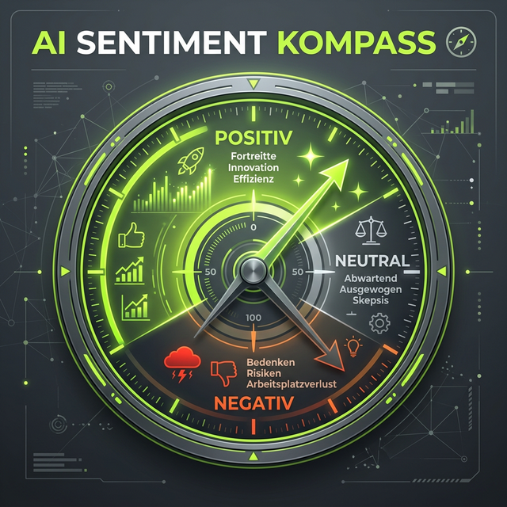

Die große Frage im AI-SEO-Zeitalter ist nicht mehr nur, auf welcher Position du bei Google stehst. Die neue, viel spannendere Frage lautet: **Wie sichtbar bin ich eigentlich in ChatGPT, Perplexity, Claude und all den anderen AI-Systemen?**

Früher war alles "einfach". Wir hatten die Google Search Console, wir hatten Tools wie Sistrix oder Ahrefs und haben uns über Nachkommastellen beim Sichtbarkeitsindex gefreut. Aber was nützt dir ein Sichtbarkeitsindex von 10 bei Google, wenn die Leute ihre Kaufentscheidungen heute immer öfter auf Basis der Empfehlungen eines KI-Assistenten treffen?

## Der Blindflug in der KI-Suche

Bisher war das Ganze ein totaler Blindflug. Man hat ab und zu mal ChatGPT gefragt: "Hey, kennst du Jörg Zimmer?" oder "Wer ist der beste SEO in Berlin?". Wenn die Antwort passte, hat man sich gefreut. Wenn nicht, wusste man nicht mal, WARUM. Es gab keine Daten, keine Historie, keinen Wettbewerbsvergleich. 

Genau hier setzt **Rankscale** an. Ich habe mir das Tool aus Österreich in den letzten Wochen genauer angeschaut und muss sagen: Es ist für mich aktuell die Antwort auf die dringendste Frage im modernen SEO.

## Rankscale im echten Praxis-Test

Rankscale ist nicht einfach nur ein weiteres Keyword-Tool. Es ist ein AI Visibility Tracker. Ich habe damit meine eigene Domain `teleschmie.de` und die Projekte einiger Kunden durch die Mangel gedreht. Was das Tool wirklich liefert:

### 1. Tracking deiner Erwähnungen (Citations)
Es geht nicht nur darum, ob du erwähnt wirst, sondern WIE. Rankscale zeigt dir, ob die KI dich als Quelle verlinkt oder ob du nur beiläufig erwähnt wirst. Das ist der heilige Gral für GEO (Generative Engine Optimization).

### 2. Der Sentiment-Check: Was denkt die KI über dich?

Das ist für mich der absolute Game-Changer. Das Tool analysiert den Kontext der Erwähnung. Sagt Claude, dass du ein Experte bist? Oder wirst du in einem negativen Kontext erwähnt (z.B. "XY ist teuer")? Dieses Sentiment-Tracking ist für das Reputation-Management in der KI-Ära überlebenswichtig.

### 3. Der Kampf um die 17 LLMs
Rankscale trackt nicht nur ChatGPT. Es deckt eine riesige Bandbreite ab, von Google Gemini über Anthropic's Claude bis hin zu spezialisierten Suchmaschinen wie Perplexity und You.com. Warum ist das wichtig? Weil jedes dieser Modelle auf anderen Daten basiert. Wer in Perplexity sichtbar ist, muss es in ChatGPT noch lange nicht sein.

## Die Kosten-Nutzen-Rechnung: Lohnt sich das?

Reden wir über Geld. Der Jahresplan ist gerade mit 15% Rabatt verfügbar. Im Pro-Plan landest du bei ca. 84€ im Monat für 1200 Credits. 

### Ist das nötig?
Meine ehrliche Meinung:
- **Für das kleine Café um die Ecke?** Nein, vergiss es. Da reicht lokales SEO und ein guter Google Maps Eintrag.
- **Für Freelancer, Agenturen und E-Commerce-Brands?** Ein deutliches JA. 

Wenn du in einem wettbewerbsintensiven Markt unterwegs bist, kannst du es dir nicht leisten, nicht zu wissen, was die KI über dich erzählt. Wenn ein Kunde fragt: "Warum empfiehlt ChatGPT eigentlich immer unseren Konkurrenten?", dann willst du nicht mit den Schultern zucken. Du willst sagen: "Weil die deren Content besser als Quelle validieren können – und hier ist die Strategie, wie wir das ändern."

## Community-Feedback: Zwischen Euphorie und Skepsis

Ich habe meine ersten Ergebnisse auf LinkedIn geteilt und die Reaktionen waren bezeichnend für unsere Branche. 
Einige Kollegen waren sofort Feuer und Flamme: *"Endlich ein Tool, das Ordnung ins Chaos bringt!"* 
Andere waren skeptisch wegen des Preises: *"Noch ein Abo? Brauchen wir das wirklich?"*

Meine Antwort auf die Skeptiker: Wir stehen am Anfang einer Revolution. Wer jetzt die Datenhoheit gewinnt, setzt die Standards für morgen. Es ist wie 2005 bei den ersten SEO-Tools. Die, die damals gelacht haben, haben heute keine Agentur mehr.

## Warum Rankscale für mich aktuell die Nr. 1 ist

Was mir besonders gefällt, ist der Fokus. Sie versuchen nicht, noch ein schlechtes Tool für Keyword-Recherche zu sein. Sie konzentrieren sich voll auf die AI Visibility. Das Team aus Österreich liefert schnellen Support und die Roadmap ist vielversprechend. 

In meiner [SEO-Sprechstunde](/seo-sprechstunde/) zeige ich Kunden oft live, was Rankscale ausspuckt. Die Gesichter, wenn sie sehen, wie unterschiedlich die KIs ihre Marke bewerten, sprechen Bände.

### Tacheles am Ende

SEO ist heute multidisziplinär. Google ist wichtig, aber nicht mehr alles. Tools wie Rankscale helfen uns, die unsichtbaren Strömungen der KI-Welt sichtbar zu machen.

Ob du es nun AI-SEO, GEO oder LLMO nennst – am Ende des Tages geht es darum, dass die Maschine dich als vertrauenswürdige Antwort erkennt. Rankscale ist das Thermometer, das uns sagt, ob wir in dieser neuen Welt glühen oder ob wir erfrieren.

---

  <h3>Lust auf mehr AI Visibility?</h3>
  
Wenn du Rankscale selbst testen willst, kannst du hier direkt loslegen:

  <a href="https://rankscale.ai/?via=offer" target="_blank" rel="noopener noreferrer" class="btn-primary inline-flex mt-4 no-underline">
    Rankscale ausprobieren →
  </a>

---

*Nutzt ihr schon AI Visibility Tools? Oder verlasst ihr euch noch auf euer Glück und manuelle Stichproben? Schreibt mir auf LinkedIn – ich bin gespannt auf eure Erfahrungen und ob ihr den Preis auch für gerechtfertigt haltet.*

### Weiterführende Artikel für KI-Pioniere
* **Lese-Tipp:** [Deep Dive: 17 LLMs mit Rankscale tracken – Mein Erfahrungsbericht](/blog/rankscale-ai-visibility-tracking-17-llms/)
* **Lese-Tipp:** [SE Ranking launcht AI Tracker: Der Konkurrenzkampf der Tools beginnt](/blog/se-ranking-ai-tracker/)
* **Lese-Tipp:** [GEO vs. SEO: Wo liegt der Unterschied?](/blog/geo-seo-ai-seo-llmo-umfrage/)

