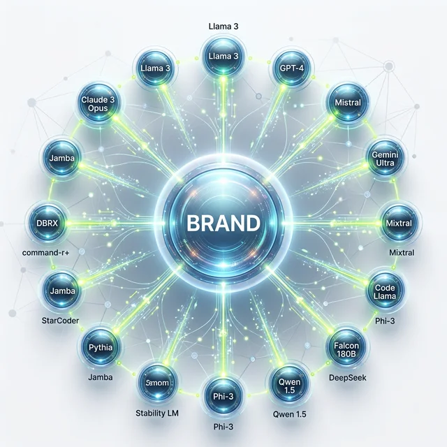

Moin! 🌻

## Die Lösung für AI Tracking ist da

Da bin ich wochenlang auf der Suche, wie man die Erwähnungen in den KI-Modellen sauber messen kann — und dann fällt mir die Lösung einfach so auf den Tisch. Ein Tool, was nicht nur ChatGPT, Google AI und Perplexity messen kann, sondern gleich 17 Sprachmodelle und KI-Maschinen.

Die Rede ist von [Rankscale](https://rankscale.ai/?via=offer) aus Österreich. Ich hatte gestern mein kleines Onboarding-Gespräch und bin überrascht, wie intuitiv es ist. Domain eingeben, Topic Cluster wählen, LLM auswählen. Fertig. Das Tool rennt los, erkennt das Umfeld und schaut, wo die Marke inklusive verschiedener Schreibweisen bereits erschienen ist.

  
 Jörgs SEO-Klartext (LinkedIn Insights)

  
"AI-Tracking ist das neue Google Search Console. Wer hier blind fliegt, verliert die Kontrolle über seine wichtigste digitale Währung: Reputation."

### AI Visibility: Warum Rankscale?

In einer Welt, in der Nutzer immer seltener auf blaue Links klicken und immer öfter direkt Antworten von KIs wie Perplexity, ChatGPT oder Claude erhalten, wird das Messen der „AI Visibility“ zur Überlebensfrage für SEOs. Bisher war das ein stochern im Nebel. Man hat mal hier gefragt, mal da geschaut.

[Rankscale](https://rankscale.ai/?via=offer) automatisiert diesen Prozess. Das Tool crawlt nicht nur die Ergebnisse, sondern analysiert auch den Kontext. Wird meine Marke neutral erwähnt? Positiv? Oder vielleicht sogar als Negativ-Beispiel? Besonders für Generative Engine Optimization (GEO) ist das Gold wert.

### Die Features im Überblick

Was mir besonders gut gefallen hat, sind die verschiedenen Analyse-Layer:

1.  **Marken-Tracking:** Wo und wie oft taucht mein Name oder mein Produkt auf?
2.  **Sentiment-Analyse:** Wie wertet die KI meine Inhalte?
3.  **Topic-Clustering:** Zu welchen Themengebieten werde ich als Autorität gesehen?
4.  **Wettbewerbs-Vergleich:** Wie schneide ich im Vergleich zu meinen Mitbewerbern in den 17 Sprachmodellen ab?

### Der Preis: Fairer Deal für Early Adopter

99€ für 17 LLMs klingt erst mal nach viel, aber wer schon mal versucht hat, diese Daten manuell zu sammeln oder teure Enterprise-Lösungen anzufragen, weiß: Das ist ein Schnäppchen. Man merkt, dass das Team aus Österreich selbst aus der Praxis kommt und ein Tool gebaut hat, das funktional ist, ohne unnötigen Schnickschnack.

### Wie ich Rankscale in der Praxis nutze

Für meine Kundenprojekte nutze ich [Rankscale](https://rankscale.ai/?via=offer) vor allem, um den Erfolg von Content-Kampagnen zu messen. Wenn wir einen großen Leitartikel veröffentlichen, wollen wir wissen: Schlägt sich das in den KI-Antworten nieder? Werden wir als Quelle zitiert?

Ein Beispiel: Wir haben eine Strategie für einen E-Commerce-Kunden im Bereich Nachhaltigkeit entwickelt. Nach drei Monaten konnten wir mit [Rankscale](https://rankscale.ai/?via=offer) schwarz auf weiß belegen, dass ChatGPT den Kunden nun als Experten für „nachhaltige Verpackungen“ nennt, was vorher nicht der Fall war. Das ist Reporting auf einem ganz neuen Level.

---

### Was du jetzt tun solltest

[Rankscale](https://rankscale.ai/?via=offer) löst ein echtes Problem elegant. Die Bedienung ist intuitiv, die Preise fair, die Ergebnisse aussagekräftig.

Ist es ein Must-Have für jeden? Noch nicht. Aber für Unternehmen, die ernsthaft in AI Visibility investieren wollen, gibt es aktuell keine bessere Lösung.

Ich bleibe dabei und habe auf das Jahres-Abo umgestellt. Bei meinem Workload und den Kundenprojekten rechnet sich das bereits nach wenigen Monaten.

Falls du Fragen zu [Rankscale](https://rankscale.ai/?via=offer) oder AI Visibility hast: Schreib mir gern eine DM auf LinkedIn oder buch dir eine [SEO-Sprechstunde](/seo-sprechstunde/). Dort können wir schauen, ob und wie sich das Tool in deine Strategie einbauen lässt.

Das war mein ehrlicher Erfahrungsbericht. Keine bezahlte Werbung, sondern echte Praxis-Erkenntnisse nach zwei Monaten intensivem Test.

---

  <h3>Lust auf mehr AI Visibility?</h3>
  
Wenn du <a href="https://rankscale.ai/?via=offer" target="_blank" rel="noopener noreferrer">Rankscale</a> selbst testen willst, kannst du hier direkt loslegen:

  <a href="https://rankscale.ai/?via=offer" target="_blank" rel="noopener noreferrer" class="btn-primary inline-flex mt-4 no-underline">
    Rankscale ausprobieren 
  </a>

---

ALOHA 🌻! 🌻

### Weiterführende Artikel
* **Lese-Tipp:** [Rankscale: Ein AI Visibility Tool das ich empfehlen kann](/blog/rankscale-ai-visibility-tool/)
* **Lese-Tipp:** [GEO, SEO, AI-SEO oder LLMO? Die Community hat abgestimmt](/blog/geo-seo-ai-seo-llmo-umfrage/)
