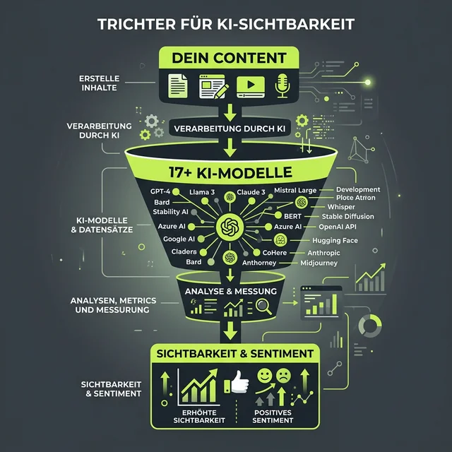
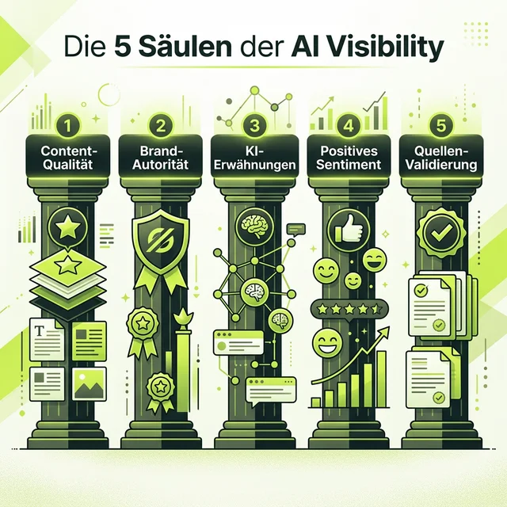

Moin! 🌻

Hast du dich in letzter Zeit auch mal gefragt, ob die ganze Arbeit, die du in deinen Content steckst, eigentlich dort ankommt, wo die Leute heute ihre Antworten suchen? 

Wir reden hier nicht mehr nur von der klassischen Google-Suche mit ihren "blauen Links". Wir reden von ChatGPT, Perplexity, Claude und Gemini. Wenn jemand fragt: „Wer ist der beste Experte für Thema X?“, willst du dort auftauchen. 

Das Problem für Einsteiger war bisher: **Wie zum Geier messe ich das?** 

Entweder du verbringst Stunden mit manuellem Tippen in fünf verschiedene KIs, oder du schaust dir Enterprise-Lösungen an, die preislich jenseits von Gut und Böse liegen. Heute habe ich die Lösung für alle, die Licht ins Dunkel ihres AI-Trackings bringen wollen: **Das <a href="https://rankscale.ai/?via=offer" target="_blank" rel="noopener noreferrer">Rankscale</a> Essentials-Paket.**

  
 Jörgs SEO-Klartext (LinkedIn Insights)

  
"Gute Daten müssen nicht teuer sein. Aber gar keine Daten sind für dein Business lebensgefährlich."

---

## Preis-Leistung, die Spaß macht: Der Deal für 20 Euro

Wer heute kein AI-Tracking macht, betreibt SEO im Blindflug. Aber man muss am Anfang nicht direkt 100€ oder mehr im Monat ausgeben. Das Essentials-Paket von [Rankscale](https://rankscale.ai/?via=offer) ist für mich die absolute Empfehlung für jeden Einsteiger.

**Die Zahlen:** Du zahlst **20 € pro Monat** bei monatlicher Kündbarkeit. Wer sich direkt festlegt, landet im Jahresabo bei gerade einmal **17 € pro Monat**. 

Das ist weniger als ein täglicher Kaffee und du bekommst dafür:
*   **120 Credits & 480 AI Responses:** Echte Antworten schwarz auf weiß.
*   **10 Page Audits & 5 Brand Slots:** Deine Projekte immer im Blick.
*   **Unlimited Search Terms:** Tracken ohne Limit bei den Begriffen.

---

## Die Geheimwaffe: Flexibilität bei den Modellen

Was [Rankscale](https://rankscale.ai/?via=offer) wirklich auszeichnet, ist die Wahl der **Engines**. Wir leben nicht mehr in einer Welt mit nur einer KI. OpenAI ist Marktführer, aber Perplexity ist die Suchmaschine der Zukunft, Claude schreibt oft besser und Gemini ist tief in Google verwitwelt.

Im Essentials-Paket hast du Zugriff auf über 17 LLMs (u.a. ChatGPT, Claude, Gemini, Perplexity, Mistral). Jede KI tickt anders. Eine Marke, die in ChatGPT sichtbar ist, kann in Perplexity komplett untergehen. Diese Flexibilität ist dein Goldwert, um die Unterschiede zu verstehen und deine Strategie anzupassen.

---

## Infografik: Dein Weg zur AI Visibility

Stell dir das Ganze wie einen Trichter vor:
1.  **Input:** Dein Content und deine Marke fließen hinein.
2.  **Der Kern:** Über 17+ KI-Modelle analysieren deine Daten gleichzeitig.
3.  **Output:** Du erhältst klare Daten zu Sichtbarkeit, Sentiment (Stimmung) und Zitaten.

Das ist sauberes, datengetriebenes Arbeiten statt Bauchgefühl. Wer die Daten über alle wichtigen KIs hat, gewinnt am Ende den Markt.

---

## 30-Tage Quickstart für Einsteiger

Wie startest du jetzt konkret? Hier ist mein Schlachtplan für deinen ersten Monat mit [Rankscale](https://rankscale.ai/?via=offer):

**Woche 1: Die Bestandsaufnahme.** Gib deine Domain und deine Top-Wettbewerber ein. Schau dir das Sentiment an: Wenn die KI dich erwähnt, klingt das positiv oder neutral?

**Woche 2: Die Inhalts-Lücke.** Nutze die Audits. Warum ignorieren KIs Seiten, die bei Google eigentlich gut ranken? Oft fehlen nur Kleinigkeiten wie klare Fakten oder strukturierte Daten.

**Woche 3: Wettbewerbs-Check.** Wo wird die Konkurrenz zitiert? Welche Verzeichnisse nutzen sie? [Rankscale](https://rankscale.ai/?via=offer) zeigt dir die Quellen, damit du nachziehen kannst.

**Woche 4: Optimierung.** Passe deinen Content basierend auf den Insights an und schaue in der nächsten Abfrage, ob sich die Nadel bewegt.

---

### Dein Action-Plan

SEO verändert sich massiv. Die Leute nutzen KI-Assistenten, um Entscheidungen zu treffen. Wenn du dort nicht stattfindest, existierst du für diese Zielgruppe nicht.

[Rankscale](https://rankscale.ai/?via=offer) Essentials ist die fairste Eintrittskarte in diese neue Welt. Es ist intuitiv, kommt aus Österreich und liefert Daten, die man sonst kaum so kompakt bekommt. Es ist wie das Fitnessstudio für deinen digitalen Marken-Körper: Du baust echte Daten-Muskeln auf.

ALOHA 🌻! 🌻

---

---

  <h3>Werde jetzt zum AI Visibility Profi!</h3>
  
Hol dir das <a href="https://rankscale.ai/?via=offer" target="_blank" rel="noopener noreferrer">Rankscale</a> Essentials-Paket für nur 17 € im Monat (Jahresabo) und starte dein Tracking noch heute.

  <a href="https://rankscale.ai/pricing?via=offer" target="_blank" rel="noopener noreferrer" class="btn-primary inline-flex mt-4 no-underline">
    Jetzt [Rankscale](https://rankscale.ai/?via=offer) testen 
  </a>

---

*PS: Wenn du Hilfe beim Setup brauchst, buche dir eine [SEO-Sprechstunde](/seo-sprechstunde/) bei mir. Wir biegen deine AI-Visibility gemeinsam gerade!*

### Weiterführende Artikel
* **Lese-Tipp:** [Rankscale: Ein AI Visibility Tool das ich empfehlen kann](/blog/rankscale-ai-visibility-tool/)
* **Lese-Tipp:** [Rankscale AI Visibility Tool: 17 LLMs für 99€ tracken](/blog/rankscale-ai-visibility-tracking-17-llms/)
* **Lese-Tipp:** [Sichtbarkeit im SEO verstehen](/glossar/sichtbarkeit/)
