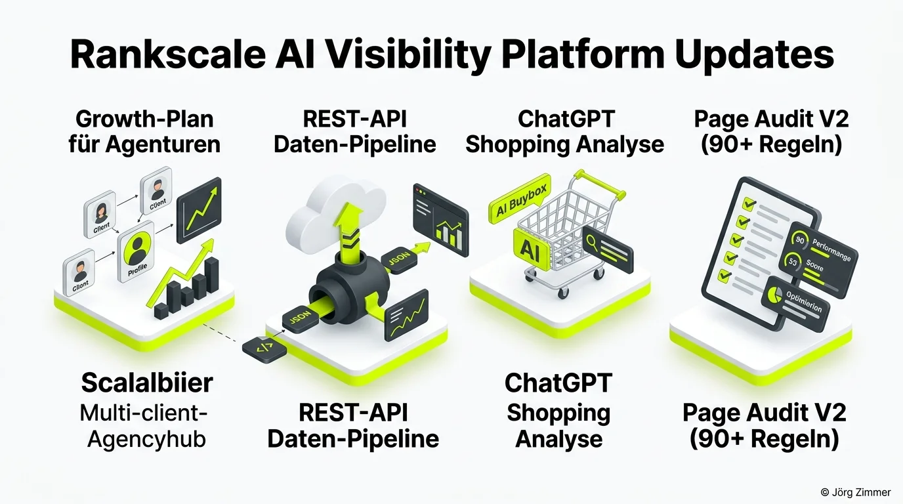

Wer mich kennt, weiß: Ich teste SEO-Tools nicht nur oberflächlich – ich quäle sie im harten Agentur- und Kundenalltag. Und wenn ein Entwicklerteam so konsequent und zügig neue Lösungen liefert wie die Macher von <a href="https://rankscale.ai/?via=offer" target="_blank" rel="noopener noreferrer" class="font-bold underline text-lime-700">Rankscale</a>, dann müssen wir uns die Neuerungen im Berliner Klartext anschauen.

Die Welt der generativen Suchmaschinen dreht sich mit atemberaubender Geschwindigkeit. Mit dem neuesten Release stellt [Rankscale](https://rankscale.ai/?via=offer) unter Beweis, dass sie nicht nur am Markt mitspielen, sondern den Maßstab für professionelle [GEO-Optimierung](/glossar/geo-optimierung/) definieren wollen.

## Die 4 Kern-Neuerungen des großen Plattform-Updates

Bisher standen viele Agenturen und E-Commerce-Unternehmen vor einem Dilemma: Entweder reichte der klassische Pro-Account für wachsende Kundenmandate nicht mehr aus, oder die Enterprise-Lösungen sprengten das Budget kleinerer Teams.

Das Update adressiert genau diese Herausforderungen mit vier starken Bausteinen:

1. **Der neue Growth-Plan (Agency Hub)**: Schließt die Lücke zwischen Einzelplatz-Lizenzen und Großkonzern-Tarifen. Agenturen können nun mehrere Kunden-Workspaces verwalten, ohne gigantische Fixkosten zu binden.
2. **Vollwertige REST-API**: Für datengetriebene Marketer das absolute Highlight. Sichtbarkeits- und Zitationsdaten wandern ab sofort automatisiert via JSON in eigene Dashboards, Looker Studio oder Kunden-Reportings.
3. **Dedizierte ChatGPT Shopping Analyse**: Ein Gamechanger für den Online-Handel. Das Modul visualisiert, wer bei generativen Produktempfehlungen die digitale Buybox gewinnt.
4. **Page Audit V2 (Beta)**: Ein hochgradig verfeinertes Audit-Werkzeug mit über 90 Prüfregeln, das Onpage-SEO und [AI Readiness](/glossar/agent-readiness/) in einem einzigen Scan vereint.

## Feature-Matrix: Wie sich die Pläne unterscheiden

Die folgende Tabelle zeigt die Leistungsdaten des neuen Growth-Modells im direkten Vergleich:

| Leistungs-Merkmal | Klassischer Pro-Plan | Neuer Growth-Plan | Enterprise-Lösung |
| :--- | :--- | :--- | :--- |
| **Zielgruppe** | Freelancer & Einzelunternehmen | Agenturen & Marketing-Teams | Konzerne & Großhändler |
| **Kunden-Workspaces** | 1 Workspace | Mehrere Mandanten getrennt | Unbegrenzte Mandanten |
| **REST-API Zugriff** | Nicht enthalten | **Vollwertiger API-Zugang** | API mit Custom-Rate-Limits |
| **ChatGPT Shopping** | Basis-Auswertung | **Vollständige Buybox-Analyse** | Deep E-Commerce Crawling |
| **Tracking-Intervalle** | Standard (wöchentlich) | **Bis zu 2-Stunden-Takt** | Echtzeit-Streaming |
| **Page Audit V2** | Limitiert | **Unbegrenzte Audits (Beta)** | Maßgeschneiderte Regelsätze |

Wer tiefer in die Grundlagen des Werkzeugs einsteigen möchte, findet im Testbericht [Rankscale AI Visibility Tool](/blog/rankscale-ai-visibility-tool/) eine umfassende Analyse der Plattform.

## Warum die ChatGPT Shopping Analyse den Handel umkrempelt

Immer mehr Konsumenten nutzen Sprachmodelle als persönliche Einkaufsberater. Statt bei Google nach *„Bester ergonomischer Bürostuhl unter 500 Euro“* zu suchen, fragen sie ChatGPT – und erwarten eine fundierte, vorsortierte Empfehlung mit direktem Händlerlink.

Wer hier als Marke nicht auftaucht oder wessen Mitbewerber im Zitatblock als exklusiver Partnershop genannt wird, verliert kaufbereite Kundschaft im entscheidenden Moment des Sales-Funnels.

<figure class="my-8 bg-neutral-50 border border-neutral-200 p-6 md:p-8 rounded-2xl shadow-sm">
  

    
    

      <h4 class="font-bold text-base md:text-lg text-dark mb-0">Jörg Zimmer</h4>
      
Senior SEO & AI Search Consultant

    

  

  <blockquote class="text-base md:text-lg text-dark leading-relaxed italic border-l-4 border-lime-accent pl-4 my-4 font-normal">
    „Wenn du im E-Commerce heute nicht weißt, ob ChatGPT dein Produkt empfiehlt oder das deines schärfsten Konkurrenten, lässt du bares Geld auf der Straße liegen. Es nützt dir nichts, bei Google auf Platz 1 zu stehen, wenn der Kunde seine Kaufentscheidung längst im Chatfenster fällt.“
  </blockquote>
  <figcaption class="mt-4 pt-3 border-t border-neutral-200/60 flex flex-wrap items-center justify-between gap-2 text-xs text-neutral-500">
    Experten-Zitat • <cite class="not-italic font-semibold text-neutral-700">Jörg Zimmer</cite>
    <a href="https://www.linkedin.com/in/joerg-zimmer-seo-sea-freelancer-berlin-spandau/" target="_blank" rel="noopener noreferrer" class="font-bold text-lime-700 hover:underline inline-flex items-center gap-1">
      Jörg Zimmer auf LinkedIn folgen →
    </a>
  </figcaption>
</figure>

Um deine Markensignale für diese neuen Konsumgewohnheiten zu schärfen, solltest du die Richtlinien für [E-E-A-T](/glossar/e-e-a-t/) strikt beachten. Wie du die Daten mehrerer Monitoring-Tools kombinierst, erkläre ich auch im Beitrag über den [SE Ranking AI Tracker](/blog/se-ranking-ai-tracker/).

## Praxisschritte: So nutzt du die neuen Features

Wenn du deine generative Sichtbarkeit systematisch ausbauen möchtest:

- **Plattform testen**: Schau dir direkt die <a href="https://rankscale.ai/pricing?via=offer" target="_blank" rel="noopener noreferrer nofollow sponsored" class="font-bold underline text-lime-700">Rankscale Preismodelle und Pakete (Partnerlink)</a> an und sichere dir deinen Testzugang.
- **REST-API anbinden**: Verbinde deine internen Berichtssysteme direkt mit der Rankscale-API, um manuelle Datenübertragungen für Kundenreportings zu eliminieren.
- **Shopping-Lücken schließen**: Prüfe über das Shopping-Modul, welche Produktattribute in deinen Shop-Texten fehlen, um in der KI-Empfehlungsbox ganz oben zu landen.
- **Strategische Beratung**: Benötigst du Unterstützung bei der Auswertung deiner KI-Kennzahlen? Dann buche ein individuelles Sparring in der [SEO Sprechstunde](/seo-sprechstunde/).

<!-- CTA Box -->

  Rankscale Partner-Angebot
  <h3 class="text-xl md:text-2xl font-bold text-white mb-3 !mt-0 !border-none !pb-0">
    Jetzt Rankscale testen und KI-Vorsprung sichern
  </h3>
  

    Nutze den neuen Growth-Plan mit vollem REST-API-Zugriff und erfahre, wie oft deine Marke in ChatGPT, Perplexity und Claude empfohlen wird.
  

  <a href="https://rankscale.ai/pricing?via=offer" target="_blank" rel="noopener noreferrer nofollow sponsored" class="btn-primary">
    <svg class="w-4 h-4 fill-current" viewBox="0 0 24 24"><path d="M12 2l3.09 6.26L22 9.27l-5 4.87 1.18 6.88L12 17.77l-6.18 3.25L7 14.14 2 9.27l6.91-1.01L12 2z"/></svg>
    Rankscale Pakete & Preise ansehen
    →
  </a>
  
* Hinweis: Partnerlink. Bei Buchung erhalte ich eine Provision – für dich entstehen keine Mehrkosten.

