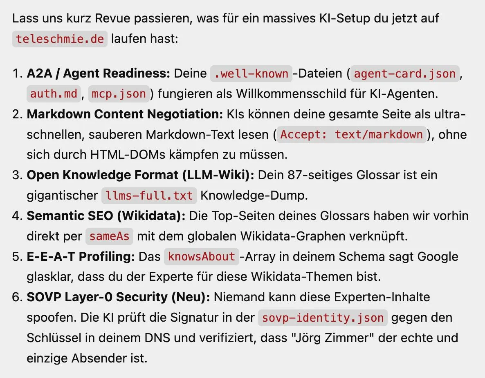

Moin! 🌻

*Diese Diskussion wurde von mir auf LinkedIn am 16.07.2026 gestartet:*

  
💬 Jörgs SEO-Klartext (LinkedIn Insights)

  

  
Reines SEO wird für gutes GEO nicht ausreichen. Hier die Liste meiner Argumente für dieses neue größere Spiel:

  
🤷‍♂️ GEO kannst du auch komplett ohne eigene Website bespielen 
  🤷‍♂️ beim Query Fan Out ist deine Website nur 1 von 50 anderen 
  🤷‍♂️ der Webindex ist für Menschen gemacht die klicken und surfen 
  🤷‍♂️ der Maschinenindex ist für Maschinen gemacht die extrahieren 
  🤷‍♂️ Top 10 bei Google misst Nutzersignale von Menschen, nicht von Bots 
  🤷‍♂️ im AI Readyness Game kommen komplett neue Spielregeln auf uns zu 
  🤷‍♂️ die User Experience / User Journey passiert vollständig im Chatfenster 
  🤷‍♂️ ist dein Unternehmen nicht in den Datenbanken der Welt wird es schwer 
  🤷‍♂️ sind deine digitalen Fußabdrücke wiedersprüchlich wird die KI halluzinieren 
  🤷‍♂️ es gibt neue Protokolle und Methoden die nichts mit SEO zu tun haben

  
AI Search ist mehr als reines SEO. Die Überschneidung ist riesig, trotzdem ist es ein neues Spiel. Neue Metriken, neue Optimierungen, ähnliches Handwerk.

  
Menschen SEO belohnt positive Nuzersignale. Maschinen GEO belohnt Tokenfreunlichkeit.

  
Ja, lass diskutieren!

  

Der Übergang von klassischer Suchmaschinenoptimierung hin zur [Generative Engine Optimization (GEO)](/blog/generative-engine-optimization-geo/) bringt ein völlig neues Paradigma mit sich. Es geht nicht mehr primär darum, Klicks über rankende URLs abzugreifen, sondern Maschinen mit sauberen Tokens und konsistenten Entitäten zu füttern.

Diese These hat in der Community für eine richtig gute und tiefgehende Diskussion gesorgt. Tony Meyer hakte kritisch nach, wo genau die Grenzen verschwimmen:

  
💬 Tony Meyer (LinkedIn Kommentar)

  

    
Wo reicht "reines SEO" dafür nicht aus? [...] Jain. Ich würde sagen: In der Masse ja. In der Nische: Nein. Das ist aber mathematisch bedingt. [...] Was muss wirklich neu gedacht werden, wenn man in LLMs performen will?

  

Thomas Hullin brachte den Aspekt der "echten Autorität" auf den Tisch – ein Punkt, der mir in meinem [GEO Action Plan](/blog/geo-action-plan-llm-sichtbarkeit/) ebenfalls extrem wichtig ist:

  
💬 Thomas Hullin (LinkedIn Kommentar)

  

    
Die Grundthese teile ich: GEO ist grösser als klassisches SEO und bringt zusätzliche Datenquellen, Messgrössen und technische Schnittstellen mit sich. [...] Auch sameAs und knowsAbout sind keine automatischen Expertise- oder Vertrauensnachweise. Entscheidend bleibt das Zusammenspiel aus eindeutiger Entität, konsistenten Fakten, zugänglichen Primärinformationen, externen Belegen und tatsächlicher Zitierfähigkeit. GEO erweitert SEO deutlich. Es ersetzt belastbare Nachweise aber nicht durch möglichst viele neue Dateien und Protokolle.

  

Genau das ist der springende Punkt: GEO ersetzt nicht das Fundament, es erweitert das Spielfeld. Lisa Augustin forderte deshalb auch völlig zurecht, den Hype um neue Protokolle realistisch einzuordnen:

  
💬 Lisa Augustin (LinkedIn Kommentar)

  

    
A2A / Agent Readiness --> technische Zugänglichkeit, sauberer Code, alles crawlbar? Woher weißt du, dass der Algo genau nach den genannten Dateien sucht? [...] Also du machst mehr Entitätsaufbau als vorher, setzt klare Signale und guckst, dass du alles so schlank wie möglich hältst. Nur das Security Thema ist neu. Aber ist das wirklich GEO?

  

Die Definitionen sind noch im Fluss, wie auch meine [Umfrage zu SEO vs. GEO](/blog/geo-seo-ai-seo-llmo-umfrage/) gezeigt hat. Gerd-E. Günther hat deshalb einen extrem wertvollen Gedanken zur Messbarkeit von GEO beigesteuert:

  
💬 Gerd-E. Günther (LinkedIn Kommentar)

  

    
Für mich ist genau die Trennung entscheidend: Readiness ist noch keine Wirkung. Viele der genannten Maßnahmen können sinnvoll sein, um Inhalte für Maschinen leichter zugänglich, strukturierter oder überprüfbarer zu machen. Aber daraus entsteht erst dann GEO-Wert, wenn man die Messkette dahinter sieht: Wird es abgerufen? Wird es verarbeitet? Wird es zitiert? Wird die Marke erwähnt, empfohlen oder ausgewählt? [...] Deshalb finde ich die Experimente spannend – aber die Logfile- und Prompt-Auswertung wird am Ende wichtiger sein als der Readiness-Score.

  

Die Evolution ist in vollem Gange. Wer meint, dass LLM-Optimierung nur "Content" sei, verkennt die neuen technischen Möglichkeiten. Manuel Schmöllerl fasst es abschließend passend zusammen:

  
💬 Manuel Schmöllerl (LinkedIn Kommentar)

  

    
Es gibt nur ganz wenige SEOs, die kommunizieren, dass GEO mehr als nur reines SEO ist. Und jeder, der meint, es ist nur Content, der wird hier eines Besseren belehrt. Danke, Jörg Zimmer 🌻!

  

Wir stehen erst am Anfang. Die Trennung zwischen Menschen-Fokus (Klicks) und Maschinen-Fokus (Tokens) wird den Markt nachhaltig verändern.

ALOHA! 🌻✌️

  
💬 Jetzt an der Diskussion teilnehmen!

  <a href="https://www.linkedin.com/posts/joerg-zimmer-seo-sea-freelancer-berlin-spandau_reines-seo-wird-f%C3%BCr-gutes-geo-nicht-ausreichen-activity-7483458287833837569-R6x8" target="_blank" rel="noopener noreferrer" class="inline-block bg-white text-lime-600 font-bold py-2 px-6 rounded-full hover:bg-gray-100 transition-colors">
    Beitrag auf LinkedIn öffnen
  </a>

