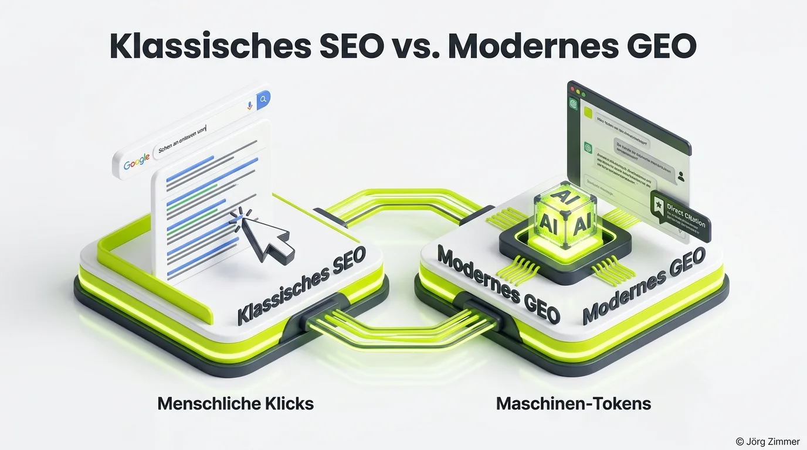

Reines SEO wird für exzellente Ergebnisse in generativen Suchsystemen schlichtweg nicht mehr ausreichen.

Wir erleben gegenwärtig den Übergang von einer menschzentrierten Klick-Ökonomie zu einer maschinengesteuerten Synthese-Landschaft. Wer diesen Paradigmenwechsel ignoriert und glaubt, mit altbekannten Methoden wie Keyword-Dichte und Backlink-Jagd auch in ChatGPT, Claude und Perplexity zu dominieren, wird ein böses Erwachen erleben.

Suchmaschinenoptimierung bleibt ein unverzichtbares Fundament. Doch [Generative Engine Optimization (GEO)](/blog/generative-engine-optimization-geo/) eröffnet ein vollkommen neues, größeres Spielfeld.

<figure class="my-8 bg-neutral-50 border border-neutral-200 p-6 md:p-8 rounded-2xl shadow-sm">
  

    
    

      <h4 class="font-bold text-base md:text-lg text-dark mb-0">Jörg Zimmer</h4>
      
Senior SEO & AI Search Consultant

    

  

  <blockquote class="text-base md:text-lg text-dark leading-relaxed italic border-l-4 border-lime-accent pl-4 my-4 font-normal">
    „Wie aktiv spülst du dich und deinen Kontext in die Suchen? Das muss man doch erstmal messen, bevor ich sage, wenn ich nicht weiß, wie die Ausgangslage ist, kann ich auch nicht sinnvoll optimieren. Ich muss ja erstmal wissen, wie der jetzige Stand ist. Wie werde ich denn jetzt ausgerollt? Und wenn wir da mal warum Jer schon zwei Jahre auf dem Marktm aber.“
  </blockquote>
  <figcaption class="mt-4 pt-3 border-t border-neutral-200/60 flex flex-wrap items-center justify-between gap-2 text-xs text-neutral-500">
    

      Experten-Zitat • <cite class="not-italic font-semibold text-neutral-700">Jörg Zimmer</cite>
      •
      <a href="https://www.youtube.com/watch?v=32YkPQtOJDU&t=809s" target="_blank" rel="noopener noreferrer" class="text-neutral-600 hover:text-dark underline inline-flex items-center gap-1">
        Quelle: YouTube Magic Writing Podcast (13:29)
        <svg class="w-3 h-3 text-neutral-400" fill="none" stroke="currentColor" viewBox="0 0 24 24"><path stroke-linecap="round" stroke-linejoin="round" stroke-width="2" d="M10 6H6a2 2 0 00-2 2v10a2 2 0 002 2h10a2 2 0 002-2v-4M14 4h6m0 0v6m0-6L10 14" /></svg>
      </a>
    

    <a href="https://www.linkedin.com/in/joerg-zimmer-seo-sea-freelancer-berlin-spandau/" target="_blank" rel="noopener noreferrer" class="font-bold text-lime-700 hover:underline inline-flex items-center gap-1 shrink-0">
      Jörg Zimmer auf LinkedIn folgen →
    </a>
  </figcaption>
</figure>

## Die zehn fundamentalen Unterschiede zwischen SEO und GEO

Warum greift klassisches SEO zu kurz? Hier sind die handfesten Fakten:

1. **GEO funktioniert ohne eigene Website:** Markenpräsenz in Sprachmodellen entsteht durch Erwähnungen im gesamten digitalen Ökosystem – Branchenregister, Presseportale, Foren und Kundenbewertungen genügen oft schon für Nennungen.
2. **Der [Query Fan-Out](/glossar/query-fan-out/) verwässert Monopole:** Während Google zehn URLs auflistet, feuert ein KI-Modell intern 20 bis 50 Suchabfragen ab und destilliert ein gemeinsames Ergebnis.
3. **Menschlicher Index vs. Maschinen-Index:** Der Webindex belohnt ansprechende Oberflächen. Der KI-Index belohnt tokenarme, fehlerfreie Faktenextraktion.
4. **Das Interface wandert ab:** Die gesamte User Journey findet im Chatfenster statt. Wer keinen Grund zur Quellennennung liefert, bleibt unsichtbar.
5. **Widersprüchliche Spuren führen zu Halluzinationen:** Weichen Unternehmensdaten auf verschiedenen Plattformen voneinander ab, stufen Modelle die Quelle als unsicher ein.

## Stimmen aus der Experten-Community

Meine LinkedIn-These löste eine der tiefgründigsten Fachdiskussionen des Jahres aus:

**Tony Meyer** fragte nach der mathematischen Grenze zwischen Masse und Nische:
> *„In der breiten Masse reichen klassische SEO-Hebel oft nicht mehr aus. Um in Sprachmodellen performant zu bleiben, müssen wir die semantische Verknüpfung völlig neu denken.“*

**Thomas Hullin** betonte die Notwendigkeit echter Belastbarkeit:
> *„GEO ist größer als klassisches SEO und verlangt neue Schnittstellen. Doch Schema-Properties wie `sameAs` sind kein Blankocheck. Entscheidend bleibt die Konsistenz der Entität und die tatsächliche Zitierfähigkeit der Primärdaten.“*

Wie wir diese Anforderungen systematisch in der Praxis umsetzen, beschreibe ich in meinem detaillierten [GEO Action Plan](/blog/geo-action-plan-llm-sichtbarkeit/) sowie in meinem persönlichen Erfahrungsbericht zur [GEO Transformation: Die neue SEO-Disziplin der AI Search](/blog/ich-befinde-mich-in-der-geo-transformation/).

**Lisa Augustin** hinterfragte den Hype um neue Dateiformate:
> *„Ist Readiness schon GEO? Entscheidend ist, dass wir neben sauberem Code klare Signale für Vertrauenswürdigkeit setzen.“*

**Gerd-E. Günther** lieferte die treffendste Differenzierung zur Messbarkeit:
> *„Readiness ist noch keine Wirkung. Ein echter Mehrwert entsteht erst durch die Messkette: Wird der Inhalt abgerufen? Wird er verarbeitet? Wird die Marke empfohlen? Logfile- und Prompt-Auswertungen sind der wahre Gradmesser.“*

Dass sich der Markt im Umbruch befindet, verdeutlichen auch die Ergebnisse aus unserer [Umfrage zu SEO vs. GEO](/blog/geo-seo-ai-seo-llmo-umfrage/).

**Manuel Schmöllerl** brachte es auf den Punkt:
> *„Es gibt nur wenige Berater, die offen aussprechen, dass GEO weit mehr ist als reiner Content. Wer sich nicht mit den technischen Maschinenstandards befasst, wird abgehängt.“*

## Der strategische Hebel: Erst SEO durchspielen, dann GEO aufbauen

Meine bewährte Formel für Kundenprojekte lautet: **Erst das klassische SEO zu 100 % meistern, dann den GEO-Layer zünden.**

Wer kein sauberes technisches Fundament besitzt, hat im Maschinenraum keine Chance. Doch wer auf diesem Fundament strukturierte Entitäten aufbaut, gezielt [Topical Authority](/glossar/topical-authority/) verankert und seine Präsenz über spezialisiertes Tracking wie [SE Ranking KI-Sichtbarkeit](/blog/se-ranking-ki-sichtbarkeit/) überwacht, sichert sich uneinholbare Wettbewerbsvorteile.

Möchtest du analysieren, wie gut deine Marke auf die neuen Anforderungen von AI Search vorbereitet ist? In der [SEO-Sprechstunde](/seo-sprechstunde/) analysieren wir deine Ausgangslage und entwickeln deine zukunftssichere GEO-Roadmap.

<!-- LinkedIn CTA Box -->

  <h3 class="text-xl md:text-2xl font-bold text-white mb-3 !mt-0 !border-none !pb-0">
    Jetzt an der Diskussion teilnehmen
  </h3>
  

    Diskutiere mit Jörg Zimmer und der SEO-Community auf LinkedIn über die Grenzen von klassischem SEO und den Paradigmenwechsel zu GEO.
  

  <a href="https://www.linkedin.com/posts/joerg-zimmer-seo-sea-freelancer-berlin-spandau_reines-seo-wird-f%C3%BCr-gutes-geo-nicht-ausreichen-activity-7483458287833837569-R6x8" target="_blank" rel="noopener noreferrer" class="btn-primary">
    <svg class="w-4 h-4 fill-current" viewBox="0 0 24 24"><path d="M20.447 20.452h-3.554v-5.569c0-1.328-.027-3.037-1.852-3.037-1.853 0-2.136 1.445-2.136 2.939v5.667H9.351V9h3.414v1.561h.046c.477-.9 1.637-1.85 3.37-1.85 3.601 0 4.267 2.37 4.267 5.455v6.286zM5.337 7.433c-1.144 0-2.063-.926-2.063-2.065 0-1.138.92-2.063 2.063-2.063 1.14 0 2.064.925 2.064 2.063 0 1.139-.925 2.065-2.064 2.065zm1.782 13.019H3.555V9h3.564v11.452zM22.225 0H1.771C.792 0 0 .774 0 1.729v20.542C0 23.227.792 24 1.771 24h20.451C23.2 24 24 23.227 24 22.271V1.729C24 .774 23.2 0 22.222 0h.003z"/></svg>
    Beitrag auf LinkedIn öffnen
    →
  </a>

