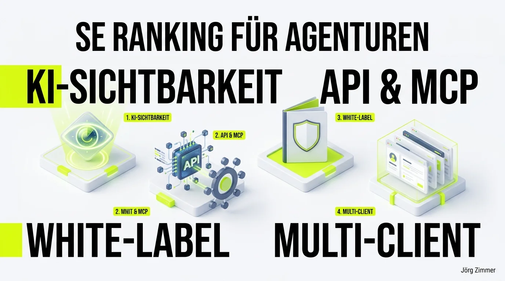

Wenn du als SEO-Freelancer oder in einer Agentur Verantwortung für Kundenprojekte trägst, kennst du das Dilemma: Ein Tool-Stack aus fünf verschiedenen Plattformen frisst jeden Monat Tausende Euro an Lizenzgebühren. Gleichzeitig fragmentieren sich die Arbeitsabläufe zwischen Rank-Trackern, Crawler-Lizenzen, Reporting-Lösungen und KI-Tools. Das Preis-Leistungs-Verhältnis muss stimmen – erst recht in einem Marktumfeld, in dem Effizienz und Datenqualität über den Agenturgewinn entscheiden.

Genau darüber habe ich eine offene Diskussion auf LinkedIn angestoßen. Das Feedback der Community war überwältigend: Zahlreiche Agenturinhaber und Senior-SEOs teilten ihre Erfahrungen beim Umstieg und der täglichen Nutzung von <a href="https://seranking.com/de/se-ranking-for-agencies.html?ga=4169588&source=link" target="_blank" rel="noopener noreferrer nofollow sponsored">SE Ranking für Agenturen (Partnerlink)</a> *(Partner-Link)*.

<figure class="my-8 bg-neutral-50 border border-neutral-200 p-6 md:p-8 rounded-2xl shadow-sm">
  

    
    

      <h4 class="font-bold text-base md:text-lg text-dark mb-0">Jörg Zimmer</h4>
      
Senior SEO & AI Search Consultant

    

  

  <blockquote class="text-base md:text-lg text-dark leading-relaxed italic border-l-4 border-lime-accent pl-4 my-4 font-normal">
    „Wir hatten ja beide darüber gesprochen. SE Ranking hat ja dieses Tool EIO Trecker. Ja, ja, das ist ein separates Tool. Und wenn ich dich da als Marke anlege und als Projekt anlege, dann kostet das Geld.“
  </blockquote>
  <figcaption class="mt-4 pt-3 border-t border-neutral-200/60 flex flex-wrap items-center justify-between gap-2 text-xs text-neutral-500">
    

      Experten-Zitat • <cite class="not-italic font-semibold text-neutral-700">Jörg Zimmer</cite>
      •
      <a href="https://www.youtube.com/watch?v=pJFZzv5LEvk&t=3729s" target="_blank" rel="noopener noreferrer" class="text-neutral-600 hover:text-dark underline inline-flex items-center gap-1">
        Quelle: YouTube Talk Antonio Blago & Jörg Zimmer Folge 5 (62:09)
        <svg class="w-3 h-3 text-neutral-400" fill="none" stroke="currentColor" viewBox="0 0 24 24"><path stroke-linecap="round" stroke-linejoin="round" stroke-width="2" d="M10 6H6a2 2 0 00-2 2v10a2 2 0 002 2h10a2 2 0 002-2v-4M14 4h6m0 0v6m0-6L10 14" /></svg>
      </a>
    

    <a href="https://www.linkedin.com/in/joerg-zimmer-seo-sea-freelancer-berlin-spandau/" target="_blank" rel="noopener noreferrer" class="font-bold text-lime-700 hover:underline inline-flex items-center gap-1 shrink-0">
      Jörg Zimmer auf LinkedIn folgen →
    </a>
  </figcaption>
</figure>

## 10 handfeste Fähigkeiten, die den Agentur-Alltag transformieren

Hier sind die zehn Kernfunktionen, mit denen SE Ranking den Workflow von SEO-Teams zentralisiert und spürbar beschleunigt:

1. **Generative Engine Optimization (GEO) & KI-Sichtbarkeit:**  
   Das Tool trackt nicht mehr nur Google-Rankings auf Position 1 bis 100. Es misst systematisch Erwähnungen und Zitationen in generativen KI-Engines wie ChatGPT, Perplexity, Google Gemini und den AI Overviews. Wie wir im Leitfaden zur [SE Ranking KI-Sichtbarkeit](/blog/se-ranking-ki-sichtbarkeit/) aufgeschlüsselt haben, ist das heute Pflicht für jede moderne Kundenstrategie.

2. **Native Integration via MCP-Connector:**  
   Über das Model Context Protocol (MCP) bindest du Live-Daten aus deinen Projekten direkt in KI-Entwicklungsumgebungen wie Cursor, Claude Desktop oder VS Code ein. Deine Coding-Assistenten analysieren Keyword-Daten, On-Page-Fehler und Backlinks in Echtzeit, ohne dass du CSV-Dateien exportieren musst.

3. **Leistungsstarke REST-API für Automatisierung:**  
   Sämtliche Ranking- und Audit-Metriken lassen sich per API in Looker Studio, PowerBI oder firmeninterne Dashboards einspeisen. Die Token-Preise sind dabei extrem fair kalkuliert.

4. **Integrierter Lead-Generator für Neukunden:**  
   Ein anpassbares On-Page-Checker-Widget lässt sich direkt auf der Agentur-Website einbetten. Besucher erhalten nach Eingabe ihrer URL ein kompaktes Erst-Audit – und die Agentur gewinnt qualifizierte Inbound-Leads mit konkretem Beratungsbedarf.

5. **Lückenloses White-Label-Reporting:**  
   Reports werden vollautomatisch im Corporate Design der Agentur generiert – inklusive eigenem Logo, Firmenfarben, Absender-Domain und benutzerdefinierter E-Mail-Signatur. Der Kunde merkt zu keinem Zeitpunkt, welches Tool im Hintergrund läuft.

6. **Multi-Client-Workflows mit individuellen Rechten:**  
   Kunden erhalten maßgeschneiderte Zugänge mit klar definierten Rollen. So sieht der Marketingleiter exakt die KPIs seiner Domain, ohne Einblick in andere Kundenprojekte oder Abrechnungsdetails zu erhalten.

7. **Zentrales Local-SEO-Management:**  
   Für lokale Kunden bündelt das Tool Google Unternehmensprofil-Rankings im Local Pack, ermöglicht die Planung von Beiträgen und aggregiert Bewertungen aus diversen Verzeichnissen an einem Ort.

8. **Langfristige historische Daten ohne Aufpreis:**  
   Historische SERP- und Projektdaten bleiben über die gesamte Laufzeit vollständig erhalten. Das ist Gold wert, wenn nach einem [SEO-Relaunch](/blog/seo-relaunch-klassiker-meme/) oder Google Core Update der langfristige Verlauf bewiesen werden muss.

9. **Integrierte Content- & KI-Suite:**  
   Der Content Editor unterstützt Texter mit NLP-Briefings, Keyword-Dichten und Konkurrenz-Strukturanalysen direkt beim Verfassen neuer Landingpages.

10. **Sichere Gastlinks für schnelle Freigaben:**  
    Für Freelancer oder Stakeholder ohne eigenen Login lassen sich temporäre Betrachter-Links generieren. Das erspart langwierige PDF-Exporte per Mail.

<figure class="my-10 text-center">
  
  <figcaption class="text-xs text-neutral-500 mt-2 italic">
    Abb.: Schlüsselmodule für Agenturen: KI-Sichtbarkeitstracking, MCP-Schnittstellen, White-Label-Berichte und Mandantenverwaltung.
  </figcaption>
</figure>

## Stimmen aus der Praxis: Was die LinkedIn-Community diskutiert

Die Resonanz der SEO-Praktiker auf meinen Beitrag zeigte genau die Schmerzpunkte auf, die in Agenturen täglich verhandelt werden:

### Der „versteckte“ Business-Tarif

Lisa Augustin merkte in den Kommentaren an:
> *„Den Business Tarif find ich auf deren Website nicht :-/“*

Tatsächlich platziert der Anbieter seine kleineren Pakete (Essential und Pro) ganz oben. Wer jedoch als wachsende Agentur oder Verbund von Freelancern agiert, sollte auf der Preisübersicht ganz nach unten scrollen. Der Business-Tarif schaltet unbegrenzte Projekte, fünf Managerzugänge und erweiterte API-Limits frei – zu Konditionen, die im Vergleich zu Alt-Verträgen anderer Suiten oft mehr als 60 Prozent Ersparnis bringen.

### Datenqualität im Härtetest: Sistrix vs. SE Ranking

Torsten Materna fragte kritisch nach der Verlässlichkeit:
> *„Für mich immer interessant, wie die Datenqualität ist. Bei großen Keywords und bei Nischen. Wie beurteilst Du das? Ich nutze gefühlt schon ewig Sistrix.“*

Eine berechtigte Skepsis, die viele alteingesessene SEOs teilen. In unserem ausführlichen Vergleich [Sistrix vs. SE Ranking](/blog/sistrix-vs-se-ranking/) haben wir beide Systeme detailliert gegenübergestellt: Bei deutschsprachigen Top-Suchbegriffen wie auch im Long-Tail hat die Datenbasis von SE Ranking massiv an Tiefe gewonnen. Torstens Urteil nach eigenem Test fiel entsprechend positiv aus: Man muss Bewährtes nicht über Nacht über Bord werfen, aber als schlankes Haupt- oder Zweitsystem für Mandantenprojekte überzeugt die Zuverlässigkeit auf ganzer Linie.

### Semrush-Vergleich und API-Stärke

Yevheniya Shafar brachte den Vergleich zu Semrush ins Spiel:
> *„Ich glaube, dass ich SE Ranking kurz getestet habe und es mich nicht auf Anhieb überzeugen konnte. Hast du Erfahrungen mit Semrush im Vergleich?“*

Semrush bleibt eine Wucht bei internationalen Paid-Search-Kampagnen (Google Ads) und weltweitem Display-Advertising. Für den organischen SEO-Fokus – On-Page-Crawls, Rank-Tracking und Mandantenberichte – liefert SE Ranking jedoch dieselbe Tiefe zu deutlich kalkulierbareren Fixkosten.

Dominik Breitbach ergänzte dazu treffend:
> *„Nutzen wir auch sehr zufrieden. Die API ist sehr fair! Viele Tokens für vergleichbar wenig Geld.“*

Wer wie wir auf Automatisierung und Vibe Coding setzt, schätzt genau diese API-Zugänglichkeit: Daten lassen sich unkompliziert abrufen, um Kunden-Dashboards oder ein automatisiertes [Website-SEO-Audit](/glossar/se-ranking-website-audit/) mit Live-Zahlen zu füttern. Wie wichtig agile Werkzeuge für Agenturen sind, unterstreicht auch unsere [CAMPIXX Agentur-Umfrage](/blog/campixx-seo-agentur-umfrage/).

## Praxis-Empfehlung für den Wechsel

Wer den Umstieg in Betracht zieht, muss nicht Hals über Kopf migrieren:

1. **Parallel-Test für 14 Tage:** Lege zwei bis drei aktive Kundenprojekte parallel an und vergleiche die Ranking-Abweichungen mit deinem aktuellen Tool.
2. **White-Label-Portal konfigurieren:** Binde deine Agentur-Subdomain ein und erstelle ein Muster-Reporting im eigenen CI.
3. **MCP und API testen:** Verbinde die Schnittstelle mit deinen internen Prozessen, um repetitive Aufgaben zu automatisieren.

Wenn du Unterstützung bei der Tool-Auswahl oder der strategischen Ausrichtung deiner Agenturprojekte suchst, lass uns in einer gemeinsamen [SEO-Sprechstunde](/seo-sprechstunde/) oder einer strategischen [SEO-Beratung](/glossar/seo-beratung/) darüber sprechen.

*(Transparenz-Hinweis: Wer sich über meinen <a href="https://seranking.com/de/se-ranking-for-agencies.html?ga=4169588&source=link" target="_blank" rel="noopener noreferrer nofollow sponsored">Partner-Link für SE Ranking (Partnerlink)</a> entscheidet, erhält von mir 2 Stunden persönlichen Onboarding-Support für die Agentur-Einrichtung on top!)*

<!-- CTA Box -->

  <h3 class="text-xl md:text-2xl font-bold text-white mb-3 !mt-0 !border-none !pb-0">
    SE Ranking für Agenturen 14 Tage kostenlos testen
  </h3>
  

    Überzeuge dich von White-Label-Berichten, Gast-Zugängen und unlimitierten Projekten im vollen Funktionsumfang – unverbindlich und ohne Kreditkarte.
  

  <a href="https://seranking.com/de/se-ranking-for-agencies.html?ga=4169588&source=agentur" target="_blank" rel="noopener noreferrer nofollow sponsored" class="btn-primary">
    <svg class="w-4 h-4 fill-current" viewBox="0 0 24 24"><path d="M12 2L2 7l10 5 10-5-10-5zM2 17l10 5 10-5M2 12l10 5 10-5"/></svg>
    Jetzt Agentur-Features kostenlos testen * (Partnerlink)
    →
  </a>
  
* Hinweis: Partnerlink. Bei Buchung erhalte ich eine Provision – für dich entstehen keine Mehrkosten.

