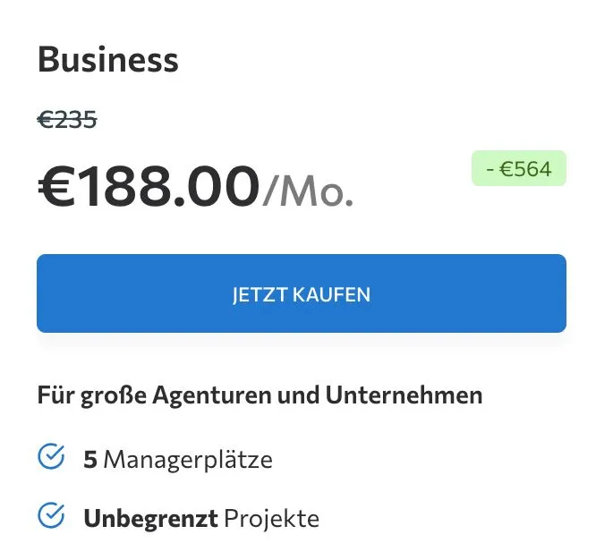

Moin! 🌻

Wenn du als Freelancer oder in einer SEO-Agentur arbeitest, kennst du das Problem: Zu viele Tools und zu viel Chaos bei den Workflows. Das Preis-Leistungs-Verhältnis muss einfach stimmen. 

  
💬 Jörgs SEO-Klartext (LinkedIn Insights)

  
"10 Gründe warum jede SEO Agentur über SE Ranking nachdenken sollte - das Preis/Leistungsverhältniss ist meiner Meinung nach sehr gut. SE Ranking bietet für Agenturen und Freelancer eine Reihe von Funktionen, um SEO- und Sichtbarkeits-Workflows zu zentralisieren."

Die Suchlandschaft dreht sich. Es reicht nicht mehr, nur klassische Links zu checken. Mit SE Ranking trackst du nicht nur Google-Ergebnisse, sondern analysierst direkt deine [KI-Sichtbarkeit](/glossar/ki-sichtbarkeit/). Über den **MCP-Connector** holst du Live-SEO-Daten direkt in deine Entwickler-Umgebung, komplett ohne Code-Stress.

Deine Kunden wollen individuelle Dashboards? Die Daten pumpst du über die API direkt in deine Automatisierungs-Plattformen. Auch [Local SEO](/glossar/local-seo/) war noch nie so einfach: Map-Rankings tracken und Kundenbewertungen zentral steuern ist voll integriert. 

  
💬 Lisa Augustin (LinkedIn Kommentar)

  
"Den Business Tarif find ich auf deren Website nicht :-("

Das ist ein wichtiger Punkt von Lisa: Der Business-Tarif wird auf der Webseite oft nicht direkt beworben, bietet aber enorm viel Leistung (unbegrenzte Projekte und 5 Managerplätze). Oft lohnt es sich, direkt auf der Preis-Seite ganz nach unten zu scrollen.

  
💬 Torsten Materna (LinkedIn Kommentar)

  
"Für mich immer interessant, wie die Datenqualität ist. Bei großen Keywords und bei Nischen. Wie beurteilst Du das? Ich nutze gefühlt schon ewig Sistrix."

Eine absolut berechtigte Frage von Torsten! Gerade im Vergleich mit Platzhirschen wie Sistrix hat die Datenqualität extrem aufgeholt. Sowohl bei stark umkämpften Short-Tail-Keywords als auch in spitzeren Nischen liefert das Tool sehr verlässliche Volumina.

  
💬 Yevheniya Shafar (LinkedIn Kommentar)

  
"Ich habe früher super gerne sistrix genutzt. Irgendwann mal auf semrush umziehen müssen. Und bin dabei hängen geblieben... Hast du Erfahrungen mit semrush im Vergleich zu SE Ranking?"

Beide spielen in der Top-Liga. Semrush bietet tiefere Paid-Ads-Features, was den höheren Preis rechtfertigt. Für reine SEO-Workflows und Agentur-Features (White-Label, Lead-Gen) punktet SE Ranking aber extrem durch sein unschlagbares Preis-Leistungs-Verhältnis. Und wie Dominik Breitbach in den Kommentaren bestätigte: *"Nutzen wir auch sehr zufrieden. Die API ist sehr fair! Viele Tokens für vergleichbar wenig Geld"*.

Falls du unsicher bist, wirf einen Blick auf meinen Vergleich: [Sistrix vs. SE Ranking](/blog/sistrix-vs-se-ranking/).

Wer über meinen [Partner Link](https://lnkd.in/d8sW4sHm) abschließt, bekommt 2 Stunden Support von mir on top!

ALOHA! 🌻✌️
