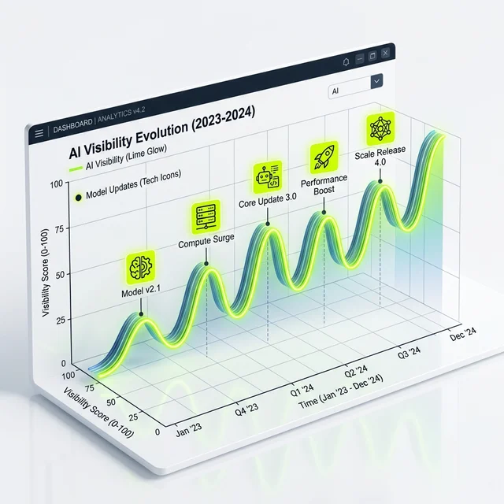

Man merkt, dass ein Thema den Kinderschuhen entwachsen ist, wenn die "Großen" anfangen, ihre Claims abzustecken. Nach <a href="https://rankscale.ai/?via=offer" target="_blank" rel="noopener noreferrer nofollow sponsored">Rankscale (Partnerlink)</a> kommt nun das nächste Schwergewicht für **AI Visibility Tracking** aus der Versenkung: <a href="https://seranking.com/de/?ga=4169588&source=link" target="_blank" rel="noopener noreferrer nofollow sponsored">SE Ranking (Partnerlink)</a> hat offiziell seinen eigenen AI Tracker gelauncht.

Als ich das erste Mal davon hörte, dachte ich: "Schon wieder ein Tool?" Aber dann wurde mir klar: Dass ein etablierter Player wie [SE Ranking (Partnerlink)](https://seranking.com/de/?ga=4169588&source=link) in diesen Markt einsteigt, zeigt, dass AI-SEO kein Nischen-Spielzeug mehr für uns Early Adopter ist. Es ist gekommen, um zu bleiben.

## Was kann der SE Ranking AI Tracker wirklich?

[SE Ranking (Partnerlink)](https://seranking.com/de/?ga=4169588&source=link) kennt man ja. Es ist das robuste Arbeitstier in vielen SEO-Agenturen weltweit. Keyword-Tracking mit dem [SE Ranking Rank Tracker](/glossar/se-ranking-rank-tracker/), Backlink-Audits, technisches Crawling – das machen sie seit Jahren grundsolide. Nun erweitern sie ihr Portfolio um die KI-Sichtbarkeit, und das haben sie ziemlich clever in ihr bestehendes Ökosystem integriert, wie ich auch in meinem [SE Ranking Test 2026](/blog/se-ranking-test-2026/) analysiert habe.

<figure class="my-8 bg-neutral-50 border border-neutral-200 p-6 md:p-8 rounded-2xl shadow-sm">
  

    
    

      <h4 class="font-bold text-base md:text-lg text-dark mb-0">Jörg Zimmer</h4>
      
Senior SEO & AI Search Consultant

    

  

  <blockquote class="text-base md:text-lg text-dark leading-relaxed italic border-l-4 border-lime-accent pl-4 my-4 font-normal">
    „Rausgehen und muss in den anderen auch noch unterwegs sein. Und ich glaube, das wird unheimlich teuer auch muss man auch sagen. Ja, also wenn du jetzt herkommst und sagst äh du mach mal für mich SEO und KI mit, ja, dann sage ich du äh okay, äh das können wir schon machen, aber ist dir auch bewusst, dass du das.“
  </blockquote>
  <figcaption class="mt-4 pt-3 border-t border-neutral-200/60 flex flex-wrap items-center justify-between gap-2 text-xs text-neutral-500">
    

      Experten-Zitat • <cite class="not-italic font-semibold text-neutral-700">Jörg Zimmer</cite>
      •
      <a href="https://www.youtube.com/watch?v=dVGOMAVUNQk&t=2715s" target="_blank" rel="noopener noreferrer" class="text-neutral-600 hover:text-dark underline inline-flex items-center gap-1">
        Quelle: YouTube SEOPresso (45:15)
        <svg class="w-3 h-3 text-neutral-400" fill="none" stroke="currentColor" viewBox="0 0 24 24"><path stroke-linecap="round" stroke-linejoin="round" stroke-width="2" d="M10 6H6a2 2 0 00-2 2v10a2 2 0 002 2h10a2 2 0 002-2v-4M14 4h6m0 0v6m0-6L10 14" /></svg>
      </a>
    

    <a href="https://www.linkedin.com/in/joerg-zimmer-seo-sea-freelancer-berlin-spandau/" target="_blank" rel="noopener noreferrer" class="font-bold text-lime-700 hover:underline inline-flex items-center gap-1 shrink-0">
      Jörg Zimmer auf LinkedIn folgen →
    </a>
  </figcaption>
</figure>

Der **AI Tracker** von [SE Ranking (Partnerlink)](https://seranking.com/de/?ga=4169588&source=link) fungiert als spezialisierter [AI Rank Tracker](/glossar/ai-rank-tracker/) und liefert Antworten auf Fragen, die vor einem Jahr noch niemand gestellt hat:

### 1. Die Sichtbarkeit in der KI-Antwort
Wo genau tauchst du in den AI-Suchergebnissen (z. B. Google AI Overviews oder SGE) auf? Es geht nicht mehr nur um Blau-auf-Blau-Links, sondern um die Frage: Erwähnt die KI dich als vertrauenswürdige Quelle? Der Tracker schaut tief in die generierten Texte und identifiziert deine Domain.

### 2. Der Trend-Check: Gehst du steil oder gehst du unter?
Sichtbarkeit in der KI ist extrem volatil. Ein Modell-Update von OpenAI oder Google kann deine Präsenz über Nacht halbieren oder verdoppeln. [SE Ranking (Partnerlink)](https://seranking.com/de/?ga=4169588&source=link) bietet hier die gewohnten Charts, um diese Schwankungen in einen Kontext zu setzen. Geht dein ganzer Markt runter oder nur du? Das ist die Millionen-Euro-Frage.

### 3. Wettbewerbs-Spionage (classic SE Ranking Style)
Wer sind die neuen Könige der KI-Suche? Oft sind das gar nicht deine klassischen Konkurrenten aus den organischen SERPs. Der AI Tracker identifiziert, welche Player die KI bevorzugt. Das ist oft ein Augenöffner: Warum rankt da plötzlich ein kleiner Fachblog vor dem großen Marktführer?

## Braucht man das wirklich oder ist das nur Hype-Marketing?

Lass uns ehrlich reden. Wenn du eine kleine Bäckerei in Berlin Spandau betreibst, dann brauchst du keinen AI Tracker. Da reicht es, wenn dein Google-Profil glänzt. Aber für alle anderen – Agenturen, SaaS-Buden, E-Commerce-Brands und größere Mittelständler – wird AI Visibility Tracking in 2026 zum Standard-Report gehören.

Stell dir vor, du sitzt im Meeting mit der Geschäftsführung und sie fragen: "Warum empfiehlt ChatGPT eigentlich unser neues Produkt nicht?" Wenn du dann sagen kannst: "Laut unserem [SE Ranking (Partnerlink)](https://seranking.com/de/?ga=4169588&source=link) AI Tracker liegt es daran, dass wir in den Quellen-Datenbanken von Perplexity nicht auftauchen – und hier ist der Maßnahmenplan", dann bist du der Held im Zelt. Ohne Daten bist du nur eine Person mit einer Meinung.

## SE Ranking vs. Rankscale: Der Kampf der Giganten

Die Frage, die mir auf LinkedIn am häufigsten gestellt wurde: "Jörg, soll ich jetzt [Rankscale](/blog/rankscale-ai-visibility-tool/) nutzen oder [SE Ranking (Partnerlink)](https://seranking.com/de/?ga=4169588&source=link)?"

Meine Antwort: Es kommt darauf an (der klassische SEO-Satz, ich weiß).
- **Rankscale** (aus Österreich) ist der spezialisierte Underdog. Sie brennen für das Thema, sind extrem schnell in der Entwicklung und tracken gleich 17 verschiedene LLMs. Das ist für die absoluten Strategen und Daten-Nerds.
- **[SE Ranking (Partnerlink)](https://seranking.com/de/?ga=4169588&source=link)** ist die All-in-one-Lösung. Wenn du ohnehin schon dort bist, ist die Integration des AI Trackers ein No-Brainer. Du hast alles an einem Ort, ein Login, ein Rechnungsbeleg. Das spart Zeit und Nerven.

Am Ende ist es wie bei Canon vs. Nikon. Beide machen gute Fotos. Wichtig ist, DASS du anfängst zu fotografieren (bzw. zu tracken).

## Meine persönliche Einschätzung: Die Normalisierung des Wahnsinns

Dass [SE Ranking (Partnerlink)](https://seranking.com/de/?ga=4169588&source=link) dieses Feature gelauncht hat, ist ein Signal an die gesamte Branche. Es normalisiert das Thema [Generative Engine Optimization (GEO)](/blog/generative-engine-optimization-geo/). Wir müssen aufhören, KI-Sichtbarkeit als "Magic Voodoo" zu betrachten. Es ist ein messbarer Kanal, genau wie Paid Search oder Organisch.

Der Markt für AI Tracking Tools wird in den nächsten 12 Monaten explodieren. Ahrefs, Semrush und Sistrix werden nachziehen müssen (lies dazu auch meinen Vergleich [Sistrix vs. SE Ranking](/blog/sistrix-vs-se-ranking/) sowie den Tarif-Check [SE Ranking Preise](/blog/se-ranking-preise/)). [SE Ranking (Partnerlink)](https://seranking.com/de/?ga=4169588&source=link) hat hier einen mutigen Schritt gemacht und ich bin gespannt, wie tief sie das Thema Sentiment-Analyse noch treiben werden. Mit <a href="https://rankscale.ai/?via=offer" target="_blank" rel="noopener noreferrer nofollow sponsored">Rankscale (Partnerlink)</a> haben wir bereits ein Tool, das spezialisierter ist, während <a href="https://seranking.com/de/?ga=4169588&source=link" target="_blank" rel="noopener noreferrer nofollow sponsored">SE Ranking (Partnerlink)</a> die Integration in den Arbeitsalltag meistert.

### Tacheles am Ende

Wir befinden uns in der größten Transformation der Suche seit dem Start von Google vor über 25 Jahren. Tools wie der [SE Ranking (Partnerlink)](https://seranking.com/de/?ga=4169588&source=link) AI Tracker sind unsere Scheinwerfer in dieser neuen, teils noch dunklen Welt.

Teste beide Tools. Schau, welcher Workflow dir besser liegt. Aber tu mir einen Gefallen: Ignoriere das Thema nicht. Die Kunden von heute fragen vielleicht noch nach Google-Rankings. Die Kunden von morgen fragen, warum sie in der KI-Antwort nicht stattfinden. Sei vorbereitet.

<!-- CTA Box -->

  <h3 class="text-xl md:text-2xl font-bold !text-white mb-3 !mt-0 !border-none !pb-0">
    SE Ranking AI Tracker 14 Tage kostenlos testen
  </h3>
  

    Tracke deine Markenpräsenz und Citation Share in Google AI Overviews und führenden LLMs – unverbindlich und ohne Kreditkarte.
  

  <a href="https://seranking.com/de/ai-overviews-tracker.html?ga=4169588&source=ai-tracker" target="_blank" rel="noopener noreferrer nofollow sponsored" class="btn-primary">
    <svg class="w-4 h-4 fill-current" viewBox="0 0 24 24"><path d="M12 2L2 7l10 5 10-5-10-5zM2 17l10 5 10-5M2 12l10 5 10-5"/></svg>
    Jetzt AI Tracker kostenlos testen * (Partnerlink)
    →
  </a>
  
* Hinweis: Partnerlink. Bei Buchung erhalte ich eine Provision – für dich entstehen keine Mehrkosten.

