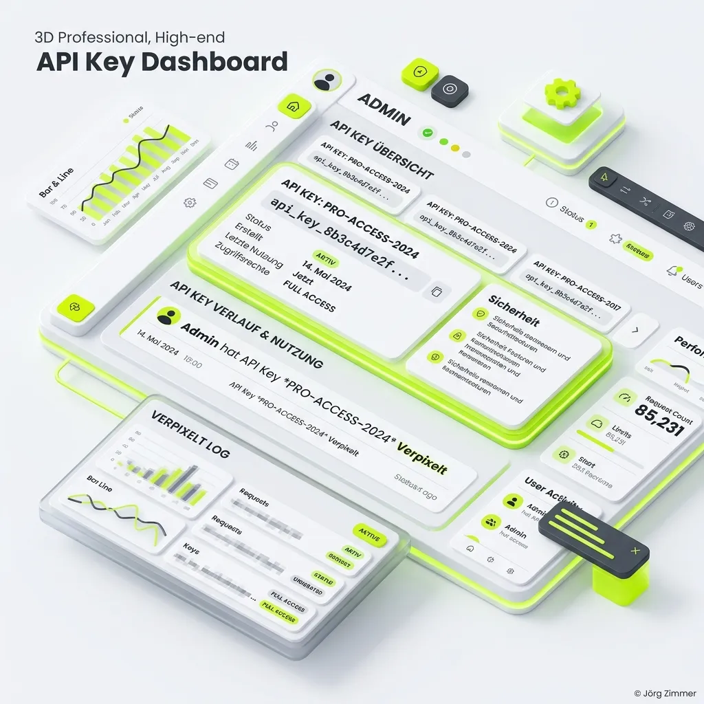
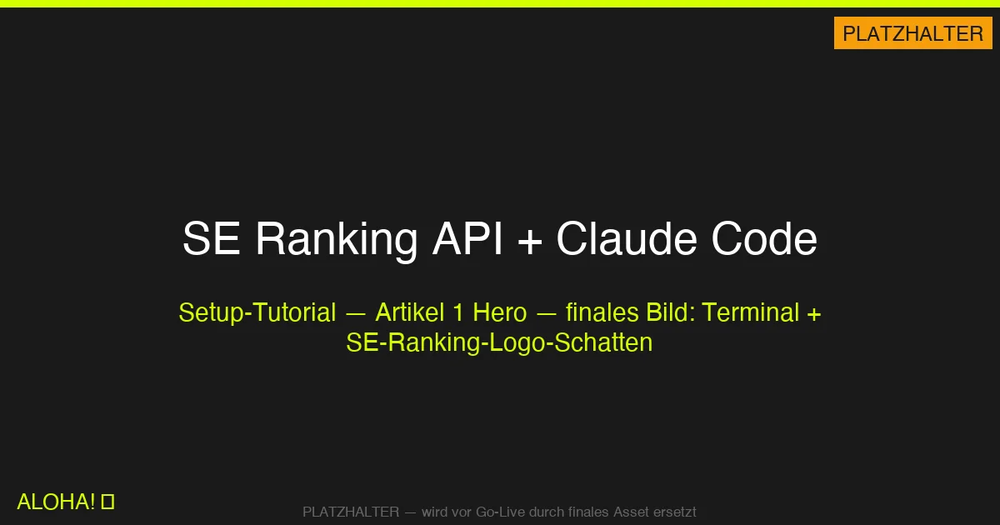
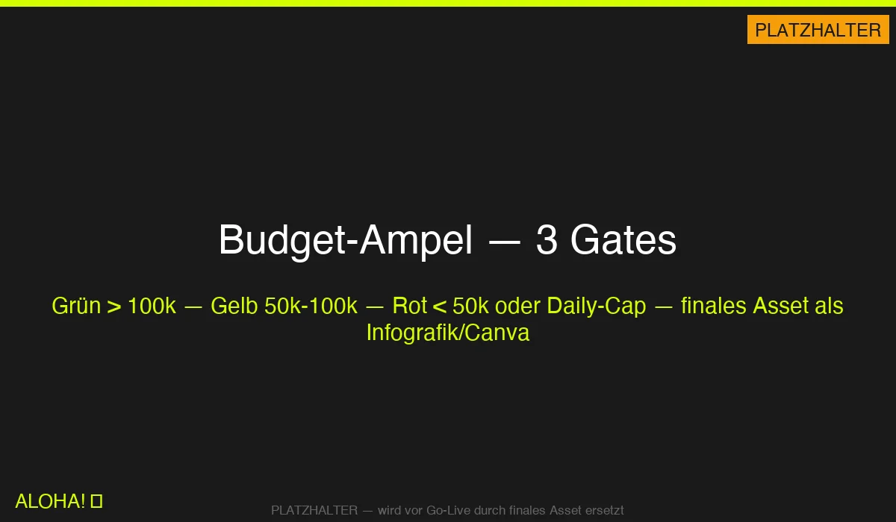
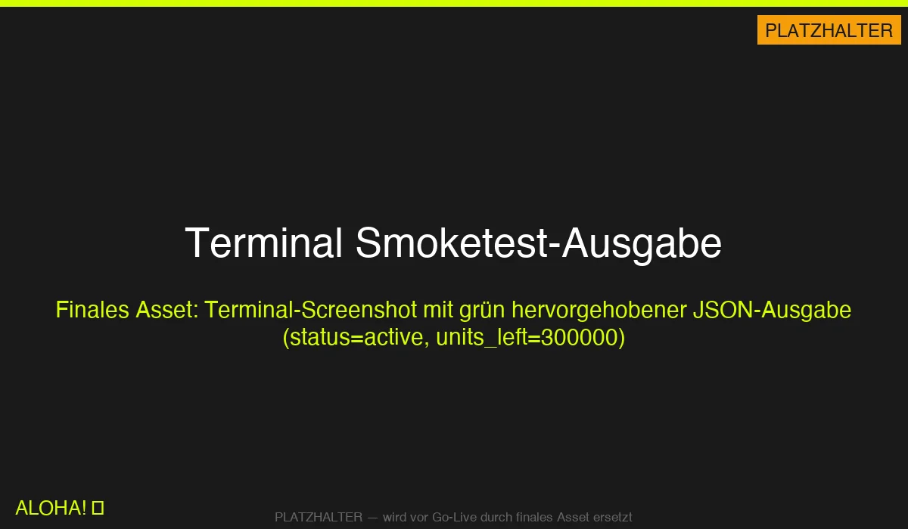

Moin! 🌻

Mein Kumpel <a href="https://www.linkedin.com/in/maximilianmuhr/" target="_blank" rel="noopener noreferrer">Maximilian D. Muhr</a> - ja, der, den ich schon [im SEOpresso-Podcast-Artikel](../seopresso-podcast-maximilian-muhr/) erwähnt habe - saß mit mir letzte Woche beim Kaffee und erzählte mir eine Geschichte, die mich seitdem nicht loslässt. Er nutzt seit einer Weile eine **SEO-API von einem bekannten SEO-Tool mit Claude Code** für automatisierte SEO-Analysen - sauber aufgesetzt, Wrapper gebaut, alles gut.

Bis an einem dieser Tage, an dem man irgendwas schnell testen will.

Ein anderer Agent bei ihm machte eine **Mini-Anfrage**. Eine. Kleine. Abfrage.

Ergebnis: **10.000 API-Credits weg in einem Rutsch.**

Das komplette Wochenbudget. Pulverisiert. Für eine Frage, die eigentlich einen Credit hätte kosten sollen - aber durch einen undokumentierten Endpoint-Preis eben 10.000 kostete.

Und ich dachte mir: *Das kann ich mit <a href="https://seranking.com/de/?ga=4169588&source=link" target="_blank" rel="noopener noreferrer">SE Ranking</a> doch auch. Nur dass ich bei dem Fehler nicht noch mal hängen bleiben will.*

Deshalb gibt es diesen Artikel. Ein Setup-Tutorial, bei dem das **Daily-Credit-Limit von Minute 1 dabei ist** - nicht nachträglich.

## Warum SE Ranking API + Claude Code

<a href="https://seranking.com/de/?ga=4169588&source=link" target="_blank" rel="noopener noreferrer">SE Ranking</a> kenne ich aus der täglichen Arbeit. Sichtbarkeits-Index, Keyword-Research, Backlink-Profile: Das All-in-One-Werkzeug, das ich seit Jahren für meine Kunden nutze. Claude Code wiederum ist seit ein paar Monaten mein zweiter Schreibtisch: kein Dashboard-Klick, sondern echte Skripte, die bleiben. Einmal geschrieben, immer reproduzierbar.

Die Kombination macht etwas Spezielles möglich: du baust dir dein eigenes SEO-Tooling. Kein SaaS on top, keine Zapier-Kette, keine Drittabhängigkeit. Nur deine Fragen, deine Daten, dein Report.

Persönliches Versprechen: Ich zeige dir genau den Weg, den ich gegangen bin - inklusive der einen Stelle, wo ich extra ein Limit eingebaut habe, damit mir **nicht** passiert, was Max passiert ist.

## Was du brauchst

- SE Ranking Account mit API-Zugang (Core-Tarif reicht, Pro optional)
- Claude Code Installation (mac/windows/linux)
- Terminal-Grundkenntnisse
- ~30 Minuten Zeit
- Kaffee ☕ (optional, aber bewährt)

## Schritt 1: API-Key holen

*(Falls du noch keinen Account hast: <a href="https://seranking.com/de/api.html?ga=4169588&source=link" target="_blank" rel="noopener noreferrer">Hier registrieren für einen SE Ranking Account inkl. API-Zugang</a>)*

Der Startpunkt ist denkbar einfach, aber extrem wichtig. Log dich in dein SE Ranking Dashboard ein, klick oben auf dein Profil und navigiere zu **Admin → API**. Hier findest du die Verwaltungsebene für deinen programmatischen Zugriff. Mit einem Klick auf "API-Schlüssel generieren" erzeugst du deinen persönlichen Token.



Achte darauf, dass du den Schlüssel direkt sicherst. Einmal kopiert, gehört er sofort in einen Passwort-Manager deines Vertrauens oder direkt in eine lokale `.env.local`-Datei deines Projekts. Er sollte auf gar keinen Fall irgendwo unverschlüsselt herumliegen. Sobald der Key sicher verstaut ist, testen wir ihn genau einmal per curl, um sicherzugehen, dass alles klappt:

```bash
curl -H "Authorization: Token DEIN_KEY" \
  https://api.seranking.com/account/subscription
```

<div class="my-8 bg-amber-50 border-l-4 border-amber-500 p-6 rounded-r-lg">
  <p class="font-bold text-amber-700 mb-2">⚠️ Warnung</p>
  <p class="italic text-dark mb-0">Niemals in Commits, Screenshots, Slack oder Whatsapp - behandle den API-Key wie deinen Haustürschlüssel. Einmal öffentlich, einmal rotieren.</p>
</div>

## Schritt 2: Claude Code Projekt aufsetzen

Neues Verzeichnis, Claude Code starten, loslegen:

```bash
mkdir seo-analyse && cd seo-analyse
claude
```

<div class="my-8 bg-lime-accent/10 border-l-4 border-lime-600 p-6 rounded-r-lg">
  <p class="font-bold text-lime-600 mb-2">Jörgs SEO-Klartext (LinkedIn Insights)</p>
  <p class="italic text-dark mb-0">"Claude Code ist wie ein Praktikant, der wirklich liest, was du sagst. Erklär ihm, was du willst, lass ihn schreiben, prüfe - fertig."</p>
</div>

Meinen ersten echten Prompt an Claude Code habe ich fast eins zu eins so eingetippt:

<div class="relative group my-8">
  <div class="bg-gray-50 border-l-4 border-lime-600 p-6 rounded-r-lg italic text-dark pr-12">
    "Erstelle einen Python-Client für die SE Ranking Data API. Base-URL `https://api.seranking.com`. Auth: Header `Authorization: Token {KEY}`. Plus Smoketest gegen `account/subscription`. Plus Tests mit pytest-mock. Key aus `.env.local` via python-dotenv."
  </div>
  <button class="copy-prompt-btn absolute top-4 right-4 p-2 bg-white border border-gray-200 rounded shadow-sm text-gray-500 hover:text-lime-600 hover:border-lime-600 transition-colors" data-prompt="Erstelle einen Python-Client für die SE Ranking Data API. Base-URL https://api.seranking.com. Auth: Header Authorization: Token {KEY}. Plus Smoketest gegen account/subscription. Plus Tests mit pytest-mock. Key aus .env.local via python-dotenv." title="Prompt kopieren">
    <svg class="w-4 h-4" fill="none" stroke="currentColor" viewBox="0 0 24 24"><path stroke-linecap="round" stroke-linejoin="round" stroke-width="2" d="M8 16H6a2 2 0 01-2-2V6a2 2 0 012-2h8a2 2 0 012 2v2m-6 12h8a2 2 0 012-2v-8a2 2 0 01-2-2h-8a2 2 0 01-2 2v8a2 2 0 012 2z" /></svg>
  </button>
</div>

Claude Code legt dir daraufhin eine absolut saubere und professionelle Struktur an. Du bekommst ein `scripts/seo_api/seranking.py` für deinen zentralen API-Client, ein ausführbares `scripts/seranking_smoke.py` für deinen Smoketest und einen separaten `tests/`-Ordner für deine Testfälle. Der Wrapper sitzt auf Anhieb, die Tests laufen grün durch und der gesamte Code ist sauber dokumentiert und committbar. Was früher einen halben Tag manuelle Fleißarbeit bedeutet hätte, ist hier in nicht einmal 10 Minuten erledigt. 

Um dir zu veranschaulichen, wie das Ganze in der Praxis aufgebaut ist, habe ich dir hier eine kurze Architektur-Skizze mitgebracht. Sie zeigt exakt, wie der Request vom Nutzer über Claude Code und deinen eigenen Wrapper bis zur SE Ranking API durchgereicht wird:



Die Skizze verdeutlicht den massiven Vorteil dieses Setups: Du hast die volle Kontrolle über den Mittelsmann – deinen Wrapper. Und genau an dieser Stelle klinken wir im nächsten Schritt unsere Budget-Überwachung ein.

## Schritt 3: Daily-Limit einbauen (das Wichtigste!)

Jetzt kommt der Teil, wo ich an Max zurückdenke.

Vor jedem produktiven Call macht mein Wrapper einen Vor-Check via `account/subscription`. Der Endpunkt kostet **0 Credits** - der kostet dich nichts, außer einer Netzwerkverbindung. Er liefert dir zurück, wie viele Units du gerade noch hast. Danach schätze ich den geplanten Call-Verbrauch. Vergleiche beides mit drei Grenzwerten. Fertig.

| Gate | Schwelle | Aktion |
|------|----------|--------|
| 🟢 Grün | `units_left > 100.000` | Alles läuft, keine OK-Pflicht |
| 🟡 Gelb | `units_left` 50.000 - 100.000 | Admin-OK für die Session nötig |
| 🔴 Rot | `units_left < 50.000` | Stop. Kein weiterer Call. |
| 🔴 Rot | `heute > 100.000 verbraucht` | Daily-Cap: Stop bis morgen |

Diese simple, aber hochgradig effektive Mechanik habe ich dir in der folgenden Budget-Ampel einmal grafisch aufbereitet. Sie zeigt den genauen Prüf-Flow, den jeder einzelne Call durchlaufen muss, bevor er dein wertvolles Budget antastet.



Wenn die Ampel auf Grün steht, rauscht der Call ohne weitere Nachfragen durch. Bei Gelb hält das Skript an und fragt dich aktiv im Terminal, ob du diesen speziellen, potenziell teureren Request wirklich abfeuern willst. Und bei Rot zieht der Wrapper knallhart die Handbremse. Kein Wenn und Aber.

Im Code sieht das - stark gekürzt - so aus:

```python
# Hard-Stop: niemals unter 50k
if left - estimated_cost < SERANKING_HARD_STOP:
    raise BudgetViolation(f"Hard-Stop: {left}-{estimated_cost} < 50000")

# Soft-Stop: unter 100k nur mit Admin-OK
if left < SERANKING_SOFT_STOP and not admin_ok:
    raise BudgetViolation("Soft-Stop: brauche Admin-OK")

# Daily-Cap: max 100k pro Session
if session_cumulative + estimated_cost > SERANKING_MAX_PER_SESSION:
    raise BudgetViolation("Daily-Limit erreicht")
```

Drei Zeilen Logik, und aus einem offenen Scheunentor wird ein Drehkreuz.

<div class="my-8 bg-lime-accent/10 border-l-4 border-lime-600 p-6 rounded-r-lg">
  <p class="font-bold text-lime-600 mb-2">Jörgs SEO-Klartext (LinkedIn Insights)</p>
  <p class="italic text-dark mb-0">"Ein API-Key ohne Daily-Limit ist wie ein Porsche ohne Tempomat: theoretisch cool, praktisch teuer."</p>
</div>

Zusätzlich schreibt der Wrapper jeden Call in ein append-only Log: Zeitstempel, Endpunkt, geschätzte Kosten, tatsächliche Units vorher/nachher, Delta. So weiß ich am Ende des Monats nicht nur, **was** ich verbraucht habe, sondern auch **wofür**.

## Schritt 4: Smoketest laufen lassen

Zeit für den ersten echten Call: Kostet nichts, beweist alles:

```bash
python3 scripts/seranking_smoke.py
```

Erwartete Ausgabe (aus meinem echten Log):

```json
{
  "status": "active",
  "units_left": 300000,
  "expiration_date": "2027-03-29"
}
```

Wie das live im Terminal aussieht, siehst du in diesem Screenshot. Ein kurzer, knackiger Test, der dir in Sekundenbruchteilen bestätigt, dass deine Credentials sauber greifen und die SE Ranking Server erreichbar sind.



Ein kleines Detail am Rande: Falls die API statt `expiration_date` das Feld `expiraton_date` liefert - ja, das ist ein echter Typo drüben bei SE Ranking in der API. Nicht deiner. Mein Smoketest toleriert beide Schreibweisen. **SE Ranking, wenn ihr das lest: bitte fixen. 😉**

## Schritt 5: Der erste echte Call

Jetzt die erste kostenpflichtige Abfrage. `research/domain/overview/db`: 100 Credits, gibt dir Sichtbarkeit plus Keyword-Count einer Domain. Der perfekte Einstieg.

```python
client = SERankingClient()
overview = client.domain_overview("teleschmie.de")
print(overview["organic"]["traffic_sum"])
```

Und dann siehst du, wie dein Wrapper macht, was er soll: Vor-Check, Call, Nach-Check, Log-Eintrag, Ergebnis im Terminal. Sauber, transparent, reproduzierbar.

Bei dem Setup hat mir übrigens die Truppe von <a href="https://polisys.de" target="_blank" rel="noopener noreferrer">poliSYS</a> (das ist Max' Agentur) tatkräftig geholfen: Die haben das genaue Wrapper-Pattern als Open-Source-Skill vorgemacht und auch den Budget-Guard mit den drei Gates. Wenn du das Rad nicht neu erfinden willst: rüberschauen lohnt.

## Tacheles am Ende

Wenn du einmal den Wrapper hast, sind alle weiteren Endpunkte eine Sache von fünf Minuten. `backlinks/summary`, `research/keyword/questions`, `audit/audits/standard`: alles nach dem gleichen Muster. Du baust dir im Lauf einer Woche dein eigenes kleines SEO-Tooling, das deinem Workflow entspricht und nicht dem eines SaaS-Produktmanagers in San Francisco.

<a href="https://seranking.com/de/?ga=4169588&source=link" target="_blank" rel="noopener noreferrer">SE Ranking</a> belohnt strukturierte Setups. Die API-Docs sind gut, die Endpunkte gut sortiert. Aber Daily-Limits muss man selbst bauen. Jetzt weißt du, wie.

Im nächsten Teil der Serie sortiere ich, was die SE Ranking API eigentlich alles kann: **Ein Kompass durch die Endpunkte**. Sechs Kategorien, Kosten-Tabelle, Use-Cases. Teuerste Abfrage: 7.500 Credits. Günstigste: null. Dazwischen liegt eine Menge SEO-Arbeit.

Spart euch den 10k-Schock. Baut das Limit jetzt. ALOHA! 🌻

